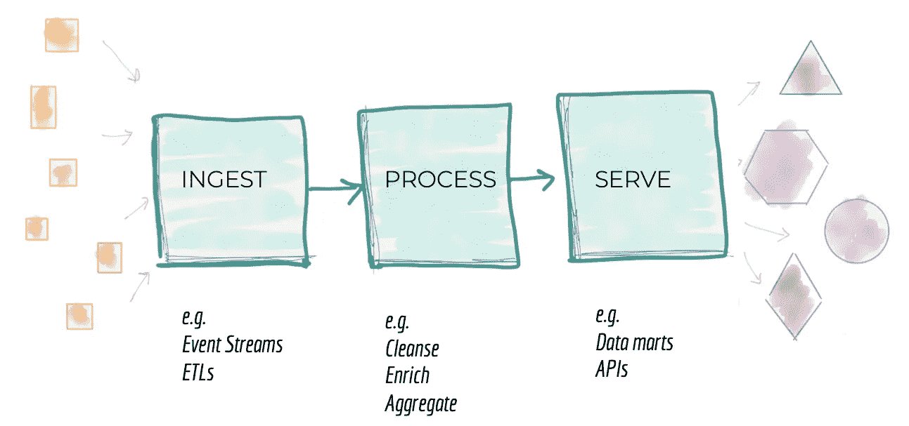

# 使用百老汇和 RabbitMQ 在 Elixir 中创建数据管道

> 原文：<https://itnext.io/using-broadway-and-rabbitmq-to-create-a-data-pipeline-in-elixir-900ddff57c7d?source=collection_archive---------1----------------------->



[https://Martin fowler . com/articles/data-monolith-to-mesh . html](https://martinfowler.com/articles/data-monolith-to-mesh.html)

在本文中，我将重点关注使用**百老汇** [1]库为 Elixir 创建一个数据接收和处理管道。根据**百老汇的** github 页面，这个库是用来—

*“使用 Elixir 构建并发和多阶段数据接收和数据处理管道。它允许开发人员有效地使用来自不同来源的数据，这些来源被称为生产者，如亚马逊 SQS、Apache Kafka、谷歌云 PubSub、RabbitMQ 等。”*

在本文中，我将使用**百老汇**rabbit MQ【2】的生产者，来演示开发一个简单的股票报价检索应用程序的基本用法。

附注:*本文中的例子是虚构的，并没有充分利用这个库的所有特性。特别是，由于用于检索股票报价的外部 API 每分钟只允许使用自由层进行 5 次调用，因此没有利用库的并发支持。但是对于真正的应用程序来说，并发数据管道将大大提高处理能力，这可能是大多数应用程序所需要的。然而，由于外部 API 的限制，我将展示我们如何利用作为这个库的一部分的速率限制特性。*

# 百老汇的主要特点:

*   背压
*   定量
*   内置测试
*   排序和分区
*   限速的
*   韵律学

你可以在官方文档[这里](https://github.com/dashbitco/broadway)阅读更多关于这些特性的内容。

# 我们的应用:

我将开发一个股票报价检索应用程序，并将使用 RabbitMQ 作为股票符号生产者和消费者之间的消息代理，消费者从 RabbitMQ 消费这些符号并检索它们的报价。对于这样一个简单的应用程序，RabbitMQ 可能有些过头了。但是如果生产者和消费者驻留在不同的应用程序中，我们将需要一个消息队列作为中间的代理。

# 先决条件:设置 RabbitMQ

我用下面的命令在 Mac 上安装了 RabbitMQ

> $ brew 更新
> 
> $ brew 安装 rabbitmq

启动 rabbitmq 服务后，我使用下面的命令创建了一个将在示例应用程序中使用的队列

> $ rabbitmqadmin 声明队列名称= **股票 _ 队列**持久=真

durable 选项告诉即使服务器重新启动也要保留队列。

一旦创建了队列，它可以被如下列出—

> $ rabbitmqctl list_queues
> 超时:60.0 秒……
> 列出 vhost / …
> name 消息的队列
> stock_queue 0

如我们所见， **stock_queue** 已创建，目前其中没有任何消息。

# 设置 Elixir 项目

在这个阶段，我使用下面的命令创建了 Elixir 应用程序—

> $ mix new broadway_stock — sup

我在 **mix.exs** 文件中添加了必要的依赖项—

```
defp deps do
  [
    # {:dep_from_hexpm, "~> 0.3.0"},
    # {:dep_from_git, git: "https://github.com/elixir-lang/my_dep.git", tag: "0.1.0"}
    {:httpoison, "~> 0.10.0"},
    {:hackney, github: "benoitc/hackney", override: true},
    {:json, "~> 1.0.0"},
    **{:broadway_rabbitmq, "~> 0.6.0"}**
  ]
end
```

添加完依赖项后，我使用下面的命令安装了它们—

> $ mix deps.get

我在根项目目录下创建了一个名为**数据**的子目录，并复制了保存各种股票符号信息的 [**CSV 文件**](https://raw.githubusercontent.com/imeraj/Elixir_Playground/master/broadway_stock/data/companylist.csv) 。

# 生产者代码

我们的生产者端代码将解析 CSV 文件，生成股票符号，并写入 RabbitMQ 中的 **stock_queue** 。代码如下—

[*https://raw . githubusercontent . com/imeraj/Elixir _ Playground/master/Broadway _ stock/lib/Broadway _ stock . ex*](https://raw.githubusercontent.com/imeraj/Elixir_Playground/master/broadway_stock/lib/broadway_stock.ex)

这里—

*   第 8–10 行:打开通道到 **stock_queue**
*   第 12–20 行:解析 CSV 文件并将股票符号写入 **stock_queue** 调用函数 **write_queue** 。
*   第 25–27 行:将股票符号发布到**股票队列**的 **write_queue** 函数的定义
*   第 22 行:关闭到队列的连接

# **消费者代码:**

接下来，是在这个生产者消费者关系中定义我们的消费者代码。百老汇上演了。这方面的代码如下—

[https://raw . githubusercontent . com/imeraj/Elixir _ Playground/master/Broadway _ stock/lib/Broadway _ stock _ worker . ex](https://raw.githubusercontent.com/imeraj/Elixir_Playground/master/broadway_stock/lib/broadway_stock_worker.ex)

在这里，我使用了行为**百老汇**并定义了它需要的函数和回调。

*   第 10–28 行:定义配置管道的 start_link 函数。这里需要注意一些重要的事情— **1** )我使用的是同一个队列— **stock_queue，2** )我定义了一个转换器来在处理之前执行一些数据转换(稍后会详细介绍)， **3** )因为我将调用外部 API 来获取股票报价，而自由层服务每分钟只允许 5 次调用，所以我使用了**速率限制**来每 12 秒只允许 1 条消息(第 17–20 行)和**4【所以我只使用了一个处理器(第 22–26 行)**
*   第 42–47 行:定义了我们的转换函数 **transform/2。**通常，在被 **handle_message** 回调处理之前，该函数应该用于执行任何需要的转换。在这个函数中，我只是处理了从队列中出来的股票符号，并删除了它们周围的双引号。
*   第 31–40 行:定义 **handle_message** 函数，该函数一次获取一个股票代码，并调用 **get_quote** 函数来检索报价，并使用函数 **display_quote 进行显示。**

# **检索股票报价**

**api_worker.ex** 文件包含了获取给定股票代码的股票报价所需的所有代码。这是 Elixir 的 **GenServer** 行为的非常直接的实现。这方面的代码如下—

[https://raw . githubusercontent . com/imeraj/Elixir _ Playground/master/Broadway _ stock/lib/API _ worker . ex](https://raw.githubusercontent.com/imeraj/Elixir_Playground/master/broadway_stock/lib/api_worker.ex)

这段代码应该很容易理解。有一点需要注意，尽管我把来自 https://www.alphavantage.co[](https://www.alphavantage.co)**的 API 密匙留在了这个文件中。但是对于生产就绪代码，它应该存储在配置文件中，并且应该使用环境变量注入。**

# **监督树:**

**最后，我们需要在 **application.ex** 文件中填充我们的监督树，如下所示**

```
children = [
  # Starts a worker by calling: BroadwayStock.Worker.start_link(arg)
  **{BroadwayStock.Worker, []},**
  **{Api.Worker, []}**
]
```

**我们的应用主管将监督 BroadwayStock。工人和 **Api。工人**。**

# **输出:**

**我运行了以下命令来编译和加载 iex 中的应用程序—**

> **$ mix 编译**
> 
> **$ iex -S 混合**

**接下来是—**

> **$ BraodwayStock.dispatch**

**这应该每 12 秒产生一行输出，应该如下所示**

> **EOD——3.91 美元
> 油井——44.40 美元
> WCC——23.54 美元
> WST——158.14 美元
> 沃尔玛——32.03 美元
> WALA——23.00 美元**

# ****批处理****

**百老汇管道也允许成批处理。我没有在这个例子中使用，因为没有太多的范围。但是你可以在官方文件中读到如何做——[https://hexdocs.pm/broadway/rabbitmq.html](https://hexdocs.pm/broadway/rabbitmq.html)**

# ****结束语****

**尽管我没有用这个简单的应用程序探索百老汇的全部力量，但我认为这将有助于一些人开始使用这个库。示例应用程序的完整代码可以在我的 github 上找到，这里是[https://github . com/imeraj/Elixir _ Playground/tree/master/Broadway _ stock](https://github.com/imeraj/Elixir_Playground/tree/master/broadway_stock)**

***更多详细和深入的未来技术帖子请关注我这里或点击* [*twitter*](https://twitter.com/meraj_enigma) *。***

# **参考资料:**

**[1]https://github.com/dashbitco/broadway 的百老汇—**

**[2]rabbit MQ 的百老汇制作人—[https://github.com/dashbitco/broadway_rabbitmq](https://github.com/dashbitco/broadway_rabbitmq)**

**[3] BroadwayStock app 的源代码—[https://github . com/imeraj/Elixir _ Playground/tree/master/Broadway _ stock](https://github.com/imeraj/Elixir_Playground/tree/master/broadway_stock)**