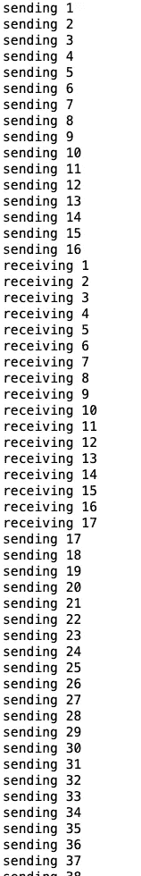

# 在 GO 中使用频道

> 原文：<https://itnext.io/using-channels-in-go-c418b0cb0f93?source=collection_archive---------1----------------------->

在与 Golang 合作时，我们使用通道来简化工作，而不使用 go 套路。

这是使用通道的最基本的例子

[https://play.golang.org/p/iy9QealMxcT](https://play.golang.org/p/iy9QealMxcT)链接到围棋运动场了解这一要点。

在这个例子中，你知道有多少个`integers`被发送到通道，有多少个被接收。

第 12 行:`numberCh <-i`表示我们正在向通道发送整数

第 16 行:`<- numberCh`意味着我们正在从渠道中获取价值

这也可以用来将整数赋给变量，例如:

`newNumber := <- numberCh`

这些类型的通道称为缓冲通道，您知道需要创建和读取的通道数量。

但是像这样使用通道对于运行一个简单的`for`循环没有任何好处。通道在处理 go 例程时非常有用，因为 go 可以为一个操作生成自己的进程，这使得并行处理成为可能，从而使程序同时运行，使我们的程序更快。

所以要使用 go 例程，我们只需要将循环封装在一个函数中，并在循环前添加一个`go`关键字。所以我们的代码应该是。

这个[https://play.golang.org/p/kAxw-8yAEb9](https://play.golang.org/p/kAxw-8yAEb9)的围棋场地链接

如果你运行这个程序，你会看到它不打印任何东西，但程序成功完成并退出，这是因为我们运行三个不同的线程来运行这个程序。

1.  执行整个程序的主线程
2.  从第 11 行开始，我们创建了一个新线程，将整数发送到我们的通道
3.  从第 18 行开始，一个新线程接收发送给通道的整数

主线程成功运行并退出，它不等待其他例程。第二个和第三个线程运行，但不会在主线程完成之前完成，因此不会打印。

如果你来自 javascript，你以前见过这个。javascript 中的解决方案是要么做出承诺并等待承诺解决，要么使用`aysnc` `await`。我们能在 Golang 做这个吗？

是的，当然。

Golang 里有个叫`WaitGroup`的东西，帮我们搞定这个。

此代码的游乐场链接[https://play.golang.org/p/6ZuRLVg8tzb](https://play.golang.org/p/6ZuRLVg8tzb)

现在你可以看到程序的实际输出。这和 javacsript `waitAll`一模一样。

但这真的是同时进行的吗？你只能看到打印的数字，而且是升序排列的。这对我来说不太符合。让我们稍微改变一下程序，看看它是并发运行的。

链接到这个代码的 go playground[https://play.golang.org/p/LfLtaE7nGQB](https://play.golang.org/p/LfLtaE7nGQB)

我们把频道增加到 50 个，浏览了 50 个号码。

在第 19 行，我们正在打印我们正在发送的号码

在第 27 行，我们正在打印我们收到的号码

它的输出看起来像这样

它随机接收和发送数字，它不等待第一个 go 例程完成就开始接收数字。

这是 Golang 中一个非常简单的通道实现，用于处理 go 例程和通道。[在下一部分](https://medium.com/@developer.naren/handling-errors-in-channels-e76ad5cbf3a0)，我们可以学习如何处理围棋程序中的错误。