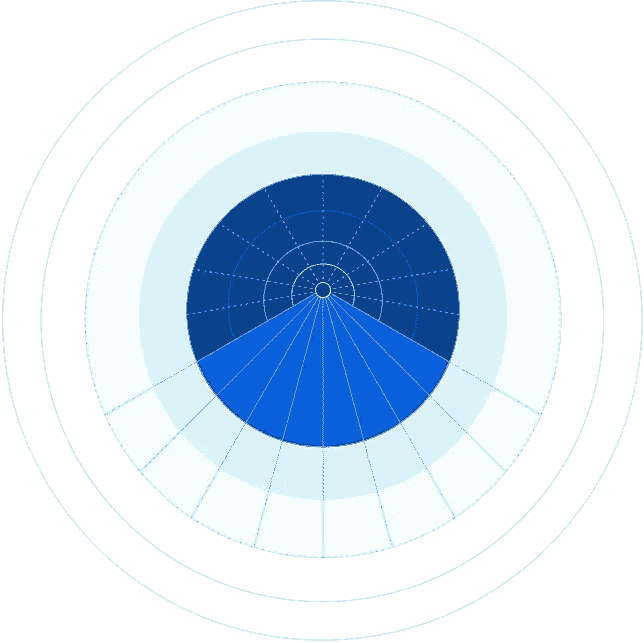
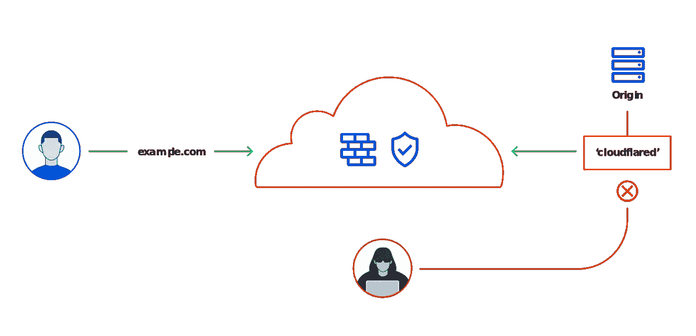
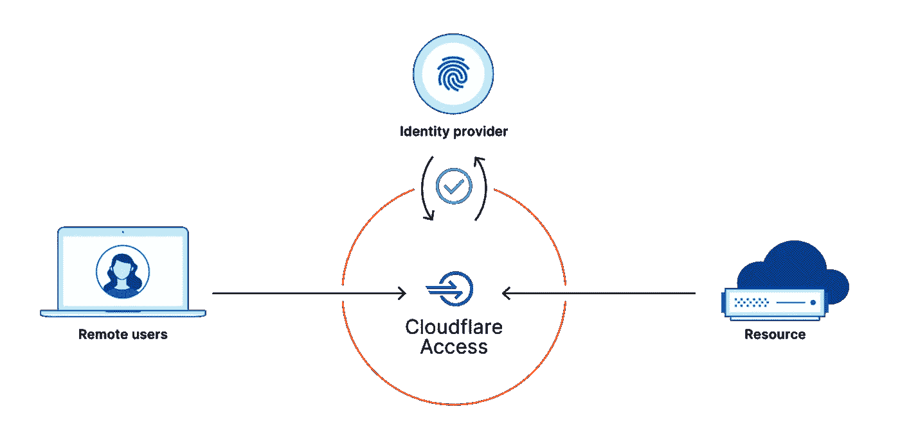
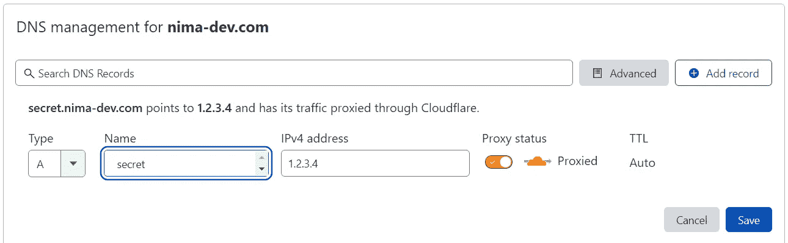

# 使用 Cloudflare 隧道安全地公开 Kubernetes 服务

> 原文：<https://itnext.io/using-cloudflare-tunnels-to-securely-expose-kubernetes-services-26713fb5da0a?source=collection_archive---------0----------------------->



图片来源:[https://www.cloudflare.com/products/tunnel/](https://www.cloudflare.com/products/tunnel/)

Cloudflare Tunnel(以前称为 Argo Tunnel)是一种工具，允许在您的 web 服务器和 Cloudflare 基础架构之间建立安全的私有连接。如果你不熟悉 Cloudflare，我建议你去看看[他们的网站](https://www.cloudflare.com/)，因为他们提供了大量的服务，其中最重要的是他们的 CDN 网络和 web 服务保护(DDoS 保护等)。).要完成本教程，您需要使用 Cloudflare 作为您的 DNS 服务器。这将允许他们控制如何为您的域路由流量。

在本教程中，我将向您展示如何建立一个 [Cloudflare 隧道](https://www.cloudflare.com/products/tunnel/)来通过互联网安全地公开 Kubernetes 服务。如果我刚才提到的任何单词对你来说没有意义，请继续阅读，我保证我会尽力解释它们。我只是假设你知道 Kubernetes 是什么。如果你对 Kubernetes 不熟悉，可以在谷歌上快速搜索一下，然后使用我的教程在几分钟内在一个虚拟机上建立你的集群，你应该能跟上。

现在最大的问题是:你为什么要这么做？或者谁会从中受益？起初，它可能看起来不是很清楚，但它支持大量的功能，其中最重要的是安全性。我个人使用 Cloudflare 隧道有三个目的:1)从没有静态 IP 和/或位于 NAT 后面的集群中公开服务(我的家庭实验室)；2)保护正在运行的 web 服务器免受直接攻击；3)利用 [Cloudflare Access 零信任](https://www.cloudflare.com/teams/access/)服务为敏感服务增加额外的安全层。

本教程是我个人成长的一部分，旨在提高我用来托管项目和自托管服务的基础设施的安全性。我现在在自己的基础设施上运行着大约 20 项服务，随着时间的推移，我越来越意识到这些服务的安全性。我还想指出的是，如果你正在运行一个托管的 Kubernetes 服务(例如，来自 AWS 或 GCP ),你可能会在托管的负载平衡器和类似 [Cloud Armor](https://cloud.google.com/armor) 的服务之后运行你的服务，这些用例中的大部分并不适用于你，但是欢迎你继续阅读。

# 问题是

让我们更详细地分析一下我们在这里试图解决的问题。

## 1.在 NAT 后运行的集群

在疫情期间，我设法保持理智的一个方法是创建我的个人家庭实验室，在那里我托管像家庭助理这样的服务，以支持我家里的智能设备。在使用 Cloudflare 隧道之前，要允许远程访问这些服务，您必须设置一个动态 DNS(使用像 [Duck DNS](https://www.duckdns.org/) 这样的服务)，将一个域指向您的家庭 IP，并在您的家庭防火墙上暴露特定端口(如果您的提供商允许，通常使用调制解调器的端口转发功能)。

现在，这带来了一些问题。首先，你已经在互联网上公开了你的家庭 IP，从安全的角度来看，我们希望以任何可能的方式保护我们的隐私。第二，你在允许流量进入你的家庭网络，这让我很不舒服。此外，这对于许多互联网服务提供商来说甚至是不可能的，因为他们根本不允许你配置端口转发。Cloudflare Tunnel 通过打通到 Cloudflare 服务器的隧道连接来解决这一问题。当对您的服务的请求到达他们的服务器时，他们将通过该隧道路由该流量并安全地进入您的基础设施。

## 2.保护正在运行的 web 服务器免受直接攻击



图片来源:【https://www.cloudflare.com/products/tunnel/ 

让我们假设您正从您的虚拟机托管 example.com，该虚拟机具有从云供应商处购买的 IP `1.2.3.4`。你可能有一个 DNS A 记录指向你的域名`1.2.3.4`。然而，您的虚拟机上可能还运行着 SSH 和更多的服务。在一个完美的世界中，您在任何时候都有一个正确配置的 SSH 代理和防火墙，并且您使用的任何服务都没有安全缺陷。但是我们并不是生活在一个完美的世界中，如果您错误地公开了任何服务或者使用了糟糕的 SSH 配置，攻击者就会知道您的虚拟机的 IP 地址。

这可以通过将所有流量转发到 Cloudflare 服务器来解决，这些服务器会将流量路由到在您的虚拟机上运行的 Cloudflare 隧道代理。您不需要公开虚拟机的 IP 地址。事实上，您甚至不必允许任何流量通过您的防火墙。

## 3.使用 Cloudflare 访问



图片来源:[https://www.cloudflare.com/products/tunnel/](https://www.cloudflare.com/products/tunnel/)

正如我提到的，我自己托管了许多 web 应用程序，其中一些包含相当敏感的数据。我最初使用 Nginx 基本认证(在负载平衡器中)和密码(在应用程序中)来公开这些服务。但是正如我们所知，[基本认证是不安全的](https://www.oreilly.com/library/view/http-the-definitive/1565925092/ch12s03.html),我想用一个更好的替代方案来取代它，使用 GitHub 或 Google 这样的身份提供商来使用服务。这是我偶然发现 [Cloudflare Access](https://www.cloudflare.com/teams/access/) 的时候，他们托管的零信任安全服务允许你添加几个规则来限制对你的基础设施中运行的服务的访问。您最初可以通过 Cloudflare 代理您的流量:



这将完美地工作，secret.nima-dev.com[的流量将被路由到 Cloudflare，他们将应用安全规则并要求对受保护的端点进行身份验证。但是，要做到这一点，您需要在防火墙中允许 HTTP/HTTPS 流量，任何人都可以向您的服务器发送直接请求，并完全绕过 Cloudflare 身份验证。使用 Cloudflare 隧道时，您不需要为受保护的服务制定任何进入规则。流量安全地通过隧道传输到集群中运行的代理，然后路由到您的服务。这也使我能够安全地将不安全的应用程序(如 Homer dashboard)暴露在互联网上，只需在我的 Cloudflare Teams dashboard 中点击几下鼠标。](http://www.nima-dev.com)

现在我们知道了为什么我们可能想要使用 Cloudflare 隧道，让我们看看如何为您自己的集群设置它。

# 安装过程

在[之前的一篇文章](https://bit.ly/3rLoBM2)中，我回顾了在虚拟机上创建 K3S 集群的过程，您可以从任何云供应商那里购买(或者自己托管)。这里，我假设您有一个功能性的 Kubernetes 集群，并且对它的术语(部署、服务、入口等)有一个基本的了解。).现在我们已经准备好了，让我们创建一个隧道来安全地公开在`default`名称空间中名为`web`的服务。因此，在内部(从集群内部)，我们可以将该服务称为`web.default.svc.cluster.local`(一般模式是`my-service.my-namespace.svc.cluster.local`)。如果你不知道 Kubernetes 的 DNS 服务，请查看本页。我们现在将部署一个隧道来将流量路由到此服务。这个过程可以分两步完成:配置隧道并将其部署到 Kubernetes。

## 云耀斑隧道配置

为了配置 Kubernetes 部署，我们需要将隧道代理的私钥存储在名为`cert.pem`的文件中，将隧道的信息存储在名为`tunnel.json`的文件中，并将配置文件存储在名为`config.yml`的文件中。要获得这些，您需要 ssh 到您的虚拟机，并遵循 [Cloudflare Tunnel 入门](https://developers.cloudflare.com/cloudflare-one/connections/connect-apps/install-and-setup/tunnel-guide)指南。这个过程相当简单，所以我不会在这里详细介绍，但这里有一个总结:

在这个过程之后，您已经登录(生成`cert.pem`)并创建了隧道(生成隧道 JSON 文件)。您还创建了 DNS 规则来将流量转发到您的 Cloudflare 隧道，您可以通过访问您的 Cloudflare 控制面板来验证这一点。应该有一个新的 DNS CNAME 记录将您的主机名(例如`secure.nima-dev.com`)路由到通过 Cloudflare 代理的`TUNNEL_UUID.cfargotunnel.com`。现在您需要创建您的配置`config.yml`文件。这个文件告诉隧道每个请求应该被路由到哪里，以及隧道 JSON 文件的位置。以下配置文件适用于我们的示例:

对于更复杂的配置，您可以访问 [Cloudflare 文档](https://developers.cloudflare.com/cloudflare-one/connections/connect-apps/configuration/configuration-file)。现在我们已经有了所有需要的文件，是时候收集它们并创建 Kubernetes 部署了。如果你看一下虚拟机中的`~/.cloudflared`文件夹，你应该已经准备好了`cert.pem`和`TUNNEL_UUID.json`文件。我们也创造了我们的`config.yml`。

## Kubernetes 部署

现在，我们已经做好了一切准备，让我们准备我们的 Kubernetes 部署。创建以下文件夹结构:

```
.
├── config
│   ├── cert.pem
│   └── tunnel.json
├── configmap.yml
└── deployment.yml
```

`cert.pem`和`tunnel.json`应该来自上一步。`configmap.yml`包括配置，应该如下所示:

`deployment.yml`应该是下面这样的。只要确保用您使用的隧道名称替换`$CLOUDFLARE_TUNNEL_NAME`即可:

现在一切准备就绪，让我们将其部署到我们的 Kubernetes 集群:

几分钟后，您应该会在日志中看到类似这样的内容:

```
2022-01-22T19:17:40Z INF Connection XXXXXXXXX registered connIndex=0 location=AMS
2022-01-22T19:17:40Z INF Connection XXXXXXXXX registered connIndex=1 location=FRA
2022-01-22T19:17:41Z INF Connection XXXXXXXXX registered connIndex=2 location=AMS
2022-01-22T19:17:43Z INF Connection XXXXXXXXX registered connIndex=3 location=FRA
```

这意味着部署已经成功，一切都应该正常工作。您现在可以访问您指定的主机名来查看最终结果。

## Docker 图像

在我们的部署中，我为 Cloudflare 使用了自己的 docker 映像。尝试不时更新`deployment.yml`中的图像标签，以使用最新版本。此外，我知道你可以使用 [cloudflared 官方图像](https://hub.docker.com/r/cloudflare/cloudflared)稍加调整，但我创建了自己的图像，因为官方图像不支持 ARM 架构，我想在我的 raspberry pi 上运行它。

# 结论

在本教程中，您学习了如何使用 Cloudflare 隧道将您的 Kubernetes 服务安全地公开给互联网。从那里，你可以用 Cloudfare 服务做很多事情，其中大多数包括非常慷慨的免费层。就我个人而言，我非常享受 Cloudflare 为我的部署管理的轻松和简单的身份验证。如果你喜欢看像这样的关于 Cloudflare Access 为这些服务添加身份验证的教程，请在评论中告诉我。

# 关于我

我是阿尔伯塔大学的博士候选人，也是约克大学的客座研究员和兼职讲师。我日复一日地研究无服务器计算平台，试图找到提高其性能、可靠性、能耗等的方法。，使用分析或数据驱动的方法(对“我要么使用数学要么使用机器学习来建模无服务器计算平台”的花哨说法)。我在这里写的是我在研究期间对一些无服务器计算平台的深入了解，以及它们的自动伸缩模式文档的简要汇编。

如果你想知道更多关于我的事情，可以看看我的网站。