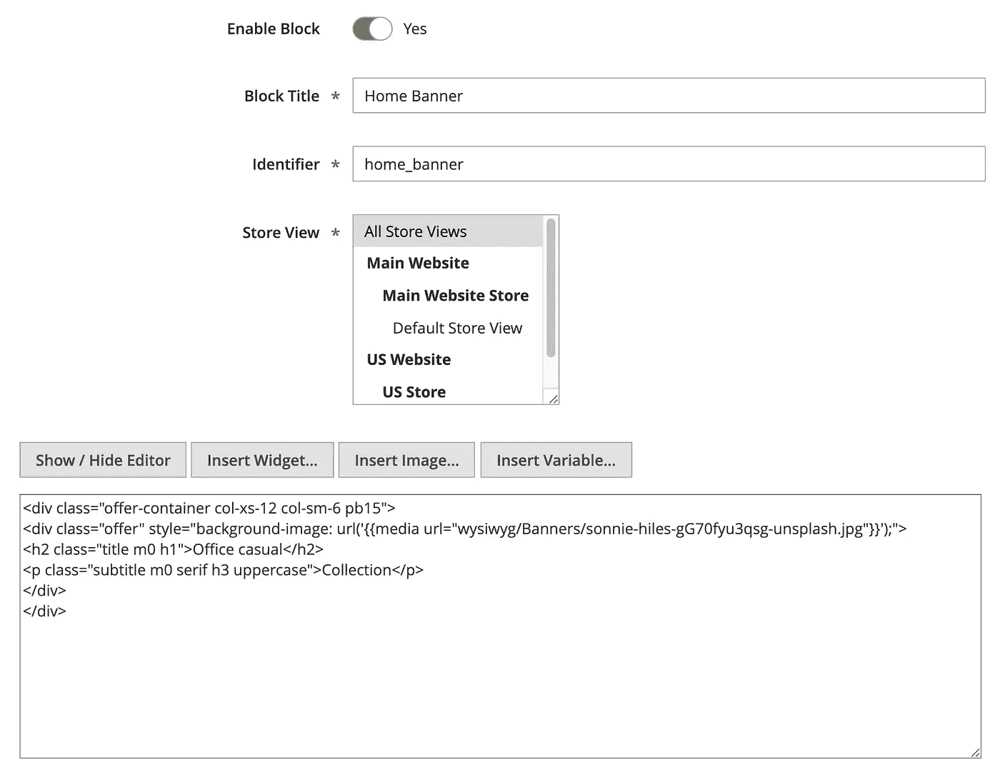
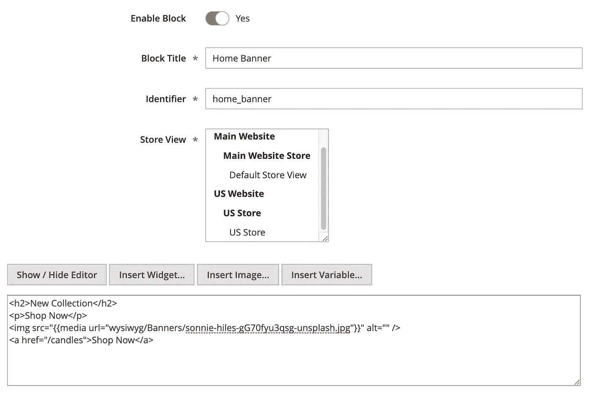
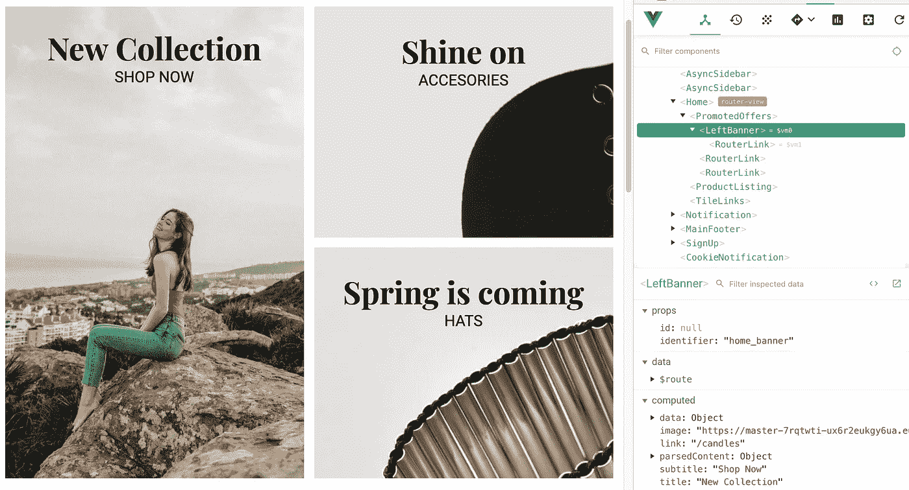

# 在 Vue 店面中有效使用 CMS 块

> 原文：<https://itnext.io/using-cms-blocks-effectively-in-vue-storefront-8020df888844?source=collection_archive---------2----------------------->

照片由 [Esther Jiao](https://unsplash.com/@estherrj?utm_source=unsplash&utm_medium=referral&utm_content=creditCopyText) 在 [Unsplash](https://unsplash.com/search/photos/blocks?utm_source=unsplash&utm_medium=referral&utm_content=creditCopyText) 上拍摄

CMS 块是一种流行的方式，使用户能够从后端编辑 Magento 2 网站中的元素，它(几乎)不需要任何编码技能，并提供了一种相对安全的方式来更新内容，而不会有破坏您的电子商务网站的风险。

开箱即用 Vue Storefront 提供对 CMS 块的支持，如果您使用的是官方的 [Magento 2 VS Indexer](https://github.com/DivanteLtd/magento2-vsbridge-indexer) 或 [mage2vuestorefront](https://github.com/DivanteLtd/mage2vuestorefront) 数据泵(v1.6+) CMS 块和页面会同步到弹性搜索数据库，因此我们可以非常高效地查询这些数据。

Vue Storefront 还包括一个组件，可以帮助我们在站点中的任何地方呈现这些内容，让我们看看如果我们想让主页中的一个块可以从 CMS 块编辑，它会是什么样子:

# 1.使用 CmsBlock 组件

在 Vue Storefront 中使用 CmsBlock 组件

我选择了`PromotedOffers`组件使最左边的横幅可编辑，所以我用`<cms-block />`组件替换了它，该组件带有一个与 Magento 2 管理区中的标识符相对应的`identifier`(或`id`)属性。

该组件所做的只是显示 CMS 块的内容，请记住，这将按原样呈现 HTML，因此我们需要确保它与 Vue Storefront 主题期望的结构相匹配，这样它看起来就很好:

# 2.创建 CMS 块

CMS 阻止 Magento 2 后端的标记

> 确保 CMS 块**标识符**与 Vue Storefront 中的标识符相匹配

保存并确保它被索引到弹性搜索数据库后，您将能够在主页中看到包含新内容的块:

照片由 [Sonnie Hiles](https://unsplash.com/@sonniehiles?utm_source=unsplash&utm_medium=referral&utm_content=creditCopyText) 在 [Unsplash](https://unsplash.com/search/photos/model?utm_source=unsplash&utm_medium=referral&utm_content=creditCopyText) 上拍摄

这适用于许多用例，但最大的缺点是，如前所述，`<cms-block />`组件将块的内容呈现为 HTML，因此 Vue 无法真正访问它，这意味着我们将无法使用 Vue Storefront 的任何优点，如:

*   按指定路线发送
*   惰性装载
*   自定义组件(如转盘、弹出窗口等)
*   自定义绑定
*   事件等…

这也使得 CMS 块更难维护，因为你需要在它的内容中保留大量的标记，所以它很容易被错误地更改，破坏网站的布局。

幸运的是，由于 Vue Storefront 的模块化方法，我们可以轻松解决这个问题。

# CMS 块混合

默认的 CMS 块组件完成了我们想要的大部分开箱即用的功能，我们唯一需要的是一种解析内容的方法，这样我们就能够“提取”出我们需要的元素，并在我们的 Vue Storefront 组件中随心所欲地使用它们。

我认为这是一个常见的用例，所以我创建了一个独立的 mixin 来将 CMS 块内容从一个字符串解析成更容易从前端操作的内容。

 [## jahvi/vsf-cms-block-mixin

### 此时您不能执行该操作。您已使用另一个标签页或窗口登录。您已在另一个选项卡中注销，或者…

github.com](https://github.com/jahvi/vsf-cms-block-mixin) 

我正在使用 [node-html-parser](https://www.npmjs.com/package/node-html-parser) 库将 CMS 块内容转换成一个简化的 DOM 树，这意味着我们可以访问一些我们用来查询 html 元素的低级 API:

节点 HTML 解析器示例

有了这些，我们可以重构我们的 CMS 块实现，这次让我们从实际的标记开始。

# 1.更新 CMS 块内容

已更新 CMS 块内容

正如你现在看到的，内容已经被简化了很多，因为我们将能够更容易地解析它，我们不需要担心类、属性、内联内容等等。事实上，标记现在几乎无关紧要，注意我们现在是如何使用一个``的，尽管我们以后会需要它作为前端的`background-image`。

# 2.使用新的 CMS 块混合

让我们更改我们的`<cms-block />`,使用我们稍后创建的自定义组件，只是为了让事情更有条理:

更新的 CMS 块组件

由于 CMS 块 Mixin 的实现与内置的`<cms-block />`组件非常相似，所以这里没有太大的变化，然而`LeftBanner`组件是所有奇迹发生的原因:

> 确保在下一步之前已经运行了`*yarn add vsf-cms-block-mixin*`

*更新的 CMS 块组件*

*正如您可以看到的 [vsf-cms-block-mixin](https://github.com/jahvi/vsf-cms-block-mixin) 公开了一个`parsedContent`属性，让您可以像在 DOM 中一样查询元素，因此我们实际上使用 Vue Storefront 组件来显示我们的数据，而不是呈现普通的 HTML，这意味着:*

*   *我们将复杂性移到了前端，因此内容更容易更新。*
*   *我们可以充分利用 Vue 组件，看看我们如何使用`v-lazy`来惰性加载背景图像，使用`<router-link>`来渲染链接，而无需重新加载整个页面。*
*   *CMS 块的内容不必遵循与前端相同的结构，只要它可以被查询，就可以按照你想要的方式存储。*

*最终结果看起来和以前一样，但这次我们可以看到我们正在处理一个真正的 Vue 组件:*

**

*前端重构的 CMS 块*

*请记住， [node-html-parser](https://www.npmjs.com/package/node-html-parser) 比其他任何东西都更注重性能，所以它只公开了可用于查询 html 元素的 API 的一个简化子集，但是我没有发现这是一个限制。*

# *奖金！*

*根据您使用 CMS 块的位置，您可能会注意到，在完全重新加载后，它们不会随页面一起加载。*

**

*页面加载后 CMS 块加载*

*这是因为这些块不是在服务器端加载的，所以它们不是初始 DOM 内容的一部分。我们不能在我们的组件或 mixin 中预取`asyncData`中的 CMS 数据，因为这只对最顶层的组件及其 mixin 运行，但是我们可以将这个登录移动到使用它的页面组件中，在我们的例子中是`Home.vue`组件:*

*在服务器上呈现 CMS 块*

*用我们在页面中需要的所有 CMS 块的数组调度`cmsBlock/list`动作将确保块的数据在加载前可用。*

> *请记住，在 Vue Storefront 的更高版本中，`asyncData`方法将被替换为`serverPrefetch`*

**

*服务器在前端呈现 CMS 块*

*如今，酷小孩们使用独立的 CMS 解决方案，如 **WordPress** 或 **Contentful** 来管理 Vue 店面网站中的内容，但我认为这是一种非常轻量级的方法，如果你已经在使用 Magento 2 来管理你的电子商务网站，你可以采用。*

*如果您觉得该模块有用，请随意使用并投稿，我们非常欢迎 PRs 和建议！👋🏽*

* [## jahvi/vsf-cms-block-mixin

### 此时您不能执行该操作。您已使用另一个标签页或窗口登录。您已在另一个选项卡中注销，或者…

github.com](https://github.com/jahvi/vsf-cms-block-mixin)*