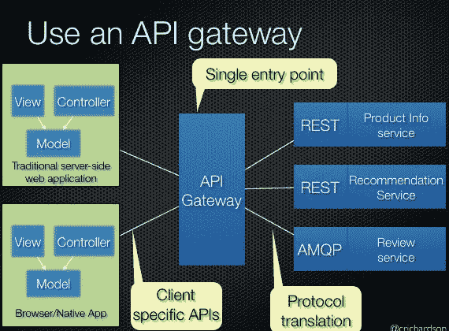
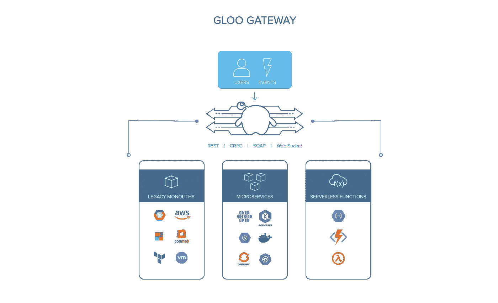
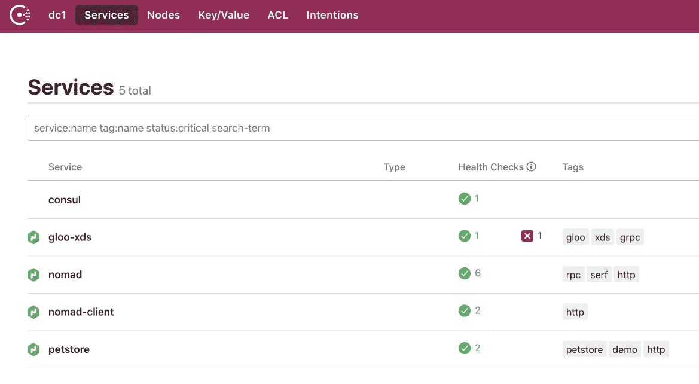
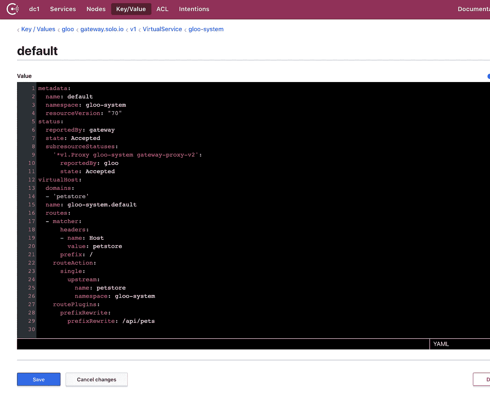
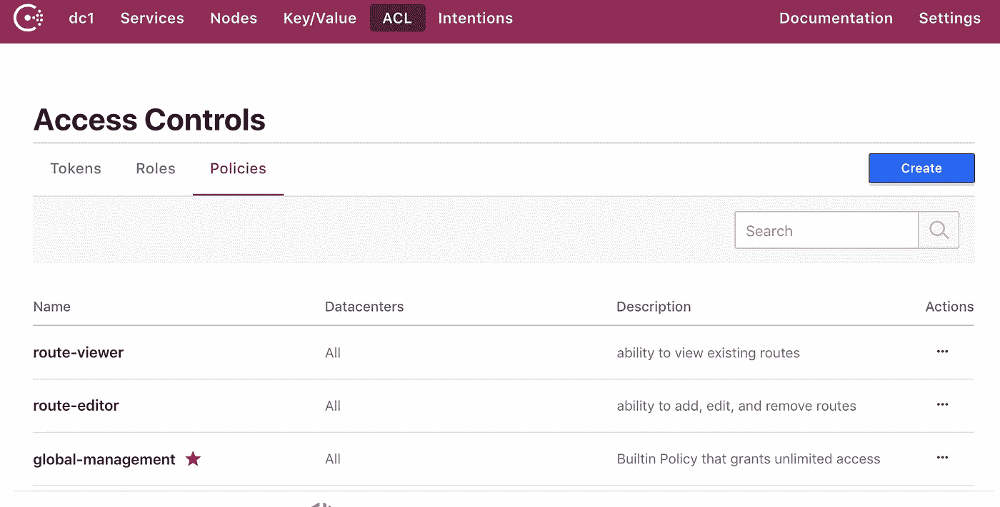

# 使用 Consul 通过 Envoy 配置 API 网关

> 原文：<https://itnext.io/using-consul-to-configure-api-gateway-with-envoy-89870ea4c67?source=collection_archive---------2----------------------->

> API 网关是管理云后端访问的一种流行解决方案，但通常受限于它们所支持的环境。入口和 API 网关的现代解决方案倾向于依赖 Kubernetes 或特定的云提供商来正常工作。
> 
> 本文深入探讨 Gloo，这是一个基于 Envoy 的现代 API 网关，它可以使用 Consul 代替 Kubernetes 进行服务发现、配置和访问控制。
> 
> [点击此处](https://youtu.be/7Mk5r9P4kb0)跳过阅读，直接进入一个录制的演示，在游牧者、执政官和金库(使用 Gloo)上运行 Envoy 作为 API 网关。

DataDog 在 2018 年进行的一项研究显示，只有 25%的客户工作负载采用了 Docker 进行容器化，其中不到 50%的客户使用了 Kubernetes 等编排系统。

诸如服务网格和 API 网关等尖端技术正在增强我们协调 IT 的能力，但它们通常需要以迁移到最新可用技术为代价。这一事实在云生态系统中留下了快速新兴技术与其自身采用挑战之间的鸿沟。

但是许多还没有迁移到 Kubernetes 的工作负载已经远远落在了后面。

在 [Solo.io](https://www.solo.io) ，我们构建软件解决方案，帮助客户从单一/传统架构过渡到现代基础设施。任何特性的首要考虑是我们将如何支持非 Kubernetes 环境，以及工作负载在 Kubernetes 上运行和不运行的混合环境。

这在 **Gloo** 中尤为重要，Solo.io 的 [Envoy-Powered API Gateway](https://www.solo.io/) 承诺将分布式应用组件“粘合在一起”，形成商业价值的逻辑单元。原则上，API 网关的功能是将独立的后端服务统一到一个面向客户端的入口点。



API 网关图。来源:[https://microservices.io/patterns/apigateway.html](https://microservices.io/patterns/apigateway.html)

当 API 网关只能在基础设施的一个分区内工作时，它提供的价值是有限的。它的路由能力将受到限制，并且除非基础设施本身全部位于一个环境中，否则不可能创建统一的入口点。

凭借其[插件架构](https://gloo.solo.io/v1/github.com/solo-io/gloo/projects/gloo/api/v1/plugins.proto.sk/)和[独立的控制平面/数据平面](https://blog.envoyproxy.io/service-mesh-data-plane-vs-control-plane-2774e720f7fc)架构，Gloo 支持轻松扩展到任何后端，而不管用于部署它的应用程序堆栈或基础架构如何。



Gloo 的 API 网关插件生态系统

我们扩展了 Gloo 作为[hashi corp consult](https://consul.io)的 API 网关，以提供三个特性:

*   服务发现
*   配置存储
*   访问控制

[consult](https://consul.io)是一个流行的基础设施工具，可以用作分布式键值存储(类似于 [etcd](https://github.com/etcd-io/etcd) )，以及服务发现后端，存储 IP、端口、健康信息和关于所发现服务的元数据。

Gloo 可以直接插入到 Consul 中，不需要 Kubernetes 作为配置和服务发现的来源。将 Gloo 插入 Consul 时:

Consul 服务目录中的所有服务都成为 Gloo 的可路由端点:



```
curl localhost:8080/ -H "Host: petstore"[
  {
    "id": 1,
    "name": "Dog",
    "status": "available"
  },
  {
    "id": 2,
    "name": "Cat",
    "status": "pending"
  }
]
```

和 Gloo 配置可以在 Consul 键值存储中直接查看和修改:



Consul 配置在数据中心之间复制，允许使用一个 Consul 代理配置 API 网关配置，并在任意数量的数据中心之间共享。

多租户环境中的管理员可以使用 [Consul ACL 令牌](https://learn.hashicorp.com/consul/security-networking/production-acls)设置策略和权限，保护对敏感路由配置的访问:



由于没有与应用程序运行时相结合，Consul 仍然是 Kubernetes 内外工作负载的配置、服务发现、健康检查和访问控制的首选。如果你是 consult 或 Gloo 的新手，我们鼓励你[通过 consult](https://gloo.solo.io/installation/gateway/docker-compose-consul/)查看本地运行 Gloo API 网关的简短教程。不需要 minikube！

下面是同一个教程的视频:

在未来的帖子中，我们将介绍 Gloo 如何利用 HashiCorp Nomad 进行部署，以及如何利用 HashiCorp Vault 进行凭证管理。涵盖所有 3 个组成部分的完整教程可以在这里找到:[https://gloo.solo.io/installation/gateway/nomad/](https://gloo.solo.io/installation/gateway/nomad/)。

感谢阅读，敬请关注更多博客和来自 [Solo.io](https://www.solo.io) 的精彩开源软件！

[1]:数据狗。(2018 年 6 月)。*关于真实码头工人收养的 8 个令人惊讶的事实*https://www.datadoghq.com/docker-adoption/ T4

[2]:不可否认，这是对云技术功能的过度简化。