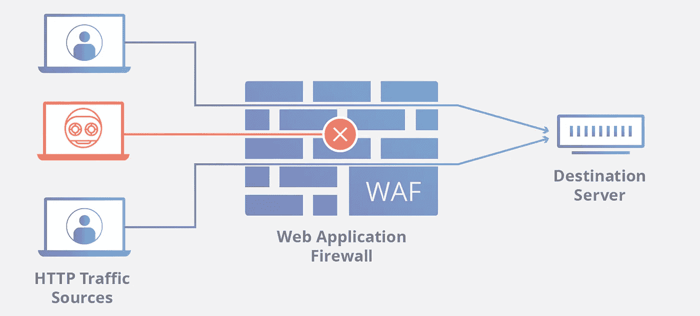
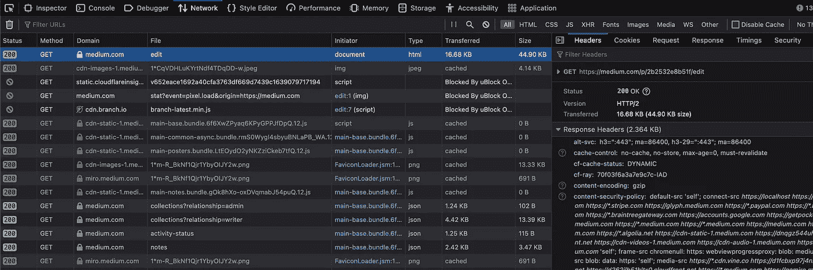
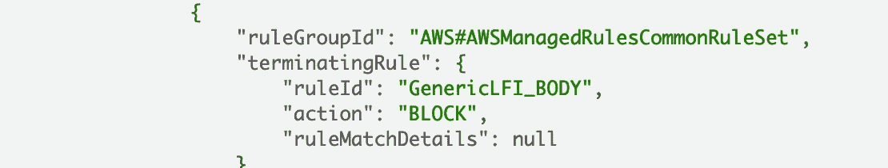
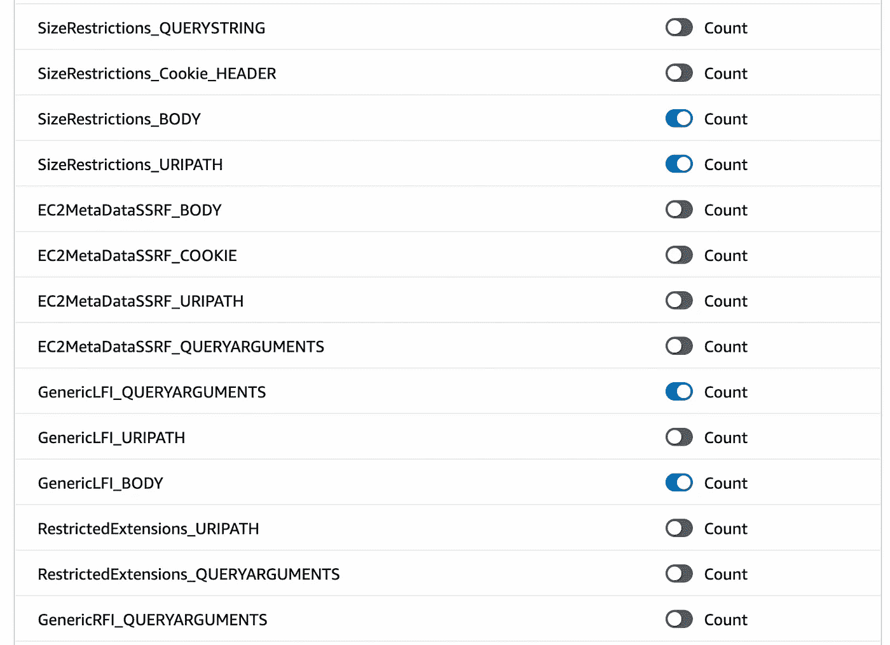
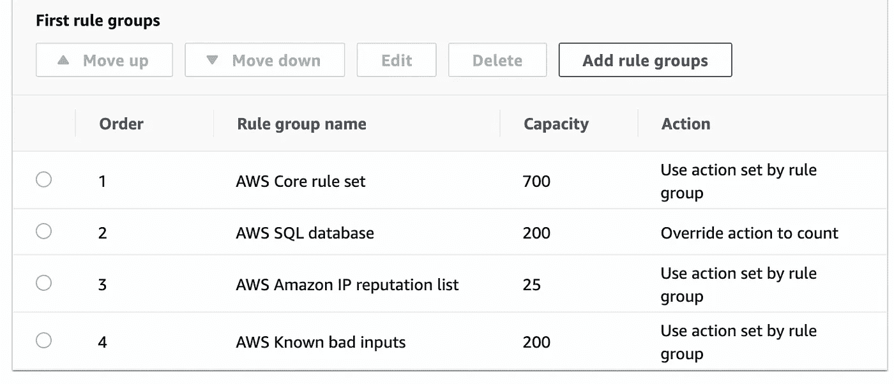
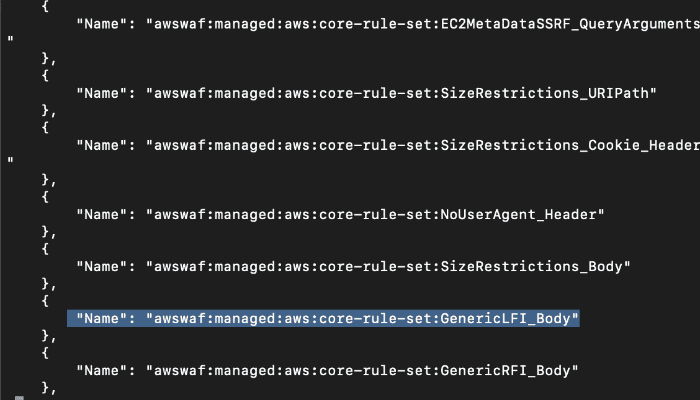
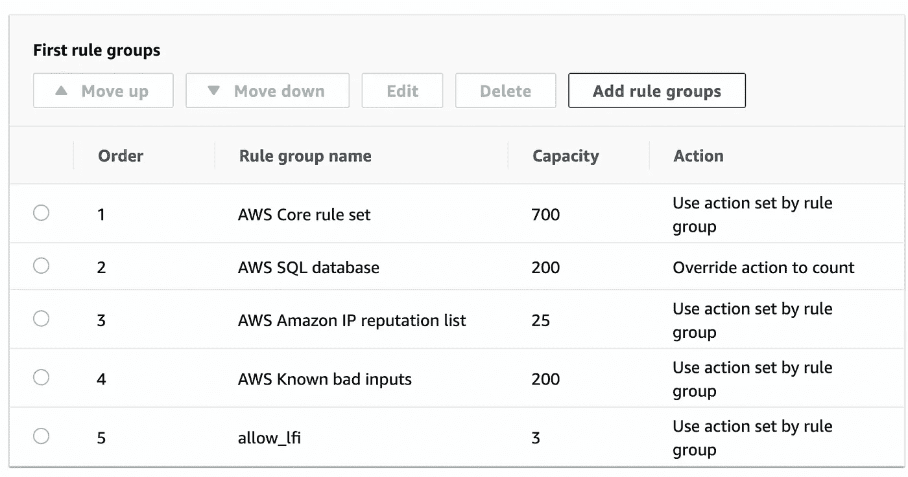
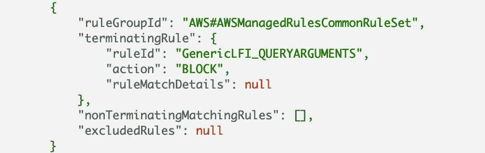

# 使用定制标签最大限度地保护 AWS WAF

> 原文：<https://itnext.io/using-custom-labels-to-maximize-protection-with-aws-waf-2b2532e8b51f?source=collection_archive---------2----------------------->

## 当您需要覆盖 AWS 管理的规则组时该做什么

在当今由 API 驱动的世界中，防火墙最需要的功能之一是能够通过解密 web 请求来检查 HTTPS 流量，并防止 SQL 注入和跨站点脚本等第 7 层利用——该列表通常被称为 [OWASP Top 10。](https://owasp.org/www-project-top-ten/)

如果你曾经管理过防火墙设备，你会非常清楚这有多麻烦。这是一个不断平衡的过程，既要精心制定策略来提供最佳保护，又不能给用户和防火墙管理团队带来太多麻烦。幸运的是，受管防火墙解决方案正变得越来越普遍，几乎每个云提供商都有自己的产品。



今天我们将深入探讨 AWS WAF 以及它的规则引擎是如何工作的。

## HTTP 101

首先，重要的是要记住 HTTP 中的 P 代表协议——它可以被定义为一组管理设备之间数据交换或传输的规则。换句话说，你的浏览器和你所连接的网页所在的服务器有一个“契约”,规定了它们应该如何相互通信。服务器说:给我发送一个格式为 x，y，z 的请求，我会按照你期望的方式处理你的请求，然后给你发送一些你能理解并能在显示器上正确显示的东西。

不出所料，浏览器构造对服务器的请求的主要方式是使用 URL。典型的 URL 如下所示:

https://domain.com/path/subpath/page.aspx?field1=test&T2【现场 2 =测试

1.  https://-这是你的浏览器正在使用的协议，现在大多数浏览器默认使用 https-http 的加密版本-有些甚至默认不显示它。如果您想使用普通的未加密 http，只需从 http://开始
2.  domain.com——这是你正在连接的实际计算机的域名或外行人的术语。互联网不理解这样的文本，它只理解像 192.168.1.24 这样的 IP 地址。您的浏览器在后台使用 DNS(域名系统)将域名转换为正确的 IP 地址。
3.  /path/subpath/page . aspx-这是 URI，统一资源标识符-有时也称为路径。这是您希望 web 服务器实际返回给您的文件——/ path/subpath 实际上是您正在连接的服务器上的文件夹——就像您笔记本电脑上的文件夹一样。有时，page.aspx 部分不会显示在 URL 中，默认情况下，web 服务器会根据路径向您返回特定的页面。
4.  [field 1 =测试&field 2 =测试](https://domain.com/path/subpath/page.aspx?field1=test&field2=test)—URI 后，如果有问号(？)问号后面的部分称为查询字符串或查询参数。这是一种向 web 服务器传递某些参数的方式，您所请求的页面可能会使用这些参数来执行一些自定义逻辑。比如一次搜索。https://www.google.com/search?q=espn[这个网址将在谷歌上搜索 ESPN。](https://www.google.com/search?q=espn)

大多数人对 URL 都很熟悉，因为他们每天都会看到它们，但实际上幕后发生的事情更多。您可以通过检查浏览器的开发工具(通常在 Windows 上按 F12 或在 Mac 上按 Command+Option+I ),获得在 web 请求中发送的信息的完整视图。



这是我写这个博客时的页面。第一眼看到这个你会不知所措。当大多数人看到点击按钮时实际发生的事情时，他们会感到震惊。这只是网络请求。

根据您在网上所做的事情，浏览器还会以以下 3 种方式包含信息:

1.  标题—当您检查请求标题时，您将看到其中包含的各种信息。下面是与普通用户最相关的 3 个标题，但是标题可以包含任何类型的信息:
    1 .主机标题—这通常与您请求的站点的域相匹配。
    2。用户代理—这包括有关您正在使用的浏览器类型的信息。这有助于 web 服务器返回一个与您的浏览器兼容的页面——对移动友好页面最有用
    3。cookie——我想大多数人都熟悉 cookie，它们是关于用户会话的信息——偏好、历史、购物车内容等。
2.  HTTP 方法—这有助于浏览器准确识别他们希望 web 服务器执行的操作，因为有时 URIs 可能会映射到幕后的不同进程。最常见的方法有:
    1。GET —您希望服务器返回一些东西。上面提到的查询字符串通常用于 GET 请求。
    2。POST —您希望 web 服务器创建一个记录。
    3。PUT —您希望 web 服务器更新现有记录。
    4。删除—您希望 web 服务器删除现有记录。
3.  请求正文/有效负载—这是您可以传递给 web 服务器以完成请求的附加数据。这通常用于 POST 和 PUT 请求。当您填写一个在线表单并单击 submit(像购物时一样)时，浏览器获取您的表单数据并将其放入请求正文中，然后发送一个 POST 或 PUT 请求。

上述每一个参数(以及其他一些参数)都是攻击者的媒介。不仅如此，在攻击者试图攻击您之前，您需要确切地知道他们的恶意请求是什么样的。你需要一个 WAF(网络应用防火墙)来检查每一个位置和精心制定的规则。输入 AWS WAF。

AWS 管理[一个规则列表](https://docs.aws.amazon.com/waf/latest/developerguide/aws-managed-rule-groups-list.html),我们可以用它来保护通过与 WAF 相关的资源的流量。这通常是大多数人开始使用 AWS WAF 的地方。在随机应用规则之前，了解您要保护的应用程序在做什么以及有什么要求是很重要的。通常从以下 5 点开始并不是一个坏主意:

1.  核心规则集—包括防范:
    1。EC2 元数据服务 SSRF
    2。跨站脚本(XSS)
    3。本地和远程文件包含
    4。恶意文件扩展名
    5。大小限制— AWS WAF 在一个请求中只能检查这么多数据；举个例子，WAF 在一个请求有效载荷中最多只能检查 8KB。这对于寻求规避 WAF 的客户来说可能是一个媒介——他们可以用 8 KB 的绒毛填充恶意的有效载荷，WAF 不会阻止它。了解了这一点，您可以配置 WAF 来阻止更大的请求，这样攻击者就无法绕过您的 WAF。如果您的应用程序需要文件上传，您可能需要允许某些请求绕过大小限制块—也许是通过精确的 URI。
2.  已知的错误输入—
    1。臭名昭著的 Log4J 漏洞
    2。Java 反序列化
    3。主机头中的本地主机。
    4。PROPFIND HTTP 方法
3.  Amazon IP 信誉列表—防止已知的恶意 IP 地址。
4.  管理保护—为您提供阻止访问敏感 URIs 的方法。这不会捕捉一切，所以通常你可以添加自己的自定义规则来阻止这些 URIs。
5.  不是托管规则，但基于速率的规则有助于防止洪水攻击。AWS 以 30 秒为增量评估 300 秒内的速率，并根据第 3 层源 IP 或报头(如“X-Forwarded-For ”)阻止违规 IP 地址(如果流中有 web 代理和负载平衡器)。

如果您使用的是 SQL 数据库，我建议您添加 awsmanagerudlesqliruleset—以增加一层针对 SQL 注入攻击的保护。

重要是要补充一点，你不应该完全依赖你的晶片来保护应用层。大多数浏览器实际上可以识别并阻止某些 XSS 攻击的发生。此外，应用程序应该添加逻辑来防止漏洞的发生——这个过程被称为[转义](https://findanyanswer.com/what-is-escaping-user-input)或[输入清理](https://www.webopedia.com/definitions/input-sanitization/#:~:text=Input%20sanitization%20is%20a%20cybersecurity,harmful%20codes%20into%20the%20system.)。最好的安全性有多层保护，并且没有单点故障。

## 当您有误报并且需要覆盖时会发生什么？

迟早你会接到用户打来的电话，说“嘿，我想在这个网站上做 xyz，但上面只写着 403 禁止”。因此，您检查日志并看到以下内容:



其中一个用户请求通过在请求体中包含一些可疑的内容来破坏本地文件包含规则。 [LFI 是一种网络请求查看服务器上目录的方式，这种方式通常是不允许的——会让你面临远程代码执行、跨站脚本或其他漏洞。](https://www.acunetix.com/blog/articles/local-file-inclusion-lfi/)典型的本地文件包含模式是

```
/../../../somefile.txt
```

您做了尽职调查，应用程序就是这样编码的，这并不一定是坏的——AWS 特别编写了稍微严格的规则。无论如何，您需要允许流量通过 WAF。你可以把通用的 LFI 体规则放在整个 WAF 的计数模式中，但是这可能会不必要地打开你。



假设您只想打开 WAF，只忽略需要打开的特定 URI 的 GenericLFI_BODY 规则。要做到这一点，您需要了解 WAF 如何处理规则和应用标签。



AWS WAF 按照规则出现的顺序处理规则。

在你需要做更复杂的事情之前，这通常没什么关系——就像我们现在所处的场景。当您将规则置于计数模式时，AWS 会将标签应用于该规则，使规则名称与请求相匹配。要查看可能分配的标签，请通过 CLI 运行此命令。根据需要更改供应商名称和名称参数。

```
aws wafv2 describe-managed-rule-group \
 — vendor-name AWS \
 — name AWSManagedRulesCommonRuleSet \
 — scope REGIONAL — region us-east-1 — query AvailableLabels
```



我们运行命令，我们看到这是应用于请求的标签，该请求在计数模式下触发核心规则集的 GenericLFI_Body 逻辑。

以下规则将阻止任何请求:如果在请求中应用了上述标签，并且请求不是针对批准的 URI/my path/page . aspx，请注意操作是 block。

```
{
  "Name": "allow-lfi",
  "Priority": 0,
  "Action": {
    "Block": {}
  },
  "VisibilityConfig": {
    "SampledRequestsEnabled": true,
    "CloudWatchMetricsEnabled": true,
    "MetricName": "allow-lfi"
  },
  "Statement": {
    "AndStatement": {
      "Statements": [
        {
          "LabelMatchStatement": {
            "Scope": "LABEL",
            "Key": "awswaf:managed:aws:core-rule-set:GenericLFI_Body"
          }
        },
        {
          "NotStatement": {
            "Statement": {
              "ByteMatchStatement": {
                "FieldToMatch": {
                  "UriPath": {}
                },
                "PositionalConstraint": "EXACTLY",
                "SearchString": "/mypath/page.aspx",
                "TextTransformations": [
                  {
                    "Type": "NONE",
                    "Priority": 0
                  }
                ]
              }
            }
          }
        }
      ]
    }
  }
}
```

然后，我们只需确保我们的新规则在核心规则集将标签“AWS waf:managed:AWS:Core-Rule-Set:generic lfi _ Body”应用于请求之后得到处理。



## 如果我们需要做一些更复杂的事情呢？

问题解决了对吗？没有。第二天，你会收到用户发来的电子邮件，说他们收到了更多的 403 错误。您检查日志，看到 GenericLFI_Body 规则在不同的 URI 上跳闸，现在您看到日志中有，它在相同的两个 URIs 上跳闸。你再次确认这是合法的交通，你需要允许它通过。但是怎么做呢？



基本上，您需要能够同时正确处理所有 4 个条件的逻辑，并应用一个块— 2 个不同的模式匹配和不同的 URI 匹配。这基本上是嵌套在 And 语句中的 Or 语句，但这在 WAF 中是不可能的——至少在单个规则中是不可能的……

前进的道路是使用自定义标签。AWS WAF 允许您根据特定逻辑对流量应用自定义标签，以便您可以将这些标签用于下游策略实施。

我将它们都包含在 CloudFormation 中，以便于阅读。注意，这个特殊的规则组有 3 个单独的规则 WAF 根据它们的优先级依次处理它们。
1。 **GenericLFI_Label_Check** —设置为计数。注意，这通过 RuleLabels 标志应用了一个标签*app:generic-RFI-label-check*。该标签将应用于任何包含标签的请求，该标签可以是
* AWS waf:managed:AWS:core-rule-set:generic lfi _ query arguments
* AWS waf:managed:AWS:core-rule-set:generic lfi _ Body
2。 **GenericLFI_Uri_Check** —设置为计数。这将检查请求是否既不是/mypath/page.aspx 也不是/otherpath/process.aspx，并应用标签*app:generic-RFI-allowed-uri*。注意这个逻辑中的 not 语句和 and 语句。
3。 **GenericLFI_Block** —这将检查请求是否具有上述两个自定义标签，如果有，将阻塞请求。

我们将它放在核心规则集下面，以确保正确应用核心规则集中的标签。我们还必须确保 GenericLFI_QueryArguments 规则被设置为在托管规则组中计数。

```
Parameters:
  Application:
    Type: String
Resources:
  GenericLFIAllowRule:
      Type: AWS::WAFv2::RuleGroup
      Properties:
        Scope: REGIONAL
        Capacity: 20
        Description: !Sub ${Application}-GenericLFI-URI-Allow-List
        Name: !Sub ${Application}-GenericLFI-URI-Allow-List
        VisibilityConfig:
          SampledRequestsEnabled: true
          CloudWatchMetricsEnabled: true
          MetricName: !Sub ${Application}-GenericLFI-URI-Allow-List
        Rules:
          - Name: GenericLFI_Label_Check
            Priority: 0
            RuleLabels:
              - Name: app:generic-rfi-label-check
            Action:
              Count: {}
            VisibilityConfig:
              SampledRequestsEnabled: true
              CloudWatchMetricsEnabled: true
              MetricName: !Sub ${Application}-GenericLFI_Check
            Statement:        
              OrStatement:
                  Statements:
                    -  LabelMatchStatement:
                        Key: awswaf:managed:aws:core-rule-set:GenericLFI_QueryArguments
                        Scope: LABEL
                    -  LabelMatchStatement:
                        Key: awswaf:managed:aws:core-rule-set:GenericLFI_Body
                        Scope: LABEL
          - Name: GenericLFI_Uri_Check
            Priority: 1
            RuleLabels:
              - Name: app:generic-rfi-allowed-uris
            Action:
              Count: {}
            VisibilityConfig:
              SampledRequestsEnabled: true
              CloudWatchMetricsEnabled: true
              MetricName: !Sub ${Application}-GenericLFI_Uri_Check
            Statement:        
              AndStatement:
                  Statements:
                    - NotStatement:
                        Statement:
                          ByteMatchStatement:
                              FieldToMatch:
                                UriPath: {}
                              PositionalConstraint: EXACTLY
                              SearchString: /mypath/page.aspx
                              TextTransformations:
                                - Type: NONE
                                  Priority: 0
                    - NotStatement:
                        Statement:
                          ByteMatchStatement:
                              FieldToMatch:
                                UriPath: {}
                              PositionalConstraint: EXACTLY
                              SearchString: /otherpath/process.aspx
                              TextTransformations:
                                - Type: NONE
                                  Priority: 0
          - Name: GenericLFI_Block
            Priority: 2
            RuleLabels:
              - Name: app:generic-rfi-block
            Action:
              Block: {}
            VisibilityConfig:
              SampledRequestsEnabled: true
              CloudWatchMetricsEnabled: true
              MetricName: !Sub ${Application}-GenericLFI_Block
            Statement:        
              AndStatement:
                  Statements:
                    - LabelMatchStatement:
                        Key: app:generic-rfi-label-check
                        Scope: LABEL
                    - LabelMatchStatement:
                        Key: app:generic-rfi-allowed-uris
                        Scope: LABEL
```

即使使用托管防火墙解决方案，正确设计和维护它们也不是一件简单的任务。AWS 已经做了大量的工作，减少了设计 web 应用程序防火墙的负担，该防火墙具有完全可扩展的策略引擎，能够检查 web 请求的每个方面，以防止恶意行为者破坏您的应用程序。

Matthew 是领先的 AWS 网络安全合作伙伴 stackArmor 的高级解决方案总监，该公司为希望满足合规框架安全要求的客户设计定制解决方案:FedRAMP、NIST 800 系列、PCI-DSS、国防部 SRG、HIPAA、FISMA、FIPS 140–2(和 3)等。StackArmor 提供了一个经过 AWS 审核的解决方案，可以加速 FedRAMP ATO 的运行并降低 40%以上的成本。