# 在 Go 中使用依赖倒置

> 原文：<https://itnext.io/using-dependency-inversion-in-go-31d8bf9b3760?source=collection_archive---------1----------------------->

# 什么是依赖倒置？

依赖倒置是指高级逻辑不应该依赖于它的低级实现。我们应用程序中的业务逻辑不应该关心我们是从一个 AWS 桶还是 Google 云存储中获取数据；我们应该能够在不中断程序的情况下轻松地交换这些实现。这使得我们的代码在变化面前保持稳定。我们还可以通过将这些依赖关系换成更容易测试的实现来使我们的应用程序可测试。

**这在围棋中是怎么做到的？**

在 Go 中，接口使我们能够使用依赖倒置。我们能够在代码中使用不同的实现，只要它们满足我们定义的接口。我们使用依赖注入来告诉应用程序使用哪个实现。

# 工作示例

为了演示这在 Go 中是如何工作的，我们将构建一个报价 API，为我们的用户提供随机报价。下面是我们当前提供 Kanye West 报价的 Go handler 的截图。

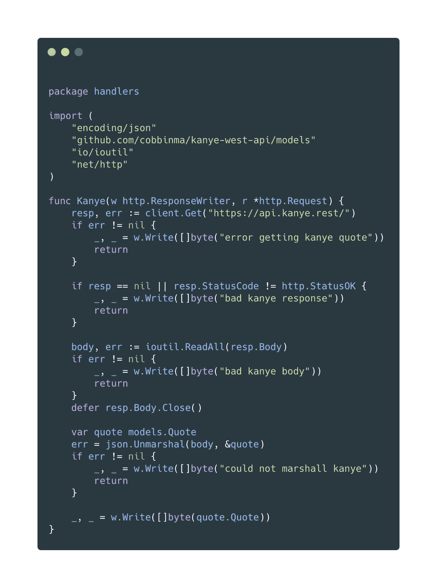

这个处理程序很好地为用户提供了 Kanye West 的引用；这是您第一次在 Go 中编写 HTTP 处理程序时可能会想到的。它对提供报价的[**https://API . kanye . rest**](https://api.kanye.rest)进行 HTTP 调用并检查响应是否有效。当您调用处理程序时，您将收到一个带有引号的响应:

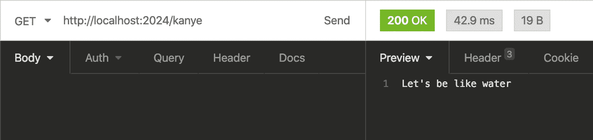

然而，我们想开始测试处理程序，但目前没有办法不进行实际的 HTTP 调用。我们也没有办法测试当我们的依赖返回错误响应时会发生什么。这就是我们可以开始使用依赖倒置的地方。

我们首先需要创建一个接口，这将定义我们的依赖行为。通过这样做，我们以后将能够在不同的实现中交换，只要它们共享相同的行为。这是我们的界面:

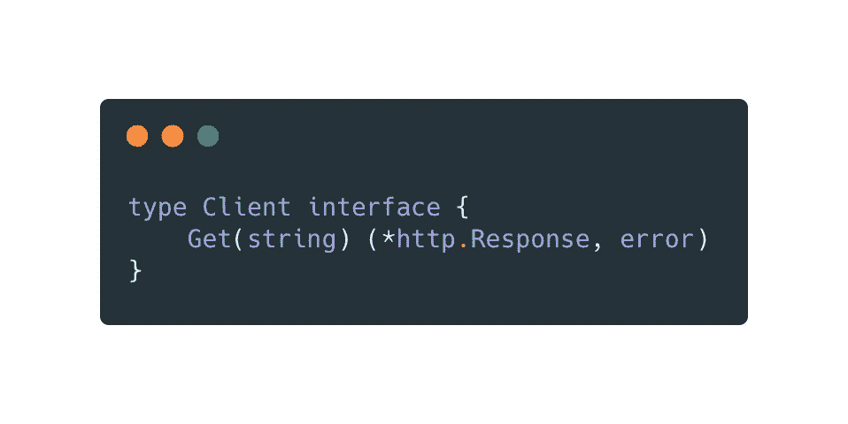

任何具有名为“Get”的方法的结构都将满足客户端接口，该方法将字符串作为参数，并返回一个指针，该指针指向带有错误的来自 net/http 包的响应类型。这是我们感兴趣的行为。

现在，我们需要一种方法将依赖注入到处理程序中，使它与我们选择使用的客户端接口的实现无关。Go 中依赖注入的方法有很多。我将在下面概述几个:

## **高阶函数**

我们可以创建一个返回原始处理函数的高阶函数。这很方便，因为你只需要调用你需要使用的高阶函数，我们也不需要创建一个处理程序结构。

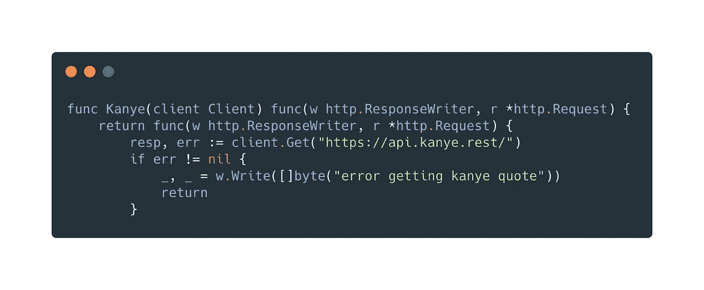

然后，通过调用高阶函数，从主函数中注入我们的 HTTP 依赖项。

## **构造器**

我们可以创建一个“handlers”结构，它有一个构造函数，我们在其中提供客户端实现。handlers 结构有一个名为 client 的字段，我们的实现就存储在这个字段中。

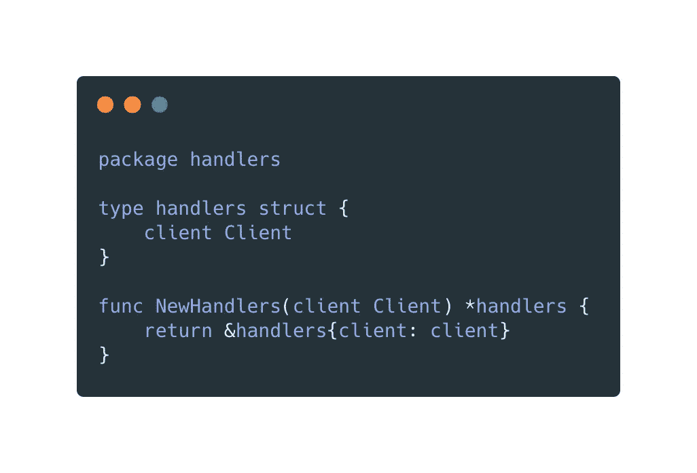

通过使 Kanye 函数成为一个 **handlers** receiver 方法，我们可以访问客户端字段。

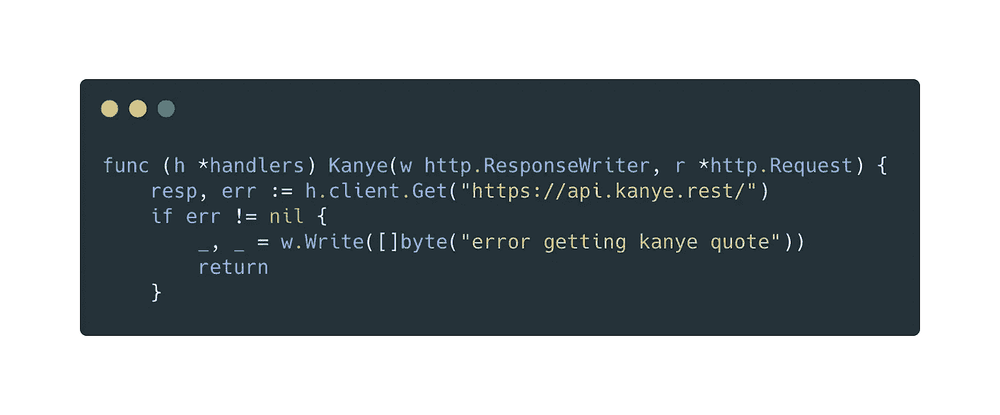

然后，我们通过构造具有正确依赖关系的处理程序结构，从主函数注入 HTTP 客户机。

这种方法的一个缺点是，当大量使用时，它会使您在主文件中构造大量的结构。

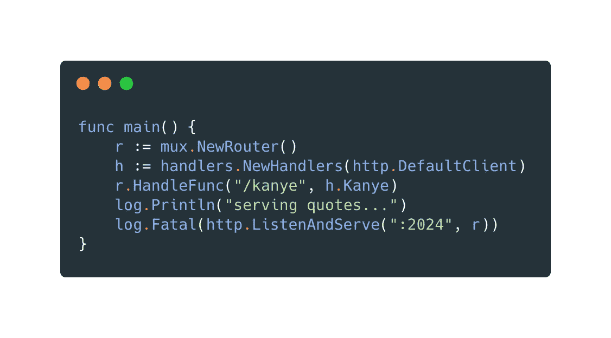

## **使用选项**

另一种方法是使用我们的**处理程序**构造函数中的选项。在这种方法中，我们设置一个默认的实现来使用，除非用户给出一个替代方案作为选项。**处理程序**构造函数将是一个变量函数，因此可以给它选项，也可以不给。在下面的例子中，我们用 CustomClient 导出了一个高阶选项函数**，使用户可以方便地使用另一个客户端实现。**

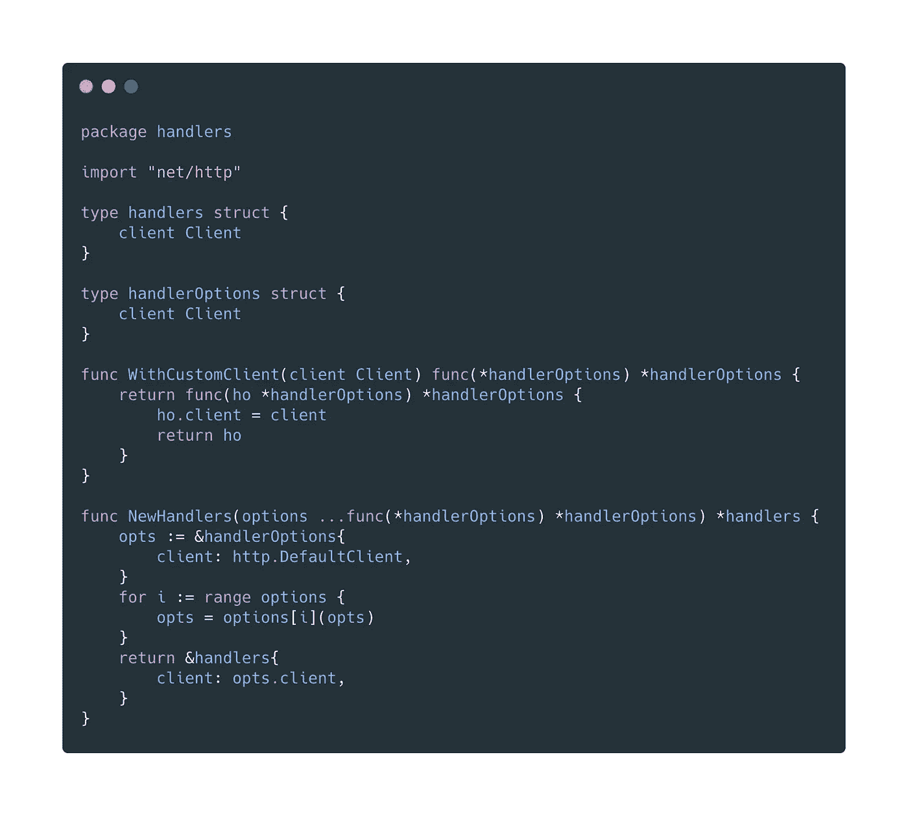

使用构造函数，我们现在可以使用默认的实现(http。DefaultClient)，方法是不带任何参数调用 **NewHandlers** :

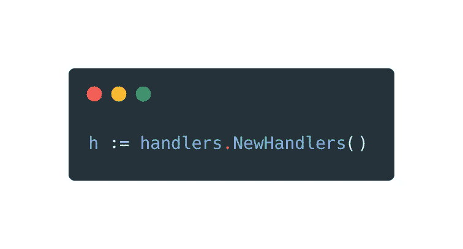

或者我们可以使用自定义客户端选项调用它，以使用非默认的:

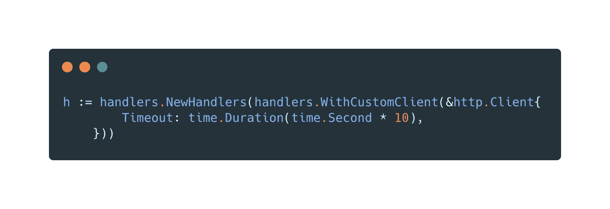

使用这种方法，当您想要使用默认实现时，您不需要自己构建这些实现，这样可以使您的主文件不那么复杂。

# 测试实现

现在我们已经介绍了不同的依赖注入方法，我们将创建一个在测试中使用的客户端接口的实现。从这里开始，我们将使用高阶函数来注入依赖性。

此时，我们可以自己编写一个 test double，或者使用 GoMock 生成一个实现，允许我们通过存根来控制它的行为。对于这个例子，我们将使用 GoMock。

通过将下面的代码行添加到我们的代码库，我们可以从客户端界面自动生成一个 test double。

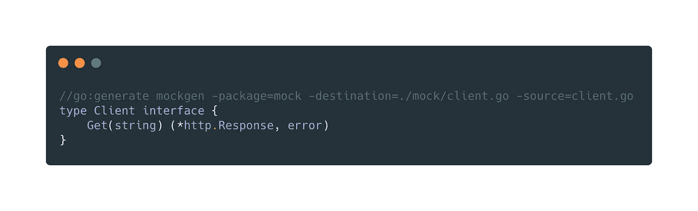

通过运行 **go 生成。/…** 我们生成以下代码:

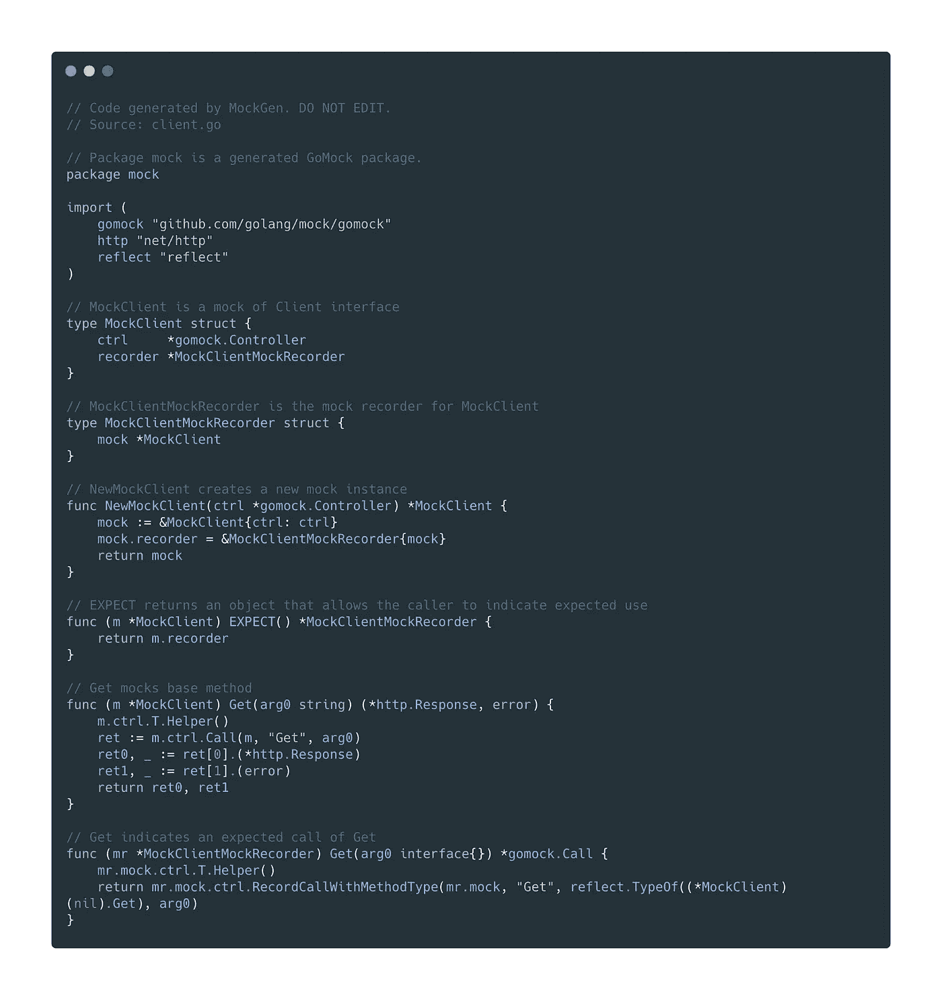

这是我们可以在测试中使用的客户端的实现。我们可以注入这个，而不是默认的 HTTP 客户端，并模拟对 Kanye API 进行真正的 HTTP Get 调用的行为。我们现在能够在不进行 HTTP 调用的情况下编写测试，并测试当我们得到不好的响应时会发生什么。

下面是我们现在可以编写的测试用例类型的一个例子。该测试使用银杏，一个行为驱动的开发测试框架。

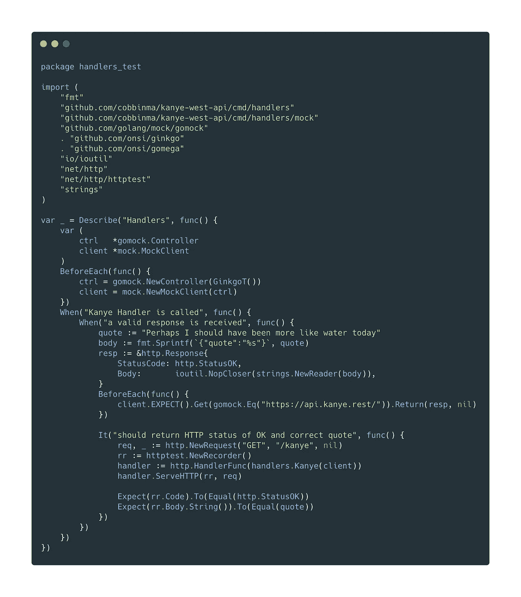

测试用例存根模拟客户端实现。我们检查它是用正确的 URL 字符串调用的，并告诉它返回我们的 HTTP 响应而不出错。我们可以检查发送给用户的 HTTP 状态代码和报价是否与我们预期的一样。

# 结论

我们已经介绍了如何使用依赖反转来改变我们的处理程序，以便它可以用于任何客户端实现。这种技术可以应用于任何类型的依赖关系。

依赖倒置是一个强大的工具，随着功能的增加，它可以创建更加稳定和健壮的程序。我们可以创建模拟依赖关系的测试，通过依赖概念而不是实现，我们减少了业务逻辑的变化量。

如果你想阅读更多关于依赖倒置的内容，我强烈推荐罗伯特·C·马丁的《干净的架构》。[https://www . goodreads . com/book/show/18043011-clean-architecture](https://www.goodreads.com/book/show/18043011-clean-architecture)

所有代码示例都可以在这里找到:

https://github.com/cobbinma/quotes