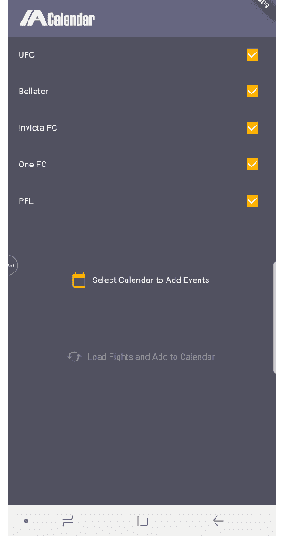
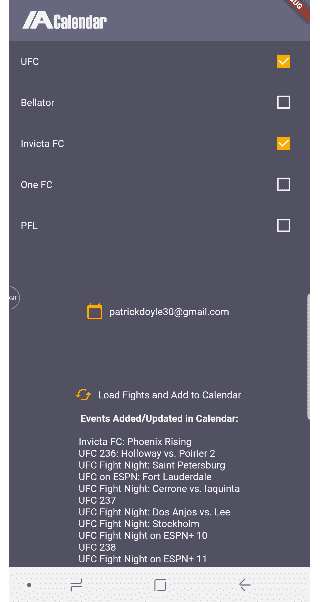

# 使用 Flutter 中的 Device_Calendar 库与 Android/iOS 日历通信

> 原文：<https://itnext.io/using-device-calendar-library-in-flutter-to-communicate-with-android-ios-calendar-95b2d8c77b40?source=collection_archive---------4----------------------->

Built to Roam 创建了一个“device _ calendar”Flutter/Dart 库，用于与移动设备日历进行通信(即添加、更新、检索、删除 Android/iOS 日历事件)。他们当前的 Github 页面包括一个实现这个库的示例应用程序，我推荐你去看看。

[](https://github.com/builttoroam/flutter_plugins/tree/develop/device_calendar) [## builttoroam/flutter_plugins

### 通过在 GitHub 上创建一个帐户，为 builttoroam/flutter_plugins 开发做贡献。

github.com](https://github.com/builttoroam/flutter_plugins/tree/develop/device_calendar) 

他们的 Github 页面目前没有关于如何使用这个库的详细信息，所以我想我应该记录一些说明来节省其他人的时间。我将以我的应用程序为例，展示如何使用这个库。我的 app 叫 **MMA 日历**。它从网络上检索未来的 MMA(混合武术)事件，并自动为用户创建/更新日历事件。

我的 app 可以在下面的链接看到，以供参考(请务必关注我的 Github😎)
[https://github.com/patpatchpatrick/MMACalendarFlutter-v2-](https://github.com/patpatchpatrick/MMACalendarFlutter-v2-)

1.  首先，有必要将包依赖性添加到 **pubspec.yaml** 文件依赖性部分，这对于任何其他 Flutter 外部库都是必要的

```
**dependencies**:
  **flutter**:
    **sdk**: flutter

  **device_calendar**: ^0.1.1
```

2.**日历使用权限****也必须添加到 Android(**androidmanifest . XML**)和 iOS ( **Info.plist** )中的相应文件中**

***安卓清单:***

```
<uses-permission android:name="android.permission.READ_CALENDAR" />
<uses-permission android:name="android.permission.WRITE_CALENDAR" />
```

***信息列表:***

```
<key>NSCalendarsUsageDescription</key>
<string>REASON_TO_USE_CALENDAR</string>
```

**3.确保将 **device_calendar** 包导入到您当前正在处理的应用程序 dart 文件中。在我的 MMA 日历应用程序中，我在我的 mainpage.dart 文件和 calendarpage.dart 文件中使用这个库，所以我在这两个文件中导入这个包**

```
 **import** 'package:device_calendar/device_calendar.dart';
```

**4.在我的应用程序中，我在 calendarpage.dart 文件中创建了一个 CalendarPage 小部件。在创建这个小部件时，我使用了 Github device_calendar 示例应用程序作为参考，但对它进行了轻微的调整。My CalendarPage 小部件包含一个 ListView，它显示用户日历的列表。然后，用户可以选择他们想要使用的日历(即，应该将网络查询的 MMA 事件添加到哪个日历)。然后，当用户点击“**载入比赛并添加到日历**”按钮时，日历事件将自动为用户创建(或者事件将被更新，如果它们是先前创建的)。日历页面如何工作的示例如下所示:**

****

**用户在应用程序中选择日历的示例**

**5.在与移动设备日历通信之前，您需要创建一个 **DeviceCalendarPlugin** 对象。当我构造我的日历页面小部件的状态( **CalendarPageState** )时，我在构造函数中创建了一个新的 DeviceCalendarPlugin 实例。我这样做是因为 CalendarPage 小部件立即需要插件可用于与移动设备日历通信的方法。**

**6.您还会注意到，在构造状态时创建了 **DeviceCalendarPlugin** 之后，在初始化状态时会调用 **_retrieveCalendars** 方法(在 overidden initState()方法中)。本质上，这里发生的事情是，在构造状态之后，立即从设备中检索日历列表。**

**在下面的代码中，您将看到 **_retrieveCalendars** 方法从设备中异步检索日历，并将 **_calendars** 对象(这是一个 **List < Calendar >** 对象)设置为日历列表。在此之前，您必须检查设备是否被授予了适当的日历权限，如果没有，您必须请求从设备检索日历列表所需的日历权限。如果成功授予权限，DeviceCalendarPlugin 的 **retrieveCalendars()** 方法可用于从移动设备检索日历列表( **List < Calendar >** )。总而言之，当创建 CalendarPage 小部件时，会创建一个新的 DeviceCalendarPlugin，然后使用该插件的 retrieveCalendars()方法从设备中检索日历。**

**7.有了日历列表后，我们就可以开始使用它们了！这里有几个选项，您可以从日历中检索事件、添加事件、删除事件、更新事件等**

**在我的 MMA 日历应用程序中，我只添加和更新事件，所以这就是我在这里关注的。如步骤 4 所述，我的 CalendarPage 小部件包含一个显示用户日历的 **ListView** 。如果日历是只读的，这个 ListView 还会显示一个锁图标(这些代码都来自 device_calendar 示例应用程序)。ListView 中有一个**手势检测器**，它将获取使用 ListView 的索引选择的日历。然后，我创建了一个回调函数，将这个日历 ID、日历名称和 deviceCalendarPlugin 返回到我的应用程序的主页，以便它们可以在我的主页小部件中使用。在这里，我不打算深入研究如何在 Dart 中使用回调的细节，但概括地说，您只需在小部件(MainPage)中创建一个函数，并将该函数传递给子小部件(CalendarPage)的构造函数。然后，您可以从子进程调用这个回调函数来为父进程提供所需的对象(例如 calendarID、calendarName、deviceCalendarPlugin)。(在我的 code _calendarCallback 函数中可以看到这样的例子)。**

**回调发送 ID，名称，插件到父部件(mainpage.dart)**

**8.在我的主页小工具中通过回调接收到日历信息后，用户已经正式选择了一个日历，所以我启用了“**加载战斗并添加到日历**”按钮供用户选择。我还向用户显示了选定的日历名称，如上面我的应用程序的 GIF 所示(第 4 步)。**

**当用户点击这个加载比赛按钮时，MMA 事件数据从网络上被抓取并且 MMA 事件被创建，这些事件可以被添加到用户的移动设备日历中。我的代码使用一个名为 **_addEventsToCalendar** 的方法来创建/更新用户日历中的事件。在用户日历中添加/更新事件相对简单。首先，您必须创建一个新的**事件(calendarID)** ，使用所选的日历 ID 作为构造函数。然后，您需要向事件添加某些数据(开始时间、持续时间、标题、描述等)。创建事件后，使用**devicecalendarplugin . createorupdateevent(event)**方法将其添加到用户的日历中，并插入您创建的事件作为唯一参数。完成了。您将通过您调用的事件创建方法接收一个结果变量( **createEventResult** )。如果您的事件创建成功，**createeventresult . issuccess**bool 将为真。**

**另一个重要的注意事项是，您的 createEventResult 对象还将有一个数据字符串变量( **createEventResult.data** )，它对应于您在移动设备中创建的事件的 ID。如果需要，您可以使用此 ID 来更新事件。要更新一个事件，必须在该事件上设置 ID 属性(即**事件)。ID = createEventResult.data** 。然后，当您调用事件的**createOrUpdateEvent(event)**方法时，它将被更新，而不是创建一个新的/重复的事件。**

**我个人使用**shared preferences**(shared _ preferences 库)来处理我的事件 id。当我创建 MMA 事件时，我将事件名称/日期与 ID 相关联，然后如果用户已经有了与事件相关联的 ID，我会确保更新事件，而不是在他们的日历中创建新的/重复的事件。**

**在日历中添加/更新事件**

****

**添加到 Android 日历的事件**

**这是所有的乡亲。**

**同样，请务必查看内置漫游设备日历插件示例应用程序，如果您喜欢，不要忘记在 Github 上关注我😎。**

****设备 _ 日历插件:**[https://pub.dartlang.org/packages/device_calendar](https://pub.dartlang.org/packages/device_calendar)**

****我的 Github:**[https://github.com/patpatchpatrick](https://github.com/patpatchpatrick)**

****MMA 日历 App:**[https://github.com/patpatchpatrick/MMACalendarFlutter-v2-](https://github.com/patpatchpatrick/MMACalendarFlutter-v2-)**