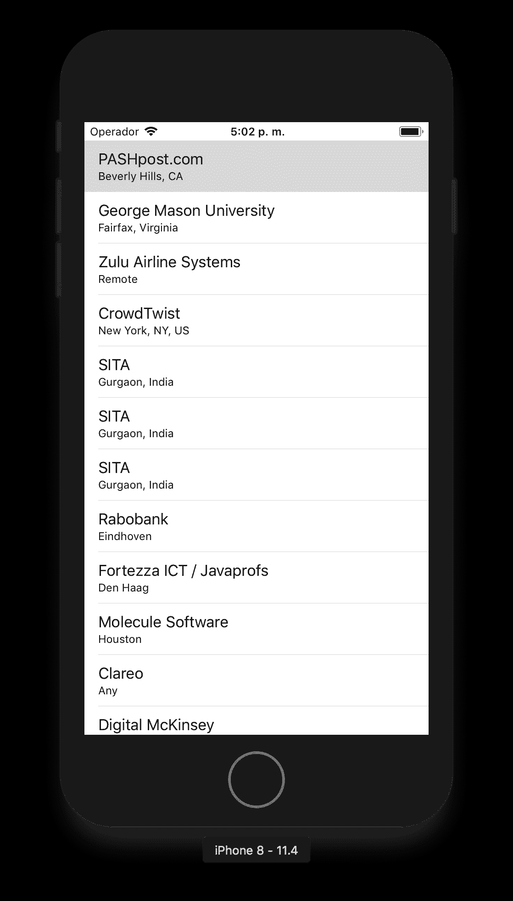

# 使用枚举和闭包替换委托

> 原文：<https://itnext.io/using-enums-and-closures-to-substitute-delegates-901c7b9ea8ce?source=collection_archive---------4----------------------->

照片由[你好我是 Nik](https://unsplash.com/photos/MAgPyHRO0AA?utm_source=unsplash&utm_medium=referral&utm_content=creditCopyText) 上 [Unsplash](https://unsplash.com/search/photos/code?utm_source=unsplash&utm_medium=referral&utm_content=creditCopyText)

作为 iOS 开发者，我们习惯于使用委托来异步移动数据，苹果当然也喜欢使用它们。
然而，如果你和我(以及其他许多 iOS 开发者)一样，避免使用它们是我们开发步骤中很重要的一部分，尤其是在使用没有 RxSwift(或任何其他函数式反应式编程库)的 MVVM 时。

我们将结合使用闭包和枚举来避免在`ViewModel`和`ViewController`之间使用委托。
我们将要处理的项目使用了委托，我们将重构它，改为使用枚举和闭包。

如果你对闭包不够熟悉，我推荐你先看看这个: [*不要滥用委托，用 Swift 闭包代替*](https://medium.com/@dmlebron/using-swift-closures-as-an-alternative-to-delegates-5c3c1a7f45d6)

首先，访问[这里](https://github.com/dmlebron/closure_enums_delegates/tree/initial_state)获得初始项目。

让我们运行应用程序，了解它的工作原理:

是一个简单的应用程序，它有一个 Api 客户端、一个视图模型和一个视图控制器。
Api 客户端通过网络调用获取所有作业，然后将对象发送给视图模型，视图模型通知视图控制器加载状态，并传递要显示的对象。所有这些调用都是异步的。因此，我们使用委托将数据从 Api 客户机一直传递到视图控制器。

## 重构:

**Api 客户端
这里我们有两个委托:**

让我们开始在名为`Response`的`ApiClient`类中创建一个`enum`。

现在让我们为结束语创建一个`typealias`。

我们差不多完成了，现在让我们修改函数签名，让我们刚刚声明的`Closure` typealias。

太好了，现在让我们把所有的碎片放在一起。
在用新的`closure`参数替换委托方法调用，并删除类中与`ApiClientDelegate`相关的所有内容之后，它看起来应该是这样的。

厉害！
到现在为止，您应该会在视图模型上看到一堆错误，但是不要担心，我们会马上处理这些错误。

**查看模型**
按照我们刚刚在`ApiClient`中所做的相同模式，我们需要:

*   在名为`Result`的 ViewModel 类中添加一个`enum`
*   声明一个名为`Closure`的`Result -> ()`类型的 typealias
*   移除底部的委托变量、init 和扩展
*   修改函数声明，使其具有一个`Closure`参数
*   在`get`函数中，我们需要对`response`进行`switch`操作，以从调用中获取`result`或`error`。
*   完成所有这些步骤后，该类应该如下所示:

现在……视图控制器正在大声呼救，让我们直接跳进来吧。

**视图控制器**

如您所见，我们可以将 viewModel 变量改为`let`而不是`lazy var`，现在，让我们将`switch`放在`result`上，就像我们在视图模型上所做的那样。

就是这样…等等…
我们通过在闭包内部调用 self 来创建一个引用循环。为了解决这个问题，让我们在闭包中的`(result)`之前使用下面的捕获列表`[unowned self]`。对于应该使用`[weak self]`还是`[unowned self]`有很多争议，但是对于这个例子，使用 unowned 是正确的选择。

运行应用程序，一切都应该像预期的那样工作。

## 可扩展:

如果您有两个以上的委托(如本例所示)，您可以快速扩展您的枚举以包含更多的事例。这就是这种方法吸引人、干净、易于遵循和易于扩展的原因。

要下载最终项目，请访问[这里](https://github.com/dmlebron/closure_enums_delegates/tree/final_state)。

## 跟我来

推特:[勒布朗](https://twitter.com/dmlebron)