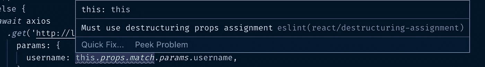
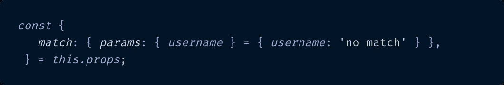

# 使用 ES6 来析构 JavaScript 中深度嵌套的对象&避免破坏代码的未定义错误

> 原文：<https://itnext.io/using-es6-to-destructure-nested-objects-in-javascript-avoid-undefined-errors-that-break-your-code-612ae67913e9?source=collection_archive---------0----------------------->

# 因为 Airbnb 的 ESLint 在反应上毫不留情


# 介绍

在的情况下，这是你第一次阅读我的帖子，感谢你抽出时间，我是一个全栈软件开发人员，喜欢 JavaScript，尤其是 React 框架。

一年多来，在我下班后的空闲时间里，我一直在网上文档、文章、教程和建立(和打破)副业的帮助下自学 React。

有了所有这些知识和灵感来源，我设法构建了一个令我非常自豪的[用户注册应用程序](https://github.com/paigen11/mysql-registration-passport)。它有一个 React 前端，一个 Express/Node.js 服务器后端，一个 MySQL 数据库，它使用 [Passport.js 和 JSON Web 令牌](/implementing-json-web-tokens-passport-js-in-a-javascript-application-with-react-b86b1f313436)来处理身份验证，使用 [Sequelize](https://medium.com/@paigen11/sequelize-the-orm-for-sql-databases-with-nodejs-daa7c6d5aca3) ORM 在数据库上执行 CRUD 操作，通过 Nodemailer 使用[密码重置功能](/password-reset-emails-in-your-react-app-made-easy-with-nodemailer-bb27968310d7)，在其余端点上测试 [Swagger 端点](/setting-up-swagger-in-a-node-js-application-d3c4d7aa56d4)，在虚拟化容器环境中同时启动应用程序的所有三个部分的`[docker-compose.yml](https://medium.com/@paigen11/using-docker-docker-compose-to-improve-your-full-stack-application-development-1e41280748f4)` [文件](https://medium.com/@paigen11/using-docker-docker-compose-to-improve-your-full-stack-application-development-1e41280748f4)等。你有足够的技术扔给你吗？😫

是的，我把那些流行语都扔了，不，我真的没什么大不了的。😉

请理解，这个项目绝不是一天就能完成的，它开始是一个非常基本的想法，随着我不断取得进展，并变得更加雄心勃勃，想看看我能把它推进多远。但是当我到了那一步的时候，我为自己感到非常自豪。我做了一个很酷、很有用的小项目——完全用 JavaScript 构建。

然后，我[将 Airbnb 的 ESLint](/how-eslint-makes-me-a-better-react-developer-237fb14c00ae) 配置引入其中，当 [VS 代码浏览器](/keep-code-consistent-across-developers-the-easy-way-with-prettier-eslint-60bb7e91b76c)左右亮起不赞成的红色波浪线时，我感到谦卑。😞然而，我没有放弃，而是坚持学习现代 JavaScript/ES6 开发的最佳实践(根据 ESLint 和 Airbnb)，修复了我的大部分错误，并成为了一名更好的开发人员。

然而，有一个错误让我困惑。深度嵌套的、被析构的对象。请告诉我，你是如何析构一个在 JavaScript 中有几层深度的`prop`对象来让 ESLint 满意的？

> 今天，我将向您展示如何使用 ES6 来析构嵌套对象，我的朋友们，更重要的是，如果一个对象完全丢失了那个属性，防止可怕的未定义错误。

我们开始吧。

# 问题:ES6 对象析构&深度嵌套对象

为了让您更深入地了解我所描述的内容，让我先回顾一下 JavaScript 中的对象析构是什么，以及为什么一旦您的对象变得复杂，它就会变得令人望而生畏。

## 简而言之，对象析构

和往常一样，MDN 的文档很好地总结了 JavaScript 析构:

> **析构赋值**语法是一个 JavaScript 表达式，可以将数组中的值或对象中的属性解包到不同的变量中。— MDN 文档，析构分配

这是 ES6 中引入的一个特性，在实践中，它意味着您的代码可以如下所示:

**普通的旧 JavaScript 对象**

```
const myObject = { 
  a : "foo", 
  b : false, 
  c : 11 
};
```

**传统 JS 对象属性访问示例(点符号和括号符号)**

对象的属性通过点符号或括号符号来访问，如下所示:

```
console.log(myObject.a); // "foo"
console.log(myObject[b]); // false
console.log(myObject.c); // 11
```

**ES6 对象属性访问示例(析构)**

像这样被访问:

```
const { a, b, c } = myObject;
console.log(a); // "foo"
console.log(b); // false
console.log(c); // 11
```

很酷，对吧？它更短，读起来更简洁，逻辑上也很有意义。

数组、对象和析构还有很多更酷的事情可以做，我建议你阅读[文档](https://developer.mozilla.org/en-US/docs/Web/JavaScript/Reference/Operators/Destructuring_assignment)获取更多示例。

好了，现在 ES6 的析构已经定义好了，让我们来看看我的问题，这个问题看起来不那么简单(至少在第一遍，对我来说)。

## 嵌套很深的对象

下面是我在 React 应用程序中使用的对象的截图。


这是我的嵌套对象，用传统的 JavaScript 点符号语法编写。

```
this.props.match.params.username; // what a mouthful! no one wants to write this anymore
```

为了提供更多的上下文信息，这个对象从 URL 字符串中提取，并被传递到从浏览器客户端到服务器端的 HTTP 调用中，以识别(并验证)数据库中的用户名。这个语法是由`react-router-dom` [NPM 包](https://www.npmjs.com/package/react-router-dom)和 React 的`props`提供的。

不管对象的语法和结构来自哪里，它都是复杂的。从技术上讲，它在这个对象中嵌套了 4 层以上，以获取有用的信息，即`username`。

与`const {a} = myObject;`不同，试图弄清楚如何深入到一个物体的几个层次有点令人困惑。

## ESLint 的错误:一如既往的无情

但是 ESLint 在乎吗？


我从未想过我会有理由在博客文章中使用蜜獾迷因，然而，它就在这里。

用蜜獾不朽的话来说，“不”。

只要 ESLint 在我的代码中看到这种语法，警报就会响起，ESLint 错误就会出现:`Must use destructuring props assignment eslint(react/destructuring-assignment)`。



谢谢你的帮助，ESLint，这是一个非常有用的警告信息。🙄

我访问了 ESLint 文档，做了一些半心半意的尝试，试图找出如何将这些错综复杂的对象分开，但最终还是放弃了，而是求助于我的文件顶部的旧的`** eslint-disable react/destructuring-assignment */*` 导入，而不是正确地修复它。我继续我的生活。😬

然后，过了一会儿，另一个开发人员给我指了一篇文章给我指明了方向，当时我们正试图决定如果在本地开发期间没有指定环境变量，如何最好地保护我们的代码不抛出错误。

看完之后，事情就说得通多了。以下是我学到的东西。

## 如何修复 ESLint“解构道具”错误

显然，我试图使对象析构的求解比它需要的更复杂。这是我的对象的分解(或构建),一路上都在解构。

**一个 JavaScript 对象**

对于最简单的对象(就像我在上面定义析构时概述的)，它看起来像这样:

```
const myObject = {
  props: 'Hello world'
};
```

析构的版本变成:

```
const { 
  props 
} = myObject; console.log(props); // prints: 'Hello world'
```

对，这看起来合乎逻辑，访问对象中的属性值，只需用花括号将属性括起来。

接下来，上…

**一个 JS 对象在*另一个*对象**内

对于另一个对象中的一个对象，例如:

```
const myObject = { 
  props: { 
    match : 'Some value' 
  }
};
```

析构的版本变成:

```
const { 
  props : { 
    match 
  },
} = myObject; console.log(match); // prints: 'Some value'
```

好的，所以要访问两层的属性值，首先用花括号将顶层对象(在本例中为`props`)中的原始属性括起来，然后，在该对象中，用另一组花括号将内部对象`match`括起来。

好的，到目前为止…

**一个 JS 对象在*内两个以上*对象**

对于稍微复杂一点的对象，比如:

```
const myObject = { 
  props: { 
    match: {
      params: 'A new value'
    } 
  } 
};
```

新的析构版本变成:

```
const{ 
  props: { 
    match:{ 
      params 
    }, 
  }, 
}=myObject; console.log(params); // prints: 'A new value'
```

再次遍历每一层:`props`被第一组花括号包围，`match`，包含在`props`中的对象被第二组花括号包围，最后，第三个对象`params`(包含我想要访问的值)被第三组花括号包围。

当一个接一个地解构时，这种模式开始变得有意义了。

**一个 JS 对象内*三个以上*对象**

所以，对于一个甚至更*更*复杂的物体来说，就像这样:

```
const myObject = { 
  props: { 
    match: { 
      params: { 
        username: 'Paige' 
      } 
    } 
  }
};
```

新的析构版本变成:

```
const { 
  props: {
    match: {
      params: { 
        username 
      }, 
    }, 
  }, 
} = myObject; console.log(username); // prints: 'Paige'
```

上面同样的规则和模式仍然适用，只需用花括号继续前进一级，到达您想要读取的对象属性。

为了修复我的 React 应用程序抛出的 ESLint 错误，`Must use destructuring props assignment eslint(react/destructuring-assignment)`，这是我想到的解决方案。


因为 ESLint 只希望从`props`对象级别开始析构对象，所以我可以让我的对象比一个真正的、完全析构的对象稍微小一点。访问`this.props`中的`match`对象，访问`match`中的`params`对象，最后，访问我正在寻找的信息的`username`的值。

分解成这样的步骤，一切开始变得更有意义。

不错！但后来我想到了一个边缘情况，如果出于某种原因，这些属性中的一个丢失了怎么办？啊，在析构对象中也有防止`undefined`错误的方法。

## **如何防止缺失属性的未定义错误:默认值**

我无法告诉你我在本地开发中抛出错误的次数，因为我试图访问的对象上的属性是`undefined`，这意味着该属性(及其值)在该对象上不存在。不是空字符串，也不是空数组，甚至不是 0。它根本不存在。

`TypeError: Cannot read property ‘params’ of undefined`。这太烦人了——尤其是当它导致 React 在浏览器中抛出一个巨大的错误时。😠

但是有一种方法可以解决这个问题，使用[对象默认值](https://developer.mozilla.org/en-US/docs/Web/JavaScript/Reference/Operators/Destructuring_assignment#Default_values_2)。ES6 的另一个很好的特性是，在从对象解包的值是`undefined`的情况下，变量可以被赋予一个默认值。

这完全是另一篇博文，但是对于我来说，在析构对象缺少属性的情况下，这意味着我可以提供一个字符串或其他值形式的回退值，而不是抛出一个`TypeError`，并且我会接收到那个值，我可以专门查找该值，然后继续前进。

这是一个只有一个属性的对象的例子。

**普通旧 JavaScript 对象**

```
const myObject = { 
  props: 'I only have props, nothing else'
};
```

和解构的版本:

```
const { props } = myObject; console.log(props); // prints: 'I only have props, nothing else'
```

如果我试图访问一个析构对象中未定义的属性，通常情况下:

**没有默认属性的 ES6 析构对象**

```
const { 
  props: {
    match 
  } 
} = myObject console.log(match); // throws error: TypeError: Cannot read property ‘match’ of undefined
```

但是，如果我设置一个默认值，如果这个属性不存在，就在这个析构的对象中，像这样:

**带有默认属性的 ES6 析构对象**

```
const { 
  props: { match } = { match: 'No match'}
} = myObjectconsole.log(match); // prints: 'No match'
```

对于一个空对象、一个空数组、一个默认的字符串或整数，或者除了可怕的`undefined`错误之外的许多其他东西，我可以在 DOM 中设置错误处理，以向用户显示某种消息，这样他们就知道发生了什么以及如何修复这种情况——这比带有神秘消息的明显的 React 错误屏幕要好得多。

因此，这里有一个重写版本的析构对象，我的应用程序需要一个来自 URL 字符串的用户名。如果用户名不在 URL 中，这个对象结构将默认为字符串`'no match’`，然后我可以检查它，并显示一个更好的错误消息来帮助用户回到应用程序中的工作位置。



默认值是防止析构对象中出现“未定义”错误的一种巧妙方法。

# 结论

ES6 是对 JavaScript 语法的一个很大的改进，Airbnb 的 ESLint 配置是一个很好的识别代码的工具，可以用来识别 ES6 中最新最好的但还没有被使用的代码。

我最大的抱怨是，有时它在解释如何修复它发现的错误方面不够有帮助。幸运的是，我找到了一个资源来更好地解释如何析构嵌套更深的对象，甚至如何设置默认值来防止 React 应用程序中抛出`undefined`错误。

可读性，干净，简洁的代码，错误预防和缺省值，人们还能要求什么呢？我是对象析构的粉丝，尤其是现在我知道如何用它处理各种不同的场景。

过几周再来看看，我会写关于 JavaScript、ES6 或其他与 web 开发相关的东西，所以请关注我，这样你就不会错过了。

感谢您的阅读，我希望这能帮助您更好地理解 ES6 对象析构的强大功能以及如何在您自己的 JavaScript 应用程序中使用它。如果你觉得有帮助，请与你的朋友分享！

如果你喜欢读这篇文章，你可能也会喜欢我的其他一些博客:

*   [ESLint 如何让我成为更好的 React 开发人员](/how-eslint-makes-me-a-better-react-developer-237fb14c00ae)
*   [更新功能在 React 应用中切换，无需重新部署](/update-feature-toggles-in-a-react-app-without-redeploying-5b95674a5bb1)
*   [通过设置同步](/settings-sync-with-vs-code-c3d4f126989),将您的 VS 代码配置轻松带到任何地方

**参考资料和更多资源:**

*   用户注册 Github 回购:[https://github.com/paigen11/mysql-registration-passport](https://github.com/paigen11/mysql-registration-passport)
*   MDN 文档，对象析构:[https://developer . Mozilla . org/en-US/docs/Web/JavaScript/Reference/Operators/destructing _ assignment # Object _ destructing](https://developer.mozilla.org/en-US/docs/Web/JavaScript/Reference/Operators/Destructuring_assignment#Object_destructuring)
*   https://www.npmjs.com/package/react-router-dom，NPM:
*   MDN 文档，对象默认值:[https://developer . Mozilla . org/en-US/docs/Web/JavaScript/Reference/Operators/destructing _ assignment # Default _ Values _ 2](https://developer.mozilla.org/en-US/docs/Web/JavaScript/Reference/Operators/Destructuring_assignment#Default_values_2)