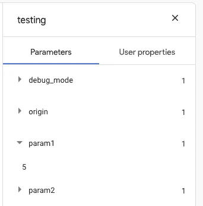
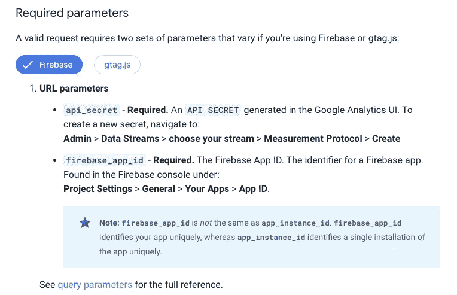
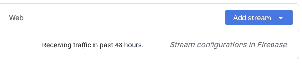
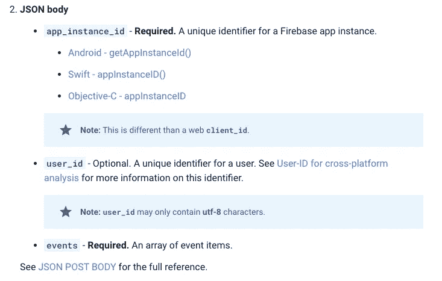

# 使用 Firebase 分析服务器端

> 原文：<https://itnext.io/using-firebase-analytics-server-side-64ffacafa6c3?source=collection_archive---------0----------------------->


# 问题是

总的来说，Firebase 致力于为*客户端*(例如 web 客户端和移动客户端)提供有用的库和 API。不幸的是，这意味着它们对服务器端环境的支持不够强大。在服务器上使用 Firebase 的典型方式是通过[Admin SDK](https://firebase.google.com/docs/reference/admin)；然而，它不具备与客户端 API 同等的特性。我们在这篇文章中关注的缺失特性是缺乏服务器端 Firebase 分析支持。注意 Firebase 团队意识到了这个问题；检查这个 [Github 问题](https://github.com/firebase/firebase-js-sdk/issues/2243)和这个 [Github 问题](https://github.com/firebase/firebase-js-sdk/issues/2243)。

让我们回忆一下。下面是如何使用 Firebase JavaScript SDK 从 web 客户端记录事件。

```
import firebase from "firebase";const firebaseConfig = { ... };
firebase.initializeApp(firebaseConfig);
firebase.analytics().logEvent("test_event", { some_param: 5 });
```

那么，我们如何从服务器上做同样的事情呢？

# 有旋度的解

我们的实现只需要满足两个要求:

1.  它需要实际上能够记录东西…当然。
2.  它需要能够在调试模式下记录事情，因此可以在[调试视图](https://firebase.google.com/docs/analytics/debugview)中查看记录的事件。否则调试起来就太难了！

二话没说，你来做吧:

为了让这个 curl 命令工作，您需要做两件事:

1.  您需要为`tid` URL 参数提供一个值。你应该为你的 Firebase 项目使用`measurementId`。这个[链接](https://firebase.google.com/docs/analytics/get-started)告诉你如何得到它。
2.  您需要为`cid` URL 参数提供一个值。如果您只是在测试，您可以通过查看 Firebase JS SDK 从网络选项卡中的浏览器发送的请求并从其中一个复制`cid`来找到它。请注意，`cid`将作为一个 cookie 包含在向您的 web 服务器发出的请求中，所以当您实际从您的服务器登录时，您应该从该 cookie 中获得`cid`。

其他一些需要注意的重要事项:

1.  `_dbg=1`在调试视图中显示日志。所以，如果你用正确的`tid`和`cid`运行这个 curl，你应该能够(几乎)立即验证它是否工作。
2.  我不确定是否所有的标题都是必要的，但我知道至少有一些是必要的(例如`user-agent`)。如果你好奇的话，我会让你来解决这个问题。
3.  `en`是事件名称。
4.  您可以使用`ep`来记录特定事件的参数。例如，如果您在请求中包含`ep.param1=5&ep.param2=6`，它在 DebugView 中将会是这样的。



最后，请注意，我发送的请求大多遵循 Google 的[测量协议(通用分析)](https://developers.google.com/analytics/devguides/collection/protocol/v1/reference)。但是他们的参考并不完整——例如，他们没有提到`ep`查询参数。我通过从浏览器手动检查 Firebase JS SDK 发送的请求来解决剩下的问题。

# 带代码的解决方案

现在您已经有了 curl 命令，您应该能够将它翻译成您选择的服务器语言的代码。下面，我提供了一个 Node.js 参考实现来帮助您解决这个问题。

# 测量协议(Google Analytics 4)怎么样？

该[协议](https://developers.google.com/analytics/devguides/collection/protocol/ga4)应该提供以下功能:

> Google Analytics 4 的 Google Analytics 测量协议允许开发人员通过 HTTP 请求将事件直接发送到 Google Analytics 服务器。这允许开发人员从任何支持 HTTP 的环境中测量用户如何与他们的业务交互。值得注意的是，这使得测量服务器到服务器的交互变得容易。

然而，我在遵循他们的文档时遇到了一些问题，这就是为什么我采用了上面描述的方法。让我们来看看他们的说明:



好的，看起来不太坏。但是，如果您导航到**管理>数据流**来查找链接到 Firebase 的 Google analytics 属性，您会看到:



我想我不能创造一个新的秘密。

让我们假设我们以某种方式解决了这个问题，并进入下一步:



好，所以我们需要一个`app_instance_id`。但是似乎没有任何方法可以为 web 客户端获得一个`app_instance_id`？

最后，我没有看到任何文档说明如何让这个协议记录的事件显示在 DebugView 中。

公平地说，谷歌确实警告你“这是一个 alpha API，可能会有变化。”

就是这样。希望你觉得这有用！