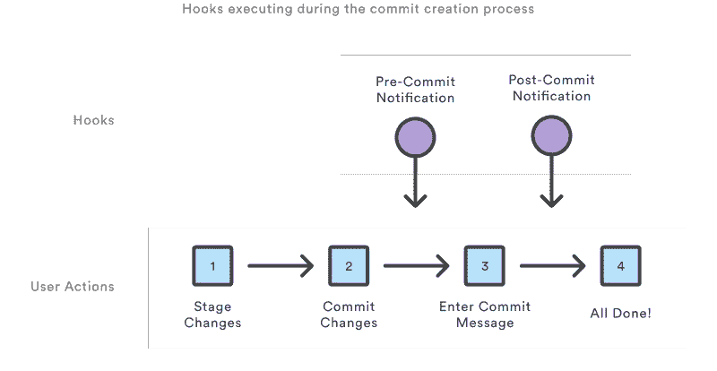
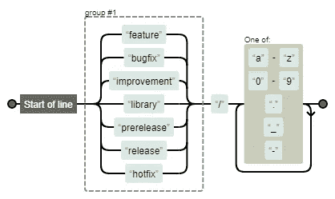
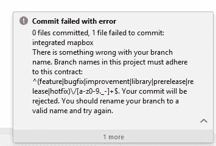

# 使用 Git 挂钩实施分支命名策略

> 原文：<https://itnext.io/using-git-hooks-to-enforce-branch-naming-policy-ffd81fa01e5e?source=collection_archive---------1----------------------->


由 [Patrick Perkins](https://unsplash.com/@pperkins?utm_source=medium&utm_medium=referral) 在 [Unsplash](https://unsplash.com?utm_source=medium&utm_medium=referral) 上拍摄

当许多人在一个存储库中协作时，分支的数量和名称会很快失去控制。分层分支文件夹是驯服混乱的有效方法。因此，您可以在每个分支中预先添加特殊的 *feature/* 或 *release/* 字符串，比如:

```
feature/mapbox
release/7.5.0
```

[Azure DevOps](https://azure.microsoft.com/en-us/services/devops/) 将`/`视为文件夹分隔符，默认情况下会自动折叠文件夹。但是即使你有一些命名的指导方针，你也不能指望每个人都能正确命名。对于大多数存储库管理器，如 github、gitlab 或 bitbucket，只需通过存储库管理器 UI 就可以轻松实施命名策略。问题是，这并不能防止开发人员在他们的本地存储库中错误地创建分支名称。幸运的是，有一种方法可以在提交之前在本地检查分支名称，这一切都从 **Git 钩子**开始。

# 什么是 Git 挂钩？

Git 挂钩是每当 Git 存储库中发生特定事件时自动运行的脚本，例如:**提交**、**推送**和**接收**。它们允许您定制 Git 的内部行为，并在开发生命周期的关键点触发可定制的操作。Git 挂钩是一个内置特性——不需要下载任何东西。Git 挂钩在本地运行。

这些钩子脚本只受开发人员想象力的限制。一些示例钩子脚本包括:

*   预提交:检查提交消息的拼写错误。
*   **预收**:执行项目编码标准。
*   **提交后**:邮件/短信团队成员的新提交。
*   **接收后**:将代码推送到生产中。



[https://www.atlassian.com/git/tutorials/git-hooks](https://www.atlassian.com/git/tutorials/git-hooks)

每个 Git 存储库都有一个`.git/hooks`文件夹，其中包含您可以绑定到的每个钩子的脚本。您可以根据需要随意更改或更新这些脚本，当这些事件发生时，Git 会执行它们。

更多关于 git 挂钩的信息[https://githooks.com/](https://githooks.com/)

# 创建挂钩来检查分支名称

创建新分支时没有专门运行的钩子，所以我们将使用**预提交**钩子。我们应该在 hooks 目录中添加一个**预提交**文件。在钩子中，我们将执行以下任务:

*   检查分支名称是否正确。否则，我们将打印一条错误消息，以 1 结束`exit`。
*   如果一切正常，我们将`exit`设为 0。

要获得当前的分支名称，我们使用这个

```
**git rev-parse --abbrev-ref HEAD**
```

然后为了检查名字是否正确，我们可以使用正则表达式。在我们的例子中，名字应该以 **feature、bugfix 等开头。**并且只包含小写字母、数字和一些特殊符号。

```
**^(feature|bugfix|improvement|library|prerelease|release|hotfix)\/[a-z0-9._-]+$**
```



[正则表达式](https://regexper.com/#%5E%28feature%7Cbugfix%7Cimprovement%7Clibrary%7Cprerelease%7Crelease%7Chotfix%29%5C%2F%5Ba-z0-9._-%5D%2B%24)

下面是最终的钩子代码(简单的 bash 脚本):

在添加了这个挂钩并尝试提交到不符合命名策略的 branch 之后，我们得到了这个错误:



Intellij / Android Studio

## 与你的团队分享 Git 挂钩

如前所述，钩子在`.git`文件夹中，那里存储了所有的 Git 元数据。该文件夹不受版本控制，因为它的大部分内容是特定于设备和用户的。如果您使用的是 Git[2.9](https://raw.githubusercontent.com/git/git/master/Documentation/RelNotes/2.9.0.txt)或更高版本，有一个简单的方法可以使用`core.hooksPath`配置变量来改变钩子目录。只需在存储库中创建一个文件夹，并将其置于版本控制之下，然后更改 hooks 目录。

```
$ git config core.hooksPath .githooks
```

在我们的例子中，我们在所有这些钩子所在的根处创建了`.githooks`。

## 结论

我希望这将有助于你们中的一些人开始使用 Git 挂钩，并调整开发团队的工作流程:-)

感谢阅读！欢迎留下任何反馈！

通过以下方式与我联系:

*   [中等](https://medium.com/@roland.yeghiazaryan)
*   [领英](https://www.linkedin.com/in/roland-yeghiazaryan/)
*   [推特](https://twitter.com/RolandYeghiazar)
*   [Github](https://github.com/androideveloper)

## 脚注和进一步阅读

 [## Git 钩子| Atlassian Git 教程

### Git 挂钩:当 repo 中发生事件时自动运行的脚本。在关键点触发可定制的动作…

www.atlassian.com](https://www.atlassian.com/git/tutorials/git-hooks)  [## 在 git 挂钩中使用 javaScript

### 当使用 Git 时，git 钩子真的很方便，可以自动执行许多重复的任务，还可以…

medium.com](https://medium.com/@Sergeon/using-javascript-in-your-git-hooks-f0ce09477334)