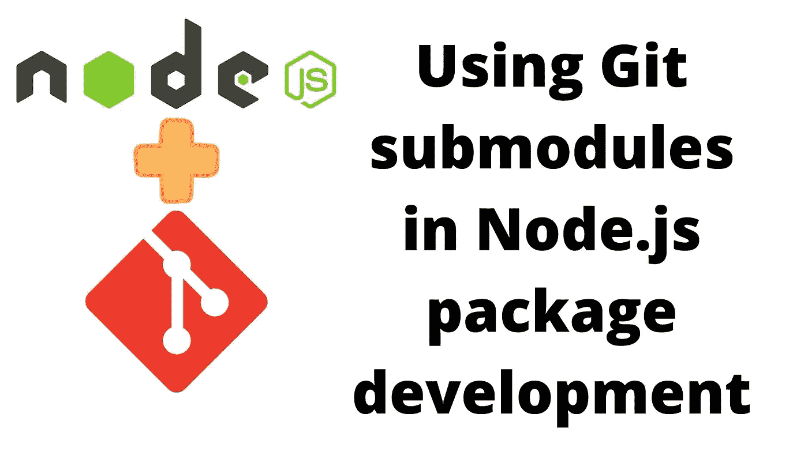

# 使用 Git 子模块简化 Node.js 包开发

> 原文：<https://itnext.io/using-git-submodules-to-streamline-node-js-package-development-d3b358abab0e?source=collection_archive---------1----------------------->



**在开发 Node.js 包时，我们通常会创建一个测试应用程序来测试这个包。这意味着对于包中的每个源代码更改，我们必须将包重新安装到测试应用程序的 *node_modules* 目录中，这可能会非常令人沮丧。Git 的子模块特性可以简化这一过程，让您直接编辑测试应用程序和包，而不需要重新安装。**

开始之前，我们先回顾一下情况。假设我们正在开发一个名为`P`的包。这是一个很好的小图书馆，可以做一些有用的事情。稍后我们将使用一个人工示例包。为了开发这个包，编写一个程序(或者两三个)来测试这个包通常是有帮助的。我说的不是测试套件，而是真正的程序。

在我的例子中，正在开发的应用程序是 AkashaCMS，一个静态网站生成器。AkashaCMS 生态系统中有几个包。他们中的大多数在包中有单元测试，但是我也创建了几个用于功能测试的示例网站。

其中之一是 [akashacms-example 网站](https://github.com/akashacms/akashacms-example)，它既是 akashacms 项目的工作示例，也是我开发 AkashaCMS 功能的功能测试。项目已经被重新设计，使用子模块来简化包的开发。

换句话说，`akashacms-example`是一个可以实施我们一揽子计划的例子。

一般来说，`A`应用程序必须将`P`安装在它的`node_modules`目录中。然后我们可以编辑`A`的代码来尝试`P`中的功能。但是，如果/当我们必须改变`P`中的代码时，会发生什么呢？

正常情况下，我们会打开两个编辑器窗口，一个指向`P`中的文件，另一个指向`A`。一旦我们在`P`中编辑了一个文件，我们必须将更改后的文件复制到`A/node_modules/P`中。过了一段时间，这变得很乏味，当然有时我们会忘记更新`A`中的文件，然后想知道为什么我们在代码中所做的改变没有改变任何行为。

有一个 npm 命令`npm link`，它的意思是简化这个问题。顾名思义，它*将*包`P`链接到应用程序的`node_modules`目录中。然后我们可以自由编辑`P`和`A`，而不需要从`P`到`A`重新安装文件。但是，当我阅读`npm link`文档时，它令人困惑，我从来没有这样做过。

# Git 子模块和 Node.js 开发

相反，我发现 Git 子模块更加直接。关于子模块入门的完整教程:[如何以及为什么使用 Git 子模块](https://techsparx.com/software-development/git/submodules.html)

简言之，Git 子模块是:

*   父 Git 储存库包含引用一个或多个其他 Git 储存库的子模块配置
*   外部存储库出现在签出的父存储库的目录树中
*   父存储库包含对外部存储库的引用，以及要签出的提交的 SHA-1 散列

这个特性似乎最适合支持包开发。即，

*   在`A`的存储库中，将其配置为嵌入`P`存储库作为子模块
*   `A`应该是测试应用程序
*   在`A`的`package.json`中，我们使用一个本地文件引用作为`P`的`dependency`——使 npm 在`node_modules`中创建一个到`P`目录的符号链接

这是计划，所以让我们做它。

# 创建两个存储库

在 GitHub/GitLab/Gitea/etc 中创建两个存储库，一个用于应用程序，另一个用于包。为此，我们创建了两个:

首先，我们克隆`sample-app`存储库:

```
$ git clone git@github.com:robogeek/sample-app-2021-12-12.git 
... 
$ git submodule init 
$ git submodule add \
     https://github.com/robogeek/sample-package-2021-12-12.git \
     package 
Cloning into '.../sample-app-2021-12-12/package'... 
remote: Enumerating objects: 4, done. 
remote: Counting objects: 100% (4/4), done. 
remote: Compressing objects: 100% (4/4), done. 
remote: Total 4 (delta 0), reused 0 (delta 0), pack-reused 0 
Receiving objects: 100% (4/4), done. 
$ git submodule update --recursive --remote --checkout
```

我们将展示存储库是如何初始化的。当您看到这篇文章时，存储库已经完全设置好了，并且可以运行了。无论如何，我们从一个空白存储库开始，我们做的第一件事是使用`git submodule add`引入`sample-package`存储库。

让我们从在`sample-package`存储库中设置一个简单的包开始:

```
$ cd package 
$ npm init -y 
... 
$ git add package.json  
$ git commit -m 'Initial revision' package.json  
[main 4a14cf6] Initial revision 
 1 file changed, 12 insertions(+) 
 create mode 100644 package.json
```

这将创建一个包含默认`package.json`的空白 Node.js 项目。默认情况下，它支持 CommonJS 模块，并将`index.js`指定为`main`模块。因此，让我们创建一个名为`index.js`的文件，其中包含:

```
module.exports.hello = (txt) => {
     console.log(`Hello ${txt}`); 
};
```

从一个简单的包开始。我们稍后将对此进行修改。

接下来，让我们设置`sample-app`目录:

```
$ cd .. 
$ npm init -y
```

这将设置一个空白默认值`package.json`。在此基础上，添加以下内容:

```
"dependencies": {
       "package": "./package"   
}
```

这个依赖说明符引用了一个本地文件，即我们刚刚在`package`目录中创建的包。

接下来，创建一个名为`app.js`的文件，其中包含:

```
const P = require('package');  
P.hello('There');
```

我们已经导入了这个包，将其命名为`P`，并将它导出的方法命名为。这是演示子模块使用的良好开端。

然后运行这些命令

```
$ npm installadded 1 package, and audited 3 packages in 1s 
found 0 vulnerabilities 
$ ls -l node_modules/ 
total 0 
lrwxr-xr-x 1 david admin 10 Dec 12 22:48 package -> ../package 
$ node app.js Hello There
```

这些命令在`sample-app`目录中执行。它会安装运行应用程序所需的任何依赖项。我们在`package.json`中列出的唯一依赖项是`package`目录。因此，产生`node_modules`的唯一项目是那个包。

注意`package`是一个到`package`目录的符号链接。这是我们努力创造的关键。符号链接让我们编辑`package`目录中的文件，并立即将编辑反映在为`node_modules`中的应用程序安装的代码中。

最后一位演示了我们有一个工作的应用程序。

# 将初始文件提交到存储库

我们有一个正在开发的包的初始代码，以及一个用于测试该包的示例应用程序。这意味着我们已经到达了第一个里程碑，拥有最小可行的产品。有必要将这个里程碑提交给存储库。

```
$ cd package 
$ git status -s 
?? index.js 
$ git add . 
$ git commit -a -m 'Initial Revision' 
[main 5623118] Initial Revision 
 1 file changed, 4 insertions(+) 
 create mode 100644 index.js 
$ git push 
Enumerating objects: 7, done. 
Counting objects: 100% (7/7), done. 
Delta compression using up to 4 threads 
Compressing objects: 100% (6/6), done. 
Writing objects: 100% (6/6), 810 bytes | 810.00 KiB/s, done. 
Total 6 (delta 1), reused 0 (delta 0), pack-reused 0 
remote: Resolving deltas: 100% (1/1), done. 
To [https://github.com/robogeek/sample-package-2021-12-12.git](https://github.com/robogeek/sample-package-2021-12-12.git)
    c8adfa5..5623118  main -> main
```

我们从`package`目录开始，添加任何存在的文件，并将它们推送到存储库。

为了使用 HTTPS URL，我们用 GitHub 配置了一个*访问令牌*，并提供了这个令牌作为密码。

现在，让我们在`sample-app`目录中做同样的事情:

```
$ cd .. 
$ git add .  
$ git status -s 
A  .gitmodules 
A  app.js 
A  package 
A  package.json  
$ git commit -m 'Add submodules' .gitmodules package  
[main 53100a7] Add submodules 
 2 files changed, 4 insertions(+) 
 create mode 100644 .gitmodules 
 create mode 160000 package  
$ git commit -a -m 'Initial Revision' 
[main f243c11] Initial Revision 
 2 files changed, 27 insertions(+) 
 create mode 100644 app.js 
 create mode 100644 package.json 
$ git push 
Enumerating objects: 8, done. 
Counting objects: 100% (8/8), done. 
Delta compression using up to 4 threads 
Compressing objects: 100% (7/7), done. 
Writing objects: 100% (7/7), 1.06 KiB | 1.06 MiB/s, done. 
Total 7 (delta 1), reused 0 (delta 0), pack-reused 0 
remote: Resolving deltas: 100% (1/1), done. 
To github.com:robogeek/sample-app-2021-12-12.git
    39bca02..f243c11  main -> main
```

我们又有一些文件要添加。前两个是 Git 用来记录子模块配置数据的内务文件。我们分别提交它们，所以它们有正确的提交消息。然后，我们提交其余的，并将所有内容推送到存储库。

# 一起检查应用程序和包层次结构

我们创造了这个:

```
$ tree . 
. 
├── README.md 
├── app.js 
├── node_modules 
│   └── package 
├── package 
│   ├── README.md 
│   ├── index.js 
│   └── package.json 
└── package.json 
3 directories, 6 files
```

一个目录，它是一个 Git 存储库，包含 Node.js 应用程序。其中包含另一个目录，其中包含 Node.js 包。这个图中没有显示，但是`package`目录也是一个 Git 存储库，并且作为一个子模块来管理。

理解的一种方法是使用这些命令:

```
$ git remote -v 
origin  git@github.com:robogeek/sample-app-2021-12-12.git (fetch) 
origin  git@github.com:robogeek/sample-app-2021-12-12.git (push) 
$ cd package 
$ git remote -v 
origin  https://github.com/robogeek/sample-package-2021-12-12.git (fetch) 
origin  https://github.com/robogeek/sample-package-2021-12-12.git (push)
```

每一个的 Git URL 都是不同的，反映出每一个都是自己的 Git 存储库。因此，当我们推送提交时，每个提交都进入相应的存储库。您可以在知识库网站上访问它们。

创建此层次结构的目的是简化将应用程序和包作为一个单元编辑的过程。

# 同时修改包和应用程序

现在我们已经有了一个包含子模块的存储库，并且我们已经仔细检查了它，让我们尝试修改子模块中的包。毕竟，这就是我们带您来这里看这篇文章的目的。

我们从管理层的一个特性请求开始:“*做一个改变*”。唉，那些经理有时对他们的特性要求不明确。你回去找经理澄清，她说需要平方根函数。

经理不知道`Math.sqrt`做的，我们包里也不需要这样的功能吗？

无论如何，我们正在做的是在一个包中实现一个改变。当然，在真实的场景中，这将是一个有用的改变。但是这个示例应用程序显然是人为的，所以我们就顺其自然吧。

在`package`目录中当然是我们的包。打开`package/index.js`并添加以下内容:

```
module.exports.square_root = function square_root(n) {
     let _n;
     if (Number.isInteger(n)) {
         _n = Number.parseInt(n);
         if (Number.isNaN(_n)) {
             throw new Error(`${n} is an Integer that did not parse`);
         }
     } else if (Number.isNaN(Number.parseFloat(n))) {
         throw new Error(`${n} did not parseFloat`);
     } else {
         _n = Number.parseFloat(n);
     }
     return Math.sqrt(_n); 
};
```

这满足了所要求的特性，并且增加了一些错误检查。正如在*编程风格的元素*中所说，检查函数的参数很重要。

因为我们的测试应用程序是关于测试软件包的，所以让我们把它添加到`app.js`:

```
console.log(`20: ${P.square_root(20)}`); 
console.log(`0: ${P.square_root(0)}`); 
console.log(`-20: ${P.square_root(-20)}`); 
console.log(`twenty: ${P.square_root('twenty')}`);
```

它尝试了平方根函数行为的几个重要变化。运行应用程序时，我们会得到以下结果:

```
$ node app.js  
Hello There 
20: 4.47213595499958 
0: 0 
-20: NaN 
/Volumes/Extra/akasharender/t/sample-app-2021-12-12/package/index.js:14
         throw new Error(`${n} did not parseFloat`);
         ^
```

这是预期的输出。要理解为什么这是预期输出，建议重温高中数学。

既然我们已经使用特别测试验证了该行为，我们应该进入`package`目录，添加一个单元测试目录，并添加一个单元测试来验证该行为。是的，这是我们应该做的。但出于篇幅的考虑，我们将略去。

更重要的是注意到这是多么容易。即使`package`安装在`sample-app`的`node_modules`目录中，我们也可以编辑它的源文件，它们会被立即识别出来。

另一个优势是我们可以轻松地将代码提交到存储库:

要准备，请运行以下命令:

```
$ git status -s  
M app.js  
m package 
$ cd package 
$ git status -s  
M index.js
```

父存储库和子存储库中都进行了更改。先说`package`的变化:

```
$ git commit -a -m 'Add sqrt function' 
[main fd1629b] Add sqrt function 
 1 file changed, 15 insertions(+)  
$ git push 
Enumerating objects: 5, done. 
Counting objects: 100% (5/5), done. 
Delta compression using up to 4 threads 
Compressing objects: 100% (3/3), done. 
Writing objects: 100% (3/3), 324 bytes | 324.00 KiB/s, done. 
Total 3 (delta 2), reused 0 (delta 0), pack-reused 0 
remote: Resolving deltas: 100% (2/2), completed with 2 local objects. 
To github.com:akashacms/akashacms-example.git
```

这是正常的 Git 实践，提交更改，然后推送到存储库。

请注意，存储库是使用 HTTPS URL 引用的。为此，我们在 GitHub 帐户中创建了一个访问令牌。

```
$ cd .. 
$ git status -s  
M app.js  
M package
```

返回到`sample-app`目录，我们看到状态中的小写`m`现在已经变成了大写`M`。不管这意味着什么，肯定与在`package`做出改变有关。

顺便说一下，`package`中改变的是存储库中最新提交的 SHA-1。因为我们已经在子模块中提交了，所以最新的 SHA-1 必须记录在`sample-app`中。

运行以下代码很有用:

```
$ git diff 
diff --git a/app.js b/app.js 
index ec46eb4..2086daf 100644 
--- a/app.js 
+++ b/app.js 
@@ -2,3 +2,8 @@
  const P = require('package');
    P.hello('There'); 
+ 
+console.log(`20: ${P.square_root(20)}`); 
+console.log(`0: ${P.square_root(0)}`); 
+console.log(`-20: ${P.square_root(-20)}`); 
+console.log(`twenty: ${P.square_root('twenty')}`); 
diff --git a/package b/package 
index 5623118..fd1629b 160000 
--- a/package 
+++ b/package 
@@ -1 +1 @@ 
-Subproject commit 5623118d4b3621163740c84c33ca345c0c320054 
+Subproject commit fd1629bad48ca6d6b5ffa5f80c8b2a5ea160dbae
```

使用`diff`,我们看到 SHA-1 提交散列确实发生了变化。

```
$ git commit -a -m 'Exercise the square_root function' 
[main 3a8f0d8] Exercise the square_root function 
 2 files changed, 6 insertions(+), 1 deletion(-)  
$ git push 
Enumerating objects: 5, done. 
Counting objects: 100% (5/5), done. 
Delta compression using up to 4 threads 
Compressing objects: 100% (3/3), done. 
Writing objects: 100% (3/3), 421 bytes | 421.00 KiB/s, done. 
Total 3 (delta 1), reused 0 (delta 0), pack-reused 0 
remote: Resolving deltas: 100% (1/1), completed with 1 local object. 
To github.com:robogeek/sample-app-2021-12-12.git
    f243c11..3a8f0d8  main -> main
```

而且，我们可以将提交推送到存储库。

那不也是以自然正常的方式发生的吗？这不是很容易吗？

我们的下一个任务是访问存储库并检查发生了什么变化。

# 签出`sample-app`库

因为`sample-app`存储库有子模块，所以在克隆它的存储库时会涉及到更多。通常我们只要运行`git clone`就可以了。对于子模块，我们必须确保子模块也被检出。

```
$ git clone --recursive git@github.com:robogeek/sample-app-2021-12-12.git 
Cloning into 'sample-app-2021-12-12'... 
remote: Enumerating objects: 14, done. 
remote: Counting objects: 100% (14/14), done. 
remote: Compressing objects: 100% (12/12), done. 
Receiving objects: 100% (14/14), done. 
Resolving deltas: 100% (4/4), done. remote: 
Total 14 (delta 4), reused 9 (delta 2), pack-reused 0 
Submodule 'package' (https://github.com/robogeek/sample-package-2021-12-12.git) registered for path 'package' 
Cloning into '/Volumes/Extra/akasharender/t/t/sample-app-2021-12-12/package'... 
remote: Enumerating objects: 13, done.         
remote: Counting objects: 100% (13/13), done.         
remote: Compressing objects: 100% (11/11), done.         
remote: Total 13 (delta 4), reused 8 (delta 2), pack-reused 0         
Receiving objects: 100% (13/13), done. 
Resolving deltas: 100% (4/4), done. 
Submodule path 'package': checked out 'fd1629bad48ca6d6b5ffa5f80c8b2a5ea160dbae'
```

最简单的是添加`--recursive`选项，如下所示。通读这个输出，您会看到它识别了子模块`package`并继续克隆它。注意，它检查了前面提到的提交散列。

如果我们进入子模块，我们会学到一些有趣的东西:

```
$ cd package 
$ git branch 
* (HEAD detached at fd1629b) 
  main 
$ git status 
HEAD detached at fd1629b 
nothing to commit, working tree clean
```

文件`package/index.js`有`square_root`功能，所以代码被正确检出。但是，存储库处于*分离头*状态。当处于这种状态时，您将很难做出更改并将它们推送到存储库，因为相反您会得到错误。

解决这个问题的方法很简单:

```
$ git checkout main 
Switched to branch 'main' 
Your branch is up to date with 'origin/main'.  
$ git status 
On branch main Your branch is up to date with 'origin/main'.  
nothing to commit, working tree clean
```

这使得子模块不再处于分离的头部状态。

# 常规应用呢？

为什么我们建议 Node.js 子模块的最佳用途是为 Node.js 应用程序开发一个示例应用程序？将子模块用于常规的生产 Node.js 应用程序怎么样？

区别在于谁将使用该应用程序，以及它们的设置是否容易。

考虑像`postcss`和`serverless`这样的命令行开发工具。两者都在 Node.js 中实现，安装说明是运行`npm install -g PACKAGE-NAME`，之后就可以运行这个工具了。对于应用程序提供商来说，重要的是安装体验要尽可能简单，以便为他们的客户提供尽可能少的采用障碍。

安装过程不能是首先克隆一个 Git 库，运行一些额外的命令，等等。它必须是简单的，如`npm install`，之后客户可以使用应用程序。

上面描述的技术包括这种`dependencies`:

```
"dependencies": {
     "package-name": "./modules/package-name" 
}
```

目录`./modules/package-name`由 Git 子模块填充代码。因此，在运行`npm install`之前，设置这样一个应用程序需要克隆 Git 存储库并运行 Git 命令。因此，通过 npm 发布这样的应用程序是不可行或不可能的，因为安装体验只是简单的`npm install`。

注意:我说的`npm install`，也是指等价的`yarn`命令。

有些生产应用交付场景不涉及运行`npm install`的最终客户。在这种情况下，最终用户可能不会安装应用程序，而是使用 web 服务，或者在电子应用程序的情况下，运行预构建的 GUI。

这并不意味着该技术只能用于样品或测试应用。

考虑一个不同的场景，一个 Node.js web 应用程序作为 Docker 容器交付。在这种情况下，`Dockerfile`将包含如下命令:

```
RUN git clone --recursive CLONE-URL /app 
WORKDIR /app 
RUN npm install
```

这和前面的例子大致相同。我们将存储库克隆到容器映像中的一个目录中，然后切换到该目录，并在正在构建的容器中运行`npm install`。

这个容器映像的最终用户不知道您使用了子模块。他们得到的是一个完整的映像，其中包含运行应用程序所需的所有文件。

# 摘要

我们已经简要介绍了如何在 Node.js 包开发中使用 Git 子模块。

这让我们可以轻松地编辑包的源代码，并立即重新运行示例应用程序，而不需要同步任何更改。这简化了我们的开发工作流程。我们可以在一个或多个子模块目录中自由地进行更改，然后通过在子模块中运行单元测试套件，或者通过对父存储库中的应用程序运行专门的测试来验证我们的更改。

在撰写本文的过程中，我使用了`akashacms-example`示例网站，对`akashacms-dlassets`包中的一个特性进行了修改。这个示例网站(见上面的链接)是一个示例应用程序的例子，人们可以用它来练习软件包。在过去使用它进行特性开发是令人沮丧的，因为需要不断地从源目录复制变更到`node_modules`。使用子模块使它变得轻而易举。

# 关于作者

[***大卫·赫伦***](https://techsparx.com/about.html) *:大卫·赫伦是一名作家和软件工程师，专注于技术的明智使用。他对太阳能、风能和电动汽车等清洁能源技术特别感兴趣。David 在硅谷从事了近 30 年的软件工作，从电子邮件系统到视频流，再到 Java 编程语言，他已经出版了几本关于 Node.js 编程和电动汽车的书籍。*

*原载于*[*https://techsparx.com*](https://techsparx.com/nodejs/tools/submodules.html)*。*