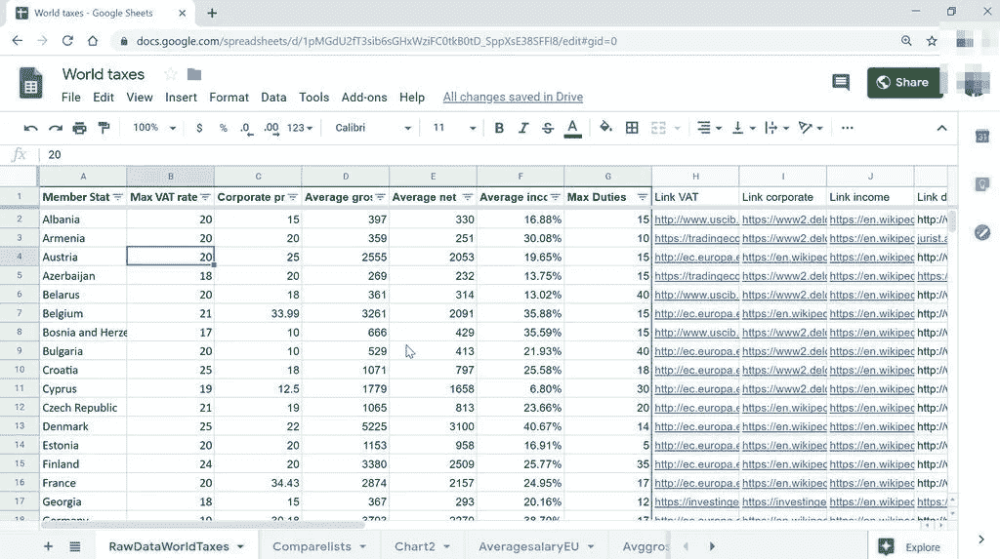

# 使用 Google Sheets 作为 React 应用程序的临时数据库

> 原文：<https://itnext.io/using-google-sheets-as-a-database-for-react-apps-6c15b4481680?source=collection_archive---------0----------------------->


我们想要一个定制的网站，一只小鸟告诉我们 [React](https://reactjs.org/) 是这些天来酷孩子所追求的——比如，它比 [Wordpress](https://wordpress.com/) 更快、可扩展、易于更新？但是我们希望能够自己更新内容。什么都有。哦，波斯特……*什么？*Postgres？那是什么？不，我们也不知道 [MySQL](https://www.mysql.com/) 。[火基](https://firebase.google.com/)？我感觉又被另一种技术术语攻击了！为什么我们不能直接用 Google Sheets？！是的，现在你可以了。

我很抱歉把 React 和 Wordpress 做比较。它们是完全不同的野兽，服务于不同的目的——React 是 Javascript 框架，Wordpress 是内容管理系统(CMS)。你可以把 Wordpress 绑在一把椅子上，然后把所有的宿舍(所有的三个部分)都放在上面，或者像爱国者队的粉丝崇拜汤姆·布拉迪一样赞美它(对不起，我永远是老鹰队的粉丝)。但是我和我认识的大多数人一样，已经离开了 Wordpress。出于各种各样的原因——我认为这些原因最适合 Reddit。好了，回到反应问题上来。

# 背景


几年前，作为我志愿创业公司 [EvoXLabs](http://evoxlabs.org/) 的一部分，我运营了 [FAWN Initiative](http://evoxlabs.org/projects/fawn) (免费且可访问的非营利网站)。大多数情况下，这些都是信息网站，需要经常更新。然而，更新并不是交易的一部分，因为该倡议背后的想法是促进和倡导网站的可访问性。这也是为什么选择 React 的原因之一——不是因为它神奇地让网站变得可访问，而是因为它不是由一堆视觉上和功能上吸引人的小部件组成，这些小部件完全没有可访问性。是的，[角](https://angular.io/)和 [Vue](https://vuejs.org/) 在这一点上几乎是一样的，但是 React 是毒药。无论如何，更新。对于更新，有两种方法:要么该组织的工作人员/志愿者对 React 感到满意，要么他们能够在传统数据库中导航。这很快成为一个问题，再加上缺乏资源来满足需求，FAWN 倡议变得不活跃，并一直如此。

# 进入谷歌工作表



大约一年前，我开始思考作为一名 React 开发人员，我可以为我所关心的事业做出贡献的其他方式。我还能为非营利组织制作网站，而不成为他们自己添加/删除/修改内容的瓶颈吗？所以，我开始询问人们在网上用来存储和获取信息的最常用的工具是什么。在科技界，这个问题的答案是一份自成一本书的清单。在科技世界之外，只有一个答案引人注目——谷歌表单。Excel/CSV 文件排在第二位，但是人们对修改和部署文件的整个过程犹豫不决。幸运的是，Google Sheets 和大多数其他 Google 产品一样，有一个非常棒的 API。哪里有空气污染指数，哪里就有光明。

Google Sheets 无法与传统数据库相提并论，也无法取代传统数据库。但是 Google Sheets 作为一个临时的数据库可能真正有益的一个地方是它的开箱即用跟踪历史的能力，在传统数据库中，这是通过额外的手段来处理的。

# 让我们来谈谈技术

好的，我们有一个 API。React 是一个 Javascript 框架。所以，`[fetch](https://developer.mozilla.org/en-US/docs/Web/API/Fetch_API/Using_Fetch)`来电，对吧？或者`[axios](https://github.com/axios/axios)`，如果你喜欢的话。应该很简单，对吧？不完全是。

React 最棒的一点是它的路由功能。当浏览页面和子组件时，不需要重新加载整个页面。所以才快。所以，假设你有几个组件(在这个上下文中，与页面同义)，每个组件都有一个`fetch`调用。会发生什么？每次加载组件时(取决于`fetch`调用的位置)，都会有一个网络调用。网络调用可能会大大降低性能。但这还不是全部。每次进行 Google Sheets API 调用时，都会被计入调用配额。来自 [Google Sheets API v4](https://developers.google.com/sheets/api) 的[使用限制](https://developers.google.com/sheets/api/limits)部分:

> 这个版本的 Google Sheets API 限制每个项目每 100 秒 500 个请求，每个用户每 100 秒 100 个请求。分别跟踪读取和写入的限制。没有每日使用量限制。

长话短说，考虑到这些限制，我们真正想要的是尽可能地限制网络调用。这使得我们的网站更快，我们最大限度地利用配额。如果您的预期流量超出了使用限制，传统数据库可能最适合您的需求。后面的“何时不使用 Google Sheets”一节将介绍这种情况。

# Metis 简介

[Metis](https://github.com/athersharif/metis) 是一个[高阶组件(HOC)](https://reactjs.org/docs/higher-order-components.html) ，它允许 React 应用程序使用 Google Sheets 作为临时数据库。如果你想知道，[梅蒂斯](https://github.com/athersharif/metis)是以希腊智慧女神命名的。 [Metis](https://github.com/athersharif/metis) 有两个主要组成部分:`GoogleSheetsProvider`和`withGoogleSheets`。

## GoogleSheetsProvider

`GoogleSheetsProvider`很像 React 的`[Context.Provider](https://reactjs.org/docs/context.html#contextprovider)`。它包装 React 应用程序，从 Google Sheets 文档中获取所有的工作表，将来自 API 的原始结果转换成可读的键/值(kv)存储，并将这个 kv 存储发布到上下文。这允许从组件树中的任何地方访问 kv 存储。

## 使用 GoogleSheets

`withGoogleSheets`是一个高阶组件，它使得从上下文的特定工作表中获取数据(通过 GoogleSheetsProvider 完成)并通过`[props](https://reactjs.org/docs/components-and-props.html)`使其对组件可用变得非常容易。

默认情况下，`withGoogleSheets`附带了一个非常基本的组件，用于在从 Google Sheets API 获取数据不成功的情况下进行渲染(不正确的权限，达到配额等)。).这个特设允许定制这个默认组件，也可以用一个完全不同的定制组件来替换它。

`withGoogleSheets`被设计成将单个表名或一组表名作为获取数据的参数。获取所有的工作表而不单独指定每个工作表也是受支持的，并且[很好地记录了](https://github.com/athersharif/metis/blob/master/README.md)和[示例](https://github.com/athersharif/metis/tree/master/example)。

## 基本示例

**安装**

```
npm install react-db-google-sheets --save
```

**。环境**

```
REACT_APP_GOOGLE_SHEETS_API_KEY=[YOUR-API-KEY]
REACT_APP_GOOGLE_SHEETS_DOC_ID=[YOUR-DOC-ID]
```

**App.js**

```
import React from 'react';
import GoogleSheetsProvider from 'react-db-google-sheets';const App = () => (
  <GoogleSheetsProvider>
    <MyApp />
  </GoogleSheetsProvider>
);export default App;
```

**组件(say Hello.js)**

```
import React from 'react';
import { withGoogleSheets } from 'react-db-google-sheets';const Hello = props => (
  <div>
    {props.db.sheet1.map(data => (
      <span>{data.id}</span>
    ))}
  </div>
);export default withGoogleSheets('sheet1')(Hello);
```

更多示例在[文档](https://github.com/athersharif/metis/blob/master/README.md)和 [GitHub Repo](https://github.com/athersharif/metis) 上的[示例子文件夹](https://github.com/athersharif/metis/tree/master/example)下提及。

# 何时不使用谷歌工作表

希望到现在为止，你至少对使用 Google Sheets 作为 React 应用程序的临时数据库的想法感兴趣。但是你也可能会想到这并不是一个好的解决方案。确实如此——有几个这样的例子。就像编程世界中的任何事物一样，工具的使用完全取决于需求，Metis 也不例外。

首先，如前所述，如果您预计您的网站会有大量流量，即使使用`GoogleSheetsProvider`来限制每个初始网站负载一次网络调用，您也应该使用传统的数据库或考虑使用 Google Sheets API 的付费计划。其次，为了将 Google Sheets 用作临时数据库，需要将 doc 上的权限设置为公开可见。因此，如果您的数据包含密码或保证用户访问权限的敏感信息，您最应该使用传统的数据库并实现适当的安全协议。Metis 和使用 Google Sheets 作为临时数据库的目的是为了在信息或简历/投资组合网站等公开可见的数据。

最后，如果您需要外键(充当表之间交叉引用的列 Google Sheets 术语中的表),那么您最好使用关系数据库。 [Metis](https://github.com/athersharif/metis) 将提供助手功能和指南，指导如何在未来使用 Google Sheets 实现这一目标，但评估您的需求并决定什么是最适合您用例的工具**强烈推荐**。

**更新:**在与一些人交谈后，值得*重申一下*Google Sheets 本身是 ***而不是*** 一个数据库。它无法扩展，没有利用传统数据库的任何优势，因为它根本就不是一个数据库。但是在非常具体的用例中，可伸缩性不是问题，构建 CMS 是不切实际的，向不精通技术的内容维护者培训新工具的开销太高，Metis 可能是有益的。评估您的需求和用例，然后为此目的选择合适的工具是至关重要的——可以说，这应该是决定是否使用 Metis 的首要因素。

# 最后的想法

Metis 旨在作为一个工具来添加/修改/删除你网站上的内容，使用 Google Sheets 很容易，而不必担心代码更改和部署过程等等。您甚至可以通过在 Google Sheets Doc 上的一个表单中指定颜色、字体大小和其他样式组件来管理网站的设计和布局。可能性是无限的，易用性是非常性感的。但是同样，您应该评估您的需求并选择最适合您需求的工具。

给[梅蒂斯](https://github.com/athersharif/metis)一个机会。欢迎反馈、投稿、提问！请随意在 [GitHub repo](https://github.com/athersharif/metis) 上提出问题，或者给我发电子邮件或者发 [Tweet](https://twitter.com/athersharif) 给我你的问题/反馈！

快乐的反应？快乐的谷歌搜索？*叹，我试试。*