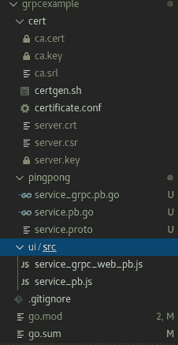
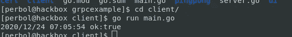
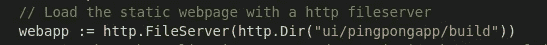
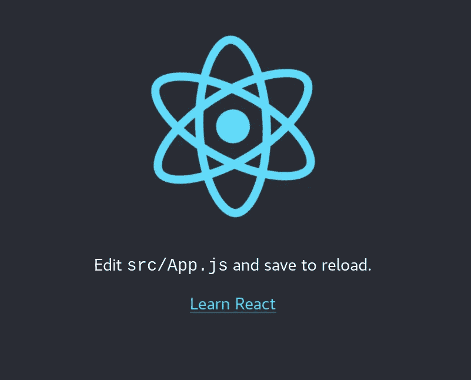
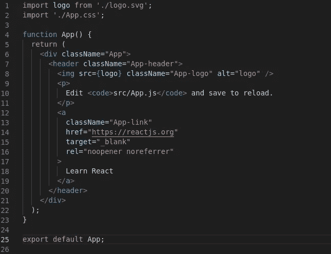
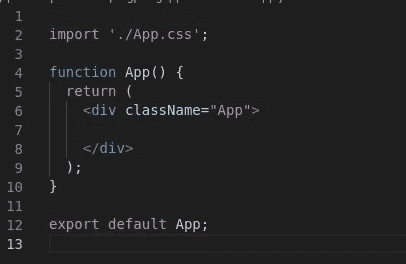
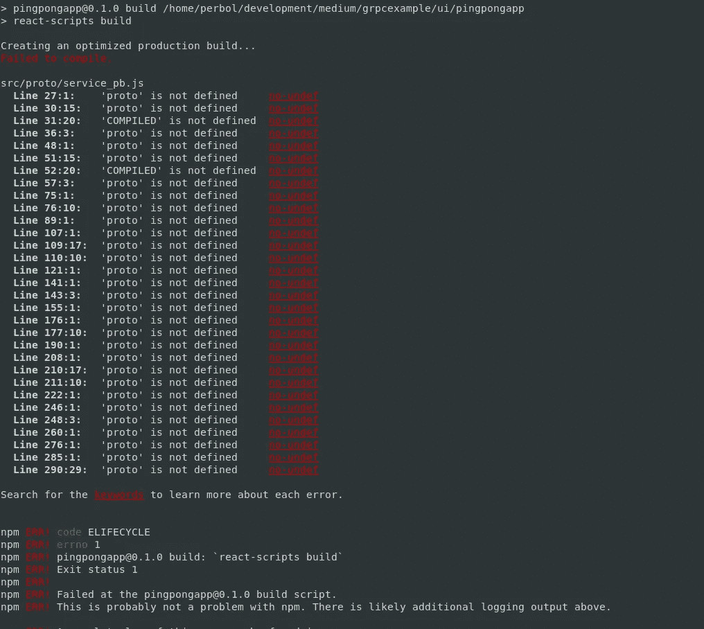

# 将 gRPC 与 TLS、Golang 和 React 一起使用(无特使)

> 原文：<https://itnext.io/using-grpc-with-tls-golang-and-react-no-envoy-92e898bf8463?source=collection_archive---------0----------------------->


我们将使用的技术堆栈有 React、Golang、gRPC。

几个月前，我开始了一个想使用 gRPC 的项目。这是一次奇妙的经历。我真的很喜欢如何使用 protobuf 和 gRPC 在后端和前端拥有相同的客户端。

在我的开发阶段，我遇到了一些小问题。因此，当在互联网上搜索在 web 应用程序中使用 gRPC 的解决方案时，似乎几乎每个人都推荐[特使](https://www.envoyproxy.io/)反向代理。我开始使用 envoy，它工作得非常好，有很多例子显示如何设置它。

当我从普通的 HTTP 迁移到 **HTTPS** 时，问题开始出现。envoy 的配置示例变得令人害怕，许多示例相互矛盾。并补充说我想使用 **gRPC 元数据**特性，这开始变得很难设置。我需要另一个解决方案。

我遇到了罗杰·查普曼，他写了一篇关于在没有特使的情况下使用 g RPC 网络客户端的文章。他解释了[impossible](https://github.com/improbable-eng/grpc-web)的团队如何为 HTTP 服务器创建了一个包装器，可用于处理 gRPC 请求。这是一个很大的帮助，我决定与你们这些地鼠分享我的经验。

这将是一个系列的一部分，我们将继续开发应用程序来探索 gRPC 和 Golang 的不同方面。

*   [第一部分] —你现在正在读它
*   [[第 1.1 部分] —在 Golang 二进制文件中嵌入 React 应用程序](https://programmingpercy.tech/blog/embedd-web-application-golang/)
*   [【第二部分】— gRPC 拦截器](/grpc-interceptors-e221aa4cc49)
*   [【第 3 部分】—使用 gRPC 传输数据](/streaming-data-with-grpc-2eb983fdee11)

让我们编写一个使用 react 应用程序与 gRPC 服务器通信的示例项目。

# 项目设置

让我们首先创建一个新文件夹，并为这个项目初始化一个 Go 模块。(注意完整的代码可以在 https://github.com/percybolmer/grpcexample 的[找到)。我们将首先创建所需的文件夹，例如包含证书的`cert`和保存我们构建的静态 react 应用程序的`ui/src`。](https://github.com/percybolmer/grpcexample)

```
mkdir grpcexample
cd grpcexample
go mod init github.com/percybolmer/grpcexample
touch main.go
mkdir -p ui/src
mkdir cert
mkdir pingpong
```

在我们开始编写我们的 API 之前，让我们确保我们已经准备好使用证书。为了生成这个，我们将使用 [openssl](https://www.openssl.org/) 。为了使事情变得简单一点，我创建了一个脚本来为我们完成这项工作，只需运行下面的脚本，它就会为我们生成文件。要运行这个脚本，你还需要在同一个目录中有一个名为`certificate.conf`的文件。脚本和配置文件都可以在下面找到。

证书生成脚本。

这个配置应该放在名为 certificate.conf 的文件中。

我已经将脚本和配置文件放在了`cert`文件夹中。运行之后，您应该会在/cert 中找到一些新文件。让我们继续我们的 Go API。

# gRPC 服务

因此，使用这种设置的最大好处是，我们可以轻松地在 react 和 Go backend 中使用同一个客户端来与 API 对话。

我们可以创建一个 Protobuf 模式来为我们生成客户端，而不是在 Go 和 Javascript 中重写相同的结构。

我们将生成一个允许我们 Ping 的 Ping/Pong 服务，我们可以从 React 和 Go 应用程序中调用它。这是一个非常简单的 protobuf 示例，但是您可以根据自己的项目需要轻松地进行修改。

首先，确保您已经安装了 Protoc，这样您就可以基于原型模式生成代码。如何安装协议可以在[这里](https://grpc.io/docs/protoc-installation/)找到。

除了 protocol，我们还需要插件来生成 go 代码和 javascript 代码。用 go get 很容易获取 go 代码。

```
go get -u google.golang.org/protobuf/cmd/protoc-gen-go
go install google.golang.org/protobuf/cmd/protoc-gen-go

go get -u google.golang.org/grpc/cmd/protoc-gen-go-grpc
go install google.golang.org/grpc/cmd/protoc-gen-go-grpc
```

此外，根据这里中[的说明安装 javascript 生成器](https://github.com/grpc/grpc-web#code-generator-plugin)

让我们编写原型模式并生成一些代码。

如果你不了解 protobuf，我建议你访问他们的官方网站[来了解一下。简而言之，消息是 API 将用作请求和响应的对象。API 本身是由关键字 service 声明的。在上面的模式中，我们有一个 API，它有一个 Ping 方法。](https://grpc.io/docs/what-is-grpc/introduction/)

我将它放在 grpcexample 根目录下的一个名为`pingpong/service.proto`的文件中。
现在，为了生成文件，我们将运行 protocol。

```
protoc service.proto --js_out=import_style=commonjs,binary:./../ui/src/ --grpc-web_out=import_style=commonjs,mode=grpcwebtext:./../ui/src/ --go-grpc_out=. --go_out=.
```

这里发生的事情是，我们运行 Protoc 二进制文件来为 Javascript 和 Go 应用程序生成客户端代码。我们还生成 gRPC 服务。

运行之后，你应该在`grpcexample/pingong`中找到两个新文件，分别名为`service_grpc.pb.go`和`service.pb.go`，包含 gRPC 服务和 Golang 客户端，在`ui/src`中应该有`service_grpc_web_pb.js`和`service_pb.js`，它们是 javascript 客户端。

到目前为止，我的文件夹看起来像这样



到目前为止的项目结构。

让我们开始在 Go 应用程序中使用生成的代码。

# Golang 后端

让我们首先创建一个 Golang 应用程序，它用于通过 TLS 提供一个简单的 gRPC API。这个应用程序也将为我们稍后从 react 应用程序进行的静态构建提供服务。

创建`*main.go*`，这里我们将创建一个函数，它使用我们生成的证书来通过 TLS 提供 HTTP API。该功能将使用[google.golang.org/grpc/credentials](https://godoc.org/google.golang.org/grpc/credentials)。这个包允许我们指出生成的 pem 文件和服务器密钥，然后它将读取这些文件并输出一个我们可以在 gRPC 服务器中使用的传输配置结构。可以将传输配置插入 grpc 服务器以要求 TLS。

generate lsapi——一个如何使用 TLS 连接到 gRPC 服务器的 golang 示例

很好，所以用 TLS 设置 gRPC 服务器很容易..但是让我们花点时间想想。生成的代码怎么知道 Ping 函数应该做什么？你说得对，不会。

原型中的服务定义只创建一个与服务匹配的接口。所以如果你打开`service_grpc.pb.go`，你会发现它定义了一个类似于

乒乓接口——协议生成的 gRPC 服务器接口

因此，我们必须创建一个结构来实现这个接口。我创建了一个名为`server.go`的新文件来保存逻辑。

这个要点展示了一个实现乒乓服务器接口的结构。

如您所见，这个 PingPong 服务将始终返回一个 true。在本教程中，我们将只专注于使一切工作，添加有趣的 API 调用逻辑将留给你。

这就是 Go 中 gRPC 在 basic 中的工作方式，你生成一个接口，你创建一个实现该接口的结构，然后你可以用同样生成的`RegisterPingPongServer`函数将你的结构注册为服务器。这需要一个`grpc.Server`对象和一个`PingPong`接口。
所以，如果你愿意，你可以通过实现这样一个主函数来启动这个 Pingpong。

在 TLS 上运行 gRPC API 的完整示例。

让我们创建一个简单的 gRPC 客户机，以确保在继续之前一切正常。让我们创建一个名为 client 的文件夹，并在其中创建一个 main.go

```
mkdir client
cd client
touch main.go
```

让我们首先加载一个我们可以被客户端使用的证书

Golang —如何从文件中加载 TLS 证书和密钥

然后一个简单的 main 函数启动一个连接并从服务器调用 Ping

从服务器调用 Ping 的 gRPC 客户端。

让我们试试吧！
转到项目根文件夹并执行

```
go run *.go
// Open a new terminal 
cd client
go run main.go 
```



您应该会看到客户端记录的 Pong 响应，如下所示

太好了，它起作用了！然而，我们的目标是为 web 应用程序托管 gRPC API。

让我们离开 golang 客户端，回到服务器。通常，此时您会将 Envoy 配置为 API 所在端口的反向代理。但是我们将把 API 包装在由 implementable-eng 创建的 gRPC-web 包装器中。

```
go get -u github.com/improbable-eng/grpc-web/go/grpcweb
```

我们将在 *main.go* 中创建一个新的结构，称为 grpcMultiplexer，它包含一个包装的 gRPC 服务器。这个 struct 只会有一个函数，这个函数是一个普通 http 路由器的中间件。原因是 gRPC 请求将在与常规 https 请求相同的端口上多路复用。
听起来很难，但它只有 11 行代码。

现在让我们创建 HTTP 文件服务器来服务我们未来的 React 应用程序。
该文件服务器也将由 grpcMultiplexer 包装。因此 http 请求将由常规的 http 服务器处理，而 gRPC 请求将被传递到 gRPC 服务器。

让我们更新一下 main.go

用 HTTP 处理程序包装 gRPC 处理程序的 Golang 示例

尝试访问 [https://localhost:8080](https://localhost:8080) 应该可以。您现在只会看到一个 src 文件夹，让我们马上修复它。还要记住，浏览器会抱怨，因为它是一个自我生成的证书。

# 让我们构建 web 应用程序

为了创建 react 应用程序，我将使用 [create-react-app](https://reactjs.org/docs/create-a-new-react-app.html) 。

对于那些不熟悉 React 和 Nodejs 的人，我将做一个非常简短的介绍，介绍如何启动和运行它。

首先你需要[安装 NPM](https://www.npmjs.com/get-npm) 。
我在跑 Centos，可以用 yum。

```
yum install npm
```

安装了 npm 之后，您还需要安装 npx 和一些 gRPC 库。

```
npm install -g npx
npm add grpc-web
npm add google-protobuf
```

一旦安装了 npx，让我们使用 [creact-react-app](https://reactjs.org/docs/create-a-new-react-app.html) 命令为我们生成一个新的应用程序。

```
cd ui
npx create-react-app pingpongapp
```

它将创建一个名为 pingpongapp 的新文件夹，其中将有一堆文件夹和文件。我们需要做的是纠正文件结构中的一个小错误。我们生成的 javascript 文件在`grpcexample/ui/src`中，我们需要将它们移动到`grpcexample/ui/pingpongapp/src/proto`。

```
mkdir pingpongapp/src/proto
mv src/* pingpongapp/src/proto/
rm -rf src
```

让我们也更新 main.go，现在 HTTP 文件服务器指向“ui/”，我们应该将其更新为“ui/pingpongapp/build”。这个文件夹还不存在，不用担心。



我们将路径改为指向 pingpongapp 中的构建目录。它将在下一步中创建

让我们进入 react 应用程序并构建它，看看到目前为止一切正常。

```
cd ui/pingpongapp
npm run build
cd ../..
go run *.go
```

我们已经构建了 react 应用程序，并重启了 go 后端。访问 [localhost:8080](https://localhost:8080) 你应该会看到



默认 react 应用程序加载屏幕

太好了！现在我们有了一个运行 gRPC api 的服务器，我们通过 TLS 托管 react 应用程序。让我们修改应用程序以使用 API。

打开`pingpongapp/src/App.js`

我们可以删除应用程序函数中返回的所有内容。



这是最初的 App.js 的样子



删除所有内容，这样你就有了一个类似这样的文件。

首先，我们需要导入 gRPC 客户端，这是在文件的顶部完成的。
我们还将导入 PingRequest，因为我们需要它来发送我们的请求。
这个 react 应用程序将使用 [React 钩子和 state](https://reactjs.org/docs/hooks-intro.html) ，所以它们也需要作为导入。

```
import React, {useState, useEffect } from 'react';
import { PingPongClient } from './proto/service_grpc_web_pb';
import { PingRequest } from './proto/service_pb';
```

应用程序将超级简单。它将显示当前的 ping 状态(始终为真)。每秒将发送一个请求。

我用注释概述了 react 代码，以解释发生了什么。

接下来，我们重新构建 react 应用程序

```
npm run build
```

如果您在构建时遇到问题，说 Proto 没有定义，如下图所示，您需要修改构建脚本中的一些配置，因为这是一个已知的 bug。



一些版本可能会抛出 proto 错误，这可以通过取消 protobuf 文件的 eslinter 来修复。

如果你没有遇到麻烦，跳过以下部分。
创建一个*。react 应用程序根目录下的 env* 文件。的。env 文件中只有一行，它是对常规 eslinter 的扩展。

```
echo "EXTEND_ESLINT=true" > .env
```

你还需要打开`package.json`，寻找`eslintConfig`部分。
这个应该用`ignorePatterns:**/*_pb.js`来扩展，这样做是为了忽略任何名字中包含`_pb.js`的文件。

这是我的 eslintConfig 的样子

```
"eslintConfig": {"extends": [
"react-app",
"react-app/jest"
],
"ignorePatterns": ["**/*_pb.js"]
},
```

构建成功后，返回并重启后端，重新访问
[*https://localhost:8080*](https://localhost:8080)*。*

您现在应该看到一个错误的状态，三秒钟后变为真。
就这样，您现在正在运行一个 react 应用程序，它可以在没有 envoy 的情况下与 gRPC api 进行通信！


状态已更新，API 调用正在定期进行。

感谢阅读，你可以在[https://github.com/percybolmer/grpcexample](https://github.com/percybolmer/grpcexample)看到完整代码。

参见[第二部分](https://percybolmer1.medium.com/embedding-a-web-application-in-a-golang-binary-f9733b25bbf7)关于将 web 应用程序嵌入到单个二进制文件中。

[](https://percybolmer.medium.com/membership) [## 阅读珀西·博尔默(以及媒体上成千上万的其他作家)的每一个故事

### 作为一个媒体会员，你的会员费的一部分会给你阅读的作家，你可以完全接触到每一个故事…

percybolmer.medium.com](https://percybolmer.medium.com/membership)