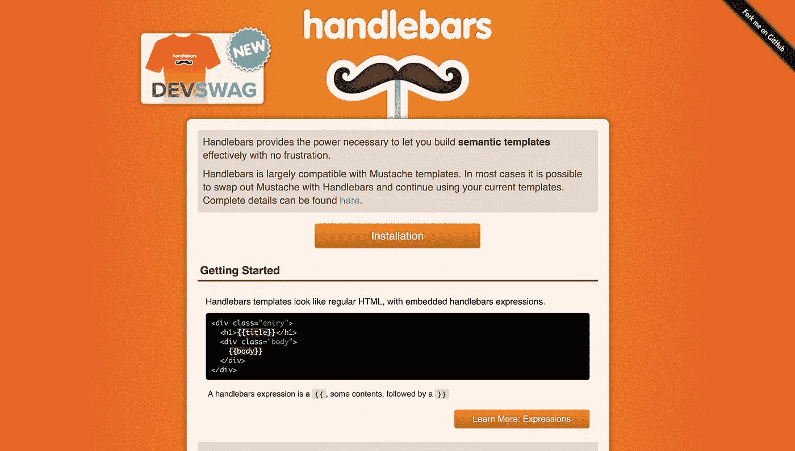

# -使用车把-带快速发电机的助手

> 原文：<https://itnext.io/using-handlebars-helpers-with-express-generator-ad163f7f89d6?source=collection_archive---------0----------------------->



Supercharge you Express /车把项目带车把助手

我最喜欢的视图引擎之一是车把。使用带 NodeJS 的手柄非常容易，尤其是使用 Express Generator。但是车把本身是相当有限和基本的。[车把助手](https://github.com/helpers/handlebars-helpers)增加了额外的 188 个助手，使得车把模板化的体验更好。

# 1.使用快速生成器创建快速应用程序

使用全局安装快速生成器

```
npm i -g express-generator
```

使用以下命令，使用快速生成器创建快速应用程序:

```
express someAppName --view=hbs
```

这就创建了一个支持车把的基本 Express 应用程序。`someAppName`是一个示例项目名称。您可以使用自己的项目名称。快速生成器使用项目名称创建一个文件夹，并生成所有必需的文件。

导航到项目文件夹并安装 handlebars-helpers 和 express-handlebars

```
npm install --save handlebars-helpers express-handlebars
```

# 2.进口车把-助手，和快速车把

在我们的`app.js`文件中，导入 handlebar-helpers 和 express-handlebar。创建助手的实例。

```
const hbs = require('express-handlebars');const hbshelpers = require('handlebars-helpers');const multihelpers = hbshelpers();
```

注释掉默认视图引擎设置，并添加以下代码:

```
//Commment out => app.set('views', path.join(__dirname, 'views'));app.engine(
  "hbs",
  hbs({
    helpers: multihelpers,
    partialsDir: ["views/partials"],
    extname: ".hbs",
    layoutsDir: "views",
    defaultLayout: "layout"
  })
);
```

app.js 的完整示例:

# 3.测试车把-助手

现在为了测试，我们可以使用索引路线。只需向视图传递一个变量，我们将使用它来有条件地使用 handlebars-helpers 呈现一些 HTML。在`/routes/index.js`编辑索引路径文件。

例如，我们可以使用`is`助手。这个助手接受两个参数，如果这两个参数相等，那么块将被呈现。

```
{{#is someVariable 'example'}}THIS WILL BE RENDERED{{/is}}
```

在`/views/index.hbs`中，我们的代码应该是这样的

就是这样！现在你可以使用手柄-快速发电机的助手！更多帮助者，请访问[这里](https://github.com/helpers/handlebars-helpers#helpers)。