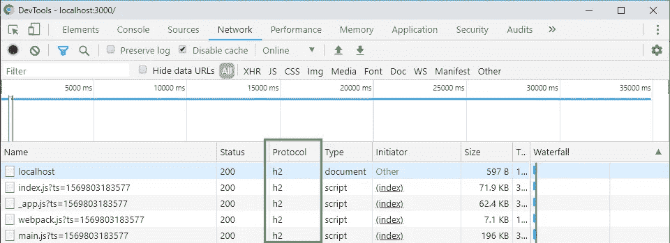

# 使用 HTTP/2 和 Next.js & Express

> 原文：<https://itnext.io/using-http-2-with-next-js-express-917791ca249b?source=collection_archive---------1----------------------->


## **关于 HTTP/2**

HTTP/2 或 H2 是万维网使用的 HTTP 协议的主要修订版。它基于 Google 开发的实验协议 SPDY，旨在加速客户机和服务器之间的互联网交换。
所有主流浏览器都支持 HTTP/2 已经好几年了，你可以在[上看到我能使用](https://caniuse.com/#feat=http2)。2019 年，大多数 GAFA/NATU 现代 SAAS 创业公司已经将它用于其产品和服务(截至 2019 年 9 月，前 1000 万网站中有 41.0%支持 HTTP/2)。

谷歌和 IETF 甚至已经在研究基于 UDP 的协议 QUIC，最近被重新命名为 HTTP/3 或 H3。Chrome 和 Mozilla Firefox 已经支持它，但现在让我们把注意力集中在 H2 上。

## **HTTP/2 的优势**

在大多数情况下，HTTP/2 比 HTTP/1.1 要快得多，谷歌强烈推荐它进行性能和 SEM 优化，正如你在 [Lighthouse](https://developers.google.com/web/tools/lighthouse/) 中看到的。其原因是:

*   **HTTP/2 是 TCP 上的二进制协议，**因此数据传输比基于文本的协议(如 HTTP/1.1)更紧凑，更不容易出错
*   **HTTP/2 是多路复用的，**这意味着它支持单个连接上的多个请求，从而减少了服务器和客户端之间的握手操作。HTTP/1.1 被限制为每个连接只能有一个请求。
*   **HTTP/2 使用 defacto 报头压缩，**使用 [HPACK](https://tools.ietf.org/html/rfc7541) 作为有效表示 HTTP 报头的压缩格式。
*   **HTTP/2 引入了 HTTP/2-Push，**，它允许服务器自动将页面所需的资源推送到客户端缓存，而无需客户端发出额外的请求。

## **next . js&Express 怎么样？**

**Node.js** 在其 2017 年 7 月的第 8 版中通过`http2`内置包引入了原生 HTTP/2 支持，作为一个实验性的特性，并作为一个稳定的特性进入 Node.js 10 LTS。

**Next.js** 是一个著名的服务器端渲染框架，使用 Node.js 和 React 来制作快速、预渲染和优化的基于 React 的网站或 web 应用。不幸的是，从第 9 版开始，Next.js 还不支持 HTTP/2。

我们的 HTTP/2 解决方案将使用 Next.js 的功能来定义一个定制的后端应用程序:

*   使用`express`拥有灵活的路由框架
*   与`spdy`结合产生一个 HTTP/2 服务器

除了它的名字，`spdy`包提供对 HTTP/2 (H2)和 spdy (2，3，3.1)的支持，与 Express 兼容，并为常规 https 提供自然的`http` 模块接口和后备。

## **让我们深入实施**

以下是我们将要采取的步骤:

*   1.设置项目，并用两个简单的页面创建前端
*   2.生成本地开发 SSL 证书
*   3.用 next.js + express + spdy 创建自定义后端

1.  **设置项目&前端** 首先初始化一个 npm 包并创建一个 next.js 应用程序，其中包含两个基本静态页面:

```
mkdir next-express-h2-app
cd next-express-h2-app
npm init
npm install next react react-dom express spdy compression --save
npm install cross-env --save-dev
```

创建一个`pages`文件夹，里面有两个文件，index.js 和 about.js

**2。生成本地开发 SSL 证书** 由于没有哪种主流浏览器支持不加密的 HTTP/2，所以即使是开发也需要生成本地 SSL 证书。用 OpenSSL 做到这一点相当简单。

移动到项目的根目录，使用该命令生成两个文件，我们将使用这两个文件来运行开发中的服务器:

```
openssl req -x509 -newkey rsa:2048 -nodes -sha256 -keyout privateKey.key -out certificate.crt
```

**3。创建自定义后端** 现在在项目的根目录下创建一个`server.js`文件，并从生成一个经典的 Next.js 应用程序开始:

然后配置您的私钥和证书，我们很快会将它们配置到`spdy`中:

我们现在将使用`compression`包来设置请求体的压缩。HTTP/2 提供了对 HTTP 头压缩的本机支持，但通常也压缩请求的正文是一个好的做法，因为它通常由文本或可压缩数据组成:

然后我们将使用 Next.js API 来准备应用程序，并用它来设置`express`和`spdy`:

```
app.prepare().then(() => {
  // express setup
  // spdy setup
}
```

对于`express`配置，我们将在本例中使用一个相当简单的路由策略，但使用`express`的意义在于，您显然可以根据自己的需求使用更高级的快速路由策略和快速功能:

最后，我们配置`spdy`服务器:

## 结论

现在，您可以使用 npm 脚本运行您的应用程序:

*   首先，用`npm run build`构建它
*   并从`npm run dev`开始

如果您想用生产优化版本测试它，只需用

*   `npm run release`
*   `npm run start`

在`https://localhost:3000`上打开你的 chrome 开发者控制台，你会看到用于提供内容的协议现在显示为`h2`:



完整代码可在此处找到:

[](https://github.com/typedef42/nextjs-express-http2-example) [## typedef 42/nextjs-express-http 2-示例

### 下载示例:git clone https://github . com/typedef 42/nextjs-express-http 2-example . git CD…

github.com](https://github.com/typedef42/nextjs-express-http2-example) 

*感谢* [*@chabou*](https://medium.com/@chabou_82202) *和@*[*Jule Marcoueille*](https://medium.com/u/ea339d23b0b?source=post_page-----917791ca249b--------------------------------)*回顾这个故事。*