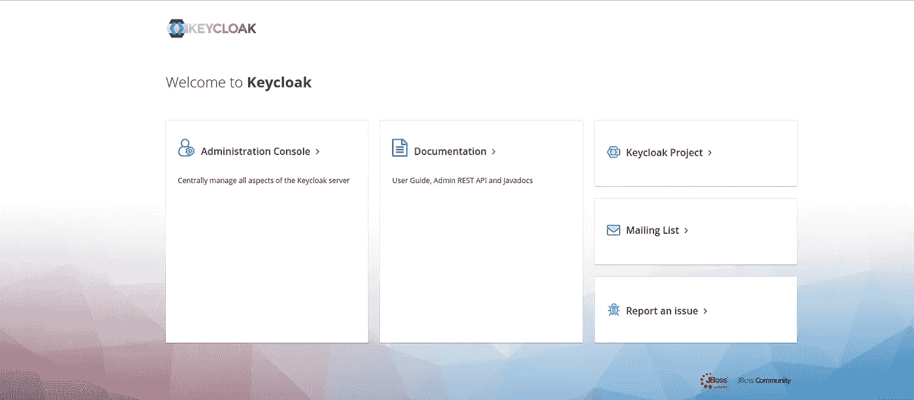
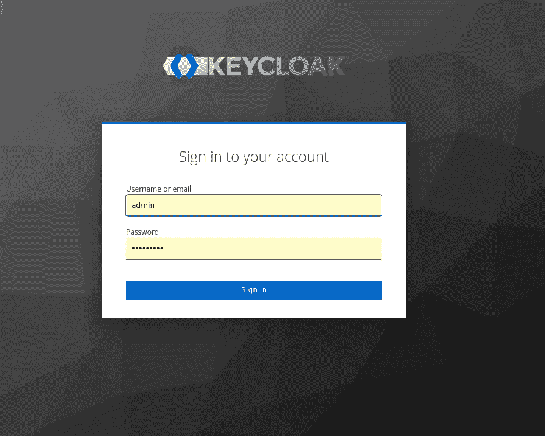
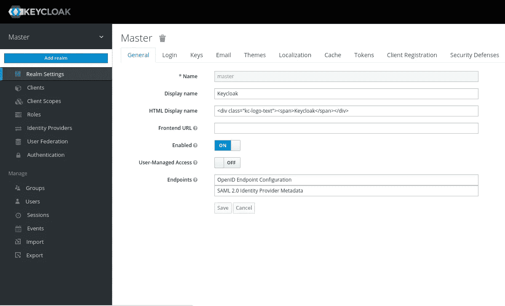
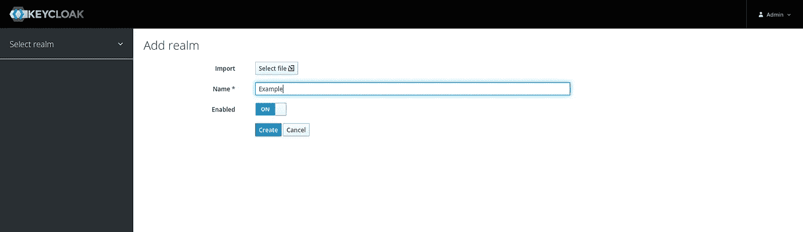
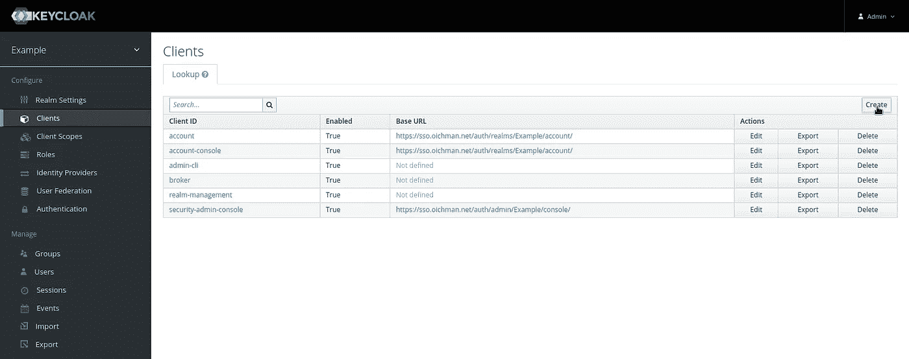
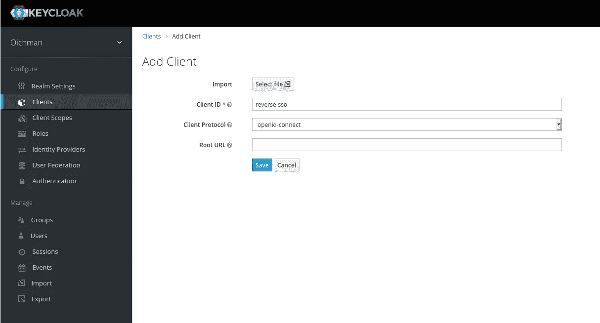
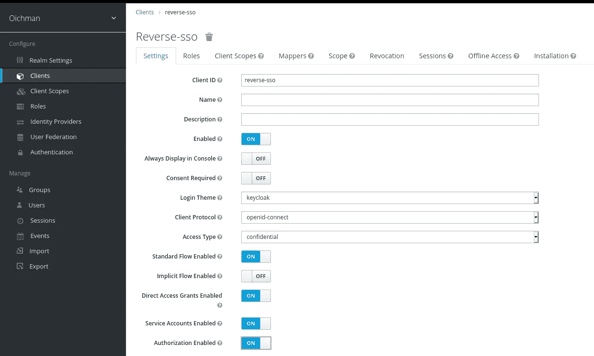
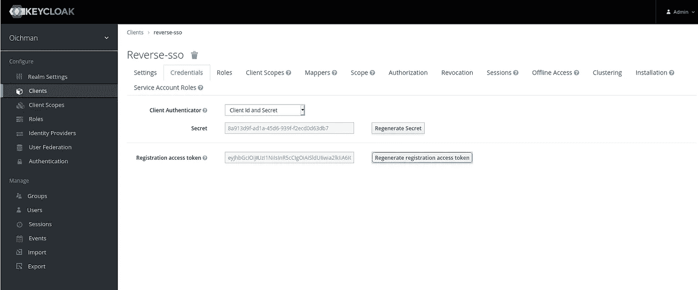

# 使用 httpd 作为 OpenID 连接身份验证的反向代理

> 原文：<https://itnext.io/using-httpd-as-a-reverse-proxy-for-openid-connect-authentication-791d7e517608?source=collection_archive---------1----------------------->

# 为什么是这篇文章？

嗯，由于许多原因…在经历从模块化应用到微服务应用的转变时，认证方法也发生了变化..过去，我们会将应用程序连接到 Ldap 甚至 Kerberos 服务器(以及更多类似 Active directory 的服务器),而现在，我们使用基于 HTTP 的协议进行身份验证，如 SAML2 和 OpenID Connect。

在某些情况下，将应用程序迁移到新的身份验证方式的开销很大。在某些情况下，应用程序根本没有任何身份验证，您需要确保用户在开始工作之前已经过身份验证。

最后，我们需要一个反向代理，它将身份验证请求发送到 OpenID Connect 服务器，并在我们通过身份验证后将我们重定向到应用程序。

# 我们需要什么？

为了实现我们的设置，我们需要一个 OpenID 连接服务器，为此，我们将使用 Keycloak 开源和 httpd with OpenID Connect 模块作为反向代理。
本文假设您对我们正在使用的 Kubernetes 集群拥有集群管理特权。

1.  Keycloak——Red Hat Signed Sign-On 开源项目(对于生产用例，我强烈推荐使用 rh-sso，而不是 key cloak 来处理生产环境的所有相关方面
2.  httpd 的自定义容器，我将在本教程中详细介绍它

# 入门指南

## 键盘锁设置

要将 keyCloak 部署到 Kubernetes 集群，可以运行以下命令:

首先，为 KeyCloak 创建一个名称空间

```
$ oc create ns keycloak$ kubectl config set-context --current --namespace=keycloak
```

**第一步—数据库** KeyCloak 可以使用 PostgreSQL 作为后端服务器，为此我们将首先使用持久存储来部署它。

让我们创建 PVC 和

```
$ cat > postgresql-pvc.yaml << EOF
apiVersion: v1
kind: PersistentVolumeClaim
metadata:
  name: postgresql-pvc
spec:
  accessModes:
    - ReadWriteOnce
  volumeMode: Filesystem
  resources:
    requests:
      storage: 1Gi
EOF
```

并应用它:

```
$ oc apply -f postgresql-pvc.yaml
```

现在我们需要生成 PostgreSQL 部署:

```
$ cat > postgresql-deployment.yaml << EOF
apiVersion: apps/v1
kind: Deployment
metadata:
  name: postgres
  labels:
    app: postgres
spec:
  replicas: 1
  selector:
    matchLabels:
      app: postgres
  template:
    metadata:
      labels:
        app: postgres
    spec:
      containers:
        - name: postgres
          image: docker.io/library/postgres:11
          imagePullPolicy: "Always"
          ports:
            - containerPort: 5432
          env:
            - name: POSTGRES_PASSWORD
              value: keycloak_passwd
            - name: POSTGRES_USER
              value: keycloak
            - name: POSTGRES_DB
              value: keycloak
          volumeMounts:
            - mountPath: /var/lib/postgresql/data
              name: postgredb
      volumes:
        - name: postgredb
          persistentVolumeClaim:
            claimName: postgresql-pvc
EOF
```

并应用它:

```
$ oc apply -f postgresql-deployment.yaml
```

为了让 keycloak 与数据库一起工作，我们需要为它生成服务:

```
$ cat > postgresql-service.yaml << EOF
apiVersion: v1
kind: Service
metadata:
  name: postgres
  labels:
    app: postgres
spec:
  ports:
  - name: postgres
    port: 5432
    targetPort: 5432
  selector:
    app: postgres
EOF
```

并应用它:

```
$ oc apply -f postgresql-service.yaml
```

**步骤 2—应用程序** 我们需要做的第一件事是部署应用程序并将其指向我们的 PostgreSQL 服务器:

```
$ cat > keycloak.yaml << EOF
apiVersion: apps/v1
kind: Deployment
metadata:
  name: keycloak
  labels:
    app: keycloak
spec:
  replicas: 1
  selector:
    matchLabels:
      app: keycloak
  template:
    metadata:
      labels:
        app: keycloak
    spec:
      containers:
      - name: keycloak
        image: quay.io/keycloak/keycloak:12.0.4
        env:
        - name: KEYCLOAK_USER
          value: "admin"
        - name: KEYCLOAK_PASSWORD
          value: "admin"
        - name: PROXY_ADDRESS_FORWARDING
          value: "true"
        - name: DB_ADDR
          value: postgres.keycloak.svc
        - name: DB_USER
          value: keycloak
        - name: DB_PASSWORD
          value: keycloak_passwd
        - name: DB_DATABASE
          value: keycloak
        ports:
        - name: http
          containerPort: 8080
        - name: https
          containerPort: 8443
        readinessProbe:
          httpGet:
            path: /auth/realms/master
            port: 8080
EOF
```

并应用它:

```
$ oc apply -f keycloak.yaml
```

确保它已启动并正在运行:

```
$ oc get pods
 NAME                        READY   STATUS    RESTARTS   AGE
postgres-66cb8c965f-b96lr   1/1     Running   1          16h
keycloak-758d65676d-qwc7j   1/1     Running   2          16h
```

现在我们需要为我们的 keycloak 服务器添加服务和入口，所以在这个例子中我们称它为 sso.example.com

```
$ cat > keycloak-service.yaml << EOF
apiVersion: v1
kind: Service
metadata:
  name: keycloak
  labels:
    app: keycloak
spec:
  ports:
  - name: keycloak
    port: 8080
    targetPort: 8080
  - name: keycloak-ssl
    port: 8443
    targetPort: 8443
  selector:
    app: keycloak
EOF
```

对于入口:

```
$ cat > keycloak-ingress.yaml << EOF
apiVersion: networking.k8s.io/v1beta1
kind: Ingress
metadata:
  name: keycloak-ingress
spec:
  tls:
    - hosts:
      - sso.example.net
      secretName: tls-sso
  rules:
  - host: "sso.example.net"
    http:
      paths:
      - backend:
          serviceName: keycloak
          servicePort: 8080
        path: /
EOF
```

**注意** 如您所见，我们在这里使用了一个 TLS 密钥来启用 TLS，为了生成密钥，我们使用教程 [OpenSSL 更改 DNS 名称](https://two-oes.medium.com/working-with-openssl-and-dns-alternative-names-367f06a23841?sk=28bf711fe07e62e407de071a9f8397b7)来创建证书。所有文件准备就绪后，我们就可以开始生成文件了:

```
$ oc create secret tls tls-sso --cert=./sso.crt --key=./sso.key
```

一旦秘密和入口路径被创建，是时候切换到网络，所以进入[https://sso.example.com](https://sso.example.com)

为了快速解决问题，我们可以使用以下命令提取 FQDN:

```
$ echo -n '[https://'](/') &&  oc get ingress keycloak-ingress -o jsonpath='{.spec.rules[0].host}' ; echo
```

转到网页:



踢管理控制台:



登录门户(默认用户名和密码是 admin/admin)

登录后，让我们创建一个新域:



对于这个例子，我们称之为“例子”:



创建领域后，让我们添加一个客户端:

转到客户端“选项卡”并单击创建:



写下客户端的名称，在本例中为“反向单点登录”



单击客户端上的“后退”,并确保以下内容:

*   登录主题:keycloak
*   客户端协议:OpenID 连接
*   访问类型:机密



在重定向 URL 中添加星号“*”，然后单击保存。

一个新的“凭证”选项卡将出现在页面顶部，单击它，然后单击“重新生成注册访问令牌”



将秘密和访问令牌都复制到一边，我们就可以开始了(转到反向代理设置)

## 步骤 3 —反向代理

就在 Kubernetes 上部署应用程序而言，我们到目前为止所做的一切都很简单，现在我们可以继续前进，用已经可用的部分创建一个小应用程序……我们只需要将它们放在一起。

让我们以 CENTOS 基础映像为例，使用代理和 openidc 安装 Apache 的 httpd。

创建一个 Dockerfile 文件，其中包含以下内容:

```
$ cat > Dockerfile << EOF
FROM centos
MAINTAINER Oren Oichman <Back to Root>RUN dnf install -y httpd && dnf module \
    enable mod_auth_openidc -y && \
    dnf install -y mod_auth_openidc && dnf clean allCOPY run-httpd.sh /usr/sbin/run-httpd.sh
COPY ca.crt /etc/pki/ca-trust/source/anchors/rh-sso.crtRUN update-ca-trust extract
RUN echo "PidFile /tmp/http.pid" >> /etc/httpd/conf/httpd.conf
RUN sed -i "s/Listen\ 80/Listen\ 8080/g"  /etc/httpd/conf/httpd.conf
RUN sed -i "s/\"logs\/error_log\"/\/dev\/stderr/g" /etc/httpd/conf/httpd.conf
RUN sed -i "s/CustomLog \"logs\/access_log\"/CustomLog \/dev\/stdout/g" /etc/httpd/conf/httpd.confRUN echo 'IncludeOptional /opt/app-root/*.conf' >> /etc/httpd/conf/httpd.conf
RUN mkdir /opt/app-root/ && chown apache:apache /opt/app-root/ && chmod 777 /opt/app-root/USER apacheEXPOSE 8080 8081
ENTRYPOINT ["/usr/sbin/run-httpd.sh"]
EOF
```

现在我们需要创建一个配置文件来启用我们刚刚安装的模块，但是我们需要在服务启动时使用它。最好的方法是创建一个启动脚本来生成配置文件。

让我们生成“run-httpd.sh”脚本:

```
$ cat > run-httpd.sh << EOF
#!/bin/bashif [ -z ${RH_SSO_FQDN} ]; then
        echo "Environment variable RH_SSO_FQDN undefined"
        exit 1
elif [[ -z $CLIENT_ID ]]; then
        echo "Environment variable CLIENT_ID undefined"
        exit 1
elif [[ -z $CLIENT_SECRET ]]; then
        echo "Environment variable CLIENT_SECRET undefined"
        exit 1
elif [[ -z $REVERSE_SSO_ROUTE ]]; then
        echo "Environment variable REVERSE_SSO_ROUTE undefined"
        exit 1
elif [[ -z ${DST_SERVICE_NAME} ]]; then
        echo "Environment variable DST_SERVICE_NAME undefined"
        exit 1
elif [[ -z $RH_SSO_REALM ]]; then
        echo "Environment variable RH_SSO_REALM undefined"
        exit 1
elif [[ -z ${DST_SERVICE_PORT} ]]; then
        echo "Environment variable DST_SERVICE_PORT undefined"
        exit 1
fiecho "
<VirtualHost *:8080>
        OIDCProviderMetadataURL [https://${RH_SSO_FQDN}/auth/realms/${RH_SSO_REALM}/.well-known/openid-configuration](https://${RH_SSO_FQDN}/auth/realms/${RH_SSO_REALM}/.well-known/openid-configuration)
        OIDCClientID $CLIENT_ID
        OIDCClientSecret $CLIENT_SECRET
        OIDCRedirectURI [https://${REVERSE_SSO_ROUTE}/oauth2callback](https://${REVERSE_SSO_ROUTE}/oauth2callback)
        OIDCCryptoPassphrase openshift
        OIDCPassClaimsAs both
        #Header set Authorization "Bearer %{OIDC_access_token}e" env=OIDC_access_token <Directory "/opt/app-root/">
                AllowOverride All
        </Directory> <Location />
                AuthType openid-connect
                Require valid-user
                ProxyPreserveHost on
                ProxyPass       [http://${DST_SERVICE_NAME}:${DST_SERVICE_PORT}/](/${DST_SERVICE_NAME}:${DST_SERVICE_PORT}/)
                ProxyPassReverse        [http://${DST_SERVICE_NAME}:${DST_SERVICE_PORT}/](/${DST_SERVICE_NAME}:${DST_SERVICE_PORT}/)
        </Location>
</VirtualHost>
" > /tmp/reverse.confmv /tmp/reverse.conf /opt/app-root/reverse.conf/usr/sbin/httpd $OPTIONS -DFOREGROUND
EOF
```

将您的 keyclock CA 复制到名为 ca.crt 的文件中，并将其放在我们的工作目录中

```
#cp <path to your CA> ./ca.crt
```

现在我们可以建立图像

```
$ buildah bud -f Dockerfile -t < registry >/reverse-sso
```

现在只需将图像推送到您的注册表中:

```
$ buildah push < registry >/reverse-sso
```

现在我们有了一个映像，我们可以继续部署了。

我知道这看起来很奇怪，但我们需要部署服务和路线/入口，然后是 pod。

让我们从服务开始:

```
$ cat > service.yaml << EOF
apiVersion: v1
kind: Service
metadata:
  name: reverse-sso
spec:
  selector:
    app: reverse-sso
  ports:
    - protocol: TCP
      port: 8080
      targetPort: 8080
EOF
```

现在出场的是:

```
$ cat > ingress.yaml << EOF
apiVersion: networking.k8s.io/v1beta1
kind: Ingress
metadata:
  name: reverse-ingress
spec:
  rules:
  - host: "my-app.example.com"
    http:
      paths:
      - backend:
          serviceName: reverse-sso
          servicePort: 8080
        path: /
EOF
```

最后一步，让我们部署应用程序:

```
$ cat > pod-deployment.yaml << EOF
apiVersion: apps/v1
kind: Deployment
metadata:
  name: reverse-sso
spec:
  selector:
    matchLabels:
      app: reverse-sso
  replicas: 1
  template:
    metadata:
      labels:
        app: reverse-sso
    spec:
      containers:
        - name: reverse-sso
          image: < registry >/reverse-sso:latest
          imagePullPolicy: Always
          env:
          - name: RH_SSO_FQDN
            value: 
          - name: CLIENT_ID
            value: 
          - name: CLIENT_SECRET
            value: 
          - name: REVERSE_SSO_ROUTE
            value: 
          - name: DST_SERVICE_NAME
            value:
          - name: RH_SSO_REALM
            value:
          - name: DST_SERVICE_PORT
            value:
          ports:
            - containerPort: 8080
EOF
```

剩下的就相当简单了，将以下值添加到部署文件并应用它:

*   RH_SSO_FQDN —红帽 SSO 的 FQDN(在我们的示例中是 keycloak
*   CLIENT_ID —我们使用的客户端的 ID，在我们的例子中是“反向单点登录”
*   CLIENT _ SECRET—key cloak 中“凭据”选项卡上的客户端密码
*   REVERSE_SSO_ROUTE —反向 SSO 服务的路由/入口 FQDN(我们之前创建的)
*   DST_SERVICE_NAME —我们希望将流量发送到的目标服务
*   RH_SSO_REALM —在我们的例子中是“example”
*   DST_SERVICE_PORT —我们的服务应用程序的端口

并应用部署:

```
$ oc apply -f pod-deployment.yaml
```

剩下的就是去反向单一标志的路线/入口:

```
$ echo -n '[http://'](/') &&  oc get ingress reverse-ingress -o jsonpath='{.spec.rules[0].host}' ; echo
http://my-app.example.com
```

如果您有任何问题，请随时回复/留下您的评论。你可以在领英上找到:[https://www.linkedin.com/in/orenoichman](https://www.linkedin.com/in/orenoichman)或者在推特上找到:[https://twitter.com/ooichman](https://twitter.com/ooichman)

玩得开心！！！