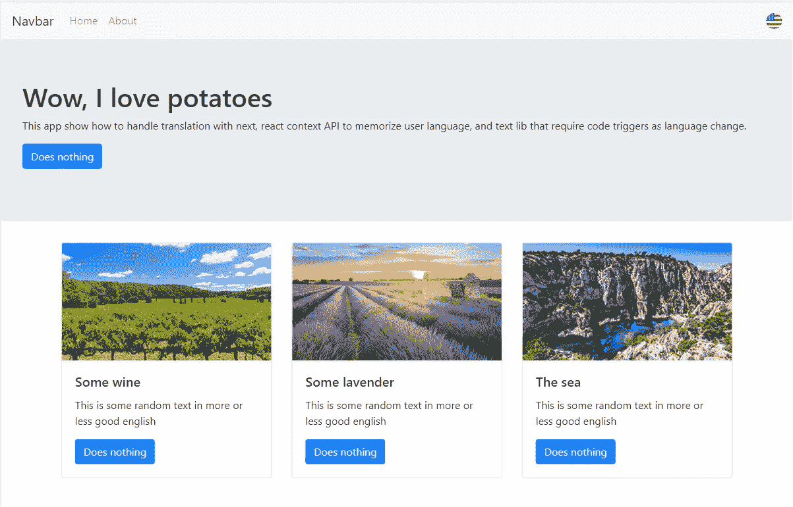

# 将 i18n 与 Next.js 和 React 上下文 API 一起使用

> 原文：<https://itnext.io/using-i18n-with-next-js-react-context-api-ab208659cee8?source=collection_archive---------0----------------------->

一个国际化的 HTTP/2 React 应用程序，速度快，搜索引擎友好


# 为什么要国际化？

作为一个非英语母语的人，我喜欢认为我很好地理解了英语，当我面对一个不是用我的母语写的网站或产品时，我不会感到困扰。如果它不是英语，也不是我的母语，那就是另一回事了！

截至 2019 年，有超过 90 种语言的使用人数超过 1000 万。

让我们面对现实吧，在你的网络应用程序上提供不同的语言支持可能是 UX 的最佳实践，而且无论你的转换指标是什么，也肯定会增加。这就是为什么你的网络应用不应该默认硬编码成你的母语。

# 为 javascript 输入 i18next，为 Next.js 输入 next-i18 next…

数字 i18n 代表国际化的单词 T2。就是第一个和最后一个字母，18 代表单词第一个 **i** 和最后一个**n**之间的字母数。

基于这种国际化需求，为 javascript 构建了一个名为 **i18next** 的框架。

> I18next 是一个用 JavaScript 编写的国际化框架**。但远不止如此。**
> 
> i18next 不仅仅提供标准的 i18n 特性，比如(复数、上下文、插值、格式)。它为您提供了一个完整的解决方案，将您的产品从 web 本地化到移动和桌面。

这些年来，社区围绕它创建了一个很好的生态系统，并且几乎为所有主要的前端框架建立了一个集成。

**next-i18next** 除了名字容易混淆之外，就是整合了 ***i18next* 为 ***Next.js*** 框架。我们将使用它来简单地为我们的 Next.js 应用程序提供国际化。**

# 我们要建造什么

我们的目标是构建一个小型应用程序，超越他们的 Github repo 上提供的 next-i18next 的基本使用示例。

我们的应用将涵盖这些部分:

*   使用 Fastify 而不是 Express 作为提供 HTTP/2 支持的更快/更小的服务器框架
*   提供用户语言的自动检测
*   通过 React 上下文 API 存储和使用用户语言首选项
*   在我们的组件代码中提供语言更改监听器，以更新特殊的 text/lib(在本例中使用 typed.js 组件)

它还将使用 Next.js >9.1.0，该版本优先于*公共*文件夹引入了*静态*文件夹的折旧。

# 让我们深入研究一下实现

下面是我们将要采取的步骤

*   1.设置项目，并使用 Fastify 实现一个定制服务器
*   2.创建前端应用程序(使用 react-bootstrap)，并添加 next-i18next 集成
*   3.使用 React context API 构建一个用户上下文，它存储语言首选项并在我们的组件方法中提供语言更新侦听器

1.  **设置&定制 Fastify 服务器** 像往常一样，首先初始化一个 npm 包:

```
mkdir next-fastify-i18n-example
cd next-fastify-i18n-example
npm init
npm install next @zeit/next-css eventemitter3 react react-dom react-bootstrap react-typed fastify fastify-nextjs fastify-static i18next next-i18next --save
npm install cross-env rimraf --save-dev
```

现在，您可以在项目的根目录下创建一个基本的 next.config.js 文件，主要用于设置 CSS 配置:

next.config.js

**next-i18next** 提供了一个 Express.js 服务器中间件。但由于我们正在构建一个主要是静态的网站，我们将使用 Fastify 而不是 Express。其中一个优势是它很容易切换，而且 Fastify 支持 Express 中间件 API，所以所有适用于 Express 的中间件，也适用于 Fastify。

> Fastify 是一个高度专注于以最少的开销和强大的插件架构提供最佳开发者体验的 web 框架。它的灵感来自哈比神和 Express，据我们所知，它是目前最快的 web 框架之一。

在项目的根目录下创建 server.js 文件。这将是我们国际化所需的定制服务器。该文件有三个主要部分:

*   **Fastify 服务器设置**
    我选择启用 http/2 支持，所以需要提供本地生成的证书。为此，我在 package.json 中添加了一个使用 OpenSSL 的 npm 脚本

*   **next . js**的设置以及与 Fastify & i18next
    的集成在这一点上，代码非常简单明了:

*   **启动 Fastify listening**
    就这样，我们基本上有了正在运行的 http/2 服务器:

**2。带有 next-i18n 的前端应用程序**

*   **Next-i18next setup** 在自定义服务器配置上，您可能已经发现了一个*要求*到一个 ***i18n*** 文件。该文件导出一个配置 i18n 的 **NextI18Next** 对象。您可以在存储库的根目录下创建这个 i18n.js 文件，并对其进行如下配置:

next-i18next 支持一个有趣的特性:**局部子路径。正如他们所描述的，用例子来解释是最简单的:**

```
myapp.com        ---> Homepage in default lang
myapp.com/de     ---> Homepage in German
```

它在默认情况下是不启用的，我认为它在某些情况下可能是有用的，但由于它需要 next.js 应用程序使用特殊链接来支持这一点，我们不打算在我们的应用程序中使用它。

*   **Next.js 前端设置
    这里有两个步骤。**

>创建一个使用 next-i18 next***appwithflatement***HOC 的 _app.js

>在所有页面和组件中使用第二个 next-i18next 的 HOC: ***withTranslation，*** ，并为页面指定翻译名称空间

*   **翻译内容**

然后 **next-i18next** 用 JSON 文件保存你的翻译，期待这种文件夹架构*(注意，我们用的是最新的 next.js，不赞成静态文件夹)*

```
.
└── public
    └── locales
        ├── en
        |   └── common.json
        └── fr
            └── common.json
```

*   **组件和页面中的用法**

next-i18next HOC 增加了一个 ***props.t*** ，就是你可以用来引用你的 JSON 文档结构的翻译函数:

它将一个字符串作为第一个参数，首先是可从组件访问的翻译名称空间，然后是冒号和 JSON 中的对象路径。

**3。使用 React 上下文 API 更改和访问语言首选项**

更改语言将自动导致使用来自 JSON 文件的新数据进行重绘。这是通过调用以下命令来完成的:

`i18n.changeLanguage("fr")`

但在大多数情况下，你会想要更多。一种常见的方法是:

*   从浏览器设置中自动检测用户语言，
*   提供一个允许用户更改语言的图标(或下拉菜单)
*   存储您的用户语言设置(如果他更改了设置)
*   通知回调，当语言改变时需要手动更新库或特定内容的代码片段。

感谢 [React 上下文 API](https://reactjs.org/docs/context.html#dynamic-context) ，我们将能够在定制的用户上下文中轻松实现这一点。React 上下文带有一个提供者和消费者类。在这种情况下，我们将创建我们的自定义上下文提供程序来处理语言设置操作

> React Context 提供了一种通过组件树传递数据的方式，而不必在每一层手动向下传递属性。

*   **创建 user-context.js 文件**

让我们在组件文件夹中创建一个***user-context . js***文件。首先，我们创建我们的上下文:

上下文在创建时需要一个对象。然后，我们将创建一个自定义提供程序组件，并使用其状态来定义实际值:

在上面的代码片段中，我们还使用 **eventemitter3，**实例化了一个 EventEmitter，它将用于在我们的语言发生变化时处理回调触发。

然后，我们可以添加组件初始化方法，尝试从本地存储中获取以前的用户设置，如果没有检测到，则使用默认的浏览器语言:

最后，我们实现了在上下文中声明的组件方法，以切换语言并注册将侦听语言更改的回调:

*   **在我们的导航栏组件中使用我们的上下文**

让我们创建一个 navbar 组件，它将包含一个标志图标，用户可以单击该图标来切换语言。在类组件中使用上下文是这样完成的:

您只需要定义一个静态的 **contextType，**，然后从 **this.context.** 中获取您的上下文，然后您将从我们的用户上下文提供程序中调用 **toggleLang()** 方法，该方法将更改其状态，触发 **i18n.changeLanguage()** 并用相应的语言文件重新呈现，最后用 eventemitter 传播给任何需要它的人。很酷，不是吗？

*   **注册一个关于语言变化的方法来更新代码中的内容**

让我们创建一个组件，它将使用 **Typed.js** lib，并且需要在语言改变时更新 react-typed 组件属性。我们将这个组件称为 banner.js。

同样，这个组件将使用我们的用户上下文，但是它将使用我们的 register 和 unregister 监听器方法，而不是使用 **toggleLang()，**。

首先，让我们用本地状态设置**类型的**:

然后，我们只需添加 mount 和 unmount 方法，将我们的 **updateTyped()** 注册为用户上下文语言更改的监听器:

就是这样，我们的类型化组件现在会在用户改变它时用相应的语言重新设置它自己。它还可以通过在组件卸载时取消注册回调来避免内存泄漏。

# 结论

就这样，您现在已经有了构建完全国际化的网站或 web 应用程序的良好基础，它使用服务器端呈现，并且可以支持您需要的任何语言。

下一步可能是将谷歌分析整合到你的网站上，以跟踪你的访问者的来源国，创建相应的翻译文件，并愉快地为他们提供一个母语网站。



完整代码可在此处找到:

[](https://github.com/typedef42/nextjs-fastify-i18n) [## typedef42/nextjs-fastify-i18n

### 此时您不能执行该操作。您已使用另一个标签页或窗口登录。您已在另一个选项卡中注销，或者…

github.com](https://github.com/typedef42/nextjs-fastify-i18n) 

以下是如何启动和运行此回购的快速回顾:

```
git clone [https://github.com/typedef42/nextjs-fastify-i18n.git](https://github.com/typedef42/nextjs-fastify-i18n.git)
cd nextjs-fastify-i18n
npm install
npm run generate-certs
```

然后将其用于生产设置:

```
npm run release
npm run stage
```

或者在开发中:

```
npm run dev
```

最后，在`[https://localhost:5000/](https://localhost:5000/)`启动您最喜欢的浏览器