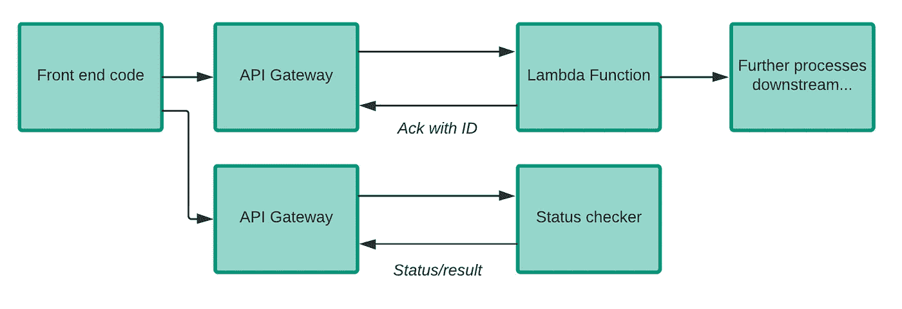
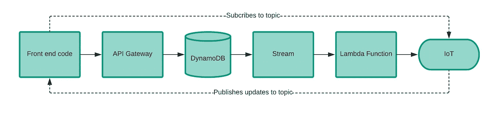
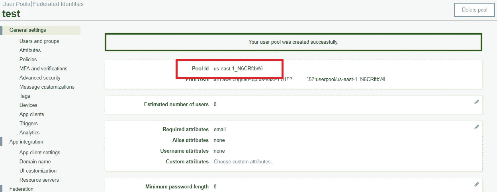
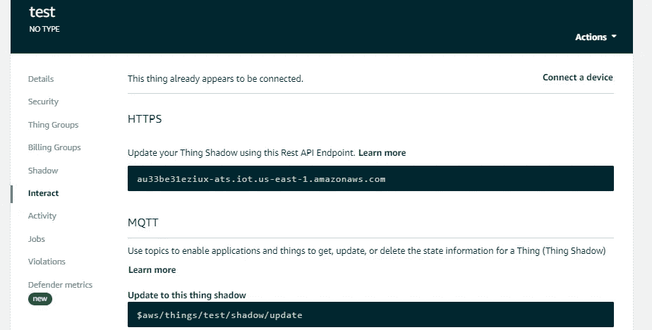
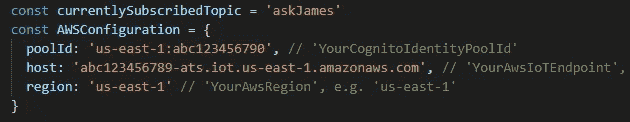
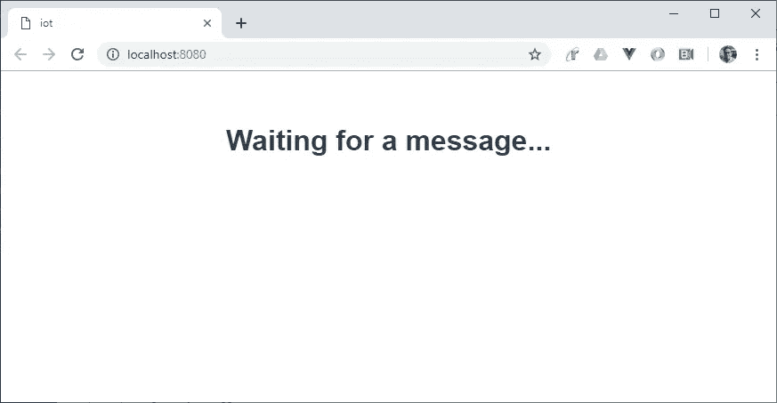
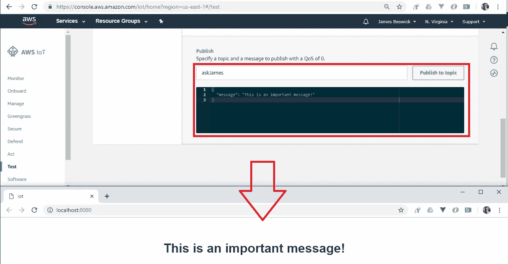
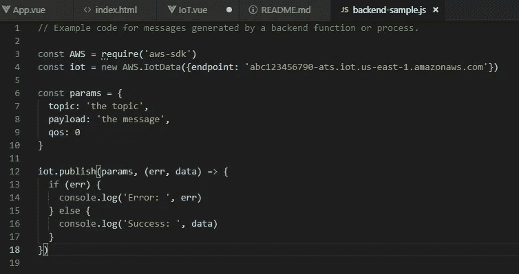

# 为无服务器 web 应用带来实时性

> 原文：<https://itnext.io/using-iot-to-send-messages-back-to-your-serverless-front-end-fb335a099576?source=collection_archive---------1----------------------->

有许多方法可以将结果返回到前端，但使用 AWS IoT 最容易实现实时选项。

在 web 应用程序中，通常有一个前端与 REST APIs 通信，以在后端完成工作。一般来说，API 会返回一个结果，表示成功或者您正在从系统中检索某个值。

但是，在无服务器基础设施中有一类棘手的调用，返回值“消失”或者很难推回到前端，要么是因为花费的时间太长，要么是由于事件的连锁性质，发起调用方不再能够访问最终结果。

看一下这个例子:

在这个图中，一些前端代码调用 API gateway，在 DynamoDB 中产生一个条目，生成一个流，触发一个 Lambda 函数。但是最后一个 Lambda 函数的返回值无处可去。因此，如果有错误、问题或我们需要原始前端代码知道的东西，我们就有点卡住了。

事实上，任何时候你将函数附加到 S3、DynamoDB 或任何其他 AWS 服务生成的事件上，返回值都不能被推回到链上。例如，如果您使用 Rekognition 来分析放入 S3 桶中的照片，则响应需要发送到函数返回值之外的其他地方。

这些问题有几种解决方案，每一种都有自己的优缺点，这取决于您的使用情况。

## 选项 1:等待

在最简单的情况下，您有一个需要一段时间的函数，您可以等待。您受到 API Gateway 30 秒超时的限制，因此对于长期进程来说，这是行不通的。从成本角度来看，这也不好，因为你是在为等待付费。但是对于简单的、特定的、低使用率的应用程序，这是最简单的解决方案。

*示例*:每月一次，前端请求将一个大对象从一个 S3 桶复制到另一个区域，并等待 3-5 秒，直到 S3 确认成功完成。在这种情况下，可能不值得努力设计任何更复杂的东西。

## 选项 2:轮询

这适用于后端流程耗时超过几秒钟，或者执行时间可能超过 API Gateway 上 30 秒超时的情况。

这里，前端向 API 发出请求，发生了两件事:

*   被调用的函数立即响应，确认请求已被成功接收(但不是工作的结果)。该响应可能包括供前端稍后参考的 ID(如果 ID 不是由前端首先生成的)。
*   接下来，还有第二个 API 用于检查工作的状态，前端会定期轮询，直到报告工作完成，函数返回响应。在 AWS 中，这个状态函数通常会检查一个 DynamoDB 表，该表的 ID 是管理请求状态的 ID。

这种方法很容易实现，但是会产生许多不必要的请求，并且不是实时的。例如，如果一个事务需要 20 秒，前端每秒轮询一次，那么在前端收到完成的响应之前，需要 20-21 个轮询请求。

在无服务器中，从成本的角度来看，这可能仍然是更可取的——20 x 100 毫秒的请求比等待 20 秒的请求成本低，但有一个开销，这相当于让孩子在汽车后座反复问“我们到了吗？”。

## 选项 3:物联网

虽然物联网让人联想到硬件设备的图像，但它也可以用于无服务器的网络应用。物联网使用名为 MQTT 的轻量级消息协议，这是一种简单高效的消息推送方式。

发布-订阅方法通常用于实时应用程序，但可以很好地解决这个问题。好处是你不需要写一个轮询函数或者做多个必要的请求，也不受 API 网关 30 秒超时的限制。更好的是，无论该过程需要 5 秒钟还是 5 分钟，前端都会立即知道任务何时完成，因为通信是实时的。

对于仪表板这样的前端来说，这是一个很好的解决方案，在仪表板中，网页只需加载一次，但需要与后端数据的变化保持同步。但是，对于任何希望最大限度减少等待时间的时间关键型前端应用程序来说，它也非常有效。

在幕后，发布-订阅是复杂的，这是一个喋喋不休的过程，需要定期进行保持活动的 pings，以确保各方仍在那里。幸运的是，AWS 物联网设备 SDK 将这一切抽象化，使我们可以轻松构建一个前端，来侦听后端中一些远程进程生成的消息。

从[成本角度来看](https://aws.amazon.com/iot-core/pricing/)，AWS 按连接分钟数和消息数量收费(还有一个慷慨的免费层津贴)。一个客户端连接一整年将花费 4.2 美分(不包括数据费用)，因此，如果你有成千上万的用户，这些钱很重要，但仍然相对便宜。

## 构建物联网解决方案。

举个简单的例子，我构建了将消息返回到浏览器前端所需的绝对最小值。我选择 VueJS 是因为更新显示很简单，如果您打算使用这种解决方案，单页面应用程序框架是一个很好的用例。

首先，克隆我的来自 https://gitlab.com/jbesw/askjames-iot-demo[的回购协议。这是一个包含许多文件的 VueJs 应用程序，但我们只关心这两个文件:](https://gitlab.com/jbesw/askjames-iot-demo)

*   components/IoT.vue:它包含了所有的逻辑，并且基于 IoT 核心开发者网站的样板代码。
*   App.vue:监听新消息并将内容放入`<h1>`标签的主网页。

在你能让这个做任何有意义的事情之前，你需要做两件事。首先，转到 [AWS Cognito](https://console.aws.amazon.com/cognito/users/?region=us-east-1) 并点击“创建用户池”——提供一个名称，点击“查看默认值”，然后点击“创建池”。以下屏幕将显示一个池 ID，您稍后需要复制该 ID:

接下来，进入 [AWS 物联网控制台](https://console.aws.amazon.com/iot/)。点击“管理”(自动选择“物品”子类别)，点击“创建”，然后点击“创建单个物品”。提供一个名称，单击“下一步”，然后单击“创建证书”(在“一键创建证书”选项旁边)。单击默认设置，直到看到新的 https 端点，并将其复制下来以备后用:

回到 repo，打开 IoT.vue，在 AWSConfiguration 中输入您的池 ID 和主机(端点):

在控制台中键入`npm run dev`并访问 [http://localhost:8080](http://localhost:8080) 来启动您的应用程序:

现在回到物联网控制台，单击左侧菜单中的“测试”选项。选择“发布”，输入“askJames”作为主题，然后在下面的 JSON 中输入消息。当您单击“发布到主题”时，消息将立即出现在浏览器窗口中:

刚刚发生了什么？我们创造了一个物联网“东西”,既可以发布，也可以订阅。实际上，您可以在整个应用程序中使用 Lambda 函数进行发布，使用类似 repo:

有趣的是，前端应用程序使用 SDK 连接到物联网基础设施，并等待消息。它足够聪明，能够在断线和多日开放的情况下存活下来。它还可以处理大规模扇出操作，因此如果您有数万个(或更多)用户，它将毫无问题地进行扩展。此外，在生产系统中，您可以使用 Cognito 来确保订阅者只收听他们被授权的主题。

回到我们最初的问题，如果操作 ID 作为消息有效负载的一部分通过物联网基础设施传递回来，前端可以对此进行过滤，并检测操作何时完成。总的来说，这是一种简单、优雅的方式来解决将响应推回到前端应用程序的问题。