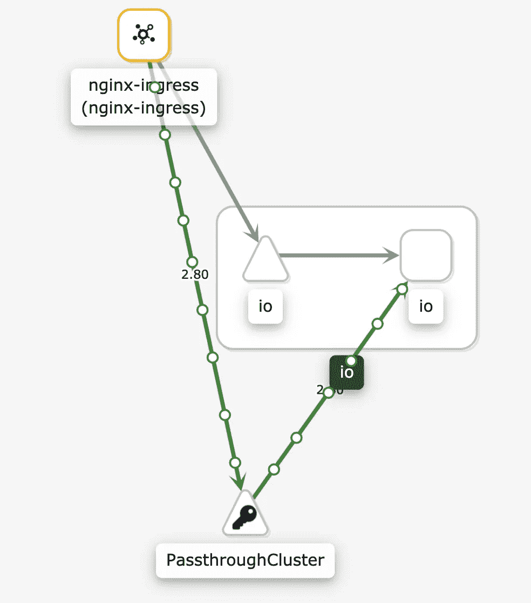
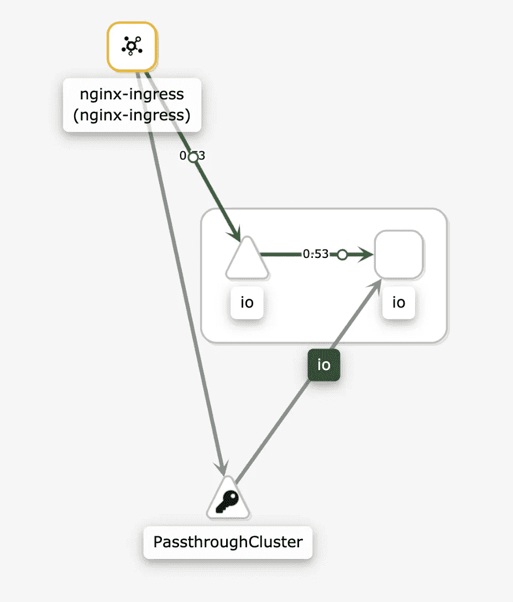

# 使用 Istio 和 Nginx 入口

> 原文：<https://itnext.io/using-istio-with-nginx-ingress-ccb8e28d9aff?source=collection_archive---------1----------------------->

在 giffgaff，我们从一开始就使用 [NGINX](https://github.com/kubernetes/ingress-nginx) 作为 Kubernetes 集群的入口控制器。NGINX 是最受欢迎的 Kubernetes 入口提供商，已经证明是一个可靠的解决方案。

在过去一年左右的时间里，我们一直在向一些工作负载推出 [Istio](https://istio.io/) 。Istio 是一个非常复杂的软件，功能非常强大。如你所知，**“权力越大，责任越大”。从第一天开始就可以获得很多开箱即用的好处，包括遥测、跟踪和详细的访问日志。但是，如果您对 Istio 如何管理进出网格的流量没有深刻的理解，也很容易把事情搞砸。配置也要复杂得多，NGINX 中的一个简单注释在 Istio 中变成了两个或三个(可配置性更强的) [CRs](https://kubernetes.io/docs/concepts/extend-kubernetes/api-extension/custom-resources/) 。**

Istio 对大多数公司来说可能太复杂，无法一次推出所有功能。因此，我们决定分阶段推出 Istio。我们继续使用当前的入口控制器，而不是基于 Istio 的入口控制器，Istio 入口网关。由于 Kubernetes 允许同时部署多个入口控制器，我们可以稍后将它们迁移到 Istio Gateway 中，而不会遇到大问题。

虽然这是一种保守的方法，但它需要一些更改才能使 NGINX 和 Istio 之间的集成行为正确。

# 部署期间 503 秒

在应用程序和 NGINX 入口容器中注入 Istio 后，我们注意到一些问题:

*   在部署期间，从 NGINX 到应用程序的请求导致了 503 个错误。在被正确路由到新的 pod 之前，流量被路由到被短时间终止的 pod。
*   Istio telemetry 将来自 Nginx 的请求报告为 [PassThroughCluster](https://istio.io/latest/blog/2019/monitoring-external-service-traffic/#what-are-blackhole-and-passthrough-clusters) ，而不是应用服务(下图中的三角形)。



直通集群

> *如果使用 Istio Ingress 网关而不是 NGINX，这些问题都不存在。*

# 到底发生了什么

了解 NGINX ingress 如何工作的一些概念很重要。NGINX 入口控制器不使用服务将流量路由到 pod。相反，它使用 NGINX 上游配置中所有端点(Pod IP/端口)的列表，以绕过 kube-proxy，从而允许 NGINX 功能，如会话相似性和自定义负载平衡算法。

您应该配置 NGINX ingress 路由到单个上游服务，而不是将出站流量路由到 NGINX 上游配置中的端点列表，以便出站流量被 istio sidecar 拦截。

`nginx.ingress.kubernetes.io/service-upstream`注释禁用了这种行为，取而代之的是使用 NGINX 中的单个上游，即服务的集群 IP 和端口。

> *即使您不使用 Istio 并且您正在寻找零停机部署，您也可能想要添加这个注释，如* [*文档*](https://github.com/kubernetes/ingress-nginx/blob/master/docs/user-guide/nginx-configuration/annotations.md#service-upstream) *中所述。请记住，像会话相似性和自定义负载平衡这样的功能是不起作用的。*

`nginx.ingress.kubernetes.io/upstream-vhost`注释允许您在下面的语句中控制 host 的值:`proxy_set_header Host $host`，它构成了位置块的一部分。

为了使 Istio 正常工作，需要将以下注释添加到每个入口资源中，以便:

*   出站流量被 Istio 边车拦截
*   流量被发送到正确的服务入口。

```
nginx.ingress.kubernetes.io/service-upstream: "true" nginx.ingress.kubernetes.io/upstream-vhost: <service-name>.<namespace>.svc.cluster.local
```



# 不包括入站流量

在这一点上，那些 503 应该消失了。入站流量在到达 NGINX pods 之前仍然通过 Istio 路由。如果我们希望阻止入站流量通过边车，(我们希望入口代理来处理它)，用以下内容注释 NGINX 部署:

```
traffic.sidecar.istio.io/excludeInboundPorts: 80,443 traffic.sidecar.istio.io/includeInboundPorts: ""
```

`traffic.sidecar.istio.io/excludeInboundPorts:`要从重定向到特使中排除的以逗号分隔的入站端口列表。

`traffic.sidecar.istio.io/includeInboundPorts:`以逗号分隔的入站端口列表，流量将被重定向到特使。通配符“*”可用于配置所有端口的重定向。空列表将禁用所有入站重定向。

您可以在[官方文档](https://istio.io/latest/docs/reference/config/annotations/)中找到 Istio 资源注释的完整列表。

# 结论

如本文开头所述，Istio 是复杂的。我们建议逐步采用，这样您可以先熟悉它，然后才能充分利用它的潜力。


本文假设你熟悉作为[入口控制器](https://github.com/kubernetes/ingress-nginx)的 [Istio](https://istio.io/latest/) 和 [NGINX 入口](https://github.com/kubernetes/ingress-nginx)。

这种配置已经过测试:

*   Istio 1.7.4
*   Kubernetes 1.16

*原发布于*[*https://www . giffgaff . io*](https://www.giffgaff.io/tech/using-istio-with-nginx-ingress/)*。*