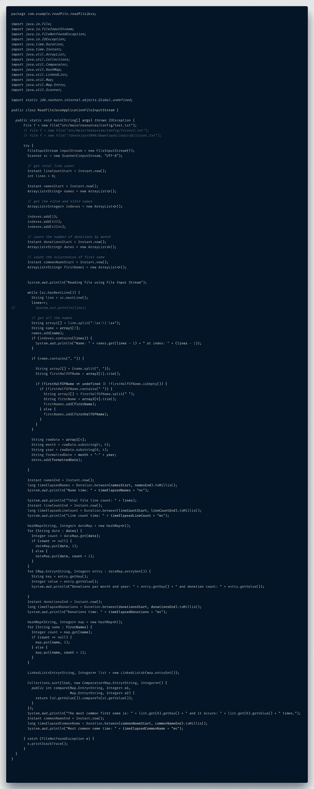
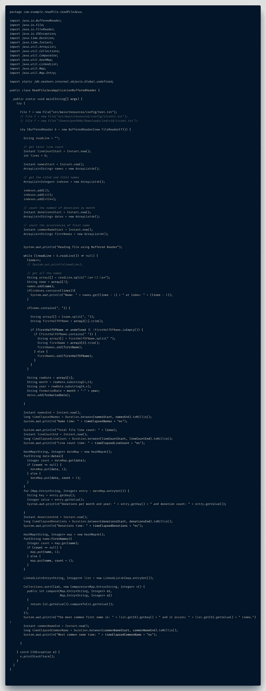
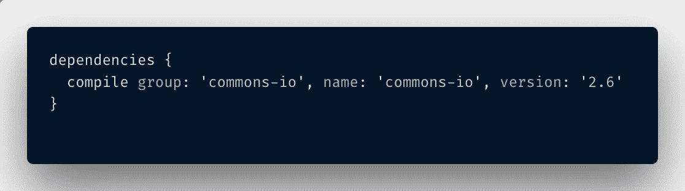
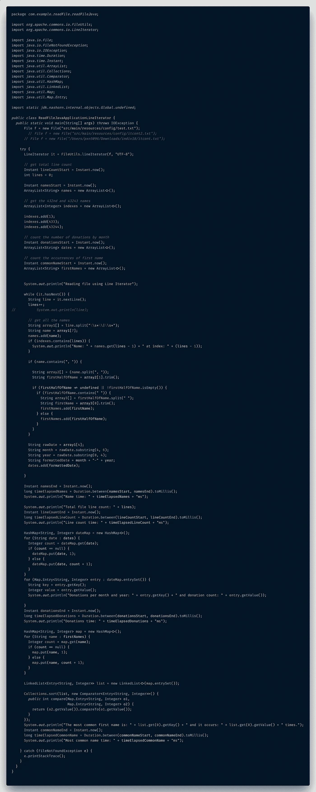
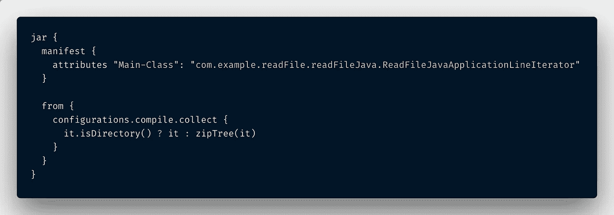
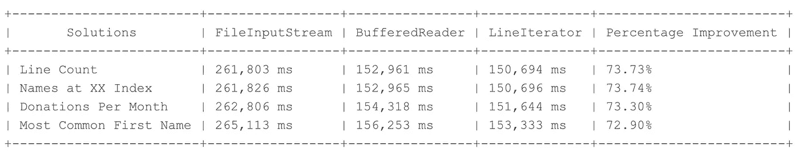
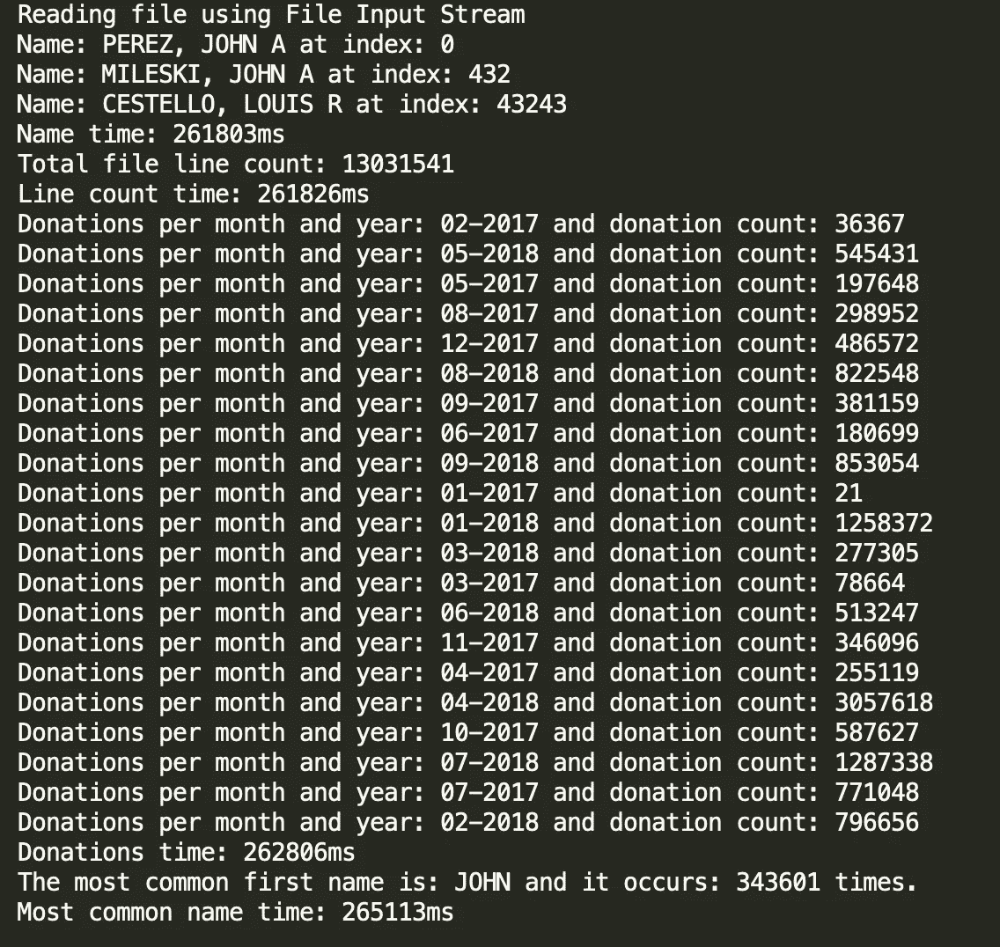
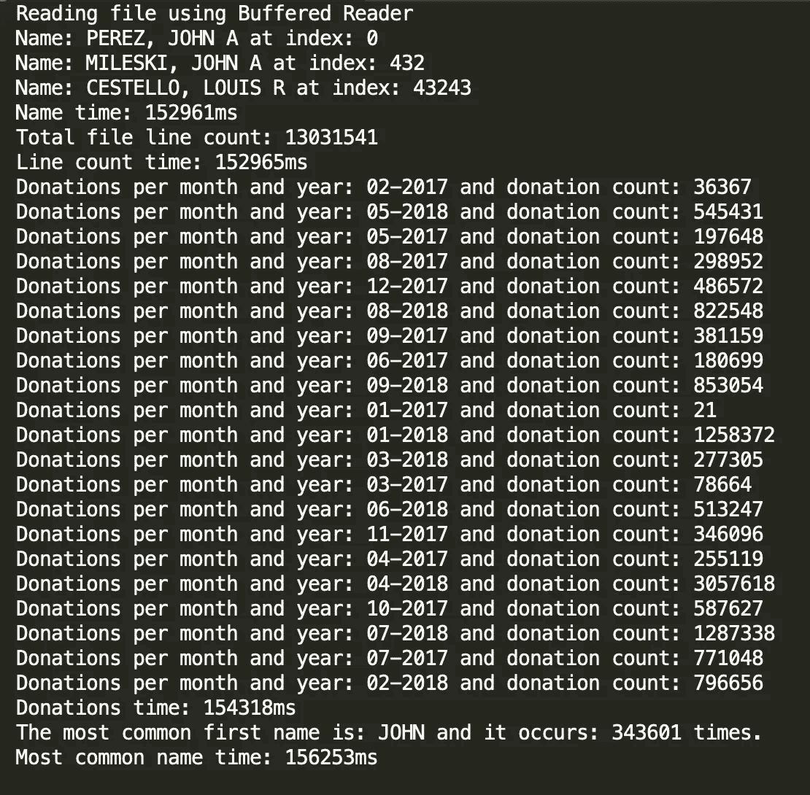
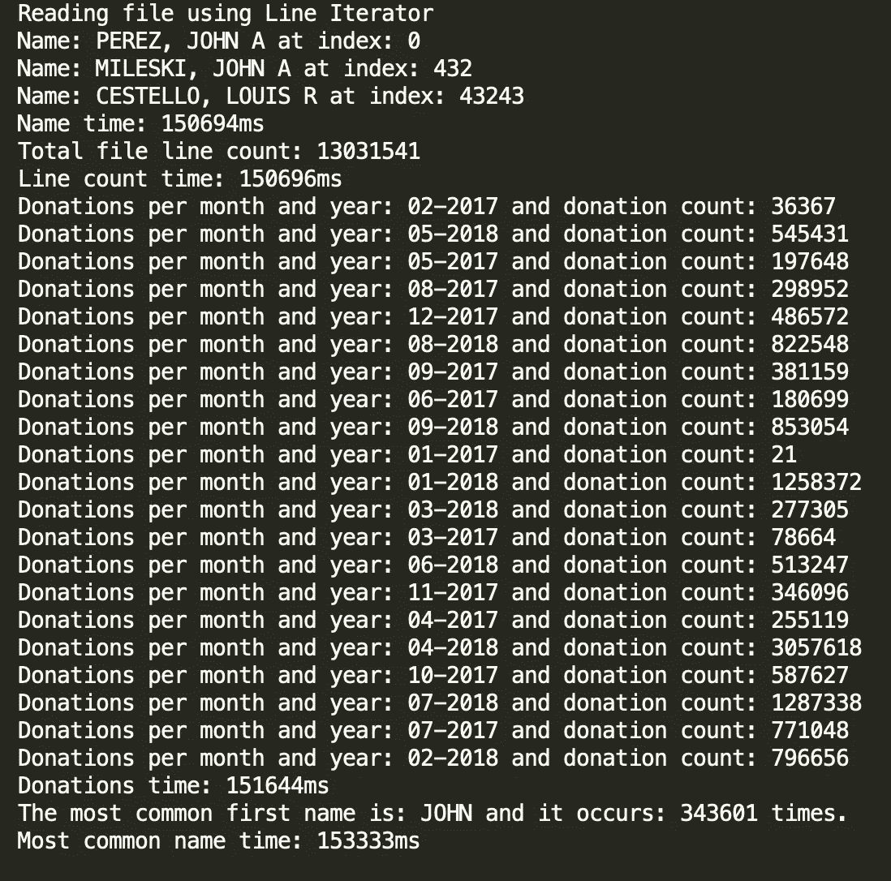

# 使用 Java 读取非常非常大的文件

> 原文：<https://itnext.io/using-java-to-read-really-really-large-files-a6f8a3f44649?source=collection_archive---------0----------------------->

# Java 就是为这种东西而生的。


任何在我的编程生涯中对我相当了解的人都会知道，我并不偏爱 Java。

我首先是一名 JavaScript 开发人员。这是我第一次学到的东西，在我开始掌握它之后，它让我困惑，然后又让我高兴，对我来说，它比 Java 有意义得多，因为它的编译，它需要声明每一个变量类型(是的，我知道 Java 的最新版本已经取消了对一些更简单的推理的这一要求)，以及它的大量地图、列表、集合等库。:哈希表，映射，哈希表，树映射，数组列表，链表，数组，等等。

也就是说，我确实努力提高 Java 水平，克服我没有传统计算机科学学位的缺点。如果你想了解更多关于我成为软件工程师的非典型途径，你可以在这里阅读我的第一篇博文[。](https://medium.com/@paigen11/how-i-went-from-a-digital-marketer-to-a-software-engineer-in-4-months-7ed99c65d360)

因此，当我告诉我的一个同事几个月前我遇到的一个编码挑战，以及我如何用 JavaScript[解决了它](/using-node-js-to-read-really-really-large-files-pt-1-d2057fe76b33)(然后[性能](/streams-for-the-win-a-performance-comparison-of-nodejs-methods-for-reading-large-datasets-pt-2-bcfa732fa40e)测试了我的各种解决方案)，他回头看着我说:“你会如何用 Java 解决它？”


我对使用 Java 这个问题的最初反应。

我盯着他，脑子里的轮子开始转动，我也接受了用 Java 寻找最优解的挑战。

所以在我开始讨论如何使用 Java 解决我的挑战之前，让我回顾一下需求。

# 我面临的挑战

正如我在我的[原始文章](/using-node-js-to-read-really-really-large-files-pt-1-d2057fe76b33)中所说，关于使用 Node.js 读取非常非常大的文件，这是一个发给另一个保险技术公司开发人员的编码挑战。

挑战很简单:从联邦选举委员会下载这个大的文本 zip 文件，从。txt 文件，并提供以下信息:

*   写一个程序，打印出文件中的总行数。
*   请注意，第 8 列包含一个人的姓名。编写一个程序，加载这些数据并创建一个包含所有名称字符串的数组。打印出第 432 号和第 43243 号姓名。
*   请注意，第 5 列包含一种日期形式。计算每个月有多少捐赠，并打印出结果。
*   请注意，第 8 列包含一个人的姓名。用每个名字创建一个数组。确定数据中最常见的名字及其出现的次数。

数据链接:[https://www.fec.gov/files/bulk-downloads/2018/indiv18.zip](https://www.fec.gov/files/bulk-downloads/2018/indiv18.zip)*

**注意:**我在文件链接后面加了星号，因为自从我在 2018 年 10 月初下载以来，其他选择自己承担这项挑战的人实际上已经看到文件大小增加了。在最近的统计中，有人提到现在高达 3.5GB，所以看起来这个数据仍然是实时的，并且一直在增加。我相信我下面提出的解决方案仍然有效，但是你的计数和数字会和我的不同。

我喜欢这个挑战，并且想练习操作文件，所以我决定看看我是否能解决这个问题。现在，事不宜迟，让我们来谈谈我想到的用 Java 读取非常非常大的文件的一些不同的解决方案。

# 我想到的三个 Java 解决方案

Java 长期以来一直是一种具有文件处理能力的标准编程语言，因此，有大量不断改进的方法可以用它来读取、写入和操作文件。

有些方法是直接放入核心 Java 框架中的，有些仍然是独立的库，需要导入并捆绑在一起才能运行。但是不管怎样，我想出了三种不同的方法来读取 Java 中的文件，然后我对它们进行了性能测试，看哪种方法更有效。

下面是 [Polacode](https://marketplace.visualstudio.com/items?itemName=pnp.polacode) 格式的我所有代码的截图以及各种代码片段，如果你想看所有的原始代码，你可以在这里访问我的 Github repo。

您会注意到，我使用了相同的代码逻辑从每个文件中提取数据，主要区别在于初始文件连接和文本解析。我这样做是为了更准确地了解不同方法在我的评估中的性能部分是如何相互影响的。苹果与苹果的比较以及所有这些。

## **Java**[**file inputstream()**](https://docs.oracle.com/javase/8/docs/api/?java/io/FileInputStream.html)**&**[**Scanner()**](https://docs.oracle.com/javase/7/docs/api/java/util/Scanner.html)**实现**

我想到的第一个解决方案是使用 Java 内置的`FileInputStream()`方法结合`Scanner()`。

本质上，FileInputStream 只是打开了到要读取的文件的连接，不管是图像还是字符等等。它并不特别关心文件实际上是什么，因为 Java 将输入流作为原始数据字节读取。另一个选择(至少对我来说)是使用专门用于读取字符流的`FileReader()`，但是我在这个特殊的场景中使用了`FileInputStream()`。我在后来测试的另一个解决方案中使用了`FileReader()`

一旦建立了与文件的连接，Scanner 就开始将文本字节解析成可读的数据字符串。`Scanner()`使用分隔符模式将其输入分解成标记，默认情况下匹配空白(但也可以被覆盖以使用 regex 或其他值)。然后，通过使用`Scanner.hasNextLine()`布尔值和`Scanner.nextLine()`方法，我可以逐行读取文本文件的内容，并提取出我需要的数据片段。

`Scanner.nextLine()`实际上让这个扫描器前进通过当前行，并返回跳过的输入，这就是我如何能够从每一行收集所需信息，直到没有更多行要读取，`Scanner.hasNextLine()`返回 false，然后`while`循环结束。

这里有一个使用`FileInputStream()`和`Scanner()`的代码示例。

```
File f = new File("src/main/resources/config/test.txt");

try {
   FileInputStream inputStream = new FileInputStream(f);
   Scanner sc = new Scanner(inputStream, "UTF-8");
   do some things ... while (sc.hasNextLine()) {
      String line = sc.nextLine();
      do some more things ...
   }   do some final things
}
```

这是我解决上述所有任务的完整代码。



FileInputStream()和 Scanner()逐行流过文本数据。

在一次读取一行文件的数据后，只需获取必要的数据并对其进行操作以满足我的需求。

**任务 1:获取文件的总行数**

获取整个文件的行数很容易。所涉及的只是在`while`循环之外声明了一个新的`int lines = 0`,每当循环再次运行时，这个值就会增加。请求 1:完成。

**任务 2:创建所有姓名的列表，并找到第 432 和 43243 个姓名**

第二个请求是收集所有的名字并打印数组中的第 432 和第 43243 个名字，它要求我创建一个`ArrayList<String> names = new ArrayList<>();`和一个`ArrayList<Integers> indexes = new ArrayList<>();`，我很快用`indexes.add(433)`和`indexes.add(43244)`分别添加了 432 和 43243 的索引。

我必须给每个索引加 1 来获得数组中正确的名字位置，因为一旦`Scanner.hasNextLine()`返回 true，我就增加我的行计数(从 0 开始)。在`Scanner.nextLine()`返回前一行的内容后，我可以取出我需要的名字，这意味着它的真正索引(从索引 0 开始)实际上是行数减 1 的索引。(相信我，我检查了三遍，以确保我的计算是正确的)。

我使用 ArrayList 作为名称，因为它维护了元素的插入顺序，这意味着在显示 ArrayList 元素时，结果集将总是具有与元素插入列表时相同的顺序。因为我是逐行遍历文件，所以元素总是以相同的顺序插入到列表中。

下面是我用来获取所有名字的完整逻辑，如果我在`indexes`数组列表中的索引与`lines`计数索引匹配，就打印出这些名字。

```
int lines = 0;ArrayList<String> names = new ArrayList<>();

// get the 432nd and 43243 names
ArrayList<Integer> indexes = new ArrayList<>();

indexes.add(433);
indexes.add(43244);

System.*out*.println("Reading file using File Input Stream");

while (sc.hasNextLine()) {
   String line = sc.nextLine();
   lines++; // get all the names
   String array1[] = line.split("\\s*\\|\\s*");
   String name = array1[7]; names.add(name);
   if (indexes.contains(lines)) {
      System.*out*.println("Name: " + names.get(lines - 1) + " at
      index: " + (lines - 1));
   } 
   ...
}
```

请求二:完成。

**任务 3:统计每个月有多少捐款**

当我接近捐赠计数请求时，我想做的不仅仅是按月计数捐赠，我还想按月和年计数，因为我有 2017 年和 2018 年的捐赠。

我做的第一件事是建立一个初始数组列表来保存我所有的日期:`ArrayList<String> dates = new ArrayList<>();`

然后，我取每行中的第 5 个元素，即原始日期，并使用`substring()`方法提取每笔捐赠的月份和年份。

我将每个日期重新格式化成更容易阅读的日期，并将它们添加到新的`dates`数组列表中。

```
String rawDate = array1[4];
String month = rawDate.substring(4, 6);
String year = rawDate.substring(0, 4);
String formattedDate = month + "-" + year;
dates.add(formattedDate);
```

在我收集了所有的日期之后，我创建了一个 HashMap 来保存我的日期:`HashMap<String, Integer> dateMap = new HashMap<>();`，然后遍历`dates`列表，或者将日期作为键添加到 HashMap 中(如果它们还不存在的话)，或者增加它们的值计数(如果它们确实存在的话)。

一旦创建了散列表，我就通过另一个`for`循环运行新的映射，以获取每个对象的键和值，并打印到控制台。瞧。

日期结果没有按照任何特定的顺序排序，但是如果需要的话，可以通过将 HashMap 转换回 ArrayList 或 LinkedList 来排序。我选择不这样做，因为这不是一个要求。

```
HashMap<String, Integer> dateMap = new HashMap<>();
for (String date : dates) {
   Integer count = dateMap.get(date);
   if (count == null) {
      dateMap.put(date, 1);
   } else {
      dateMap.put(date, count + 1);
   }
}for (Map.Entry<String, Integer> entry : dateMap.entrySet()) {
   String key = entry.getKey();
   Integer value = entry.getValue();
   System.*out*.println("Donations per month and year: " +
   entry.getKey() + " and donation count: " + entry.getValue());

}
```

请求三:完成。

**任务 4:确定最常见的名字&出现的频率**

第四个请求是只获取所有名字，并找出最常出现的名字，这是最棘手的。

它要求我首先检查`names`数组是否包含逗号(有些企业名称没有逗号)，然后检查逗号上的`split()`名称和`trim()`中任何多余的空格。

一旦清理完毕，我必须检查名字的前半部分是否有空格(意思是这个人有名字和中间名，或者可能有一个类似“女士”的名字)，如果有，再次`split()`，并`trim()`到新创建的数组的第一个元素(我认为几乎总是名字)。

如果名字的前半部分没有空格，它将被添加到`firstNames`数组列表中。我就是这样从文件中收集到所有名字的。请参见下面的代码片段。

```
// count the occurrences of first name
ArrayList<String> firstNames = new ArrayList<>();

System.*out*.println("Reading file using File Input Stream");

    while (sc.hasNextLine()) {
        String line = sc.nextLine();

        // get all the names
        String array1[] = line.split("\\s*\\|\\s*");
        String name = array1[7];
        names.add(name);

        if (name.contains(", ")) {
            String array2[] = (name.split(", "));
            String firstHalfOfName = array2[1].trim();

            if (firstHalfOfName != *undefined* ||
                !firstHalfOfName.isEmpty()) {
                     if (firstHalfOfName.contains(" ")) {
                       String array3[] = firstHalfOfName.split(" ");
                       String firstName = array3[0].trim();
                       firstNames.add(firstName);
                     } else {
                        firstNames.add(firstHalfOfName);
                     }
                  }
               }
```

一旦我收集了所有我能收集到的名字，并且读取文件的`while`循环已经结束，就该对名字进行排序并找到最常见的一个了。

为此，我创建了另一个新的 HashMap: `HashMap<String, Integer> map = new HashMap<>();`，然后遍历所有的名字，如果这个名字在 Map 中不存在，它就被创建为 map 的键，值被设置为 1。如果这个名字已经存在于 HashMap 中，那么这个值就增加 1。

```
HashMap<String, Integer> map = new HashMap<>();
for (String name : firstNames) {
   Integer count = map.get(name);
   if (count == null) {
      map.put(name, 1);
   } else {
      map.put(name, count + 1);
   }
}
```

但是等等——还有更多！一旦我们有了 HashMap(本质上是无序的),就需要从最大值到最小值对它进行排序，以获得最常出现的名字，所以我将 HashMap 中的每个条目转换成一个 LinkedList，可以对它进行排序和迭代。

```
LinkedList<Entry<String, Integer>> list = new LinkedList<>(map.entrySet());
```

最后，使用`Collections.sort()`方法对列表进行排序，并调用`Comparator interface`根据名称对象的值计数对其进行降序排序(最大值在前)。看看这个。

```
Collections.*sort*(list, new Comparator<Map.Entry<String, Integer>>()
  {
     public int compare(Map.Entry<String, Integer> o1,
     Map.Entry<String, Integer> o2) {
         return (o2.getValue()).compareTo(o1.getValue());
       }
  });
```

一旦所有这些都完成了，LinkedList 的第一个键值对就可以取出来显示给用户了。这是从文件中读出所有名字后整理出来的全部内容。

```
HashMap<String, Integer> map = new HashMap<>();
for (String name : firstNames) {
   Integer count = map.get(name);
   if (count == null) {
      map.put(name, 1);
   } else {
      map.put(name, count + 1);
   }
}

LinkedList<Entry<String, Integer>> list = new LinkedList<>(map.entrySet());

Collections.*sort*(list, new Comparator<Map.Entry<String, Integer>>()
  {
     public int compare(Map.Entry<String, Integer> o1,
     Map.Entry<String, Integer> o2) {
         return (o2.getValue()).compareTo(o1.getValue());
       }
  });System.*out*.println("The most common first name is: " + list.get(0).getKey() + " and it occurs: " + list.get(0).getValue() + " times.");
```

请求 4(可以说是所有任务中最复杂的):完成。

很好，现在我已经给了你我的大脑在 Java 中的逻辑独白，我可以给你更快的概述我尝试的从文件中读取文本数据的其他两种方法。(因为代码的逻辑部分完全一样。)

## **Java**[**buffered reader()**](https://docs.oracle.com/javase/8/docs/api/java/io/BufferedReader.html)**&**[**FileReader()**](https://docs.oracle.com/javase/8/docs/api/?java/io/FileReader.html)**实现**

我的第二个解决方案涉及到 Java 的另外两个核心方法:`BufferedReader()`和`FileReader()`。

BufferedReader 从字符输入流中读取文本，缓冲字符以提供对字符、数组和行的有效读取，它包装在 FileReader 方法周围，FileReader 方法是读取指定文本文件的实际方法。BufferedReader 使 FileReader 的操作更加高效，仅此而已。

BufferedReader 的方法`readLine()`实际上是读回从流中读取的每行文本，允许我们提取所需的数据。

设置类似于 FileInputStream 和 Scanner 你可以在下面看到如何实现 BufferedReader 和 FileReader。

```
File f = new File("src/main/resources/config/test.txt");

try (BufferedReader b = new BufferedReader(new FileReader(f))) { 
   String readLine = "";
   do some things ... while ((readLine = b.readLine()) != null) { 
     do some more things...
   } do some final things
}
```

这里是我使用`BufferedReader()`和`FileReader()`的完整代码。



BufferedReader()和 FileReader()逐行流过文本数据。

但是，除了 BufferedReader 和 FileReader 实现之外，其中的所有逻辑都是相同的，所以现在我将继续讨论我的最后一个 Java 文件读取器实现:FileUtils.LineIterator。

## **Apache Commons IO**[**FileUtils。LineIterator()**](https://commons.apache.org/proper/commons-io/javadocs/api-2.5/org/apache/commons/io/LineIterator.html) **实现**


Apache 负责这个方便的库。

我想到的最后一个解决方案涉及 Apache 制作的库，名为`FileUtils.LineIterator()`。包含依赖关系很容易。我在我的 Java 项目中使用了 Gradle，所以我所要做的就是在我的`build.gradle`文件中包含`commons-io`库。



这是您需要为 FileUtils.lineIterator()方法包含的依赖项。它不是内置在核心 Java 中的。

LineIterator，顾名思义:它保存一个对 open `Reader`的引用(就像我上一个解决方案中的`FileReader`),并遍历文件中的每一行。而且一开始设置 LineIterator 真的很容易。

LineIterator 有一个名为`nextLine()`的内置方法，它实际上返回包装阅读器中的下一行(与 Scanner 的`nextLine()`方法或 BufferedReader 的`readLine()`方法没有什么不同)。

下面是包含依赖库后设置`FileUtils.LineIterator()`的代码。

```
File f = new File("src/main/resources/config/test.txt");

try {
   LineIterator it = FileUtils.*lineIterator*(f, "UTF-8"); 
   do some things ... while (it.hasNext()) {
      String line = it.nextLine(); 
      do some other things ...
   } do some final things
}
```

这里是我使用`FileUtils.LineIterator()`的完整代码。



FileUtils。LineIterator()逐行读取文本数据。

**注意:**如果你在没有 Spring Boot 的帮助下运行一个普通的 Java 应用程序，有一点你需要注意。如果您想使用这个额外的 Apache 依赖库，您需要手动将它与您的应用程序的 JAR 文件捆绑到一个所谓的 **fat JAR** 中。

> **fat jar(也称为 uber jar)是一个自给自足的档案，包含运行应用程序所需的类和依赖项。**

Spring Boot“自动地”将我们所有的依赖捆绑在一起，但它也有很多额外的开销和功能，对这个项目来说是完全不必要的，这就是为什么我选择不使用它。这使得项目变得不必要的繁重。

现在有可用的插件，但我只是想要一个快速简单的方法将我的一个依赖项与我的 JAR 捆绑在一起。所以我从 Java Gradle 插件修改了 *jar* 任务。默认情况下，该任务生成没有任何依赖关系的 jar。

我可以通过添加几行代码来覆盖这种行为。我只需要两样东西就能让它工作:

*   清单文件中的一个 *Main-Class* 属性(检查，出于测试目的，我在演示报告中有三个主类文件)
*   以及任何依赖关系 jar

感谢 [Baeldung](https://www.baeldung.com/gradle-fat-jar) 帮忙制作这个肥罐子。



制造一个大罐子的代码——这是一个 Java 术语。

一旦定义了主类文件(在我的[演示报告](https://github.com/paigen11/read-file-java)中，我创建了三个主类文件，这让我的 IDE 困惑不已)并且包含了依赖项，您可以从终端运行`./gradlew assemble`命令，然后:

`java -cp ./build/libs/readFileJava-0.0.1-SNAPSHOT.jar com.example.readFile.readFileJava.ReadFileJavaApplicationLineIterator`

并且您的程序应该运行包含的 LineIterator 库。

如果您使用 IntelliJ 作为您的 IDE，您也可以在本地使用它的运行配置，将每个主文件指定为正确的主类，它也应该运行这三个程序。查看我的 README.md 了解更多信息。

很好，现在我有三种不同的方法来读取和处理 Java 中的大型文本文件，我的下一个任务是:找出哪种方法更高效。

# 我如何评估他们的表现和结果

为了对我的不同 Java 应用程序和其中的函数进行性能测试，我在 Java 8 中遇到了两个方便的现成函数:`Instant.now()`和`Duration.between()`。

我想做的是看看读取同一文件的不同方式之间是否有任何可测量的差异。因此，除了不同的文件读取选项:FileInputStream、BufferedReader 和 LineIterator 之外，我试图让代码(以及标记每个函数开始和停止的时间戳)尽可能地相似。我觉得效果很好。

`[**Instant.now()**](https://docs.oracle.com/javase/8/docs/api/java/time/Instant.html)`

Instant.now()正如它的名字所暗示的那样:它保存时间轴上的一个瞬时点，存储为代表纪元秒的`long`和代表纳秒秒的`int`。这本身并不是非常有用，但是当它与 Duration.between()结合使用时，就变得非常有用了。

`[**Duration.between()**](https://docs.oracle.com/javase/8/docs/api/java/time/Duration.html)`

Duration.between()接受一个开始间隔和一个结束间隔，并查找这两个时间之间的持续时间。就是这样。时间可以转换成各种不同的可读格式:毫秒、秒、分钟、小时等等。

下面是一个在我的文件中实现 Instant.now()和 Duration.between()的例子。这个是计时获取整个文件的行数需要多长时间。

```
try {
         LineIterator it = FileUtils.*lineIterator*(f, "UTF-8");

         // get total line count
         Instant lineCountStart = Instant.*now*();
         int lines = 0;

         System.*out*.println("Reading file using Line Iterator");

         while (it.hasNext()) {
            String line = it.nextLine();
            lines++;

         }

         System.*out*.println("Total file line count: " + lines);
         Instant lineCountEnd = Instant.*now*();

         long timeElapsedLineCount =
         Duration.*between*(lineCountStart, lineCountEnd).toMillis();

         System.*out*.println("Line count time: " +
         timeElapsedLineCount + "ms");

      } 
   }
```

## 结果

下面是将`Instant.now()`和`Duration.between()`应用到 Java 中所有不同的文件读取方法后的结果。

我针对 2.55GB 的文件运行了我的三个解决方案，该文件总共包含 1300 多万行。



LineIterator 勉强击败 BufferedReader，两者都轻松击败 FileInputStream。

正如你从表中看到的，`BufferedReader()`和`LineIterator()`都进行得很好，但是他们的计时非常接近，这似乎取决于他们更愿意使用哪个开发者。

`BufferedReader()`很好，因为它不需要额外的依赖，但是一开始设置起来稍微复杂一点，因为要用`FileReader()`来包装。而`LineIterator()`是一个外部库，但是在它作为一个依赖项被包含进来之后，它使得迭代文件变得非常容易。

上表末尾也列出了改进的百分比，以供参考。

有趣的是，被另外两个人轰出了水面。通过缓冲数据流或使用专门用于迭代文本文件的库，所有任务的性能提高了约 73%。

以下是我的每个解决方案在终端上的原始截图。

**方案一:** `**FileInputStream()**`



使用 FileInputStream()和 Scanner()的解决方案。

**解决方案#2:** `**BufferedReader()**`



使用 BufferedReader()和 FileReader()的解决方案。

**解决方案#3:** `**FileUtils.lineIterator()**`



使用 FileUtils.lineIterator()的解决方案。

# 结论

最后，缓冲流和自定义文件读取库是在 Java 中处理大型数据集的最有效方式。至少对于我负责阅读的大型文本文件来说是这样。

感谢阅读我的关于使用 Java 读取非常非常大的文件的帖子。如果你想看 Node.js 上激发这篇文章的原始帖子，你可以在这里看到第 1 部分[，在这里](/using-node-js-to-read-really-really-large-files-pt-1-d2057fe76b33)看到第 2 部分[。](/streams-for-the-win-a-performance-comparison-of-nodejs-methods-for-reading-large-datasets-pt-2-bcfa732fa40e?source=friends_link&sk=11818162d84e2888187ed2b57b9e0118)

过几周再来看看，我会用 Express.js 写关于 Swagger 的文章或者其他与 web 开发& JavaScript 相关的东西，所以请关注我，这样你就不会错过了。

如果你想确保你不会错过我写的一篇文章，在这里注册我的时事通讯:[https://paigeniedringhaus.substack.com](https://paigeniedringhaus.substack.com/)

感谢您的阅读，我希望这能让您了解如何用 Java 高效地处理大量数据，并对您的解决方案进行性能测试。非常感谢鼓掌和分享！

如果你喜欢读这篇文章，你可能也会喜欢我的其他一些博客:

*   [使用 Node.js 读取非常非常大的数据集&文件(Pt 1)](/using-node-js-to-read-really-really-large-files-pt-1-d2057fe76b33)
*   [用最简单的方法保持开发人员之间的代码一致——用更漂亮的& ESLint](/keep-code-consistent-across-developers-the-easy-way-with-prettier-eslint-60bb7e91b76c)
*   [调试 Node.js 最简单的方法——用 VS 代码](/the-absolute-easiest-way-to-debug-node-js-with-vscode-2e02ef5b1bad)

**参考资料和更多资源:**

*   Github，在 Java Repo 中读取文件:[https://github.com/paigen11/read-file-java](https://github.com/paigen11/read-file-java)
*   链接到外汇券数据:[https://www.fec.gov/files/bulk-downloads/2018/indiv18.zip](https://www.fec.gov/files/bulk-downloads/2018/indiv18.zip)
*   Oracle Java 文档，文件输入流:[https://docs.oracle.com/javase/8/docs/api/?Java/io/file inputstream . html](https://docs.oracle.com/javase/8/docs/api/?java/io/FileInputStream.html)
*   Oracle Java 文档，Scanner:[https://docs . Oracle . com/javase/7/docs/API/Java/util/Scanner . html](https://docs.oracle.com/javase/7/docs/api/java/util/Scanner.html)
*   Oracle Java 文档，buffered reader:[https://docs . Oracle . com/javase/8/docs/API/Java/io/buffered reader . html](https://docs.oracle.com/javase/8/docs/api/java/io/BufferedReader.html)
*   Oracle Java 文档，文件阅读器:[https://docs.oracle.com/javase/8/docs/api/?java/io/FileReader.html](https://docs.oracle.com/javase/8/docs/api/?java/io/FileReader.html)
*   Apache Commons Java 文档，line iterator:[https://Commons . Apache . org/proper/Commons-io/javadocs/API-2.5/org/Apache/Commons/io/line iterator . html](https://commons.apache.org/proper/commons-io/javadocs/api-2.5/org/apache/commons/io/LineIterator.html)
*   贝尔东，在格拉德创造一个胖罐子:[https://www.baeldung.com/gradle-fat-jar](https://www.baeldung.com/gradle-fat-jar)
*   Oracle Java 文档，即时:[https://docs . Oracle . com/javase/8/docs/API/Java/time/Instant . html](https://docs.oracle.com/javase/8/docs/api/java/time/Instant.html)
*   Oracle Java 文档，时长:[https://docs . Oracle . com/javase/8/docs/API/Java/time/Duration . html](https://docs.oracle.com/javase/8/docs/api/java/time/Duration.html)