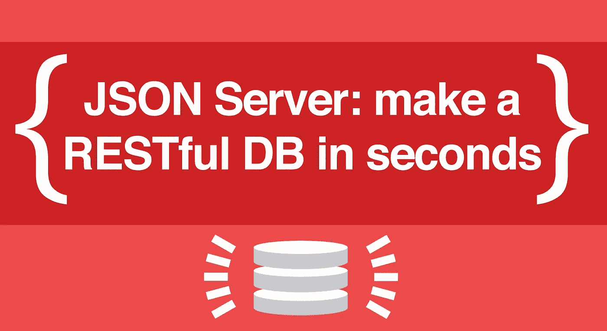
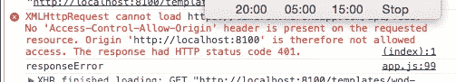

# 使用 JSON Server 在 5 秒钟内创建一个 Restful 服务器

> 原文：<https://itnext.io/using-json-server-to-create-a-restful-server-in-5-seconds-78b85ccf832b?source=collection_archive---------2----------------------->



好的，从技术上来说，你需要做一个*小*设置来让 [JSON 服务器](https://github.com/typicode/json-server)运行，但是要激活它，只需要做以下事情:

```
json-server --watch db.json
```

就这样，您的新本地开发服务器启动了。文档中有很多很酷的选项，但我们将只介绍基本的设置，以便您可以快速开始。

# 设置和安装

JSON Server 是一个节点包，所以你需要安装 node，要么从他们的[站点](https://nodejs.org/en/download/)，要么使用[自制](https://www.dyclassroom.com/howto-mac/how-to-install-nodejs-and-npm-on-mac-using-homebrew)(我推荐后者)。一旦安装了 Node，使用 Node 包管理器(Node 自带的)来安装包是非常容易的。把这个放进你的控制台:

```
npm install -g json-server
```

好了，现在已经安装好了。如果你得到一个错误，使用“复制到堆栈溢出”的可靠方法。但是，应该没问题。

# 它是如何工作的

JSON Server 将从您的主项目文件夹中取出一个 JSON 文件，并将其转换成一个 RESTful 数据库，其中包含所有正确的路径；它甚至可以做类似于[搜索查询](https://github.com/typicode/json-server)的事情。实际上，文档会给你一些启动代码，放入你的数据库，这样你就能得到正确的格式。基本模式如下:

```
{
  "posts": [
    { "id": 1, "title": "json-server", "author": "typicode" },
    { "id": 2, "title": "another post", "author": "Mike" }
  ],
  "comments": [
    { "id": 1, "body": "some comment", "postId": 1 },
    { "id": 2, "body": "another comment", "postId": 1 }
  ],
  "profile": { "name": "typicode" }
}
```

本质上，我们有 3 个“表”，帖子、评论和个人资料，每个都有自己的 RESTful 路线。让我们用简介中的命令实际启动我们的服务器来测试一下。`cd`到您的 web 项目的根文件夹并运行:

```
json-server --watch db.json
```

这样做的目的是在您的计算机端口 3000 上设置一个本地主机服务器。要查看我们所有的帖子，我们可以转到[http://localhost:3000/posts](http://localhost:3000/tasks)，要只查看第一篇帖子，我们可以转到[http://localhost:3000/posts/1](http://localhost:3000/tasks)，这是第一篇帖子的 ID。它完全符合 REST 标准，所以注释和概要文件可以用同样的方式访问。同样，要停止服务器，进入终端会话并键入 control-c。

# 添加数据

有很多 [资源](http://jsonplaceholder.typicode.com/)可以用来练习*轻松获取* JSON 数据，但是 JSON 服务器如此强大的原因在于，你可以同样轻松地*向它发送*数据。你可以使用 [Postman](https://www.getpostman.com/) 或者跳到[这篇文章](https://medium.com/@mikecronin92/coding-the-5-basic-restful-actions-for-javascript-c25279483e4f)来学习如何使用纯 JavaScript 与数据库交互。JSON Server 是一个非常好的“赝品”,你甚至不用把 id 和你的对象一起发送，一旦数据被成功添加，服务器就会自动为你创建它们。看:

```
function create(data) {
  let options = {
    method: 'POST',
    headers: {
      'Content-Type': 'application/json'
    },
    body: JSON.stringify(data)
  }
  return fetch(baseUrl, options)
    .then((response) => response.json)
}create({title: "check it out", author: "Mike"})// the server will return the object back with an id
{id: 3, title: "check it out", author: "Mike"}
```

# 一个小警告:CORS 问题

有一点点*的可能性，你可能会在玩的时候得到这个可怕的错误:*

**

*哦，太好了，我们打破了一切。*

*没有“访问控制允许来源”警告是因为一种叫做 CORS 的东西。基本上你的浏览器说它不会在两个不同的域之间交换资源。我们的数据库有一个`[http://](http://localhost)`协议，但是我们的 index.html 文件有一个`file://`协议(假设您刚刚打开了您的索引文件来玩您的站点)。所以，为了解决这个问题，使用 Python 的简单的 [http 服务器程序](http://www.pythonforbeginners.com/modules-in-python/how-to-use-simplehttpserver/)。你所要做的就是进入一个新的终端窗口，再次进入你的 web 项目的根目录`cd`，然后运行:*

```
*python -m SimpleHTTPServer*
```

*然后在您的浏览器中，而不是打开您的索引文件，转到 [http://localhost:8000/](http://localhost:8000/) 查看它。您的数据库将位于 3000 端口，您的项目将位于 8000 端口，这意味着 CORS 将有望不再打扰您。希望如此。*

*大家编码快乐，*

*迈克*

**最新文章:* [如何用 React 钩子构建一个动态的、可控的表单](https://medium.com/@mikecronin92/how-to-build-a-dynamic-controlled-form-with-react-hooks-2019-b39840f75c4f)*