# 使用开普勒 GL 观测新西兰克赖斯特彻奇附近的 35，000 多次地震

> 原文：<https://itnext.io/using-kepler-gl-to-visualise-over-35-000-earthquakes-near-christchurch-new-zealand-d207a760e000?source=collection_archive---------5----------------------->

这是一个循序渐进的教程，展示了我如何使用开普勒 GL 来可视化在新西兰克赖斯特彻奇或其周围 14 年左右的时间里发生的 35，000 次地震。

开普勒。 *gl* 是一款数据不可知、支持 WebGL 的高性能 web 应用，用于地理空间分析可视化。”。对我来说，这是一种以独特或有趣的方式查看数据的方式，这引起了我的注意。所以我坐下来玩了一个晚上，看看我是否能想象新西兰的地震——特别是过去 10 年里坎特伯雷的克赖斯特彻奇和凯库拉。对于那些不知道的人，[克赖斯特彻奇在 2010-2011 年](https://en.wikipedia.org/wiki/2011_Christchurch_earthquake)发生了一些毁灭性的地震，随后发生了数千次余震，而沿海的凯库拉在 2016 年也发生了自己的野蛮地震。

**首先，科技:**

Kepler.gl 使用 Deck.gl 构建，利用 WebGL 快速高效地渲染大型数据集。

—您可以轻松地拖放数据集、添加过滤器、应用比例以及动态聚合。

Kepler.gl 基于 React & Redux 构建，可以嵌入到您自己的地图应用程序中。

**入门**

数据，我们需要数据。为了获得所有的地震数据， [Geonet](https://geonet.org.nz/) 是政府提供的地震数据源(以及火山警报和其他类似警报)。他们提供了一个[地震搜索](https://quakesearch.geonet.org.nz/)，可以让你生成一个特定地区、特定时期以及该时期所有地震的 CSV 文件。

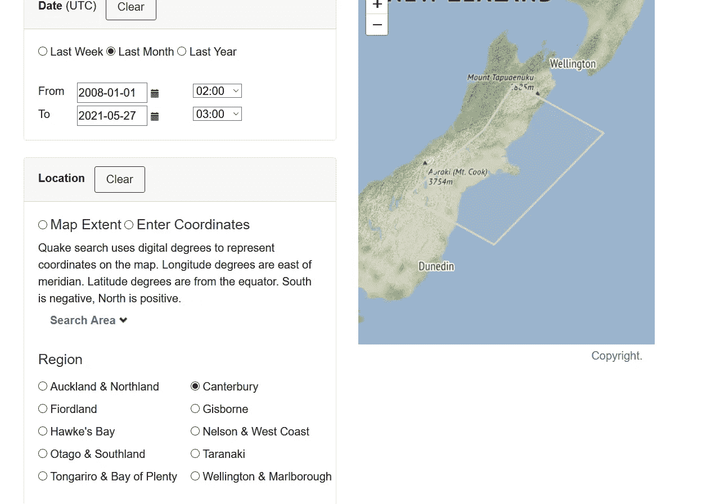

使用地震搜索过滤坎特伯雷地震

这提供了一个 CSV 文件的下载链接，其示例内容如下所示:

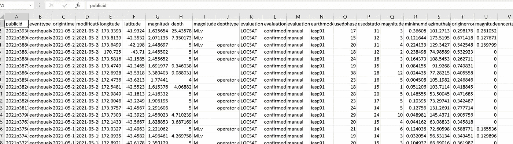

这么多地震

上传数据

点击开普勒上的“开始”会将你带到[这个页面](https://kepler.gl/demo)，它允许你加载可视化数据。这是我们加载 CSV 文件的地方:

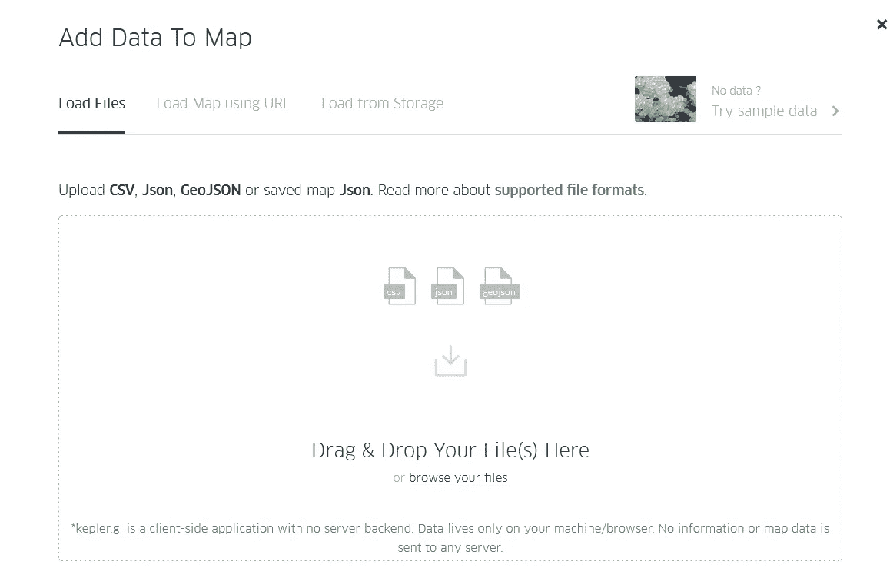

数据存取时间

请注意，这一切都发生在客户端——你的数据没有被共享——他们很小心地说“加载”而不是“上传”。

现在它被载入了，你将会看到一张…加利福尼亚的地图。这有点烦人，直到你意识到数据并没有真正被使用，它只是被载入。为了做好准备，我们将地图移到新西兰，并将底图设置为卫星图，这样它就不只是一张深色地图了:

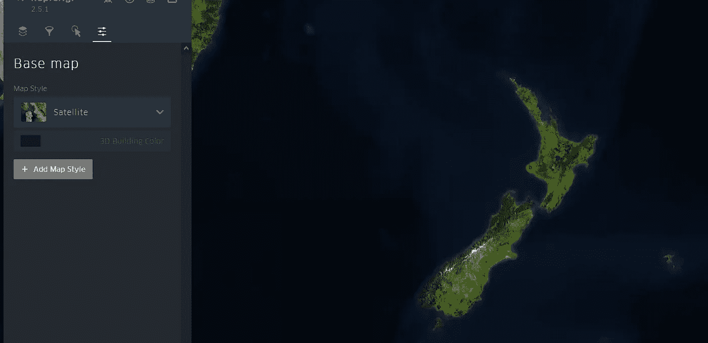

从太空监视霍比特人

在 layers 选项卡下，我们可以看到 csv 文件已加载，有 31k+行(想想看，每一行都是抖动！).

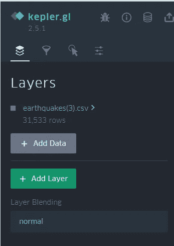

**向上分层**

在这个阶段，我们有一个地图，我们已经加载了数据，现在我们需要地图上的数据。作为一层。所以我们点击“添加图层”，给它一个名字(“shakes”)，选择一个基本点类型。Kepler GL 现在可以帮助您将 csv 文件中的字段映射到它们自己的纬度、经度和高度字段。csv 文件中的字段显示方便:

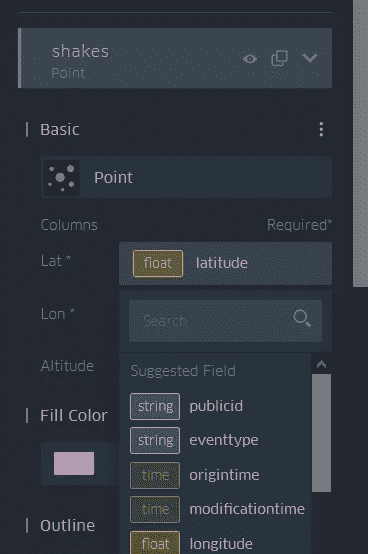

**绕道而行。**

在这一点上，你可能会注意到其他基本类型，并希望发挥。例如，hex bins 给我们提供了地震的即时热图:

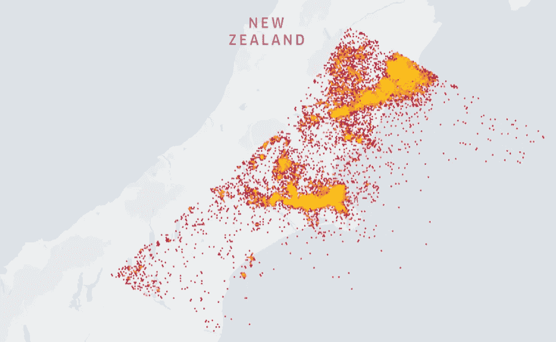

但是我们将坚持使用基本的点类型。值得注意的是，当我们看上面的图片时，它看起来像一些边界的硬线，但这是因为从 Geonet 我只要求坎特伯雷的地震，所以它们停在奥塔哥，西海岸，马尔伯勒等的边界。看到它们能在多远的海上被探测到也很酷！

回到要点，看起来简单一点:

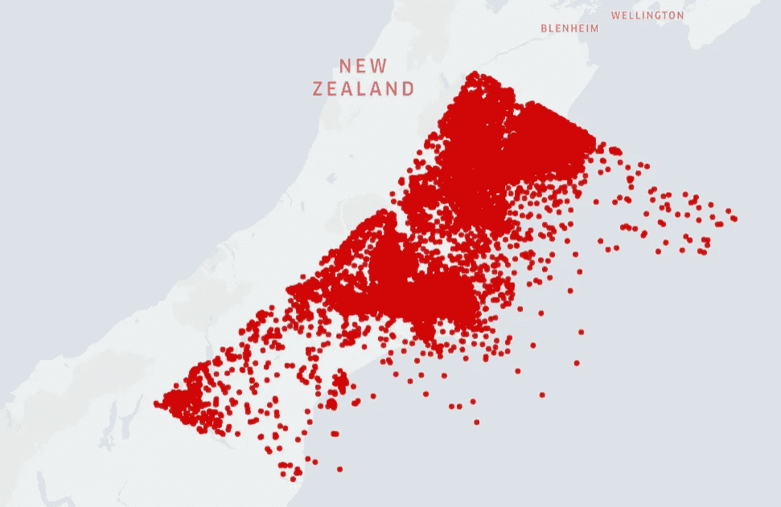

**时间到了！**

太好了！但是这并没有真正告诉我们它是什么时候发生的，只是…在哪里发生的。所以我们需要时间。这就是“过滤器”的用武之地。在“过滤器”下添加一个过滤器，选择“起始时间”,然后……哇，现在我们有一个时间线了！

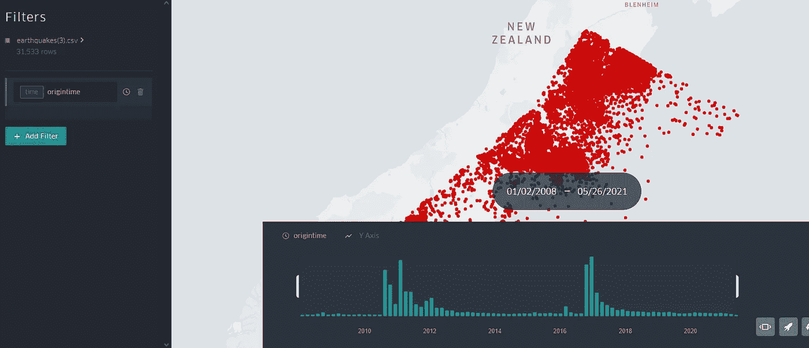

即使在这一点上，这两个大事件在时间轴上非常明显

你可以清楚地看到主要事件的时间顺序，随着时间的推移余震逐渐减弱。

**穿越时间**

这很棒，如果你看时间线，你可以看到两个条形。您可以移动它们来设置时间窗宽度:

然后点击播放，看看它的动画播放时间！

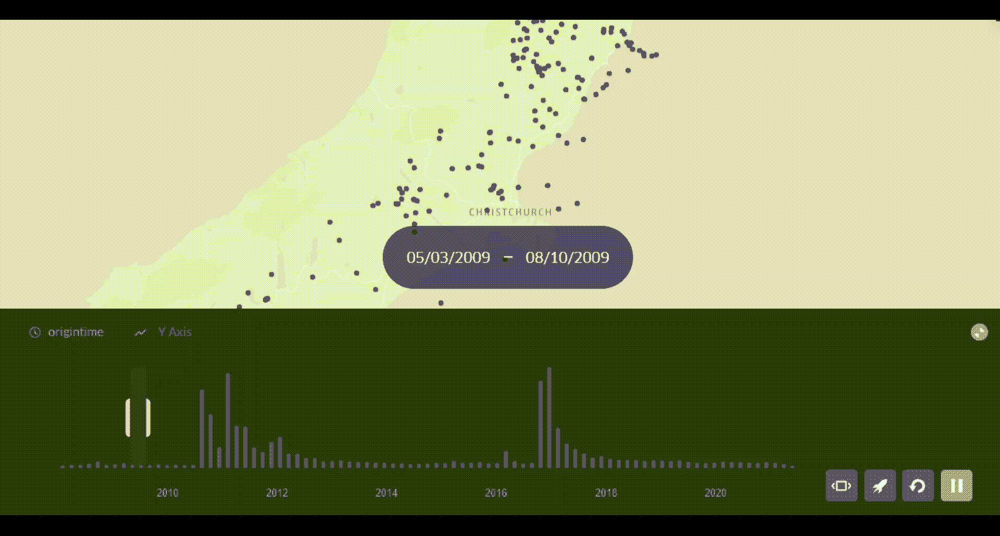

很酷，但是很难区分地震。哪一次是九月的“大”地震？凯库拉游泳从哪里开始？

**基于幅度的着色**

这就是点的自定义特性发挥作用的地方。您可以指定要基于某个场改变的颜色—为此，我将选择“幅度”,并基于该场调整半径，尽管由于种类繁多(一些“大”抖动太深而无法感觉)，我将在此使用 magnitude 类型:

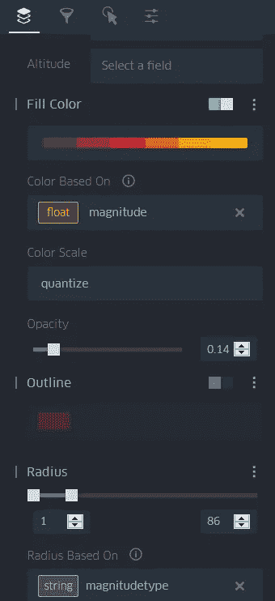

哦，颜色！

是时候再次点击 play 并看看它看起来怎么样了！

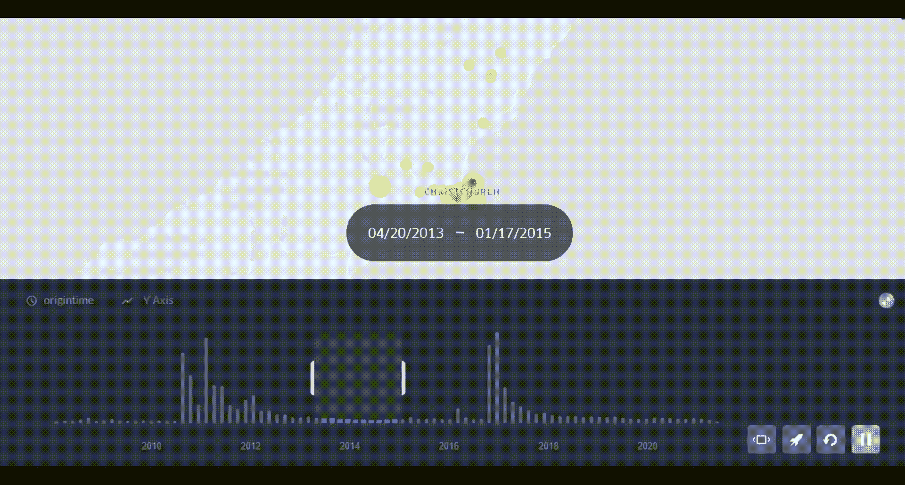

动画，带有颜色和相对半径调整

现在我们有了。整个过程花了我几个小时，因为我在玩所有的设置和写这个。但是，如果你知道你在做什么，你可以在 5 分钟内将 10 年的地震数据制作成动画，而且做起来很棒！

**最终想法**

这是一个强大的平台，我才刚刚开始使用，但美丽的数据有太多的机会轻松清晰地显示大量信息。例如，看看英格兰和威尔士通勤的弧形图:

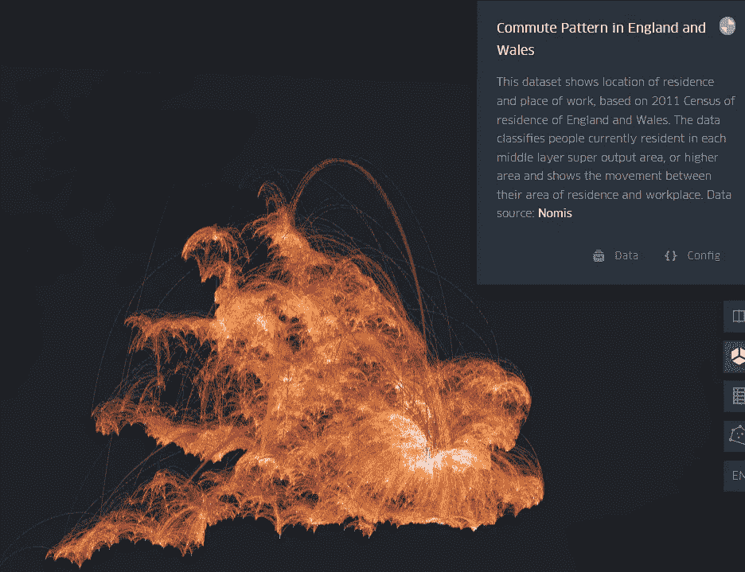

如果你的城市/城镇的议会像我的一样，他们可能有一些公共数据就在那里，等待被可视化。为什么现在不试一试呢？

*注:作者与开普勒 GL 或 GeoNet 没有关联，但确实非常欣赏它们的内容。*