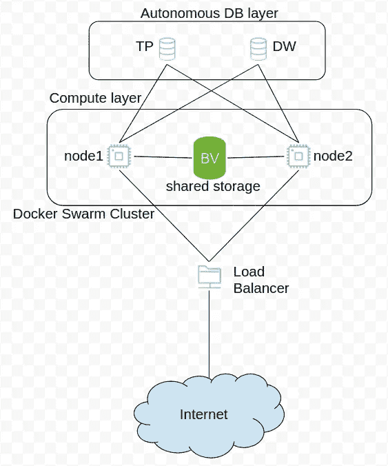
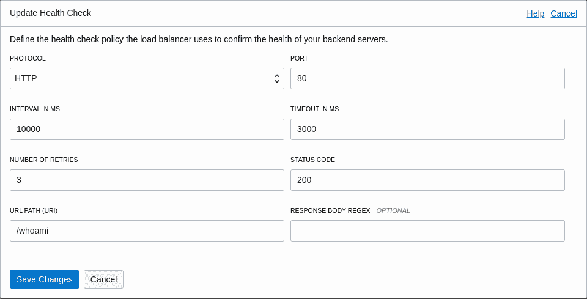
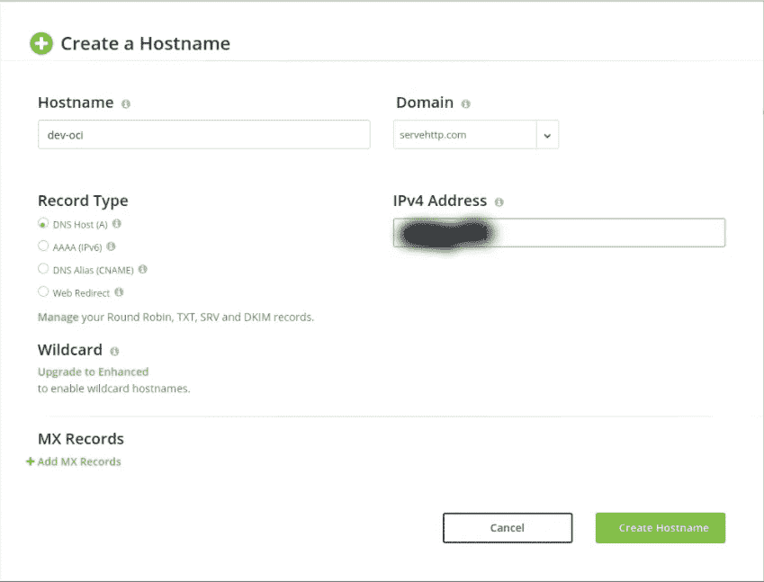
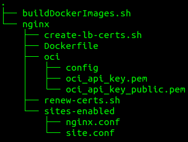
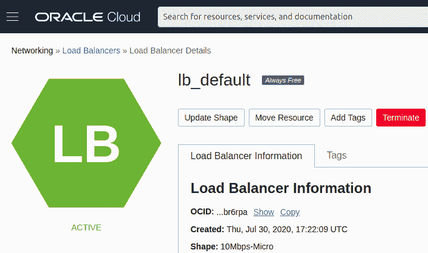
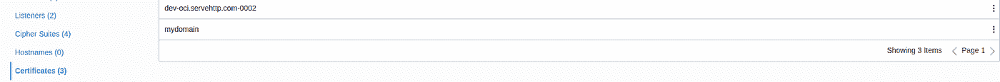
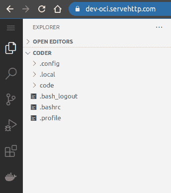
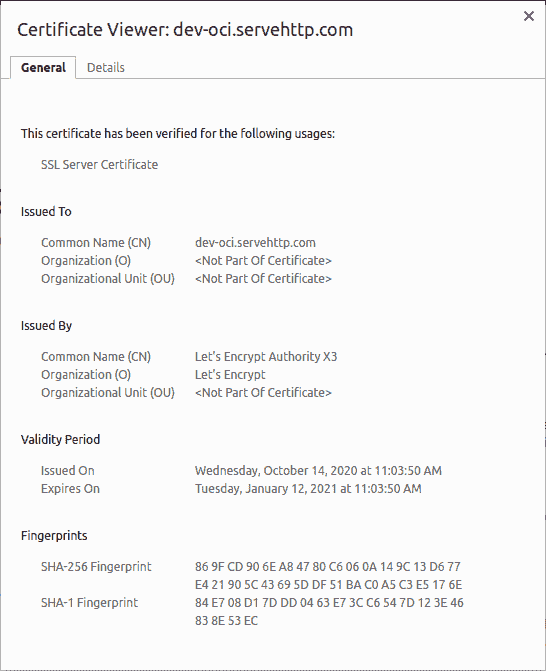
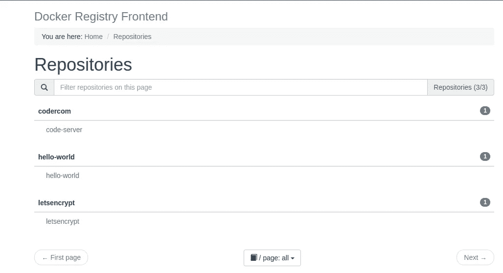

# 使用 Oracle 云负载平衡器加密证书—包括自动续订功能

> 原文：<https://itnext.io/using-lets-encrypt-certs-with-oracle-cloud-load-balancer-including-auto-renew-feature-7ae87e6d207b?source=collection_archive---------1----------------------->

Oracle Cloud free tier 包括一个高达 10 Mpbs 带宽的负载平衡器，足以用于许多项目，本文展示了如何使用使用[加密的 SSL 流量让我们来加密](https://letsencrypt.org/)免费证书。


由[马库斯·斯皮斯克](https://unsplash.com/@markusspiske?utm_source=medium&utm_medium=referral)在 [Unsplash](https://unsplash.com?utm_source=medium&utm_medium=referral) 上拍摄的照片

继续我的文章[我自己的开发/测试云环境使用 Oracle Always Free instances](/my-own-dev-test-cloud-environment-using-oracle-always-free-instances-598695cc3a10) 我将扩展它以使用让我们用自动更新特性加密证书，因为这些证书的有效期为 3 个月，我想自动更新它们。下图描述了部署图:



集群部署图

与我之前的例子不同，现在我没有使用 ***NGINX*** 作为我的应用程序的反向代理，而是使用[***trae fik***](https://doc.traefik.io/)，因为它允许使用群标签即时发布。

***Traefik*** 包含了注册 [LetsEncrypt 证书](https://doc.traefik.io/traefik/https/acme/)的功能，但是由于[让我们加密 CertBot 包含了](https://certbot.eff.org/docs/using.html#pre-and-post-validation-hooks)，所以使用包含 [NGNIX 和 CertBot](https://www.nginx.com/blog/using-free-ssltls-certificates-from-lets-encrypt-with-nginx/) 的新 Docker 容器就足够了。

# 配置 Traefik 反向代理

让我们首先配置 Traefik 反向代理，使用这个堆栈定义[docker-compose-traefik . yml](https://gist.githubusercontent.com/marcelo-ochoa/d86ccd025f97370888eb399534dd304b/raw/5c373f51596a9bfc279fb361983e8798e2dcbac4/docker-compose-traefik.yml)首先创建一个外部网络，用于通信反向代理和 trae fik 公开的内部服务，然后部署 de stack。

```
$ docker network create -d overlay lb_network
$ docker stack deploy -c docker-compose-traefik.yml traefik
```

> 我们在这个堆栈中包含了一个 whoami 服务，用于配置 Oracle 云负载平衡器后端集更新健康检查(网络->负载平衡器->负载平衡器详细信息->后端集->后端集详细信息)。



后端运行状况检查设置

一旦我们配置了负载平衡器，并且后端集将流量转发到 Traefik 实例(复制的),我们就需要一个与负载平衡器关联的公共 DNS 条目，例如，使用 NoIP 免费服务，我们可以将 A 条目定义为:



现在，我们已经准备好创建并注册一个与 Oracle 云负载平衡器相关联的加密证书。

# 使用 CertBot、NGINX 和 OCI 客户端的 Docker 映像

创建 Let's Encrypt 证书并将其与 Oracle 云负载平衡器关联的步骤是使用 Docker 容器实现的，该容器运行在我们的两个节点群集群之一中。这里是一个建立我们 Docker 形象的项目结构:



Docker 图像项目结构

一个 [Dockerfile](https://gist.githubusercontent.com/marcelo-ochoa/27c3cb2c5bf3ea30eb0a350137191eff/raw/b2e3ea25c2cd1183e189e8a37b65143c0e203747/Dockerfile) 为我们的映像将包括 NGINX，让我们加密 CertBot 和 Oracle OCI 工具，见下文:

目录 ***oci/*** 具有 ***Oracle CLI oci*** 凭证，包括 ***配置*** 、 **oci_api_key.pem** 和*OCI _ API _ key _ public . PEM*文件，如文章[从 WSL](http://www.aorcl.work/2020/01/19/administering-oci-from-wsl/) 管理 OCI 中所述，仅遵循从将 CLI 连接到您的租赁部分开始的步骤，因为所有

一旦我们准备好 docker 映像并上传到我们的 Docker 注册中心，一个 [docker-compose.yml](https://gist.githubusercontent.com/marcelo-ochoa/b68f77bd9baefb09adc9a7bcec93a485/raw/a0bd2baafb45b03bb7c05d003e792b8c1eb4873e/docker-compose-letsencrypt.yml) 文件将用于部署一个让我们加密 CertBot 堆栈:

> 我们定义了两个服务，曾经用于手动启动名为 **nginx** ， **command 的证书生成或调试目的:sleep 1d** 让我们的容器运行一天，我们可以使用 docker exec 命令附加它们。另一个名为 **renew** 的服务将用于使用 Unix crontab 的每月触发更新流程。

这两种服务都会拦截类似 [http://*/这样的网址。众所周知的/acme-challenge/](http://*/.well-known/acme-challenge/) ,让我们加密使用它们来验证我们的 DNS/IP 所有权。

环境变量***【OCID】***和 ***RENEWED_DOMAINS*** 用于定制我们的证书生成。 ***OCID*** 值可在网络- >负载平衡器- >负载平衡器详细信息(OCID 复制链接)中获得



负载平衡器详细信息

Docker 文件中定义的脚本有， [renew-certs.sh](https://gist.githubusercontent.com/marcelo-ochoa/ba12cc123d48664cbab4e95f4ea9e26b/raw/938625c7f21efc007b9172bc11e50069bb620cf2/renew-certs.sh) 调用 Let's Encrypt CertBot:

CertBot 挂钩调用 [create-lb-certs.sh](https://gist.githubusercontent.com/marcelo-ochoa/68ef2ddc248428e6cd372897ae47f2ac/raw/5222b74344395f9f709c6362e730b5731e9a803c/create-lb-certs.sh) ，这将在 Oracle 云负载平衡器上注册我们的新证书

负载平衡器证书是使用域名和序列号以唯一名称[创建的](https://docs.cloud.oracle.com/en-us/iaas/tools/oci-cli/2.7.0/oci_cli_docs/cmdref/lb/certificate/create.html)，我们不能替换或更新现有的证书定义，如果我们第一次使用 nginx 服务触发证书创建，控制台输出将如下所示:

```
[opc@node2 ~]$ docker exec -ti ***letsencrypt_nginx.1.xz8ifbsorfkn35fsob4nuk022*** bashroot@ffb330d973fb:/opt/letsencrypt# /renew-certs.sh
Saving debug log to /var/log/letsencrypt/letsencrypt.log
Plugins selected: Authenticator webroot, Installer None
Renewing an existing certificate
Running post-hook command: ***/create-lb-certs.sh***
Output from post-hook command create-lb-certs.sh:
dev-oci.servehttp.com-0002
{
"opc-work-request-id": "ocid1.loadbalancerworkrequest.oc1.iad......."
}
{
"opc-work-request-id": "ocid1.loadbalancerworkrequest.oc1.iad......."
}
IMPORTANT NOTES:
- Congratulations! Your certificate and chain have been saved at:
/etc/letsencrypt/live/dev-oci.servehttp.com/fullchain.pem
Your key file has been saved at:
/etc/letsencrypt/live/dev-oci.servehttp.com/privkey.pem
Your cert will expire on 2021-01-12\. To obtain a new or tweaked version of this certificate in the future, simply run letsencrypt-auto again. To non-interactively renew *all* of your certificates, run "letsencrypt-auto renew"
- If you like Certbot, please consider supporting our work by:
Donating to ISRG / Let's Encrypt:   [https://letsencrypt.org/donate](https://letsencrypt.org/donate)
Donating to EFF:                    [https://eff.org/donate-le](https://eff.org/donate-le)
```

一旦注册了新证书，第二步是更新侦听器定义。我们可以通过访问网络->负载平衡器->负载平衡器详细信息->证书控制台来检查这些步骤:



证书列表

至此，Oracle 云负载平衡器已准备好使用有效的 LetsEncrypt 证书接受 SSL 流量，我们可以通过点击挂锁图标来测试使用 Traefik 公开另一个堆栈，例如 VS-Code web 版本



微软 VS-Code Web 运行在始终免费的实例中，使用加密证书进行加密



让我们加密有效证书的详细信息

最后，我们的主 Swarn 节点上的一个 ***crontab*** Unix 作业将每月触发一次更新过程，例如:

```
[root@node1 yml]# crontab -l
52 2 1 * * root docker service scale ***letsencrypt_renew=0*** && sleep 60 && docker service scale ***letsencrypt_renew=1***
```

每个月的第一天凌晨 2:52。

# 2020 年 12 月更新！！！

上述 Docker 文件将于今年 12 月停止工作，因为 GitHub repo 的 LetsEncrypt certbot 克隆将不再在几个 Linux 发行版上运行，他们建议使用官方的 LetsEncrypt Docker 映像 [certbot/certbot](https://hub.docker.com/r/certbot/certbot) ，该 Docker 映像基于 Alpine Linux，然后使用 Oracle OCI 客户端获得一个扩展映像，我根据这篇博文“[的想法创建了一个新的 Oracle 云基础架构命令行界面，使用 Docker 容器](https://blogs.oracle.com/developers/get-going-quickly-with-command-line-interface-for-oracle-cloud-infrastructure-using-docker-container)，快速入门 [Lucas Jellema](https://blogs.oracle.com/author/lucas-jellema) 。更新后的 [Dockerfile](https://gist.github.com/marcelo-ochoa/fcfc8dfdc2d920019936cb7974e64509) 看起来像:

```
$ cat certbot/requirements.txt 
oci
oci-cli
$ docker build --build-arg VERSION=v1.10.1 -t "certbot-oci:v1.10.1" ./certbot
```

[create-lb-cert.sh](https://gist.github.com/marcelo-ochoa/f126232e46c075c6ecbc4ea5ee34f060) 类似:

但是 [docker-compose.yml](https://gist.github.com/marcelo-ochoa/06c0cfb57681977296b2f4fc8ec7c47d) 通过使用宏和新的 CertBot 功能变得更加紧凑:

一些评论:

*   certbot 服务仅定义用于调试目的或首次手动创建我们的证书。
*   如上所述，每月将使用 crontab 调用续订服务
*   certbot 可以为多个域创建一个证书，在这个例子中，我使用 dev-oci.mydomain.com 作为主域，registry.mydomain.com 作为备用域，bot DNS 条目必须指向我们的负载平衡器公共 IP。
*   使用 [S3 卷驱动程序插件](https://hub.docker.com/repository/docker/mochoa/s3fs-volume-plugin)将证书存储在 Oracle 云对象存储中

如果我们要测试上述证书，使用 Traefik 作为入站流量控制器的示例注册表堆栈如下所示:

请注意，registry.mydomain.com 只映射路径前缀/v2/。

注册表 UI 前端看起来像:



注册表前端接口

测试 Docker 注册表+ Traefik

```
[root@node2 letsencrypt]# docker pull hello-world:latest
Trying to pull repository docker.io/library/hello-world ... 
latest: Pulling from docker.io/library/hello-world
0e03bdcc26d7: Pull complete 
Digest: sha256:1a523af650137b8accdaed439c17d684df61ee4d74feac151b5b337bd29e7eec
Status: Downloaded newer image for hello-world:latest
hello-world:latest
[root@node2 letsencrypt]# docker tag hello-world:latest ***registry.mydomain.com/hello-world:latest***
[root@node2 letsencrypt]# docker push ***registry.mydomain.com/hello-world:latest***
The push refers to repository [***registry.mydomain.com/hello-world***]
......
[root@node2 letsencrypt]# ***docker rmi registry.mydomain.com/hello-world:latest hello-world:latest***
Untagged: registry.mydomain.com/hello-world:latest
....
Deleted: sha256:9c27e219663c25e0f28493790cc0b88bc973ba3b1686355f221c38a36978ac63
[root@node2 letsencrypt]# docker run --rm ***registry.mydomain.com/hello-world:latest***
Unable to find image '***registry.mydomain.com/hello-world:latest***' locally
Trying to pull repository ***registry.mydomain.com/hello-world*** ... 
latest: Pulling from ***registry.mydomain.com/hello-world***
0e03bdcc26d7: Pull complete 
Digest: sha256:90659bf80b44ce6be8234e6ff90a1ac34acbeb826903b02cfa0da11c82cbc042
Status: Downloaded newer image for ***registry.mydomain.com/hello-world:latest***Hello from Docker!
This message shows that your installation appears to be working correctly.To generate this message, Docker took the following steps:
 1\. The Docker client contacted the Docker daemon.
 2\. The Docker daemon pulled the "hello-world" image from the Docker Hub.
    (amd64)
 3\. The Docker daemon created a new container from that image which runs the
    executable that produces the output you are currently reading.
 4\. The Docker daemon streamed that output to the Docker client, which sent it
    to your terminal.To try something more ambitious, you can run an Ubuntu container with:
 $ docker run -it ubuntu bashShare images, automate workflows, and more with a free Docker ID:
 [https://hub.docker.com/](https://hub.docker.com/)For more examples and ideas, visit:
 [https://docs.docker.com/get-started/](https://docs.docker.com/get-started/)
```

一切又正常了！！！