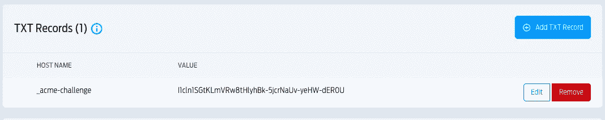
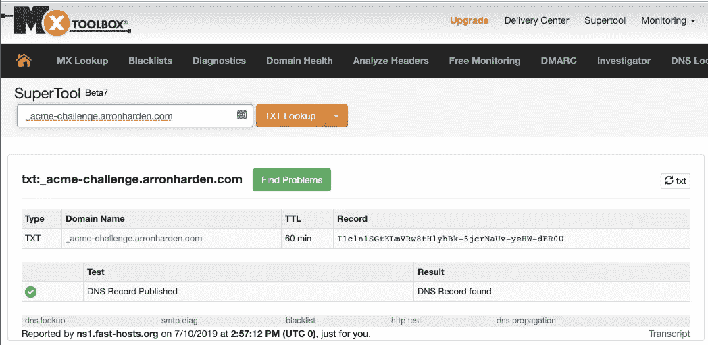
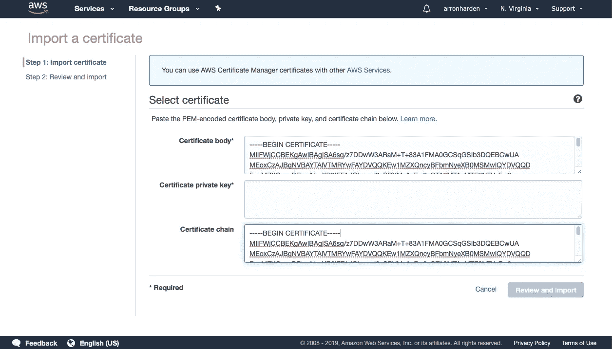
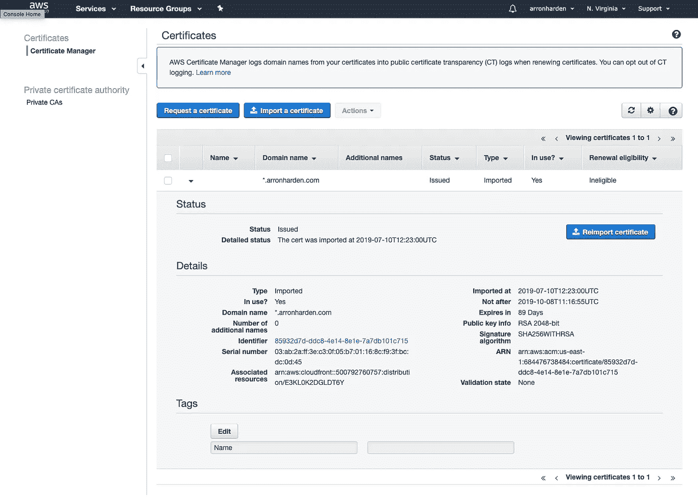
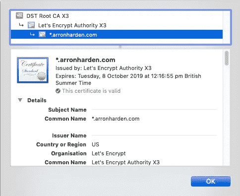

# 在 AWS 证书管理器中使用 LetsEncrypt SSL 证书

> 原文：<https://itnext.io/using-letsencrypt-ssl-certificates-in-aws-certificate-manager-c2bc3c6ae10?source=collection_archive---------0----------------------->

我最近需要为我自己的个人域创建一个 SSL 证书，这样我就可以用它来托管一个示例 AWS 应用程序，该应用程序要求您在 AWS 证书管理器中拥有一个 SSL 证书。当 SSL 证书只是临时使用时，我不想为其付费，所以我决定尝试一下 [LetsEncrypt](https://letsencrypt.org/) 解决方案(其证书是免费的，但在颁发后 3 个月到期)。

我为我的域名使用的注册商是 [FastHosts](https://www.fasthosts.co.uk/) ，由于它目前没有托管任何内容，我决定创建 SSL 证书的最便捷途径是使用 LetsEncrypt 的 *certbot* CLI 工具，在手动模式下进行 DNS 验证。

# 安装 LetsEncrypt CLI

在 MacOS 上， *brew* 安装路径对我来说是很容易的选择，我安装了 LetsEncrypt 的 *certbot* CLI 工具(参见 LetsEncrypt 文档以安装到其他 OS 上)。

```
brew install letsencrypt
```

# 生成证书

一旦安装了 LetsEncrypt，生成 SSL 证书只需运行 *certbot* CLI 工具并让它验证您是指定域的所有者。对于我的使用，我决定创建一个通配符证书，覆盖我的域的所有子域，由 CLI 的 **.arronharden.com* 选项指示。这意味着相同的证书可以用于我的根域下的任何子域。

默认情况下， *certbot* 工具需要以 root 身份运行，例如在 MacOS 上需要 *sudo* 。或者，它可以在没有 sudo 的情况下运行，并设置适当的标志来改变默认目录，这就是我在这里要做的。

```
$ mkdir ~/letsencrypt
$ cd ~/letsencrypt
$ certbot certonly \
    --manual \
    --preferred-challenges=dns \
    --email your@email-address.com \
    --agree-tos \
    --config-dir ./config \
    --logs-dir ./logs \
    --work-dir ./workdir \
    -d *.arronharden.com
```

# DNS 验证

因为我选择了 DNS 验证，这涉及到我为我的域创建一个 DNS TXT 记录——它包含一个由 *certbot* CLI 工具生成的随机字符串——以便验证我控制着那个域。当使用上述选项运行 *certbot* CLI 工具时，它将显示以下输出，并等待您为指定的域创建 DNS TXT 记录。

```
- - - - - - - - - - - - - - - - - - - - - - - - - - - - - - - - - -
Please deploy a DNS TXT record under the name
_acme-challenge.arronharden.com with the following value:I1cln1SGtKLmVRw8tHlyhBk-5jcrNaUv-yeHW-dER0UBefore continuing, verify the record is deployed.
- - - - - - - - - - - - - - - - - - - - - - - - - - - - - - - - - -
Press Enter to Continue
Waiting for verification...
```

使用我的注册商提供的管理控制台，在*高级 DNS* 部分，我能够简单地为我的*arronharden.com*域名添加一个 TXT 记录，并提供所需的值。



在 FastHosts 管理控制台中添加 DNS TXT 记录

尽管任何 DNS 更改都需要一些时间来传播到各个 DNS 系统，但对我来说这发生得非常快(几秒钟的事情)。我通过使用由 [MxToolBox](https://mxtoolbox.com/TXTLookup.aspx) 提供的查找工具，验证了该变更已经发布。



使用 MxToolBox 验证 TXT DNS 记录

一旦 TXT 记录就绪，我就可以返回到 *certbot* CLI 工具，让它继续运行。它验证了 TXT 记录与其生成的内容相匹配，并继续创建证书文件:

*   私人证书( *privkey.pem* )
*   公共证书( *cert.pem* )
*   公共证书链( *fullchain.pem* )。

# 导入 AWS 证书管理器

除了允许您购买证书，AWS 证书管理器还允许您导入现有的证书，这就是我们现在对从 LetsEncrypt 创建的证书所做的事情。

一旦 AWS 证书管理器服务被打开，并且导入过程开始，它只为相关的*保留。pem 将由 *certbot* CLI 工具创建的*文件复制并粘贴到下面的相关字段中。



将证书导入 AWS 证书管理器

*需要注意的重要一点是，一些 AWS 服务(例如 AWS Cognito)将始终在美国东部(N. Virginia)地区寻找证书，即使服务本身是从不同的地区使用的。如果没有列出您的证书，请尝试使用美国东部地区导入证书。*

成功导入证书后，您可以查看证书详细信息，并在 AWS 服务中引用该证书。



AWS 证书管理器中的证书详细信息

最后，一旦在应用程序中使用，您可以验证证书是否被浏览器接受以及是否与您期望的细节相匹配。



arronharden.com 子域中托管的应用程序的浏览器(Chrome)证书详细信息