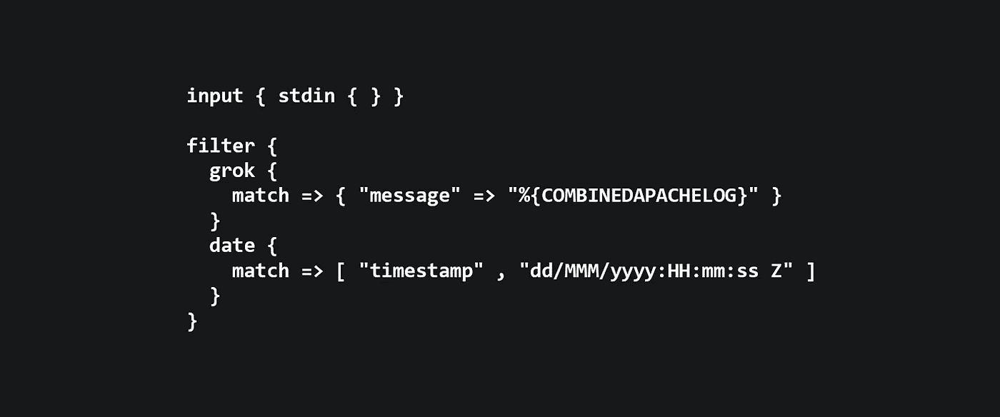

# 对卡夫卡使用 logstash

> 原文：<https://itnext.io/using-logstash-with-kafka-c1e2f32af2eb?source=collection_archive---------1----------------------->



我通常使用 kafka connect 向 kafka 发送/获取数据。

但是我最近为 Logstash 找到了两个新的输入插件和输出插件，用来连接 logstash 和 kafka。和许多过滤插件一样，它也很有用。

所以这意味着，对于某些事情，你需要更多的模块化或更多的过滤，你可以使用 logstash 而不是 kafka-connect。

例如，如果您有一个编写 syslog 文件应用程序，您希望解析它并以 json 格式发送。

```
input { stdin { } }

filter {
  grok {
    match => { "message" => "%{COMBINEDAPACHELOG}" }
  }
  date {
    match => [ "timestamp" , "dd/MMM/yyyy:HH:mm:ss Z" ]
  }
}

output {
  kafka { 
    bootstrap_servers => "kafka"
    codec => json{}
    topic_id =>  "my-topic"
  }
}
```

在这个例子中:我使用 stdin(这更容易测试)，但是你可以使用一个文件或者 logstash 的插件允许你使用的任何东西。

如果在输入中我有:

```
127.0.0.1 - - [11/Dec/2013:00:01:45 -0800] "GET /xampp/status.php HTTP/1.1" 200 3891 "http://cadenza/xampp/navi.php" "Mozilla/5.0 (Macintosh; Intel Mac OS X 10.9; rv:25.0) Gecko/20100101 Firefox/25.0"
```

kafka 中的输出将是 json 中的对象:

```
{
        "message" : "127.0.0.1 - - [11/Dec/2013:00:01:45 -0800] \"GET /xampp/status.php HTTP/1.1\" 200 3891 \"http://cadenza/xampp/navi.php\" \"Mozilla/5.0 (Macintosh; Intel Mac OS X 10.9; rv:25.0) Gecko/20100101 Firefox/25.0\"",
     "@timestamp" : "2013-12-11T08:01:45.000Z",
       "@version" : "1",
           "host" : "cadenza",
       "clientip" : "127.0.0.1",
          "ident" : "-",
           "auth" : "-",
      "timestamp" : "11/Dec/2013:00:01:45 -0800",
           "verb" : "GET",
        "request" : "/xampp/status.php",
    "httpversion" : "1.1",
       "response" : "200",
          "bytes" : "3891",
       "referrer" : "\"http://cadenza/xampp/navi.php\"",
          "agent" : "\"Mozilla/5.0 (Macintosh; Intel Mac OS X 10.9; rv:25.0) Gecko/20100101 Firefox/25.0\""
}
```

## 链接:

[](https://www.elastic.co/guide/en/logstash/current/plugins-inputs-kafka.html) [## Kafka 输入插件| Logstash 参考[6.2] |弹性

### 默认情况下，Logstash 实例形成一个逻辑组来订阅 Kafka 主题，每个 Logstash Kafka 消费者都可以…

www.elastic.co](https://www.elastic.co/guide/en/logstash/current/plugins-inputs-kafka.html) [](https://www.elastic.co/guide/en/logstash/current/plugins-outputs-kafka.html) [## Kafka 输出插件| Logstash 参考[6.2] |弹性

### Logstash Reference [6.2]“输出插件”Kafka 输出插件

www.elastic.co](https://www.elastic.co/guide/en/logstash/current/plugins-outputs-kafka.html) [](https://www.elastic.co/guide/en/logstash/current/config-examples.html) [## Logstash 配置示例| Logstash 参考[6.2] |弹性

### 以下示例说明了如何配置 Logstash 来过滤事件、处理 Apache 日志和 syslog…

www.elastic.co](https://www.elastic.co/guide/en/logstash/current/config-examples.html)