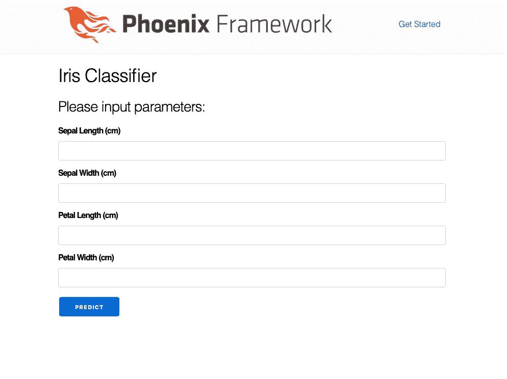

# 使用来自 Phoenix (Elixir)应用程序的 Python 训练的机器学习模型

> 原文：<https://itnext.io/using-machine-learning-models-python-from-phoenix-elixir-applications-cd028e4e5f01?source=collection_archive---------2----------------------->

Python 是机器学习和数据科学事实上的语言。Python 中有许多用于此目的的库和框架。另一方面，Elixir 相对较新，在 Elixir 中进行机器学习仍然不容易。在本文中，我将介绍我们如何使用一个机器学习模型，该模型是使用 Phoenix (Elixir) web 应用程序中的 Python 训练的。由于流程保持不变，因此不一定必须是 web 应用程序。任何 Elixir 应用程序都可以使用类似的方法，并使用预先训练好的 Python ML 模型。

# 埃尔波特:秘制调味酱

我将使用[erport](http://erlport.org)来建立 Python 和 Elixir 之间的通信通道。

ErlPort 是一个用于 Erlang 的库，它帮助 Erlang 连接到许多其他编程语言。目前支持的外部语言有 Python 和 Ruby。该库使用 [*Erlang 端口协议*](http://erlang.org/doc/reference_manual/ports.html) *来简化语言之间的连接，并使用 Erlang 外部术语格式来设置通用数据类型映射*

要详细了解 ErlPort 以及它如何为 Python 工作，我建议阅读官方文档[这里](http://erlport.org/docs/)和[这里](http://erlport.org/docs/python.html)。

总而言之，

— ErlPort 使用库函数 **start/0** 或 **start/1** 创建 Python 语言的实例

—一旦创建了语言实例，就可以使用函数 **call/4(同步)**或 **cast/2(异步)**来调用 Python 函数并将结果传回给调用者。

—会话结束时，调用 **stop/1** 函数终止语言实例

Erlang 和 Python 之间的数据类型映射在这里以表格形式呈现—[http://erlport.org/docs/python.html](http://erlport.org/docs/python.html)。也可以使用提供定制编码器/解码器的定制数据类型。

在本文中，我将从这里使用 ErlPort 十六进制模块—[https://hex.pm/packages/erlport](https://hex.pm/packages/erlport)

# 训练 ML 模型

早些时候我写过一篇文章——“使用 Scikit 训练自己的 ML 模型，并在 iOS 应用中使用 CoreML(可能还有增强现实) ”。由于本文的重点是我们如何使用来自 Elixir app 的预训练模型，我将在这里使用在那篇文章中训练的相同模型。鼓励有兴趣了解机器学习部分的读者阅读这篇文章。因为我们在这里不会使用 CoreML 模型，所以培训的最后一部分已经做了一些小的修改，使用' **joblib** '而不是 CoreML 将模型保存为 pickle 格式。

完整的 Jupyter 笔记本( **iris-analysis.ipynb** )可在此处获得—[https://github . com/imeraj/Phoenix _ Playground/blob/master/1.4/Phoenix _ ml/lib/Phoenix _ ml/model/iris-analysis . ipynb](https://github.com/imeraj/Phoenix_Playground/blob/master/1.4/phoenix_ml/lib/phoenix_ml/model/iris-analysis.ipynb)

包含训练数据的 CSV 文件( **iris-data.csv** )可在此处获得—[https://github . com/imeraj/Phoenix _ Playground/blob/master/1.4/Phoenix _ ml/lib/Phoenix _ ml/model/iris-data . CSV](https://github.com/imeraj/Phoenix_Playground/blob/master/1.4/phoenix_ml/lib/phoenix_ml/model/iris-data.csv)

生成的 ML 模型保存在文件( **classifier.pkl** )中，可在此处获得—[https://github . com/imeraj/Phoenix _ Playground/blob/master/1.4/Phoenix _ ML/lib/Phoenix _ ML/model/classifier . pkl](https://github.com/imeraj/Phoenix_Playground/blob/master/1.4/phoenix_ml/lib/phoenix_ml/model/classifier.pkl)

凤凰 app ( **phoenix_ml** )的完整源代码在这里——[https://github . com/imeraj/Phoenix _ Playground/tree/master/1.4/Phoenix _ ml](https://github.com/imeraj/Phoenix_Playground/tree/master/1.4/phoenix_ml)

## 注意:请注意，我已经将 Jupyter 笔记本、CSV 文件和生成的模型放在了同一源代码库中，这只是为了本文的目的。实际上，您的应用程序代码和 ML 代码可以存储在不同的位置。我们所需要的只是从我们的 web 应用程序访问训练好的模型文件“ **classifier.pkl** ”。

# 从 Phoenix(Elixir) Web 应用程序访问 ML 模型

在这一节中，我将把重点放在应用程序方面，并遍历必要的代码。

我生成了一个没有 ecto 的简单的 Phoenix 1.4 应用程序，并在 **mix.exs** 中添加了 ErlPort 作为依赖项

```
defp deps do
    [
      {:phoenix, "~> 1.4.0"},
      {:phoenix_pubsub, "~> 1.1"},
      {:phoenix_html, "~> 2.11"},
      {:phoenix_live_reload, "~> 1.2", only: :dev},
      {:gettext, "~> 0.11"},
      {:jason, "~> 1.0"},
      {:plug_cowboy, "~> 2.0"},
      **{:erlport, "~> 0.10.0"}**
    ]
  end
```

在 **router.ex** 中增加了一条新路线——

```
scope "/", PhoenixMlWeb do
    pipe_through :browser

    get "/", PageController, :index
    post "/predict", PageController, :show
  end
```

修改了 UI 代码(**templates/page/{ form . html . eex，index.html.eex}** )，最终的 UI 如下所示



“**秀”**的控制器代码非常简单，如下所示

```
def show(conn, %{
        "sepal_length" => sepal_length,
        "sepal_width" => sepal_width,
        "petal_length" => petal_length,
        "petal_width" => petal_width
      }) do
    with {sepal_length, _} <- Float.parse(sepal_length),
         {sepal_width, _} <- Float.parse(sepal_width),
         {petal_length, _} <- Float.parse(petal_length),
         {petal_width, _} <- Float.parse(petal_width) do
      **class = ML.predict([[sepal_length, sepal_width, petal_length, petal_width]])** 
      conn
      |> put_flash(:info, "Predicted class: " <> class)
      |> render("index.html")
    else
      _error ->
        conn
        |> put_flash(:error, "Invalid parameters!")
        |> render("index.html")
    end
  end
```

在这里，控制器接受输入参数并将其解析为浮点型。解析成功后，调用 **ML.predict** 来生成预测的类。我们的大部分逻辑驻留在 **ML.predict** 中。

## 做预测

读取模型和进行预测的主要部分是在 Python 代码(**lib/phoenix _ ml/model/classifier . py**)中完成的

```
import os
from sklearn.externals import joblib 

def load_model():
    path = os.path.abspath('lib/phoenix_ml/model/classifier.pkl')
    return joblib.load(path)  

def predict_model(args):
    iris_classifier = load_model()
    return iris_classifier.predict([args])[0]
```

**predict_model** 函数从' **classifier.pkl** 中加载模型，调用 **predict** 函数传递必要的参数并返回结果。( ***关于【args】部分我后面会再讲*** )

在 **lib/phoenix_ml/helpers** 里面有两个文件——**model _ predictor . ex**和 **python_helper.ex** 。

现在让我解释一下这部分代码。

```
defmodule PhoenixMl.ModelPredictor do
  @moduledoc false

  alias PhoenixMl.PythonHelper, as: Helper

  @path 'lib/phoenix_ml/model/'

  def predict(args) do
    **call_python(:classifier, :predict_model, args)**
  end

  defp call_python(module, func, args) do
    **pid = Helper.py_instance(Path.absname(@path))**
    **result = Helper.py_call(pid, module, func, args)**

    **pid
    |> Helper.py_stop()**

    result
  end
end
```

这里—

— **预测**函数调用 **call_python** 带模块(:**分类器**)、函数(:**预测 _ 模型**)和参数( **args** )

— **call_python** 函数使用驻留在 **python_helper.ex** 中的助手函数与 python 模块通信

```
defmodule PhoenixMl.PythonHelper do
  @moduledoc false

  def py_instance(path) when is_binary(path) do
    {:ok, pid} = :python.start([{:python_path, to_charlist(path)}])
    pid
  end

  def py_call(pid, module, func, args \\ []) do
    pid
    |> :python.call(module, func, args)
  end

  def py_stop(pid) do
    :python.stop(pid)
  end
end
```

这里—

— **py_instance** :使用 Python 模块(:**分类器**)创建 Python 实例

— **py_call** :使用 **args** 作为参数，同步调用 Python 模块的 **predict_model** 函数

— **py_stop** :终止 Python 实例

在这个阶段，我们准备做预测。下面的屏幕截图显示了输入参数和相应的预测类—


做出预测

## 最后一件事

我想多说一点关于已通过的论点。

从**控制器**，我传递参数— [[5.5，2.4，3.7，1.0]]

这转到 **ML。预测**函数为— [[5.5，2.4，3.7，1.0]]

**py_call** 接收该参数并调用— **predict_model** 函数，将参数作为[5.5，2.4，3.7，1.0]传递，因为 ErlPort 将分隔每个参数(它接受一个参数列表)

但是 SKLean 希望用一个二维数组来进行预测。因此，当我调用**iris _ classifier . predict([args])时，**我必须再次创建一个二维数组，这样最终参数就变成了— [[5.5，2.4，3.7，1.0]]

# 参考

1.  [https://hex.pm/packages/erlport](https://hex.pm/packages/erlport)
2.  http://erlport.org
3.  【http://erlport.org/docs/ 
4.  [http://erlport.org/docs/python.html](http://erlport.org/docs/python.html)
5.  [https://hacker noon . com/mixing-python-with-elixir-7a 2 b 7 AC 6696](https://hackernoon.com/mixing-python-with-elixir-7a2b7ac6696)

我希望这篇文章能帮助一些读者理解如何使用来自 Phoenix(Elixir)应用程序的用 Python 训练的机器学习模型。然而，ErlPort 并不是与来自 Elixir 的 Python 代码进行通信的唯一方式。还有其他项目，如用于跨语言服务开发的[**Apache Thrift**](https://thrift.apache.org)**。感兴趣的读者被敦促寻找替代解决方案。**

***更多详细和深入的未来技术帖子，请关注我这里或*[*Twitter*](https://twitter.com/meraj_enigma)*。***