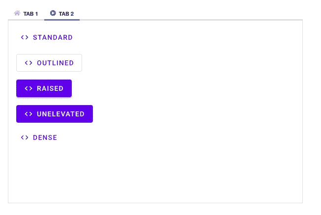
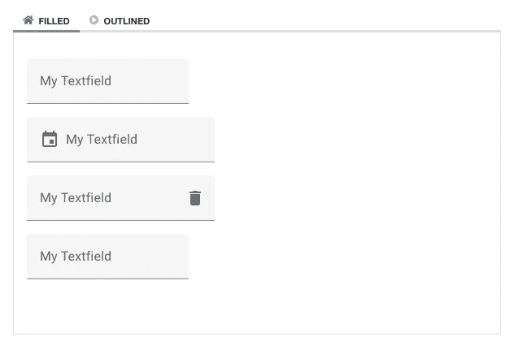
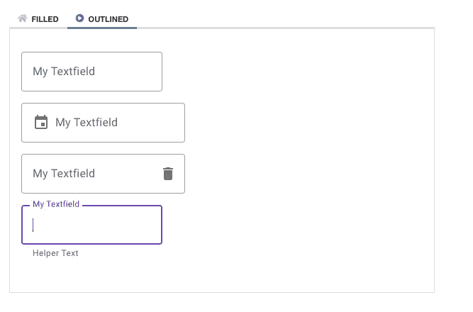
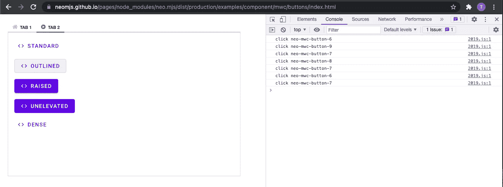
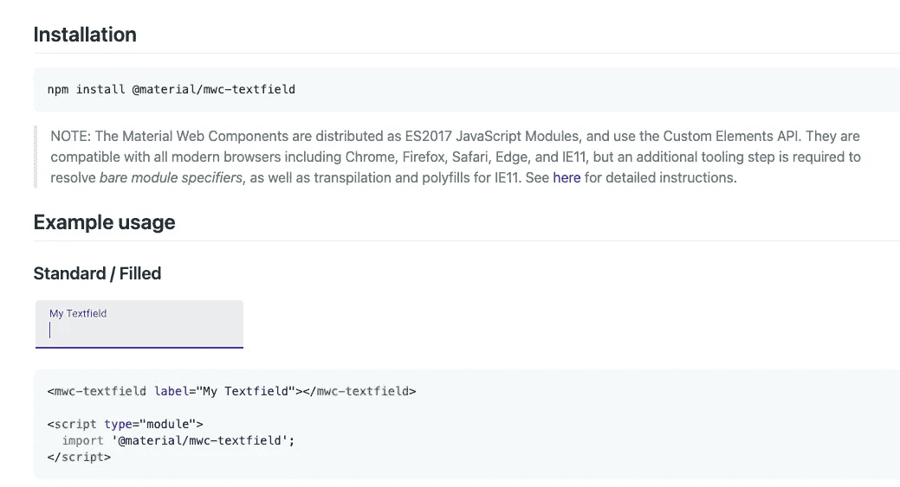

# 在 neo.mjs 应用程序工作器中使用材料 Web 组件

> 原文：<https://itnext.io/using-material-web-components-within-the-neo-mjs-application-worker-50d3790ea48?source=collection_archive---------1----------------------->

[neo.mjs](https://github.com/neomjs/neo) JavaScript 前端 UI 框架围绕着“应用工作者是主角”的概念。


因为你的应用程序，包括你的组件，存在于应用程序[工作器](https://developer.mozilla.org/en-US/docs/Web/API/Worker)中，一个经常出现的问题是:

“我们可以在 neo 应用程序中使用外部 Web 组件吗？”

每个 UI 框架或库的主要目标都是动态操作 DOM，所以答案是肯定的。

# 内容

1.  介绍
2.  简单的方法
3.  创建包装组件
4.  我们如何获得按钮的点击事件？
5.  我们如何包含依赖项(库)？
6.  我们如何尊重不同的环境？
7.  创建 textfield 包装
8.  演示视频
9.  源代码
10.  在线演示
11.  使用 Web 组件有意义吗？
12.  最后的想法

# 1.介绍

我正在使用谷歌的材料网络组件:

[](https://github.com/material-components/material-web) [## GitHub -材料-组件/材料-web:材料设计 web 组件

### 材料设计 Web 组件。通过创建一个关于…的帐户，为材料组件/材料网络的发展做出贡献

github.com](https://github.com/material-components/material-web) 

它们仍然是版本 1 (v0.22.1)之前的版本，所以 API 可能会有一些变化。

不过，我们将要深入的概念适用于任何类型的 web 组件。

对于本文，我为 button 和 textfield 组件创建了包装器，我们可以将它们放入 neo.mjs 组件树中:



# 2.简单的方法

组件。Base 有一个 vdom(虚拟 dom)配置，我们可以随意定制。我们可以将组件放入容器的项目配置中:

虽然这在包含主线程依赖项(libs)的情况下已经很好了，但是动态地更改 vdom 属性或调用我们的 web 组件实例上的方法并不容易，这些实例位于主线程内部。

# 3.创建包装组件

更聪明的方法是创建一个新的 neo 组件类:
[src/component/mwc/button . mjs](https://github.com/neomjs/neo/blob/dev/src/component/mwc/Button.mjs)

我们使用配置系统将定制类配置(字段)映射到 web 组件 DOM 属性:

例如，如果我们正在定义一个`label_`配置，我们可以选择使用:

`beforeGetLabel(value)`

`beforeSetLabel(value, oldValue)`

`afterSetLabel(value, oldValue)`

组件。基地已经有了`changeVdomRootKey()`的方法，所以我们需要做的就是:

```
*/**
 * Triggered after the label config got changed.
 ** ***@param*** *{String} value
 ** ***@param*** *{String} oldValue
 ** ***@protected*** **/* afterSetLabel(value, oldValue) {
    this.changeVdomRootKey('label', value);
}
```

现在，我们可以在创建新实例时直接使用我们的配置:

我们也可以在运行时动态地改变我们的配置:

```
const myButton = Neo.create(MwcButton, {
    label: 'foo'
});myButton.label = 'bar';myButton.set({
    icon : 'edit',
    label: 'baz'
});
```

如果你想一次改变多个配置，使用`set()`是个好办法，因为这只会触发虚拟 DOM 引擎一次。

# 4.我们如何获得按钮的点击事件？

我们的 neo 组件包装器位于应用程序工作器中，而我们的 web 组件位于主线程中。

```
afterSetHandler(value, oldValue) {
    if (value) {
        let me           = this,
            domListeners = me.domListeners;

        domListeners.push({click: value, scope: me});
        me.domListeners = domListeners;
    }
}
```

我们可以使用组件。基本的`domListeners`配置并添加一个点击监听器。

**引擎盖下**(不要求遵循文章)

这个将在`manager.DomEvents`中注册，它也位于 app worker 范围内。

默认情况下，点击事件是全局的(一个监听器连接到`document.body`，但是如果需要，我们可以添加一个`local: true`配置。

每个组件都有一个惟一的 id，它也将应用于 DOM，所以框架可以匹配它们。

如果点击事件发生在主线程内部，一个 [postMessage](https://developer.mozilla.org/en-US/docs/Web/API/Worker/postMessage) 将被发送到应用工作器。`manager.DomEvents`现在可以匹配组件的 DOM 路径并相应地触发事件

**发动机罩下的末端**

我们现在可以简单地使用我们的处理程序配置:

```
handler: data => ***console***.log('click', data.component.id)
```



# 5.我们如何包含依赖项(库)？

一种方法是将脚本标签添加到应用程序的 index.html 文件中，因为 web 组件必须位于一个主线程中。

不过这并不是很好，因为我们希望在真正需要的时候延迟加载依赖项，并且我们希望每个环境有不同的版本。

所以，我们确实想创建一个新的主线程插件:
[src/main/addon/mwc . mjs](https://github.com/neomjs/neo/blob/dev/src/main/addon/Mwc.mjs)

我们可以在我们的`neo-config.json`文件中包含主线程插件:

您可能已经注意到了我们的按钮类中的`constructor`:

第一个 ctor 调用将加载我们的谷歌 MWC 依赖异步，我们设置好了。

# 6.我们如何尊重不同的环境？

这是我花了大部分时间处理的棘手部分。

[](https://github.com/material-components/material-web/tree/master/packages/textfield) [## 材料-网络/包/主材料的文本字段-组件/材料-网络

### 重要提示:材料 Web 组件仍在开发中，在 1.0 版本发布之前可能会有重大更改。文本…

github.com](https://github.com/material-components/material-web/tree/master/packages/textfield) 

谷歌已经基于 ES2017 实现了他们的 Web 组件，这很好。

**！！！但是！！！他们正在使用裸模块说明符，这真令人失望。**

含义:导入语句是以浏览器无法理解的格式编写的。

```
import {TextAreaCharCounter} from './mwc-textfield-base';
```

它大多只是缺少文件扩展名，有时没有真正的路径。

如果您回头看看索引文件:我从 CDN 添加了模块，在这种情况下，所有“错误的”导入路径都被替换为 URL。

这种方法在没有任何构建/转换的浏览器中工作得非常好，这意味着:除了不完整的导入语句，代码是可以运行的。

我将很快创建一个功能请求。

在 neo.mjs 中，我们有 3 个不同的环境:

1.  **开发**
    直接在浏览器中运行，无需任何构建或编译
2.  **dist/development**
    [基于 Webpack](https://github.com/webpack/webpack) 使用源地图构建(这就是你在 Angular 或 React 中所说的开发模式)
3.  **分销/生产**
    基于缩小的 webpack 构建，不使用源地图

显然，我们希望以最好的方式支持所有 3 个 env。现在让我们来看看插件的主线:

对于我们的 dev env，我们必须坚持使用 CDN。如果有 JS 模块驱动的输出，那就更好了。对于第一次页面加载，通过 CDN 加载库可能需要几秒钟的时间。

我们确实需要告诉 webpack 忽略这个导入。

对于`dist`环境，我们可以简单地安装节点模块，然后自己使用裸模块说明符。Webpack 将相应地创建分割块。

我们的主线程插件中的 4 个方法通过远程配置暴露给应用工作者。这样，我们可以在我们的应用程序工作范围内直接调用它们作为承诺。例如:

```
***Neo***.***main***.***addon***.Mwc.loadButtonModule();
```

# 7.创建 textfield 包装

我们再次将组件配置映射到 vdom 顶级属性。我将跳过这一部分，专注于重要的部分。

你可以在这里找到完整的源代码:
[src/component/mwc/textfield . mjs](https://github.com/neomjs/neo/blob/dev/src/component/mwc/TextField.mjs)

textfield 在其 API 中提供了一些方法，比如`checkValidity()`和`reportValidity()`。

```
checkValidity() {
    return ***Neo***.***main***.***addon***.Mwc.checkValidity(this.id);
}
```

我们只是在我们的主线程插件中定义了这两个方法，并通过远程 API 将它们暴露给应用工作者:

```
checkValidity(id) {
    return ***document***.getElementById(id).checkValidity();
}
```

由于工人通信是异步的，我们需要触发该方法作为承诺。在我们基于组件的方法中，我们只是返回这个承诺。

在 textfield 演示应用程序中，我使用了:

```
exampleComponent.checkValidity().then(value => ***console***.log(value))
```

您也可以使用 async & await。

我们添加了一个`input` `domListener`，它被绑定到:

```
onInputValueChange(data) {
    let me       = this,
        value    = data.value,
        oldValue = me.value;

    if (value !== oldValue) {
        me.value = value;
    }
}
```

如果有变化，我们需要更新我们的`value`配置来保持状态同步。

```
afterSetValue(value, oldValue) {
    let me = this;

    me.changeVdomRootKey('value', value);

    me.fire('change', {
        component: me,
        oldValue : oldValue,
        value    : value
    });
}
```

我们还想触发一个基于应用工人的事件，其他组件或控制器可以订阅该事件。

在其中一个演示中，我们可以使用 neo textfield 配置 web 组件字段的值。如果我们在 web 组件中输入:

所以这很容易做到。如果我们添加视图模型(`model.Component`)和绑定，那就更简单了。

# 8.演示视频

这里是 4 个不同的演示应用程序的快速浏览。记录实例时，您可以直接在控制台内更改基于 neo 组件的配置。

在选项卡式按钮演示中，关注控制台日志:我们正在从 DOM 中移除空卡片(选项卡)，但是当向后导航时，neo 组件 id 保持不变(相同的 JS 实例)。

# 9.源代码

你可以在这里找到 2 个组件:
[src/component/mwc](https://github.com/neomjs/neo/tree/dev/src/component/mwc)

主线程附加:
[src/main/addon/mwc . mjs](https://github.com/neomjs/neo/blob/dev/src/main/addon/Mwc.mjs)

4 个演示应用的代码:
[示例/组件/mwc](https://github.com/neomjs/neo/tree/dev/examples/component/mwc)

# 10.在线演示

 [## 新 MWC 纽扣

### 编辑描述

neomjs.github.io](https://neomjs.github.io/pages/node_modules/neo.mjs/dist/production/examples/component/mwc/buttons/index.html)  [## 新 MWC 按钮

### 编辑描述

neomjs.github.io](https://neomjs.github.io/pages/node_modules/neo.mjs/dist/production/examples/component/mwc/button/index.html)  [## 新 MWC 文本字段

### 编辑描述

neomjs.github.io](https://neomjs.github.io/pages/node_modules/neo.mjs/dist/production/examples/component/mwc/textFields/index.html)  [## 新 MWC 文本字段

### 编辑描述

neomjs.github.io](https://neomjs.github.io/pages/node_modules/neo.mjs/dist/production/examples/component/mwc/textField/index.html) 

您可以从 URL 中删除`dist/production`来在 dev 模式下运行演示。虽然 dist/prod 可以在所有主流浏览器中运行，但开发模式仅限于 Chromium 和 Safari Tech Preview。

# 11.使用 Web 组件有意义吗？

这绝对是一个很大的权衡。

如果你使用不同的组件库，它们中的每一个都将自己创建基本的逻辑，并且这个逻辑不会被共享→导致一个更大的文件。

如果您已经收集了大量的 Web 组件，那么本文的方法可以让您的应用程序在 neo.mjs workers 设置中运行，这是一个很大的性能提升。

然而，Web 组件存在于主线程中。使用的基于 neo 的组件越多，性能提升越大(尽可能保持主线程空闲)。

Neo 组件有能力`mount()`和`unmount()`他们的 DOM。在基于`TabContainer`的例子(视频)中，你会注意到我们点击一个按钮，得到一个类似 id:1 的日志。切换到第二个选项卡会删除 DOM。向后导航并再次单击按钮 logs id:1→这是同一个 neo 组件 JS 实例。

然而，对于 Web 组件来说，情况并非如此:每次我们重新挂载 DOM 时，都会创建新的 JS 实例。对于按钮或文本字段这样的简单组件来说，这没什么大不了的，但是想象一下缓冲网格或日历。

`layout.Card`(用在`tab.Container`里面)有一个配置叫做:`removeInactiveCards`。默认值为真:
[src/layout/card . mjs # L52](https://github.com/neomjs/neo/blob/dev/src/layout/Card.mjs#L52)

对于使用 Web 组件的用例，您可以将此更改为`false`。然而，这样你就有了一个更大的 DOM 标记。这不会影响布局性能，因为带有`display: 'none'`的节点被排除在基于浏览器的布局/回流计算之外，但会影响内存使用。

到目前为止，框架中已经添加了很多小部件。例如，对于按钮和文本字段，您只需调整样式，使它们看起来“有质感”。

非常欢迎您为新部件以及现有部件的新功能创建功能请求单:
[neomjs/neo/issues](https://github.com/neomjs/neo/issues)

# 12.最后的想法

到目前为止，我已经为 button 和 textfield 组件创建了包装器。显然，MWC 图书馆里还有更多。

**如果您想在 neo.mjs 框架中看到更多的包装组件，或者您对这个主题不感兴趣，我希望得到您的反馈。**

知道这一点尤其重要，因为我很可能会继续致力于内部小部件(如日历)，除非创建更多 Web 组件包装器的需求很大。

读完这篇文章后，您肯定知道如何自己完成这项工作:欢迎您帮助为 Google 的 MWC 创建更多的包装器组件，或者建议/研究不同的 Web 组件库包装器。

您可以在 neo repo 中找到更多令人惊叹的性能演示→在线示例:

[](https://github.com/neomjs/neo) [## GitHub - neomjs/neo:应用工人驱动的前端框架

### neo.mjs 使您能够使用一个以上的 CPU 创建可扩展的高性能应用程序。不需要照顾一个…

github.com](https://github.com/neomjs/neo) 

我强烈建议深入研究它们，因为并行使用多个 CPU 可以显著提升性能。

如有疑问和反馈，欢迎您加入 Slack 频道:

[](https://join.slack.com/t/neomjs/shared_invite/zt-6c50ueeu-3E1~M4T9xkNnb~M_prEEOA) [## 在 Slack 上加入 neo.mjs

### 我们知道切换浏览器很麻烦，但是我们希望你的 Slack 体验是快速、安全和最好的…

join.slack.com](https://join.slack.com/t/neomjs/shared_invite/zt-6c50ueeu-3E1~M4T9xkNnb~M_prEEOA) 

最诚挚的问候&快乐编码，
托比亚斯