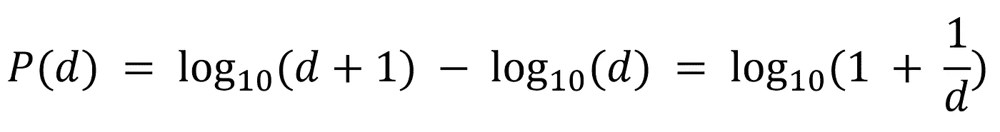
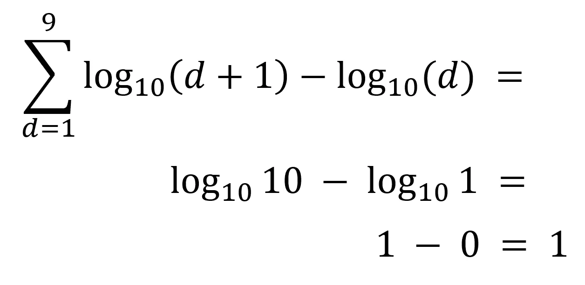
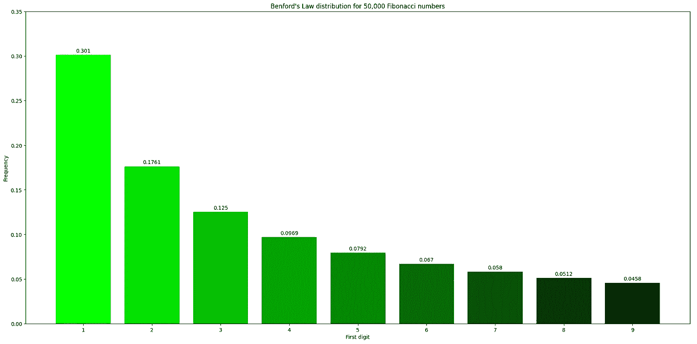
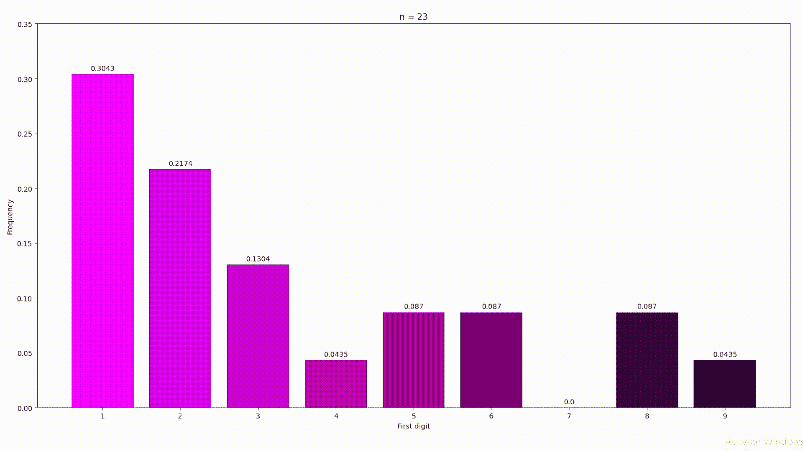

# 使用 Matplotlib 在 Python 中绘制 Benford 定律的动态图

> 原文：<https://itnext.io/using-matplotlib-to-plot-a-live-graph-of-benfords-law-in-python-79ec2e987694?source=collection_archive---------1----------------------->

# 介绍

在发表了我上一篇关于*计算第 1，000，000 个斐波那契数*的文章之后，我想到了如何使用这个数列来展示本福特定律，以及如何用 Python(而不是 Excel)来创建一个图表。在我们开始之前，我在写这篇文章之前从未使用过 matplotlib，所以这篇教程是针对像我这样的初学者的。但是即使你知道你在做什么，请留下来，你可能会学到新的东西。

以下是我们将涉及的部分的快速列表:

1.  什么是本福德定律？
2.  绘制静态频率图
3.  绘制实时图表

我也强烈推荐你在这里阅读我以前的文章[，因为我们今天将使用一些斐波那契生成函数。](https://kushm.medium.com/how-i-calculated-the-1-000-000th-fibonacci-number-with-python-e921d3642dbf)

# 什么是本福德定律？

根据[辉煌](https://brilliant.org/wiki/benfords-law/)，本福德定律是一个:

> 观察真实世界数据集中的数字的前导数字。凭直觉，人们可能会认为这些数字的前导数字是均匀分布的，因此从 1 到 9 的每个数字出现的可能性都是相等的。事实上，经常会出现这样的情况:1 比 2 出现得更频繁，2 比 3 出现得更频繁，以此类推。

这种分布经常出现在现实世界的数据集中，几乎无所不包。这也意味着本福德定律有多种用途，其中一种是检测潜在欺诈的能力。这是因为我们(人们)很难创造出符合规律的数据，因为我们倾向于将数字均匀地分布在数据中。

令人惊讶的是，计算从 1 到 9 的数字的实际分布非常简单和容易，为此我们可以使用下面的概率公式:



计算出现在数字开头的 1 到 9 之间的某个数字的概率的公式

这个等式告诉我们，对于一个数字 d，它出现在给定数据集中的概率等于 1 + 1/d 的以 10 为底的对数。我们还可以进一步证明，概率之和(其中 d 的范围从 1 到 9)总计为 1:



数字 1 到 9 的概率总和为 1 的证明

我们还可以计算我们期望看到的不同频率概率:

```
1 : 0.3010
2 : 0.1761
3 : 0.1249
4 : 0.0969
5 : 0.0792
6 : 0.0669
7 : 0.0580
8 : 0.0512
9 : 0.0457(* Multiply these values by 100 to get the probabilities in percentage.)
```

现在我们知道了什么是本福特定律，让我们开始用 Python 来绘制一些图形吧！

# 绘制静态频率图

要使用 Python 绘制图形，我们首先需要安装一个名为 matplotlib 的外部库。幸运的是，这非常简单，我们需要做的就是打开一个命令行并输入:`pip install matplotlib`。

然后，您可以从 matplotlib 导入 pyplot 函数并创建两个变量，这两个变量将在以后使用，一个用于为每个条形着色，另一个用于记录 Fibonacci 数中第一个数字的频率:

接下来要做的是创建一个函数，它可以返回斐波纳契数列中某个特定数字之前的所有数字:

在这里，我使用一个迭代解决方案将每个值添加到一个列表中，然后在函数结束时返回。如果你想知道更多关于我为什么使用比奈公式迭代解的信息，那么看看我的另一篇博文[这里](https://kushm.medium.com/how-i-calculated-the-1-000-000th-fibonacci-number-with-python-e921d3642dbf)。

然后在我们程序的主要部分，我们可以调用函数并传递整数 50，000 给它，这将返回给我们前 50，000 个斐波那契数的列表。然后，我们遍历这个列表，在每次迭代中，我们可以将这个数字转换成一个字符串，这样我们就可以使用切片方法访问字符串中的第一个字符。则字母字典中的字符值递增。您的字母词典现在应该是这样的(您可以通过打印出来来查看):

```
letters = { '1': 15052, '2': 8804, '3': 6248, '4': 4844, '5': 3959, '6': 3349, '7': 2898, '8': 2558, '9': 2288}
```

请确保您将它存储在某个地方，因为您不想在每次运行程序时等待并一次又一次地生成它们。

接下来要绘制条形图，我们需要获取我们将分配给 *x* 和 *y* 值的值，它们分别是数字 1 到 9 以及数字的频率:

对于 *x* 轴，我使用了字母字典上的按键功能，这将创建一个不同数字的列表。y 轴可能看起来有点不同，但是不要担心它并不太难理解，它只是一个简单的列表。对字母字典的不同值进行迭代，在每次迭代中，该值除以 50，000(因为我们有 50，000 个斐波那契数)，以获得频率。然后将该值四舍五入到 4 位小数，并添加到一个列表中，该列表在一个语句中返回。

然后我们可以为图表设置标题，以及为 *x* 和 *y* 标签设置标签。我还设置了 *y* 轴的范围，范围从 0 到 0.35，这对我们来说是完美的:

在这里，我通过提供 *x* 和 *y* 轴值来创建条形图。我还用我之前创建的颜色列表指定了颜色参数。这完全是可选的，但我认为它看起来很不错:

还有一个 quick for 循环，它遍历 9 个不同的条形，获取当前条形的高度，并在实际条形的上方进行注释。

最后我们可以得到一个图表，在这里我们可以清楚地看到本福特定律。



直观展示本福特定律分布的静态图

我们可以从图表上的值看到，它们与我们的预测值完全一致。这证明了斐波那契数列确实遵循本福特定律，正如我们所预期的那样，因为它是一个自然发生的序列。

# 绘制实时图表

现在，如果我们想看看这个图形如何随着斐波纳契数的增加而变化，那么我们需要绘制一个也实时更新的图形。

首先，我们导入所需的库，itertools 库中的 count 函数将保持我们当前所在的数字，matplotlib 中的 FuncAnimation 函数允许我们在我们的图形上创建动画并更新它。我们将计数设置为从 1 开始，并像以前一样创建字母字典和颜色列表。

然后，我们可以使用这个迭代函数返回第 n 个斐波那契数，而不是一次性计算它们，我们会一边计算一边进行。

接下来，我们需要一个函数，每次都可以调用它来更新我们的图形:

在这个函数中，获取计数器的下一个值，并计算第 n 个斐波那契数，在此之后，第一个数字用于更新字母字典。其余的代码几乎是相同的，但是有一行额外的代码清除了前面的图形。这是因为当我们绘制新的图形时，它会覆盖上一个图形，这是我们不希望的。注意，这个函数需要一个参数，但是 matplotlib 会自动传递这个参数，所以我们根本不需要考虑这个问题。

最后，我们可以使用导入的 FuncAnimation 函数创建动画。这需要几个参数，第一个是我们正在使用的当前“数字”。不要太担心这个，我们可以使用 get current figure 函数返回当前的数字。接下来，我们为我们的动画函数提供一个 5 的时间间隔，这是以毫秒为单位的，所以不要把这个值设置得太高，也不要太低，因为它可能会变得很慢。

希望如果一切按计划进行，执行代码将创建一个图表，显示随着越来越多的斐波纳契数被计算，频率图如何变化。这里有一个例子(请注意，GIF 可能需要一些时间来加载，你也可以在这里观看视频[):](https://imgur.com/a/4IMJxkI)



这是一个实时图表，展示了随着计算中使用更多的斐波纳契数，频率图是如何变化的

# 最后的想法

当你观察实时图表时，它变得更加“准确”,并且随着我们拥有和能够使用的数据量的增加而稳定下来。这在真实的科学世界中是一样的，这也是为什么你在学校的老师可能会要求你多次重复一个实验，以获得更好的数据并消除异常。

我希望你喜欢这篇文章。如果你有任何问题或反馈，请在下面评论，我会尽快回复。

感谢您的阅读！💖