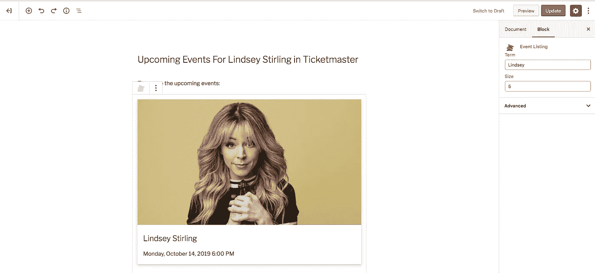
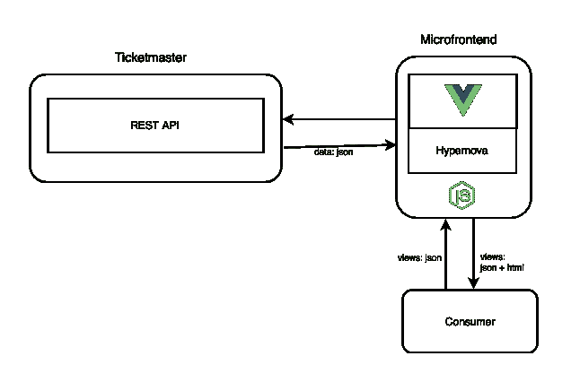
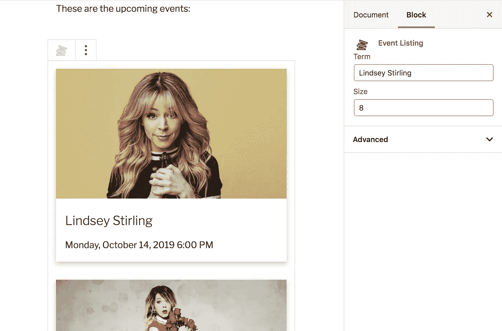
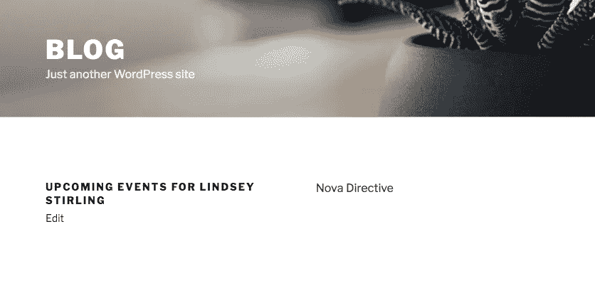
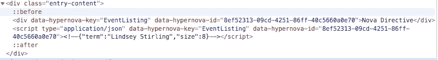
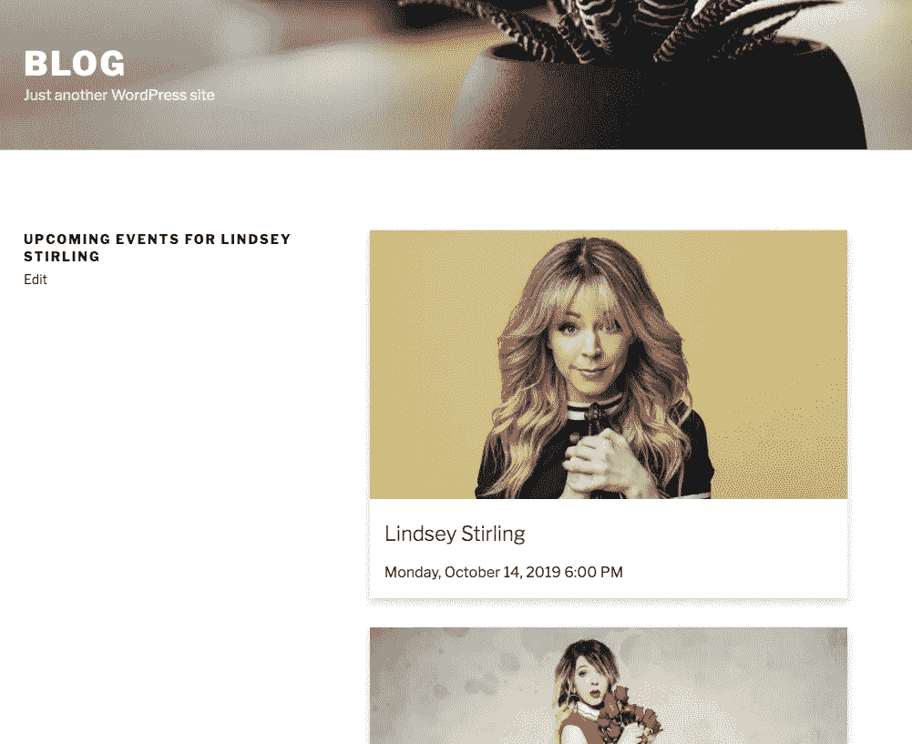

# 在 WordPress 中使用带有 Gutenberg 块的微前端

> 原文：<https://itnext.io/using-micro-frontends-in-wordpress-with-gutenberg-blocks-882faad8cd62?source=collection_archive---------5----------------------->

古腾堡的票务中心

WordPress 是最受欢迎的 CMS 平台之一，它使公司能够轻松管理他们的在线内容，并以最少的开发工作创建网站。WordPress 有一堆插件和主题来添加新的行为，而无需编写任何代码，甚至我们可以开发自己的插件和主题。

[Gutenberg](https://wordpress.org/gutenberg/) 是 WordPress 的新编辑器，它引入了块的概念，块是组织和组成内容的抽象单元，串在一起为网页创建内容。

> 这当然是一种压力，但这种压力将源源不断地流出……通过它，上帝将传播他的话语。真理之泉将从中涌出:像一颗新星，它将驱散无知的黑暗，并在人类中间点燃一盏迄今未知的明灯——约翰内斯·古腾堡

# 微前端在这里扮演什么角色？

## 场景

我们可以想象我们是一家媒体公司，我们的主要收入来自发布关于音乐、艺术和节日活动的文章。我们是一家 [Ticketmaster 附属公司](https://www.ticketmaster.se/feature/affiliate/?language=en-us)，我们通过向与我们页面内容相关的 Ticketmaster 页面推荐流量来赚钱。

Ticketmaster 附属计划。

## 一般要点和限制

1.  我们编辑的创作工作流程完全驻留在 WordPress 和 Gutenberg 中。我们需要让他们根据一个术语列出即将到来的事件，而不改变他们当前的工作流程。
2.  该公司在其路线图中计划实施一种[无头 CMS](https://medium.com/tech-tajawal/why-headless-cms-is-becoming-so-popular-57d262b1e096) 方法。我们需要在 WordPress 上实现 Ticketmaster 视图，并在新的前端重用它，而无需重写任何代码。
3.  维护 CMS 平台的团队成长了很多。我们需要按领域分配团队。

## 方法

我们可以在 Gutenberg 中使用自定义块，使编辑能够在文章或页面中列出即将发生的事件。然而，WordPress 需要知道如何与 Ticketmaster API 交互，以便收集必要的数据来呈现视图，当新的前端出现时，我们需要重新编写逻辑。

微前端使我们能够将视图作为服务进行分发，在此前提下，我们可以拥有一个独立的团队，该团队是 Ticketmaster 微前端的所有者，知道如何与 Ticketmaster API 进行通信，以便呈现和分发他们的视图。

## 解决方案

此处代码

 [## 马可尼 1992/微前端-古腾堡-示例

### 使用 Gutenberg - marconi1992 在 Wordpress 中使用微前端的演示

github.com](https://github.com/marconi1992/micro-frontends-gutenberg-example) 

# Ticketmaster 微前端

这个微前端是用 [Hypernova](https://github.com/marconi1992/hypernova) 和 [Vue.js](https://vuejs.org/) 开发的。

*   消费者请求查看 Ticketmaster 微前端。

*   微前端从 Ticketmaster API 收集所有数据。
*   微前端使用收集的数据和 Vue.js 组件呈现视图。
*   微前端发回带有所请求视图的 HTML 的响应。

## 入口点

我们有一个入口点，微前端在这里定义它可以服务的视图。

我们定义了一个**事件列表**视图，并使用 hypernova 绑定 **renderVuex** 将其绑定到 Vue.js 组件。

Vue.js 组件正在使用 Vuex 存储，因此我们在 hypernova 绑定中传递函数 **createEventListingStore** 来启用 hypernova 为每个请求的视图创建一个唯一的存储。

## 事件列表视图

这是一个 Vue.js 组件，它使用 Vuex 存储来获取和列出与使用卡片这个术语相匹配的事件。

## 事件列表存储

这个 Vuex 存储基于与 Ticketmaster API 交互的术语获取事件，转换它们并在存储状态中设置它们。

# **ticket master WordPress 插件**

这个插件在 Gutenberg 中为事件列表视图添加了一个自定义块。

## PHP 入口点

插件的入口点注册了 WordPress 中新的[块类型](https://developer.wordpress.org/block-editor/tutorials/block-tutorial/writing-your-first-block-type/)和 Gutenberg 编辑器的 javascript。

**register_block_type** 选项中的 **render_callback** 属性让 WordPress 知道如何在服务器端呈现已发布和草稿页面中的块。我们正在使用一个由 **render_nova_directive** 修饰的函数，它只返回一个带有块属性的占位符。

稍后我会解释为什么 WordPress 只渲染占位符而不从微前端获取视图。

## Javascript 入口点

这个脚本在 Gutenberg 中注册块类型，让它知道如何呈现可编辑的块和修改块属性的表单。

**NovaPreview** 组件渲染从微前端获取视图的块，并且每当块属性改变时，它再次渲染。

# WordPress 网站

一旦创建了一个页面，站点只呈现一个带有文本“Nova Directive”的占位符。这种行为是意料之中的，接下来是最精彩的部分。

渲染页面

Nova 指令占位符

您可以注意到占位符包含了关于视图及其属性的信息。我们将把 [Transclusion](https://www.infoq.com/news/2018/08/experiences-micro-frontends) 与 Nova Proxy 一起使用，以便向微前端请求视图，并将它们包含在页面中。

我写了两篇文章解释这种方法，您可以阅读它们以获得更多细节。

[用 Laravel、Vue.js 和 Hypernova 把一个庞然大物扼杀在微前端](https://medium.com/js-dojo/strangling-a-monolith-to-micro-frontends-decoupling-presentation-layer-18a33ddf591b)

[使用微前端构建页面](https://medium.com/js-dojo/page-building-using-micro-frontends-c13c157958c8)

## 使用 Nova 代理的微前端跨集群

这是一个服务器端的包含服务器，它解析来自源服务器(WordPress)的响应。

服务器端包含 Nova 代理

*   用户向 Nova 代理请求页面。
*   Nova 代理将请求传递给 WordPress(源服务器)。
*   WordPress 使用存储的内容以及自定义块呈现的 Nova 指令来呈现页面。
*   WordPress 将 HTML 发送回 Nova 代理。
*   Nova 代理解析 HTML 并获取存储在占位符中的必要数据，用于向微前端请求视图。
*   Nova 代理向微前端请求视图。
*   微前端呈现视图，并将 JSON 和为视图生成的 HTML 发送回 Nova 代理。
*   Nova 代理包含了替代占位符的生成视图。
*   Nova 代理将页面发送回浏览器。

## 结果呢

# 最后的想法

使用这种解决方案，WordPress 不知道视图将如何呈现，它只使用 Nova 指令呈现占位符，该指令使 Nova 代理能够请求视图并将它们包含在页面中。

此外，这个解决方案使 WordPress 迁移到一个无头架构变得更加容易，不需要重写任何代码，新的前端站点只需要基于来自 WordPress Rest API 的块属性呈现一个占位符。