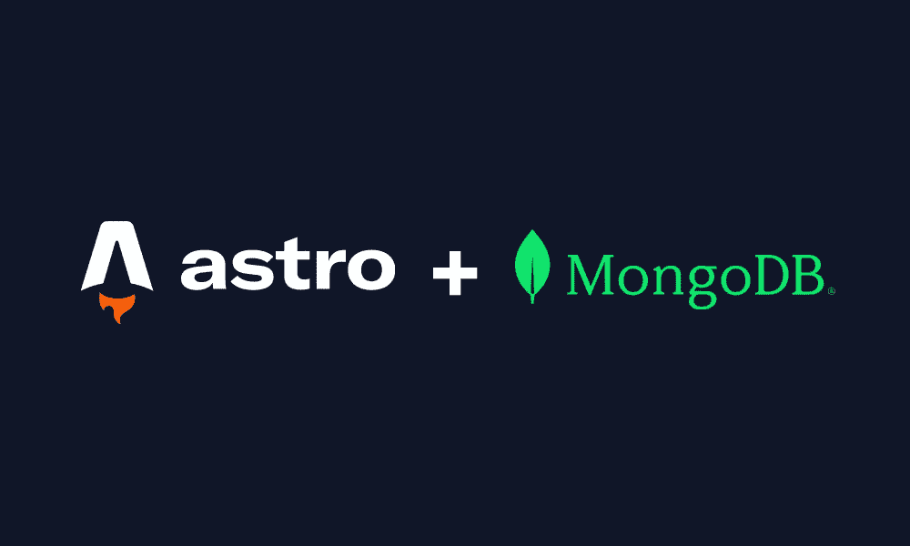

# 使用 MongoDB 和 Astro

> 原文：<https://itnext.io/using-mongodb-with-astro-5c9cf7f1be50?source=collection_archive---------1----------------------->

一个非常简单容易的教程。



我最近开始在我的项目中使用 Astro，它看起来很有前景。Astro 在静态站点生成方面很棒，但是我更喜欢[服务器端渲染](https://docs.astro.build/en/guides/server-side-rendering/) (SSR)。让我们看看如何在我们的 Astro SSR 项目中使用 MongoDB。(本教程也适用于 SSG)。

完全回购👉:[https://github.com/skolhustick/astro-mongodb](https://github.com/skolhustick/astro-mongodb)

## 1.创建一个空白的天文项目

```
npm create astro@latest
```

我通常选择空白模板。在本教程中，我们不使用 Typescript。

## 2.添加依赖关系

添加下列依赖项。我们将使用本地 Node.js MongoDB 驱动程序和 Astro 的 Node.js 适配器。Node.js 适配器只有在需要服务器端渲染时才需要。我们也将 Svelte 用于交互组件。你可以用你喜欢的任何东西。

```
npm install --save mongodb
npm install --save-dev @astrojs/node
npm run astro add svelte
```

## 3.配置`astro.config.mjs`

你的 astro.config.mjs 可能需要添加一些配置，添加 Node.js 适配器和 svelte 后，我的是这样的。

## 4.设置环境变量

创建一个`.env`文件和你的 MongoDB URI。

```
NODE_ENV="development"
MONGODB_URI="mongodb://localhost:27017"
```

## 5.正在连接到 MongoDB

让我们添加一个名为`mongodb.js`的文件。这个文件将帮助我们连接到我们的 MongoDB。为了简单起见，我还在这个文件中导出了`Users`集合。

## 6.读取和写入数据

让我们创建几个助手函数来帮助我们从 MongoDB 中读取和写入数据。

## 7.创建 API 路由

让我们创建几个可以从客户端使用的 API 路由。

## 8.添加表单以创建用户

这里有一个简单的组件，它向我们的 API 端点提交一个表单。一旦我们成功添加了用户，我们将重定向到一个列出所有用户的页面。

确保您的`.svelte`组件被添加到`.astro`页面，并在客户端设置为水合物。否则，如果没有客户端 JS，我们将无法提交表单。


## 9.列出所有用户

只是另一个简单的页面，它从服务器获取数据。该页面上的数据将在服务器端呈现。

就是这样！以下是完整的回购协议:

[](https://github.com/skolhustick/astro-mongodb) [## GitHub-skolhustick/astro-mongodb:用 Astro 使用 MongoDB 的简单方法。

### 初始天文模板最小🧑‍🚀经验丰富的宇航员？删除此文件。玩得开心！在你的宇宙里…

github.com](https://github.com/skolhustick/astro-mongodb)