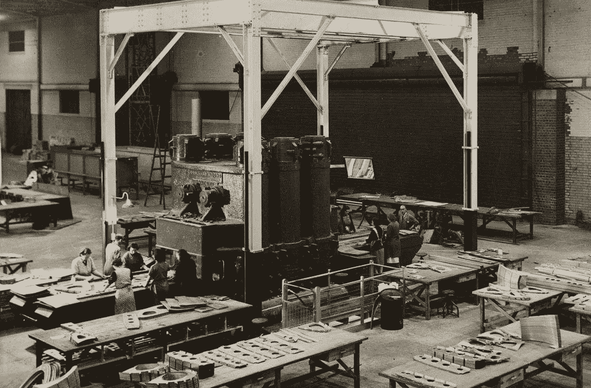
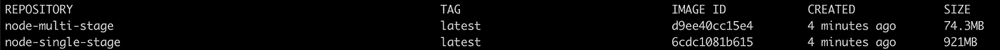

# 为什么您应该在生产中使用多阶段 Docker 构建

> 原文：<https://itnext.io/using-multi-stage-docker-builds-for-speed-and-security-9d3a1cd9cd8c?source=collection_archive---------1----------------------->

速度和安全性结合在一起的情况并不常见，但是当它们结合在一起时，就可以确定一种模式是否值得采用。这就像一个汽车零件，看起来很好，让你的汽车更快——你怎么可能出错？在这篇文章中(有大量的例子)，我将向你展示什么是多阶段 Docker 构建，以及它们如何更快更安全！



包装 Docker 容器非常类似于一条装配线，多个阶段让我们可以灵活地在最终产品中包含或不包含什么。

可选地，对于本文中的源代码，[请参考这个 GitHub 资源库](https://github.com/blhagadorn/multi-stage-docker-example/tree/master)。

# docker 文件如何工作

Docker 容器通常是用一个 *Dockerfile* 构建的，这是一组帮助你打包源代码、安装依赖项和构建应用程序(如果它编译了二进制文件)的指令。然而，很多时候你构建应用程序所需的东西并不是你运行应用程序所需的东西。让我们考虑一个来自 [Nodejs 网站](https://nodejs.org/en/docs/guides/nodejs-docker-webapp/)的标准节点 docker 文件。

```
// Node Sample Dockerfile - Single StageFROM node:12
ADD . /app
WORKDIR /app
RUN npm install
EXPOSE 8080
CMD [ "node", "server.js" ]
```

您会注意到，在我们开始处理目录和将文件复制到映像之前，我们从`FROM node:12`开始。你看，Dockerfiles 就像一个巨大的洋葱，第一个`FROM`是洋葱的核心。它为您提供了二进制文件和 Linux 文件结构，您需要继续添加更多的层，这将最终成为您的最终应用程序。然而，内核里面是什么呢？让我们在`node:12`图像内部运行一个 bash shell 来找出答案！

# 看看我们的第一层

```
$ docker run -it node:12 /bin/bash
# uname -a
Linux c415d0a3fb27 4.19.76-linuxkit #1 SMP Tue May 26 11:42:35 UTC// Ok so we're running Linux# ls
bin  boot  dev etc  home  lib lib64  media  mnt  opt proc  root  run  sbin  srv  sys  tmp  usr  var
// Standard file system in Linux# ls /bin
ps  su rm kill ping sh sed stty chmod chown chgrp bash date pwd  ls which mv# ls /usr/local/bin
docker-entrypoint.sh  node  nodejs  npm  npx  yarn  yarnpkg
```

如您所见，`node:12`是开始构建我们的应用程序的好地方。它拥有我们创建文件系统、更改目录所有权所需的一切，当然还包含`npm`，这样我们就可以安装我们的`node_modules`依赖项。但是为什么我们需要`rm`、`kill`、`mv`或者`ping`？更有甚者，我们的应用程序调用`node`来运行`server.js`，为什么我们还需要我们的包管理器`npm`，它可以安装任何东西？

答案很简单——拥有所有这些工具和完整 Linux 操作系统的感觉对于入门来说是非常好的——但是拥有所有这些二进制文件也是不安全的，而且拖着这么大的文件到处跑是很慢的。从这里开始，我们可以做两件事之一:( 1)通过删除所有我们不需要的东西，把所有东西都撕掉;( 2)只复制我们需要的东西，把它们移到第二个新的阶段。输入…多级 Dockerfiles！

# 多级 docker 文件

在上一个例子中，我们看到了在构建和安装应用程序及其依赖项时，拥有一套庞大的工具是多么方便，但是我们知道，当最终的容器交付到我们的源目的地(最有可能是 Kubernetes)时，我们不希望有所有这些臃肿的东西。下面是一个多阶段 Dockerfile 文件:

```
// Node Sample Dockerfile - Multi-stage FROM node:12 **AS stage1**
ADD . /app
WORKDIR /app
RUN npm install#Second Stage usFROM gcr.io/distroless/nodejs
COPY --from=stage1 /app /app
WORKDIR /app
EXPOSE 8080
CMD ["server.js"]
```

在第一阶段(**阶段 1)** 我们使用`node:12`图像开始。这为我们构建应用程序提供了一个很好的基础。然而，在我们将代码复制到`/app`并运行`npm install`之后，我们进入第二个阶段(第二个`FROM`)并提取节点分布图(*gcr.io/distroless/nodejs*)。Distroless 是一个惊人的最小 docker 图像——下面是来自他们的 GitHub 的一个很好的描述:

```
"Distroless" images contain only your application and its runtime dependencies. They do not contain package managers, shells or any other programs you would expect to find in a standard Linux distribution.
```

在我们拉出发行版映像后，我们从第一阶段`COPY`中提取`/app`中的内容，这应该是我们的`node_modules`以及我们的源代码`server.js`。这里需要注意的重要部分是，新图像不包含`bash`或您可能想要使用的任何其他工具`exec`。虽然不便于调试，但攻击面已经大大减少了——这对于容器的生产部署来说是完美的。从外部来看，应用程序正在做和以前一样的事情(在本例中，在端口 8080 上提供 web 服务器)。

# 调试容器

为了避免无法调试容器的不便， [Distroless 为它们的图像提供了另一个](https://github.com/GoogleContainerTools/distroless#debug-images) `:debug`标签，其中包含 shell 访问([通过 BusyBox shell](https://en.wikipedia.org/wiki/BusyBox) )。如果您的应用程序遇到了问题，您应该保留一个 docker 文件的调试版本，以便在需要将`kubectl exec`或`docker exec`放入容器时部署。下面有一个例子供参考(也在 GitHub 中):

```
// Node Sample Dockerfile - Multi-stage with Shell for DebuggingFROM node:12 AS stage1
ADD . /app
WORKDIR /app
RUN npm install#Second Stage usFROM gcr.io/distroless/nodejs**:debug**
COPY --from=stage1 /app /app
WORKDIR /app
EXPOSE 8080
CMD ["server.js"]
```

# **大小呢？**

好了，到目前为止，我们只是从安全角度讨论了两个 over 文件之间的技术差异。但是如题中所承诺的，大小呢？由于多阶段通过仅复制我们需要的东西来删除所有不必要的混乱，所以让我们检查各个图像的大小来验证这一说法:



我们的多级在尺寸上缩小了 92%!

哇！我们的新图像是 *74.3MB* ，相比之下 *921MB* 。较小的映像可以加快我们所有的构建和部署步骤，如果您在 Kubernetes 中，较小的映像是全面提高性能的最快方法之一。

# 摘要

正如您所看到的，多阶段 Dockerfile 将您的构建分成两个部分— (1)应用程序代码的设置(如依赖项)和(2)应用程序运行时的设置。Dockerfiles 开箱即用非常容易，但当我们优化安全性和速度时，部署生产就绪应用程序需要多阶段构建。同样，我们使用发行版映像来确保我们的最终映像包含运行我们的应用程序所需的内容，并且只包含**和**！如果你想进一步讨论，请联系我在 bryant.hagadorn@gmail.com 的办公室，如果你喜欢阅读这类内容，请关注我的媒体。谢谢你。