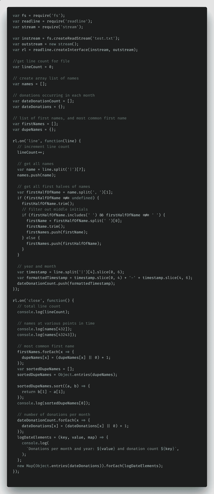
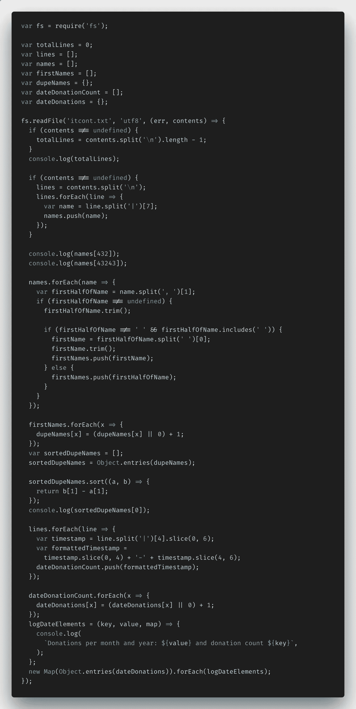
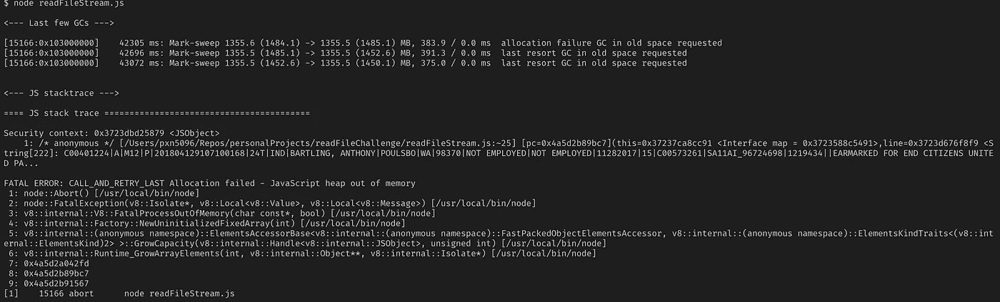
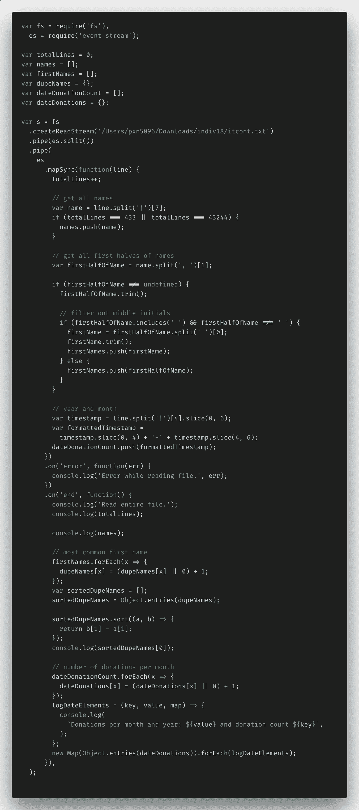
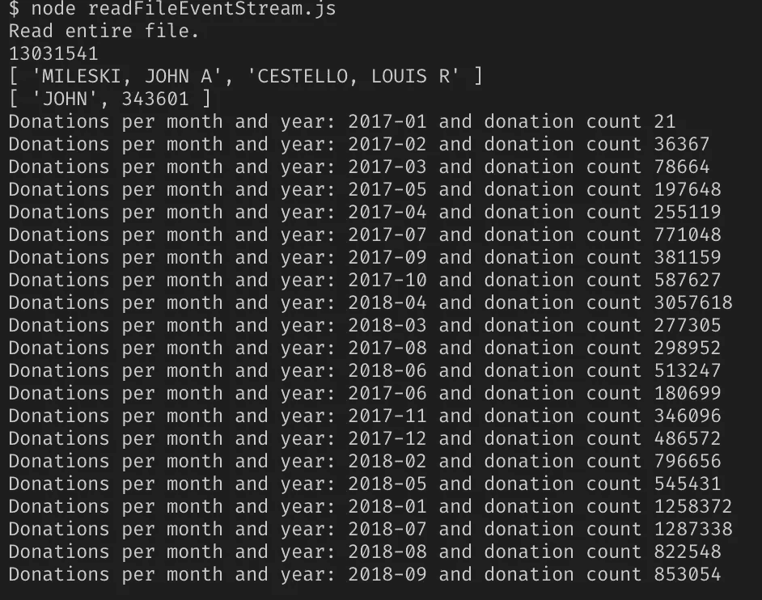

# 使用 Node.js 读取非常非常大的数据集和文件(第 1 部分)

> 原文：<https://itnext.io/using-node-js-to-read-really-really-large-files-pt-1-d2057fe76b33?source=collection_archive---------0----------------------->

T 他的博文有一个有趣的灵感点。上周，有人在我的一个 Slack 频道上发布了一个他收到的关于一家保险技术公司开发人员职位的编码挑战。

它激起了我的兴趣，因为挑战包括阅读来自联邦选举委员会的非常大的数据文件，并显示这些文件中的特定数据。由于我没有太多处理原始数据的经验，并且我总是准备迎接新的挑战，我决定用 Node.js 来解决这个问题，看看我是否能自己完成这个挑战，这只是为了好玩。

这里有 4 个问题，以及一个到程序要解析的数据集的链接。

*   写一个程序，打印出文件中的总行数。
*   请注意，第 8 列包含一个人的姓名。编写一个程序，加载这些数据并创建一个包含所有名称字符串的数组。打印出第 432 号和第 43243 号姓名。
*   请注意，第 5 列包含一种日期形式。计算每个月有多少捐赠，并打印出结果。
*   请注意，第 8 列包含一个人的姓名。用每个名字创建一个数组。确定数据中最常见的名字及其出现的次数。

数据链接:[https://www.fec.gov/files/bulk-downloads/2018/indiv18.zip](https://www.fec.gov/files/bulk-downloads/2018/indiv18.zip)

当您解压缩该文件夹时，您应该会看到一个 2.55GB 的主`.txt`文件和一个包含该主文件较小部分的文件夹(这是我在转移到主文件之前测试我的解决方案时使用的)。

不算太可怕吧？似乎可行。让我们来谈谈我是如何做到这一点的。

## 我想到的两个原始 Node.js 解决方案

处理大文件对 JavaScript 来说并不是什么新鲜事，事实上，在 Node.js 的核心功能中，有许多读写文件的标准解决方案。

最直接的方法是`[fs.readFile()](https://nodejs.org/api/fs.html#fs_fs_readfile_path_options_callback)`，将整个文件读入内存，然后在 Node 读取后对其进行操作，第二种方法是`[fs.createReadStream()](https://nodejs.org/api/fs.html#fs_fs_createreadstream_path_options)`，它以类似于 Python 和 Java 等其他语言的方式流入(流出)数据。

## 我选择运行的解决方案&为什么

由于我的解决方案需要包括计算总行数和解析每行以获得捐赠名称和日期，所以我选择使用第二种方法:`fs.createReadStream()`。然后，当我流过文档时，我可以使用`[rl.on(‘line’,...)](https://nodejs.org/api/readline.html#readline_event_line)`函数从每行代码中获取必要的数据。

对我来说，这似乎比读入文件后将整个文件分割开来并逐行运行要容易得多。

## node . js create readstream()& ReadFile()代码实现

下面是我用 Node.js 的`fs.createReadStream()`函数想出来的代码。下面我来分解一下。

我必须做的第一件事就是从 Node.js 导入所需的函数:`fs`(文件系统)、`readline`和`stream`。这些导入允许我创建一个`instream`和`outstream`，然后是`readLine.createInterface()`，这将允许我逐行读取流并从中打印出数据。

我还添加了一些变量(和注释)来保存各种数据位:一个`lineCount`、`names`数组、`donation`数组和对象，以及`firstNames`数组和`dupeNames`对象。稍后您将看到这些在哪里发挥作用。

在`rl.on('line',...)`函数内部，我能够进行所有的逐行数据解析。在这里，我为流过的每一行增加了`lineCount`变量。我使用 JavaScript `split()`方法解析出每个名字，并将其添加到我的`names`数组中。我进一步将每个名字简化为名字，同时考虑中间的首字母、多个名字等。在 JavaScript `trim()`、`includes()`和`split()`方法的帮助下显示名字。我将过时的年份和日期列切片，重新格式化为可读性更好的`YYYY-MM`格式，并将它们添加到`dateDonationCount`数组中。

在`rl.on('close',...)`函数中，我对收集到的数据进行了所有的转换，然后`console.log`将我的所有数据输出给用户查看。

位于第 432 和 43243 位的`lineCount`和`names`无需进一步操作。找到最常见的名字和每个月的捐款数量有点难。

对于最常见的名字，我首先必须为每个名字(键)和它出现的次数(值)创建一个键值对对象，然后我使用 ES6 函数`Object.entries()`将它转换成一个数组的数组。从那里开始，按照名称的值对名称进行排序并打印出最大值是一项简单的任务。

捐款还要求我制作一个类似的键值对对象，创建一个`logDateElements()`函数，我可以很好地使用 ES6 的字符串插值来显示每个捐款月的键和值。然后创建一个`new Map()`，将`dateDonations`对象转换成一个数组的数组，并通过调用每个数组上的`logDateElements()`函数对其进行循环。咻！不像我最初想的那么简单。

但是成功了。至少对于我用于测试的较小的 400MB 文件…

在我用`fs.createReadStream()`完成之后，我又用`fs.readFile()`实现了我的解决方案，看看有什么不同。这是相关的代码，但我不会在这里详述所有细节——它与第一个代码片段非常相似，只是看起来更同步(不过，除非您使用`fs.readFileSync()`函数，否则 JavaScript 会像其他所有代码一样异步运行这段代码，不用担心。

如果你想看我的全部代码，你可以在这里看到。

## Node.js 的初步结果

使用我的工作解决方案，我将文件路径添加到 2.55GB 的 monster 文件的`readFileStream.js`文件中，并看到我的节点服务器崩溃并出现`JavaScript heap out of memory`错误。

失败。咚咚咚……

事实证明，尽管 Node.js 正在流式传输文件输入和输出，但在这两者之间，它仍然试图将整个文件内容保存在内存中，这对于这样大小的文件是做不到的。节点一次最多可以容纳 1.5GB 的内存，但不能再多了。

因此，我目前的解决方案都不能完全应对挑战。

我需要一个新的解决方案。通过节点运行的更大数据集的解决方案。

## 新的数据流解决方案

我以`[EventStream](https://www.npmjs.com/package/event-stream)`的形式找到了我的解决方案，这是一个受欢迎的 NPM 模块，每周下载超过 200 万次，并承诺“让创建和使用流变得容易”。

在 EventStream 文档的一点帮助下，我能够再次找出如何逐行读取代码并做需要做的事情，希望是以一种对 Node 更友好的方式。

## 事件流代码实现

这是我的代码使用 NPM 模块 EventStream 的新代码。

最大的变化是文件开头的管道命令——所有这些语法都是 EventStream 的文档建议您将流分成由`.txt`文件每行末尾的`\n`字符分隔的块的方式。

我唯一需要修改的是`names`答案。我不得不稍加修改，因为如果我试图将所有 13 毫米的名字添加到一个数组中，我又会遇到内存不足的问题。我通过收集第 432 和第 43，243 个名字并将它们添加到它们自己的数组中来解决这个问题。不完全是被要求的，但是，嘿，我得有点创意。

## Node.js 和 EventStream 的结果:第 2 轮

好了，随着新解决方案的实现，我再次用我的 2.55GB 文件启动 Node.js，我的手指交叉这将工作。看看结果。

吼吼！

成功！

## 结论

最终，Node.js 的纯文件和大数据处理功能没有达到我的要求，但只需要一个额外的 NPM 包 EventStream，我就能够解析一个大规模数据集，而不会使节点服务器崩溃。

请继续关注本系列的[第二部分](https://bit.ly/2JdcO2g)，我将 Node.js 中读取数据的三种不同方式与性能测试进行了比较，看看哪种方式真正优于其他方式。结果令人大开眼界，尤其是当数据变大时…

感谢您的阅读，我希望这能让您了解如何使用 Node.js 处理大量数据。非常感谢鼓掌和分享！

如果你喜欢读这篇文章，你可能也会喜欢我的其他博客:

*   [邮递员 vs .失眠:比较 API 测试工具](https://medium.com/@paigen11/postman-vs-insomnia-comparing-the-api-testing-tools-4f12099275c1)
*   [如何使用网飞的 Eureka 和 Spring Cloud 进行服务注册](https://medium.com/@paigen11/how-to-use-netflixs-eureka-and-spring-cloud-for-service-registry-8b43c8acdf4e)
*   [Jib:在没有任何 Docker 知识的情况下获得专家 Docker 结果](https://medium.com/@paigen11/jib-getting-expert-docker-results-without-any-knowledge-of-docker-ef5cba294e05)

**参考资料和更多资源:**

*   Node.js 文档，文件系统:【https://nodejs.org/api/fs.html 
*   Node.js 文档，Readline:【https://nodejs.org/api/readline.html#readline_event_line 
*   Github，读取文件回购:[https://github.com/paigen11/file-read-challenge](https://github.com/paigen11/file-read-challenge)
*   https://www.npmjs.com/package/event-stream，NPM，事件之梦