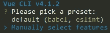
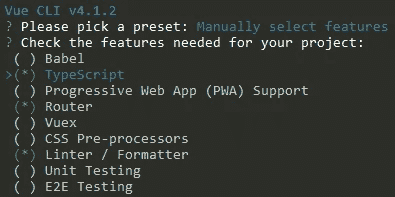
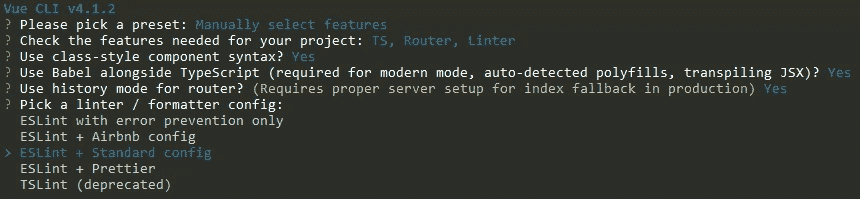

# 使用 NSwag 为 ASP.NET 核心 3.1 API 生成 Vue 客户端

> 原文：<https://itnext.io/using-nswag-to-generate-a-vue-client-for-an-asp-net-core-3-1-api-cae8c121c1cf?source=collection_archive---------7----------------------->

本周我们将添加一个 [Vue](https://vuejs.org/) 项目，该项目将利用我们几周前使用 NSwag 生成的客户端创建的 contacts API。这篇文章是 ASP.NET 核心基础回购的改造的一部分。NET Core 3.0 现已发布，目标是。网芯 3.1。有关相关样本如何达到当前状态的详细信息，请查看以下帖子。

[使用 NSwag 和 ASP.NET Core 3 的 Swagger/open API](https://elanderson.net/2019/10/swagger-openapi-with-nswag-and-asp-net-core-3/)
[ASP.NET Core 3:将实体框架核心添加到现有项目](https://elanderson.net/2019/11/asp-net-core-3-add-entity-framework-core-to-existing-project/)
[支持 API 的新 Razor Pages 项目](https://elanderson.net/2019/12/new-razor-pages-application-backed-with-an-api/)
[使用 NSwag 为 ASP.NET Core 3 API 生成 Angular 客户端](https://elanderson.net/2019/12/using-nswag-to-generate-angular-client-for-an-asp-net-core-3-api/)
[使用 NSwag 为 ASP.NET Core 3 API 生成 React 客户端](https://elanderson.net/2019/12/using-nswag-to-generate-react-client-for-an-asp-net-core-3-api/)
[使用 NSwag 为 ASP.NET Core 3.1 API 生成 Blazor 服务器客户端](https://elanderson.net/2020/01/using-nswag-to-generate-blazor-server-client-for-an-asp-net-core-3-1-api/)

本文修改前的示例代码可以在[这里](https://github.com/elanderson/ASP.NET-Core-Basics-Refresh/tree/0ac0e84ca999545e5cac7764a019b14ce76353c8)找到。


## 创建 Vue 项目

与本系列中的其他项目不同，没有。微软的. NET CLI 模板支持 Vue，所以为了创建 Vue 项目，我们将使用 [Vue CLI](https://cli.vuejs.org/guide/) 。开始之前，确保您已经安装了[NPM](https://www.npmjs.com/get-npm)。

在命令提示符下使用以下命令安装 Vue CLI。

```
npm install -g @vue/cli
```

接下来，使用以下命令通过 Vue CLI 启动项目创建过程。请记住，CLI 会使用项目名称创建一个目录。

```
vue create contacts-vue
```

上面的命令引发了一系列关于应用程序的问题。该示例将使用 TypeScript，这意味着不能使用默认设置，因此我们需要选择**手动选择特性**。



下一个问题，我们需要选择**打字稿**。我还包括了路由器和 Linter / Formatter。我还发现后来在这个过程中，巴别塔是需要的，所以在这个问题上可以随意选择它。



项目创建过程问了很多问题，我基本上都默认了。下面是我使用的所有问题和选项的截图。



既然项目已经创建，如果我们需要将目录更改为上面过程中创建的目录。

```
cd contacts-vue
```

使用以下命令运行新项目。

```
npm run serve
```

## 使用 NSwagStudio 生成 API 客户端

NSwag 为客户端生成提供了多种选项，包括 CLI、代码或 Windows 应用程序。这篇文章将使用名为 NSwagStudio 的 Windows 应用程序。NSwagStudio 可以从[这里](http://rsuter.com/Projects/NSwagStudio/installer.php)下载安装。

接下来，确保您的 API 正在运行，并获取其 OpenAPI/Swagger 规范 URL 的 URL。例如，使用示例解决方案的 Contacts API 的本地实例，URL 是[**https://localhost:5001/swagger/v1/swagger . JSON**。如果你正在使用 Swagger UI，你可以在 API 标题下找到你的 swagger.json 的链接。](https://localhost:5001/swagger/v1/swagger.json.)


现在我们已经有了 API 的 OpenAPI/Swager 规范 URL，切换到 NSwagStudio。应用程序将打开，并带有一个准备就绪的新文档。我们需要设置几个选项。首先，选择 **OpenAPI/Swagger 规范**选项卡，并在**规范 URL** 框中输入您的 API 规范 URL。


在**输出**部分勾选**打字客户端**复选框，然后选择**打字客户端**选项卡。有许多选项可供选择，突出显示的选项对于本示例非常重要。首先，确保**模块名**和**命名空间**都为空。我确信有一种方法可以让客户端使用模块或名称空间，但是我没有任何运气。对于**模板**，我们只需要一个基于**获取**的客户端。需要设置的最后一个选项是**输出文件**路径，这是您希望生成的文件所在的位置。我输出到/src/apis/contactApi.ts 下的 Vue 项目目录，设置好所有选项后点击**生成文件**。

## 创建 UI 并使用生成的客户端

请注意，我已经很长时间没有接触 Vue 了，所以实际上 UI 位可能是也可能不是在 Vue 中做这些事情的“正确”方式，但它应该足够容易理解，您可以看到 API 客户端是如何使用的。和其他文章一样，我们将创建一个联系人列表，从 API 获取数据。

首先，我们将在/src/component 目录中为联系人列表创建一个新组件，文件名为 **ContactList.vue** ，内容如下。特定于使用 NSwag 生成的客户端的行被突出显示。

```
<template>
  <div>
    <table class="table table-striped" aria-labelledby="tabelLabel">
      <thead>
        <tr>
          <th>Name</th>
          <th>Address</th>
          <th>City</th>
          <th>State</th>
          <th>Postal Code</th>
          <th>Phone</th>
          <th>Email</th>
        </tr>
      </thead>
      <tbody>
        <tr v-for="contact in contacts" v-bind:key="contact.id">
          <td>{{contact.name}}</td>
          <td>{{contact.address}}</td>
          <td>{{contact.city}}</td>
          <td>{{contact.state}}</td>
          <td>{{contact.postalCode}}</td>
          <td>{{contact.phone}}</td>
          <td>{{contact.email}}</td>
        </tr>
      </tbody>
    </table>
  </div>
</template>

<script lang="ts">
import { Component, Prop, Vue } from 'vue-property-decorator'
import { ContactsClient, Contact } from '../apis/contactsApi'
@Component
export default class HelloWorld extends Vue {
  name: string = 'ContactList';
  contacts: Contact[] = [];
  private created () {
    let client = new ContactsClient()
    client.getContacts().then(data => (this.contacts = data))
  }
}
</script>

<style scoped>
</style>
```

从上面的**创建的**函数中可以看出，我们正在创建一个 **ContactsClient** 的新实例，并调用它的 **getContacts** 函数，使用我们从 API 返回的数据用 API 调用的结果替换 **contacts** 字段。

接下来，我们将使用下面的代码在/src/views 目录下创建一个 **ContactList.vue** 。这基本上是我们上面创建的组件的包装。

```
<template>
  <div>
    <ContactListComponent/>
  </div>
</template>

<script>
import ContactListComponent from '@/components/ContacList'
export default {
  name: 'contactList',
  components: {
    ContactListComponent
  }
}
</script>
```

现在我们已经准备好了视图，我们需要添加一个到应用程序导航的链接，这样用户就可以访问联系人列表。打开 **App.vue** 和一个路由器链接到联系人列表的 nav div。

```
<div id="nav">
    <router-link to="/">Home</router-link> |
    <router-link to="/contactList">Contacts</router-link> |
    <router-link to="/about">About</router-link>
</div>
```

现在我们需要将新组件添加到应用程序的路由中。打开/src/router 目录中的 **index.ts** ，为联系人列表视图添加一个导入。

```
import ContactList from '../views/ContactList.vue'
```

最后，将联系人列表添加到 routes 数组中。

```
const routes = [
  {
    path: '/',
    name: 'home',
    component: Home
  },
  {
    path: '/contactList',
    name: 'contactList',
    component: ContactList
  },
  {
    path: '/about',
    name: 'about',
    // route level code-splitting
    // this generates a separate chunk (about.[hash].js) for this route
    // which is lazy-loaded when the route is visited.
    component: () => import(/* webpackChunkName: "about" */ '../views/About.vue')
  }
]
```

## 包扎

一如既往，NSwag 使得创建一个与 API 交互的客户端变得非常容易。希望这是有用的，即使我的 Vue 代码可能不是惯用的。

本帖修改后的样本项目可以在[这里](https://github.com/elanderson/ASP.NET-Core-Basics-Refresh/tree/a7e807f6fb4195caafb357c4b037d01cf41a33aa)找到。

*原载于* [*埃里克·安德森*](https://elanderson.net/2020/01/using-nswag-to-generate-a-vue-client-for-an-asp-net-core-3-1-api/) *。*