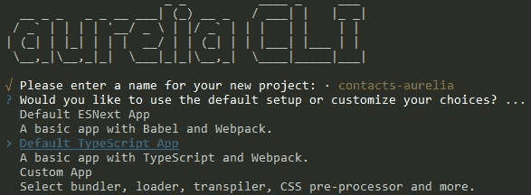
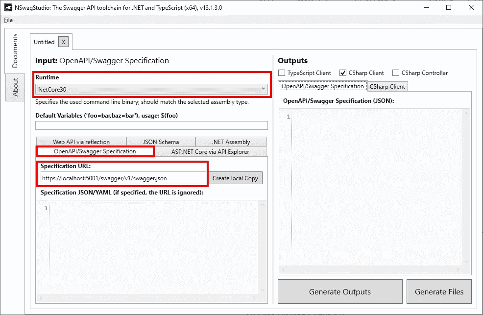
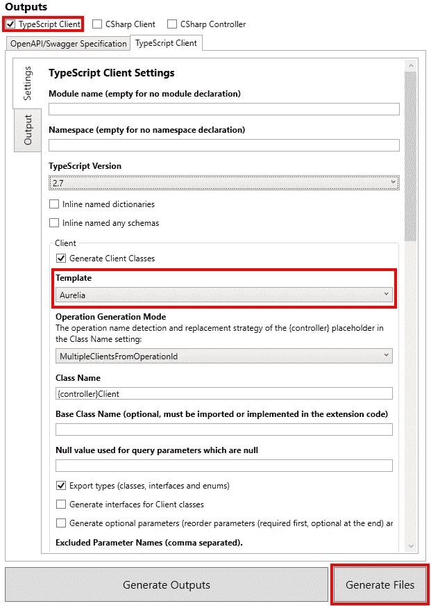

# 使用 NSwag 为 ASP.NET 核心 3.1 API 生成 Aurelia 客户端

> 原文：<https://itnext.io/using-nswag-to-generate-an-aurelia-client-for-an-asp-net-core-3-1-api-1b430005473e?source=collection_archive---------4----------------------->

本周我们将添加一个 [Aurelia](https://aurelia.io/) 项目，该项目将利用我们几周前使用 NSwag 生成的客户端创建的 contacts API。这篇文章是 ASP.NET 核心基础回购的改造的一部分。NET Core 3.0 现已发布，目标是。网芯 3.1。有关相关样本如何达到当前状态的详细信息，请查看以下帖子。

[使用 NSwag 和 ASP.NET Core 3 的 Swagger/open API](https://elanderson.net/2019/10/swagger-openapi-with-nswag-and-asp-net-core-3/)
[ASP.NET Core 3:向现有项目添加实体框架核心](https://elanderson.net/2019/11/asp-net-core-3-add-entity-framework-core-to-existing-project/)
[新的 Razor Pages 项目支持 API](https://elanderson.net/2019/12/new-razor-pages-application-backed-with-an-api/)
[使用 NSwag 为 ASP.NET Core 3 API 生成 Angular 客户端](https://elanderson.net/2019/12/using-nswag-to-generate-angular-client-for-an-asp-net-core-3-api/)
[使用 NSwag 为 ASP.NET Core 3 API 生成 React 客户端](https://elanderson.net/2019/12/using-nswag-to-generate-react-client-for-an-asp-net-core-3-api/)
[使用 NSwag 为 ASP.NET Core 3.1 API 生成 Blazor 服务器客户端](https://elanderson.net/2020/01/using-nswag-to-generate-blazor-server-client-for-an-asp-net-core-3-1-api/)

本文修改前的示例代码可以在[这里](https://github.com/elanderson/ASP.NET-Core-Basics-Refresh/tree/a7e807f6fb4195caafb357c4b037d01cf41a33aa)找到。


## 创建 Aurelia 项目

和 Vue 一样，没有。微软的. NET CLI 模板支持 Aurelia，所以为了创建 Aurelia 项目，我们将使用 [Aurelia CLI](https://aurelia.io/docs/cli) 。在开始之前，确保您已经安装了[NPM](https://www.npmjs.com/get-npm)。

在命令提示符下使用以下命令安装 Aurelia CLI。

```
npm install -g aurelia-cli
```

接下来，使用以下命令通过 Aurelia CLI 启动项目创建过程。请记住，CLI 会使用项目名称创建一个目录。

```
au new
```

以上将导致项目创建过程的演练。首先是项目的名称，在本例中是 contacts-aurelia。接下来是项目的设置，这里我们将使用**默认类型脚本应用**。



最后，选择您希望如何管理依赖关系。示例项目使用 npm，但是 Yarn 也是一个选项。如果您使用 Yarn，下面的一些步骤需要将 npm 命令翻译成 Yarn 命令。

项目创建过程完成后，使用以下命令切换到为项目创建的新目录。

```
cd contacts-aurelia
```

现在项目需要安装更多的依赖项。我们将安装几个 UI 相关的项目，Bootstrap 和 Font Awesome，以及 Aurelia Fetch 客户端，我们将需要它来访问我们的 API。

```
npm install bootstrap
npm install font-awesome
npm install aurelia-fetch-client
```

Aurelia CLI 输出的应用程序非常基础，因此用于[创建待办应用程序](https://aurelia.io/docs/tutorials/creating-a-todo-app)和[创建联系人管理器](https://aurelia.io/docs/tutorials/creating-a-contact-manager)的 Aurelia 文档用于构建示例应用程序的基础。我将覆盖 UI 中与联系人相关的部分，但是应用程序在这一点上没有实现保存功能。

## 使用 NSwagStudio 生成 API 客户端

NSwag 为客户端生成提供了多种选项，包括 CLI、代码或 Windows 应用程序。这篇文章将使用名为 NSwagStudio 的 Windows 应用程序。NSwagStudio 可以从[这里](http://rsuter.com/Projects/NSwagStudio/installer.php)下载安装。

接下来，确保您的 API 正在运行，并获取其 OpenAPI/Swagger 规范 URL 的 URL。例如，使用示例解决方案的 Contacts API 的本地实例，URL 是[**https://localhost:5001/swagger/v1/swagger . JSON**。](https://localhost:5001/swagger/v1/swagger.json.)如果您使用的是 Swagger UI，您可以在 API 标题下找到指向 swagger.json 的链接。


现在我们已经有了 API 的 OpenAPI/Swager 规范 URL，切换到 NSwagStudio。应用程序将打开，并带有一个准备就绪的新文档。我们需要设置几个选项。首先，选择 **OpenAPI/Swagger 规范**选项卡，并在**规范 URL** 框中输入您的 API 规范 URL。



在**输出**部分勾选**打字稿客户端**复选框，然后选择**打字稿客户端**选项卡。有许多选项可供选择，突出显示的选项对于本示例非常重要。对于**模板**，我们只需要一个基于 **Aurelia** 的客户端。需要设置的最后一个选项是**输出文件**路径，这是您希望生成的文件所在的位置。我输出到/src/contactApi.ts 下的 Aurelia 项目目录，设置好所有选项后点击**生成文件**。



## 创建 UI 并使用生成的客户端

同样，UI 部分主要来自文档，但我将在这里显示联系人列表的部分，UI 的其余部分您可以查看示例代码。以下所有内容都将在 Aurelia 项目的 src 目录中进行。

首先，添加一个名为**contact-list.html**的文件，它将保存联系人列表 UI 的模板，内容如下。这是 HTML 和 Aurelia 语法的混合。我们并没有真正深入到奥瑞利亚的具体部分，但即使你是奥瑞利亚的新手，这也应该是可读的。

```
<template>
  <div class="contact-list">
    <ul class="list-group">
      <li repeat.for="contact of contacts" class="list-group-item ${contact.id === $parent.selectedId ? 'active' : ''}">
        <a route-href="route: contacts; params.bind: {id:contact.id}" click.delegate="$parent.select(contact)">
          <h4>${contact.firstName} ${contact.lastName}</h4>
          <p>${contact.email}</p>
        </a>
      </li>
    </ul>
  </div>
</template>
```

接下来，添加一个 **contact-list.ts** 文件，上面的模板将绑定到这个文件。特定于使用 NSwag 生成的客户端的行被突出显示。

```
import {ContactsClient, Contact} from './contactsApi';
import {inject} from 'aurelia-framework';

@inject(ContactsClient)
export class ContactList {
  contacts: Contact[];
  api: ContactsClient;
  selectedId: any;

  constructor(api: ContactsClient) {
    this.api = api;
    this.contacts = [];
  }

  created() {
    this.api.getContacts().then(contacts => this.contacts = contacts);
  }

  select(contact) {
    this.selectedId = contact.id;
    return true;
  }
}
```

从上面可以看到，Aurelia 通过类的构造注入了一个 **ContactsClient** 的实例，然后在**创建的**函数中使用该客户端来调用 API 客户端的 **getContacts** 函数，并使用从 API 得到的数据用 API 调用的结果替换 **contacts** 字段。

应用程序通过**联系人列表**元素在**app.html**中显示联系人列表。联系人列表组件的导入和使用在下面的代码块中突出显示。

```
<template>
  <require from="./styles.css"></require>
  <require from="./contact-list"></require>

  <nav class="navbar navbar-light bg-light fixed-top" role="navigation">
    <a class="navbar-brand" href="#">
      <i class="fa fa-user"></i>
      <span>Contacts</span>
    </a>
  </nav>

  <div class="container">
    <div class="row">
      <contact-list class="col-md-4"></contact-list>
      <router-view class="col-md-8"></router-view>
    </div>
  </div>
</template>
```

在这一点上，我测试了应用程序，它没有拉回任何数据。在我的浏览器开发工具的网络选项卡中做了一些挖掘后，我注意到 API 调用缺少 URL 的基本部分。这在我以前使用 NSwag 生成的客户端时没有出现过，如果您查看客户端的构造函数，它会将基本 URL 默认为用于生成客户端的端点，请参见下面的代码。

```
constructor(baseUrl?: string, http?: { fetch(url: RequestInfo, init?: RequestInit): Promise<Response> }) {
    this.http = http ? http : <any>window;
    this.baseUrl = baseUrl ? baseUrl : "https://localhost:5001";
}
```

原来 Aurelia 依赖注入系统调用构造函数用的是空字符串而不是 null。一种选择是修改上面的构造函数来处理空字符串，但这意味着每当客户端重新生成时，我都必须记得修改构造函数，这太容易出错了。经过一番挖掘，我发现 Aurelia 提供了一种方法来控制一个类的实例是如何创建的。打开 **main.ts** 并进行以下突出显示的更改。我正在注入 URL，但是使用 null 也可以，并且将使用来自 ContactClient 的基本 URL。

```
import { HttpClient } from 'aurelia-fetch-client';
import {Aurelia} from 'aurelia-framework'
import * as environment from '../config/environment.json';
import {PLATFORM} from 'aurelia-pal';
import 'bootstrap/dist/css/bootstrap.css';
import 'font-awesome/css/font-awesome.css';
import { ContactsClient } from 'contactsApi';

export function configure(aurelia: Aurelia) {
  aurelia.use
    .standardConfiguration()
    .feature(PLATFORM.moduleName('resources/index'))
    .instance(ContactsClient, 
              new ContactsClient("https://localhost:5001",
                                 aurelia.container.get(HttpClient)));

  aurelia.use.developmentLogging(environment.debug ? 'debug' : 'warn');

  if (environment.testing) {
    aurelia.use.plugin(PLATFORM.moduleName('aurelia-testing'));
  }

  aurelia.start().then(() => aurelia.setRoot(PLATFORM.moduleName('app')));
}
```

在所有从命令提示符设置到 Aurelia 项目的根之后，您可以使用下面的命令来运行应用程序。如果你放弃打开，它将运行应用程序而不打开浏览器。

```
au run --open
```

## 包扎

一如既往，NSwag 使得创建一个与 API 交互的客户端变得非常容易。希望这是有用的，即使我的 Aurelia 代码可能不是惯用的。

本帖修改后的样本项目可以在[这里](https://github.com/elanderson/ASP.NET-Core-Basics-Refresh/tree/ce90da48353633653f4c2c194fdc597abe18a150)找到。

*原载于*[](https://elanderson.net/2020/02/using-nswag-to-generate-an-aurelia-client-for-an-asp-net-core-3-1-api/)**。**