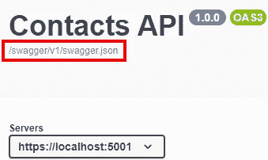
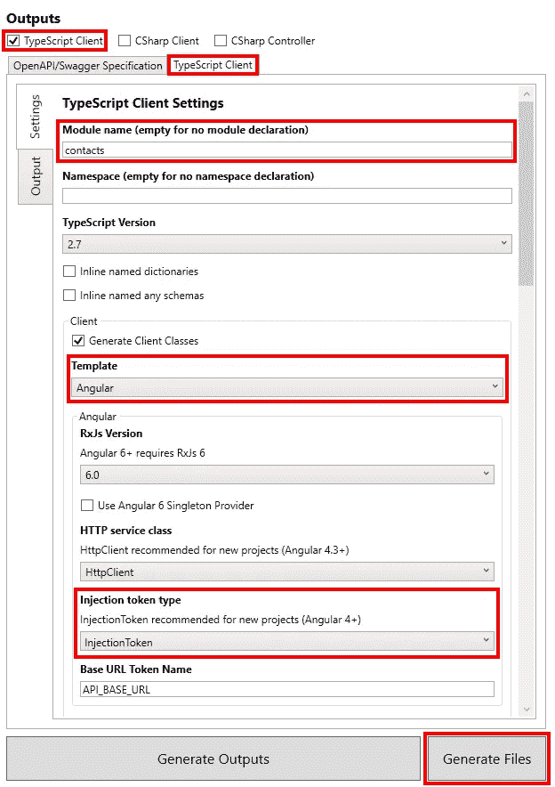

# 使用 NSwag 为 ASP.NET Core 3 API 生成 Angular 客户端

> 原文：<https://itnext.io/using-nswag-to-generate-angular-client-for-an-asp-net-core-3-api-ed88cc2e786d?source=collection_archive---------3----------------------->

本周我们将添加一个 Angular 项目，该项目将利用我们几周前创建的 API。这篇文章是我的 ASP.NET 核心基础回购改造的一部分，我开始时。网芯 3.0 发布。关于我们如何在应用程序中达到当前点的详细信息，请查看以下帖子。

[Swagger/OpenAPI 与 NSwag 和 ASP.NET 核心 3](https://elanderson.net/2019/10/swagger-openapi-with-nswag-and-asp-net-core-3/)
[ASP.NET 核心 3:将实体框架核心添加到现有项目](https://elanderson.net/2019/11/asp-net-core-3-add-entity-framework-core-to-existing-project/)
[新的 Razor Pages 项目以 API 为后盾](https://elanderson.net/2019/12/new-razor-pages-application-backed-with-an-api/)

请注意，我意识到在这个示例中使用 ASP.NET 核心支持的 Angular 项目是多余的，一个普通的 Angular 应用程序就足够了，但是我想使用 ASP.NET 核心模板作为这个系列中所有项目的基础。在最初的应用程序创建之后，除了应用程序的主 API 之外，如果有帮助的话，您可以将这个示例视为设置对辅助 API 的访问。

这篇文章中的任何改变之前的示例代码可以在[这里](https://github.com/elanderson/ASP.NET-Core-Basics-Refresh/tree/30bda427fdc7db27b754c0263e4bb76f855bfeb7)找到。

API 变更

在我们进入本帖的实际角度之前，我们将更新相关的 API 以接受所有的[跨源资源共享](https://developer.mozilla.org/en-US/docs/Web/HTTP/CORS) (CORS)请求。ASP.NET 核心设置有很多选项，如果可以的话，我建议你明确地告诉我你的 API 会接受什么。查看官方的[微软 CORS 文档](https://docs.microsoft.com/en-us/aspnet/core/security/cors?view=aspnetcore-3.0)了解更多信息。

所有需要的更改都在 API 项目的**启动**类中。CORS 设置是基于策略的，每个策略都需要一个名称，我将它存储在下面的类级别常量中。

```
private const string AllowAllCors = "AllowAll";
```

在 **ConfigureServices** 函数中添加以下内容以注册 CORS 策略。同样，如果可以的话，对您的策略进行更多的限制，但是对于这个示例，我们将开放 API 以允许任何请求。

```
services.AddCors(options =>
                 {
                     options.AddPolicy(AllowAllCors,
                                       builder =>
                                       {
                                           builder.AllowAnyHeader();
                                           builder.AllowAnyMethod();
                                           builder.AllowAnyOrigin();
                                       });
                 });
```

最后，在 **Configure** 函数中添加以下内容，以将 CORS 添加到 HTTP 管道处理中。我不是 100%确定你把它加在管道的什么地方是否重要，但是我把它加在了靠近前面的地方。我在示例应用程序中包含了一个位管道以供参考。

```
if (env.IsDevelopment())
{
    app.UseDeveloperExceptionPage();
}

app.UseCors(AllowAllCors);

app.UseHttpsRedirection();
```

这就是 API 所需的所有更改，接下来我们将创建一个新的 Angular 项目。

## 创建角度项目

为应用程序添加一个新目录，然后在终端中导航到该目录。然后，以下命令可用于创建新的角度项目。目标框架不是必需的，但是我有一个预览。NET Core 3.1 安装，我想确保这个项目是针对。网芯 3.0。

```
dotnet new angular -f netcoreapp3.0
```

接下来，使用下面的命令将新项目添加到 repo 根目录下的解决方案文件中。当然，如果你不能使用相同的代码，你的文件名和路径会有所不同。

```
dotnet sln ..\..\BasicsRefresh.sln add ContactsAngular.csproj
```

## 使用 NSwagStudio 生成角度客户端

NSwag 为客户端生成提供了多种选项，包括 CLI 选项、代码和 Windows 应用程序。这篇文章将使用名为 NSwagStudio 的 Windows 应用程序。从[这里](http://rsuter.com/Projects/NSwagStudio/installer.php)下载并安装 NSwagStudio。

接下来，确保您的 API 正在运行，并获取其 OpenAPI/Swagger 规范 URL 的 URL。例如，我正在使用我的 API 的本地实例，我需要的 URL 是[**https://localhost:5001/swagger/v1/swagger . JSON**。如果你使用的是 Swagger UI，你可以在 API 标题下找到一个到 swagger.json 的链接。](https://localhost:5001/swagger/v1/swagger.json.)



现在我们已经有了 API 的 OpenAPI/Swager 规范 URL，切换到 NSwagStudio。应用程序将打开，并带有一个准备就绪的新文档。我们需要设置几个选项。首先，选择 **OpenAPI/Swagger 规范**选项卡，并在**规范 URL** 框中输入您的 API 规范 URL。


在**输出**部分勾选**打字稿客户端**复选框，然后选择**打字稿客户端**选项卡。有很多选项可以使用，但是我突出显示了为生成这个示例的客户机而更改的选项。首先，我输入了一个名为的**模块，这样生成的代码就都在那个模块中了。对于**模板**，选择 **Angular** 非常重要，这样产生的代码将被设置用于 Angular 的依赖注入。此外，如果您使用的是新版本的 Angular，请确保将**注入令牌类型**更改为**注入令牌**。需要设置的最后一个选项是**输出文件**路径，这是您希望生成的文件所在的位置。我在 client app \ src \ app \ APIs \ contact API . ts 下输出 Angular 项目目录，设置好所有选项后点击**生成文件**。**



有关生成角度客户的更多信息，请查看关于该主题的[官方文件](https://github.com/RicoSuter/NSwag/wiki/TypeScriptClientGenerator-Angular)。

## 创建 UI 并使用生成的客户端

示例 API 是用于联系人管理的，所以我们将要构建的 UI 将显示一个联系人列表。新组件将放在 ClientApp\src\app 下的新 **contacts** 目录中。在这个目录中，我们需要两个新文件，一个用于 HTML，**contact-list.component.html，**，另一个用于后台类型脚本类，**contact-list . component . ts**。

以下是 HTML 文件上的全部内容。在这篇文章中，我不打算详细讨论 Angular，但是即使你不知道 Angular，你也会知道发生了什么。呈现的结果将是一个联系人列表。

```
<h1 id="tableLabel">Contacts</h1>

<p *ngIf="!contacts"><em>Loading...</em></p>

<table class='table table-striped' aria-labelledby="tableLabel" *ngIf="contacts">
  <thead>
    <tr>
      <th>Name</th>
      <th>Address</th>
      <th>City</th>
      <th>State</th>
      <th>Postal Code</th>
      <th>Phone</th>
      <th>Email</th>
    </tr>
  </thead>
  <tbody>
    <tr *ngFor="let contact of contacts">
      <td>{{ contact.name }}</td>
      <td>{{ contact.address }}</td>
      <td>{{ contact.city }}</td>
      <td>{{ contact.state }}</td>
      <td>{{ contact.postalCode }}</td>
      <td>{{ contact.phone }}</td>
      <td>{{ contact.email }}</td>
    </tr>
  </tbody>
</table>
```

接下来是联系人列表的 TypeScript 类。在这里，您可以看到 NSwag 生成的客户机的使用情况。相关行将突出显示。

```
import { Component } from '@angular/core';
import { contacts as Contacts } from "../apis/contactApi";

@Component({
  selector: 'app-contact-list',
  templateUrl: './contact-list.component.html'
})
export class ContactListComponent {
  public contacts: Contacts.IContact[];

  constructor(contactsClient : Contacts.ContactsClient) {
    contactsClient.getContacts().subscribe(result => {
        this.contacts = result;
      },
      error => console.error(error));
  }
}
```

正如你从上面的代码中看到的，我们注入了 **ContactClient** ，然后调用它的 **getContracts** ，并将结果赋给类的局部 **contacts** 变量。

现在我们的组件已经构建好了，我们需要将它们注册到应用程序中。这些更改位于 ClientApp\src\app 目录下的 **app.module.ts** 文件中。以下是完整的文件，不包括已有的导入，其中突出显示了与我们的联系人相关的项目的更改。

```
import { ContactListComponent } from "./contacts/contact-list.component";
import { contacts } from "./apis/contactApi";

@NgModule({
  declarations: [
    AppComponent,
    NavMenuComponent,
    HomeComponent,
    CounterComponent,
    FetchDataComponent,
    ContactListComponent
  ],
  imports: [
    BrowserModule.withServerTransition({ appId: 'ng-cli-universal' }),
    HttpClientModule,
    FormsModule, 
    RouterModule.forRoot([
      { path: '', component: HomeComponent, pathMatch: 'full' },
      { path: 'contact-list', component: ContactListComponent },
      { path: 'counter', component: CounterComponent },
      { path: 'fetch-data', component: FetchDataComponent },
    ])
  ],
  providers: [contacts.ContactsClient],
  bootstrap: [AppComponent]
})
export class AppModule { }
```

第一个变化是导入了联系人客户端的联系人列表组件和联系人 T2。接下来， **ContactListComponent** 被添加到**声明**数组中。然后我们将 **ContactListComponent** 添加到 **RouterModule** 中，这样 Angular 将知道如何将我们带到联系人列表页面。最后，我们将 **ContractsClient** 添加到 **providers** 数组中，这将允许 Angular 将客户端注入到我们的联系人列表组件中。

要将联系人列表添加到导航菜单中，我们需要更改 ClientApp\src\app\nav-menu 目录中的**nav-menu.component.html**文件。添加以下列表项以在导航栏中添加联系人链接。

```
<li class="nav-item" [routerLinkActive]="['link-active']">
  <a class="nav-link text-dark" [routerLink]="['/contact-list']"
    >Contacts</a
  >
</li>
```

## 包扎

我在重复我自己，但是 NSwag 的客户端生成使得开始使用 API 变得非常简单，但是即使随着时间的推移，能够为 API 重新生成客户端并准备好 API 中的任何更改也是非常好的。

本帖修改后的样本项目可以在[这里](https://github.com/elanderson/ASP.NET-Core-Basics-Refresh/tree/36b8b22e058a998a856bef8b7c95108b7555aaa2)找到。

*原载于* [*埃里克·安德森*](https://elanderson.net/2019/12/using-nswag-to-generate-angular-client-for-an-asp-net-core-3-api/) *。*