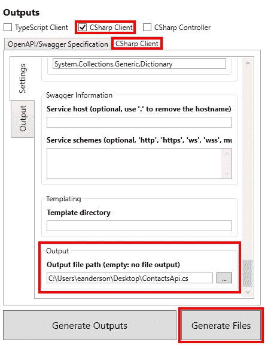

# 使用 NSwag 为 ASP.NET 核心 3.1 API 生成 Blazor 服务器客户端

> 原文：<https://itnext.io/using-nswag-to-generate-blazor-server-client-for-an-asp-net-core-3-1-api-e8236f6658f9?source=collection_archive---------4----------------------->

本周我们将添加一个 Blazor 服务器项目，该项目将利用我们几周前创建的 contacts API。这篇文章是 ASP.NET 核心基础回购的改造的一部分。网芯 3.0 发布。有关相关示例如何到达应用程序当前位置的详细信息，请查看以下帖子。

[使用 NSwag 和 ASP.NET Core 3 的 Swagger/open API](https://elanderson.net/2019/10/swagger-openapi-with-nswag-and-asp-net-core-3/)
[ASP.NET Core 3:向现有项目添加实体框架核心](https://elanderson.net/2019/11/asp-net-core-3-add-entity-framework-core-to-existing-project/)
[新的 Razor Pages 项目支持 API](https://elanderson.net/2019/12/new-razor-pages-application-backed-with-an-api/)
[使用 NSwag 为 ASP.NET Core 3 API 生成 Angular 客户端](https://elanderson.net/2019/12/using-nswag-to-generate-angular-client-for-an-asp-net-core-3-api/)
[使用 NSwag 为 ASP.NET Core 3 API 生成 React 客户端](https://elanderson.net/2019/12/using-nswag-to-generate-react-client-for-an-asp-net-core-3-api/)

在这篇文章中的任何改变之前的示例代码可以在[这里](https://github.com/elanderson/ASP.NET-Core-Basics-Refresh/tree/3d754e9a249118bd1b5697a0b88de5aba169451a)找到。

## 创建 Blazor 服务器项目

为 Blazor 服务器项目添加一个新目录，然后打开该目录的终端集。以下命令可用于创建新的 Blazor 服务器项目。

```
dotnet new blazorserver
```

接下来，使用下面的命令将新项目添加到 repo 根目录下的解决方案文件中。你的文件名和路径当然会有所不同。

```
dotnet sln ..\..\BasicsRefresh.sln add ContactsBlazorServerApp.csproj
```

## 使用 NSwageStudio 生成 API 客户端

NSwag 为客户端生成提供了多种选项，包括 CLI 选项、代码和 Windows 应用程序。这篇文章将使用名为 NSwagStudio 的 Windows 应用程序。从[这里](http://rsuter.com/Projects/NSwagStudio/installer.php)下载并安装 NSwagStudio。

接下来，确保您的 API 正在运行，并获取其 OpenAPI/Swagger 规范 URL 的 URL。例如，我正在使用我的 API 的本地实例，我需要的 URL 是[https://localhost:5001/Swagger/v1/swagger.json。](https://localhost:5001/swagger/v1/swagger.json.)如果您正在使用 Swagger UI，您可以在 API 标题下找到指向您的 Swagger . JSON 的链接。


现在我们已经有了 API 的 OpenAPI/Swager 规范 URL，切换到 NSwagStudio。应用程序将打开，并带有一个准备就绪的新文档。我们需要设置几个选项。首先，我们想使用 NetCore30 **运行时**。接下来，选择 **OpenAPI/Swagger 规范**选项卡，并在**规范 URL** 框中输入您的 API 规范 URL。


在**输出**部分，勾选 **CSharp 客户端**复选框，然后选择 **CSharp 客户端**选项卡。对于这个例子，我们将所有选项都采用默认值，除了**名称空间**，它被设置为 ContactsApi，**为客户端类生成接口**，它应该是 check，以及**输出文件路径**，它只有在您使用**生成文件**选项时才需要。单击**生成文件**按钮，NSwagStudio 将创建一个文件，其中包含访问在输入部分选择的 OpenAPI/Swager 规范中描述的 API 所需的所有代码。



如果使用与**生成文件**过程创建的代码相同的代码填充**输出**选项卡，则可以使用**生成输出**按钮，这提供了一种无需打开另一个文件即可进行设置和查看输出的好方法。

## 在 Blazor 服务器项目中设置生成的客户端

在示例项目中，创建一个**API**目录，并将使用 NSwagStudio 创建的 **ContactsApi.cs** 放在那里。用 NSwagStudio 生成的文件预计 JSON.NET 会出现，因此示例项目将需要对[微软的引用。AspNetCore . MVC . newtonsoftjson](https://nuget.org/packages/Microsoft.AspNetCore.Mvc.NewtonsoftJson)nu get 包。

有了客户端生成的和 Razor Pages 项目中的本地 API 目录，我们现在可以配置和注册它，以便在我们的新项目中使用。首先，打开 **apppsetting.json** 文件，为我们的 API 的 URL 添加一个设置，这个设置就是下面示例中的 **ContactsApi** 值。

```
{
  "Logging": {
    "LogLevel": {
      "Default": "Information",
      "Microsoft": "Warning",
      "Microsoft.Hosting.Lifetime": "Information"
    }
  },
  "AllowedHosts": "*",
  "ContactsApi": "https://localhost:5001"
}
```

既然项目已经更改了配置，并在 **Startup** 类的 **ConfigureServices** 函数中引用了 JSON.NET，我们需要告诉应用程序通过使用 **AddNewtonsoftJson** 通过依赖注入使 JSON.NET 可用，如下例所示。

```
services.AddRazorPages()
        .AddNewtonsoftJson();
```

同样在 **ConfigureServices** 函数中，我们需要注册我们的 API 客户端。

```
services.AddHttpClient<IContactsClient, 
                       ContactsClient>(client => 
         client.BaseAddress = new Uri(Configuration.GetSection("ContactsApi").Value));
```

## 创建 UI 并使用生成的客户端

现在所有的设置工作都完成了，我们可以添加联系人列表 UI，它将显示 API 客户端的用法。以下是示例的完整代码，它位于**页面**目录下的一个新的 **ContactList.razor** 文件中。突出显示了与 API 客户端相关的特定行。

```
@page "/contactlist"

@using Apis
@inject IContactsClient ContactClient

<h1>Contact List</h1>

@if (_contacts == null)
{
    <p><em>Loading...</em></p>
}
else
{
    <table className='table table-striped' aria-labelledby="tabelLabel">
        <thead>
            <tr>
                <th>Name</th>
                <th>Address</th>
                <th>City</th>
                <th>State</th>
                <th>Postal Code</th>
                <th>Phone</th>
                <th>Email</th>
            </tr>
        </thead>
        <tbody>
            @foreach (var contact in _contacts)
            {
                <tr>
                    <td>@contact.Name</td>
                    <td>@contact.Address</td>
                    <td>@contact.City</td>
                    <td>@contact.State</td>
                    <td>@contact.PostalCode</td>
                    <td>@contact.Phone</td>
                    <td>@contact.Email</td>
                </tr>
            }
        </tbody>
    </table>
}

@code {
    private ICollection<Contact> _contacts;

    protected override async Task OnInitializedAsync()
    {
        _contacts = await ContactClient.GetContactsAsync();
    }
}
```

最后，为了将我们的新页面添加到导航栏中，打开位于**共享**目录中的 **NavMenu.razor** 文件。将以下列表项添加到无序列表中。

```
<li class="nav-item px-3">
    <NavLink class="nav-link" href="contactlist">
        <span class="oi oi-list" aria-hidden="true"></span> Contacts
    </NavLink>
</li>
```

## 包扎

和我利用 NSwag 进行客户端生成的其他帖子一样，这个过程非常简单，并且简化了 API 的使用。

最终状态的样本代码可以在[这里](https://github.com/elanderson/ASP.NET-Core-Basics-Refresh/tree/0ac0e84ca999545e5cac7764a019b14ce76353c8)找到。

*最初发表于* [*埃里克·安德森*](https://elanderson.net/2020/01/using-nswag-to-generate-blazor-server-client-for-an-asp-net-core-3-1-api/) *。*