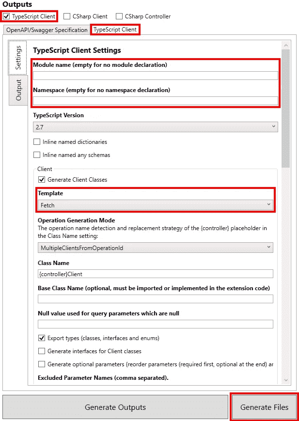
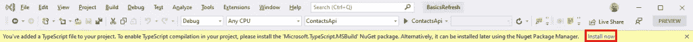

# 使用 NSwag 为 ASP.NET 核心 3 API 生成 React 客户端

> 原文：<https://itnext.io/using-nswag-to-generate-react-client-for-an-asp-net-core-3-api-9383c1b1776b?source=collection_archive---------2----------------------->

本周我们将添加一个 React 项目，该项目将利用我们几周前创建的 contacts API。这篇文章是 ASP.NET 核心基础回购的改造的一部分。网芯 3.0 发布。有关相关示例如何到达应用程序当前位置的详细信息，请查看以下帖子。

[Swagger/OpenAPI 与 NSwag 和 ASP.NET 核心 3](https://elanderson.net/2019/10/swagger-openapi-with-nswag-and-asp-net-core-3/)
[ASP.NET 核心 3:将实体框架核心添加到现有项目](https://elanderson.net/2019/11/asp-net-core-3-add-entity-framework-core-to-existing-project/)
[新的 Razor Pages 项目由 API 支持](https://elanderson.net/2019/12/new-razor-pages-application-backed-with-an-api/)
[使用 NSwag 为 ASP.NET 核心 3 API 生成 Angular 客户端](https://elanderson.net/2019/12/using-nswag-to-generate-angular-client-for-an-asp-net-core-3-api/)

我意识到使用 ASP.NET 核心支持的 React 项目对于这个示例来说是大材小用，一个原始的 React 应用程序就足够了。为了保持一致性，我选择使用 ASP.NET 核心模板作为这个系列中所有项目的基础。在最初的应用程序创建之后，除了应用程序的主 API 之外，如果有帮助或者 React 端生成的客户端可以用于包装模板生成的 API，您可以将这个示例视为设置对辅助 API 的访问。

在这篇文章中的任何变化之前的示例代码可以在这里找到。

## 创建 React 项目

为 React 项目添加一个新目录，然后打开该目录的终端集。以下命令可用于创建新的 React 项目。目标框架不是必需的，但是我有一个预览。NET Core 3.1 安装，我想确保这个项目是针对。网芯 3.0。

```
dotnet new react -f netcoreapp3.0
```

接下来，使用下面的命令将新项目添加到 repo 根目录下的解决方案文件中。当然，如果不使用示例代码，文件名和路径会有所不同。

```
dotnet sln ..\..\BasicsRefresh.sln add ContactsReact.csproj
```

## 使用 NSwagStudio 生成 React 客户端

NSwag 为客户端生成提供了多种选项，包括 CLI、代码和 Windows 应用程序。这篇文章将使用名为 NSwagStudio 的 Windows 应用程序。从[这里](http://rsuter.com/Projects/NSwagStudio/installer.php)下载并安装 NSwagStudio。

接下来，确保您的 API 正在运行，并获取其 OpenAPI/Swagger 规范 URL 的 URL。例如，我正在使用我的 API 的本地实例，我需要的 URL 是[**https://localhost:5001/swagger/v1/swagger . JSON**。](https://localhost:5001/swagger/v1/swagger.json.)如果您使用的是 Swagger UI，您可以在 API 标题下找到指向 swagger.json 的链接。


现在我们已经有了 API 的 OpenAPI/Swager 规范 URL，切换到 NSwagStudio。应用程序将打开，并带有一个准备就绪的新文档。我们需要设置几个选项。首先，选择 **OpenAPI/Swagger 规范**选项卡，并在**规范 URL** 框中输入您的 API 的规范 URL。


在**输出**部分，勾选**打字脚本客户端**复选框，然后选择**打字脚本客户端**选项卡。有很多选项可以使用，但是我强调了对这个示例很重要的选项。首先，确保**模块名**和**命名空间**都为空。我确信有办法让客户端使用模块或名称空间，但是我没有任何运气。对于**模板**，我们只需要一个基于**获取**的客户端。需要设置的最后一个选项是**输出文件**路径，这是您希望生成的文件所在的位置。我输出了 client app \ src \ app \ components \ contact API . ts 下的 Angular 项目目录，设置好所有选项后点击**生成文件**。



## 创建 UI 并使用生成的客户端

一旦完成上述操作，一旦切换回 Visual Studio，您应该会看到下面的提示来添加 **Microsoft。TypeScript . MSBuild**n 获取包。React 模板不使用 TypeScript，NSwag 也没有生成普通 JavaScript 客户端的选项，所以添加这个包将允许构建过程使用我们的 TypeScript 客户端并将其转换为 JavaScript。有一个[请求 JavaScript 生成器](https://github.com/RicoSuter/NSwag/issues/1121)的未决问题。



示例 API 是用于联系人管理的，所以我们将要构建的 UI 将显示一个联系人列表。在 ClientApp/src/component 目录下添加一个名为 **ContactList.js** 的新文件，内容如下。特定于使用 NSwag 生成的客户端的行被突出显示。

```
import React, { Component } from 'react';
import { ContactsClient } from './contactsApi';  

export class ContactList extends Component {
    static displayName = ContactList.name;

    constructor(props) {
        super(props);
        this.state = { contacts: [], loading: true };
    }

    componentDidMount() {
        this.populateContactData();
    }

    static renderContactsTable(contacts) {
        return (
            <table className='table table-striped' aria-labelledby="tabelLabel">
                <thead>
                    <tr>
                        <th>Name</th>
                        <th>Address</th>
                        <th>City</th>
                        <th>State</th>
                        <th>Postal Code</th>
                        <th>Phone</th>
                        <th>Email</th>
                    </tr>
                </thead>
                <tbody>
                    {contacts.map(contact =>
                        <tr key={contact.id}>
                            <td>{contact.name}</td>
                            <td>{contact.address}</td>
                            <td>{contact.city}</td>
                            <td>{contact.state}</td>
                            <td>{contact.postalCode}</td>
                            <td>{contact.phone}</td>
                            <td>{contact.email}</td>
                        </tr>
                    )}
                </tbody>
            </table>
        );
    }

    render() {
        let contents = this.state.loading
            ? <p><em>Loading...</em></p>
            : ContactList.renderContactsTable(this.state.contacts);

        return (
            <div>
                <h1 id="tabelLabel" >Contacts</h1>
                {contents}
            </div>
        );
    }

    async populateContactData() {
        let client = new ContactsClient();
        client.getContacts()
              .then(data => this.setState({ contacts: data, loading: false }));
    }
}
```

从上面的 **populateContactData** 代码中可以看到，我们正在创建一个 **ContactsClient** 的新实例，并调用它的 **getContacts** 函数，使用我们从 API 返回的数据来设置组件的状态。

现在联系人列表已经准备好了，它需要一个导航栏中的链接。首先，在 **App.js** 文件中，我们需要给路由器添加联系人列表。以下是完整的文件，其中突出显示了添加的行。

```
import React, { Component } from 'react';
import { Route } from 'react-router';
import { Layout } from './components/Layout';
import { Home } from './components/Home';
import { FetchData } from './components/FetchData';
import { Counter } from './components/Counter';
import { ContactList } from './components/ContactList';

import './custom.css'

export default class App extends Component {
  static displayName = App.name;

  render () {
    return (
      <Layout>
        <Route exact path='/' component={Home} />
        <Route path='/contacts' component={ContactList} />
        <Route path='/counter' component={Counter} />
        <Route path='/fetch-data' component={FetchData} />
      </Layout>
    );
  }
}
```

现在要添加一个联系人链接到导航栏，打开 **NavMenu.js** 文件，添加以下内容和其他导航项目。

```
<NavItem>
    <NavLink tag={Link} className="text-dark" to="/contacts">Contacts</NavLink>
</NavItem>
```

## 包扎

这一轮让 NSwag 客户机工作起来我遇到了更多的麻烦，但这更多是由于我对 React 的肤浅了解，而不是 NSwag 的问题。

本帖所有修改后的样本项目可以在[这里](https://github.com/elanderson/ASP.NET-Core-Basics-Refresh/tree/506c43ccf76e65ef6b5e215fdd75744d41b4a332)找到。

*最初发表于* [*埃里克·安德森*](https://elanderson.net/2019/12/using-nswag-to-generate-react-client-for-an-asp-net-core-3-api/) *。*