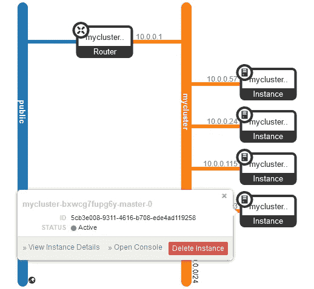

# 第 4 部分:使用 OpenStack Magnum 创建 Kubernetes 集群

> 原文：<https://itnext.io/using-openstack-magnum-to-create-a-kubernetes-cluster-af8ec3cfbda5?source=collection_archive---------0----------------------->

这是关于在 OpenStack 上运行 Kubernetes 的系列文章的第 4 部分。

本系列第一部分的[中的 local.conf 文件包含以下三行来设置 Magnum:](/a-single-server-devstack-cloud-as-a-kubernetes-platform-cd30e28e405a#ad9b)

```
enable_plugin heat [https://github.com/openstack/heat](https://github.com/openstack/heat) stable/ussuri enable_plugin magnum [https://github.com/openstack/magnum](https://github.com/openstack/magnum) stable/ussuri 
enable_plugin magnum-ui [https://github.com/openstack/magnum-ui](https://github.com/openstack/magnum-ui) stable/ussuri
```

如果您按照说明进行了操作，那么您已经具备了创建 Kubernetes 集群所需的环境。使用非管理员 Keystone 用户；为此我创建了一个用户和一个项目，都命名为 *kube* ，但是你也可以使用用户 *demo* ，项目 *demo* ，它们是由 Devstack 的 *stack.sh* 设置的。

可以在第 2 部分中手工创建的集群旁边操作 Magnum 集群，但是您可能没有足够的资源(主要是磁盘空间和 RAM)来同时操作这两个集群。在继续之前，请考虑拆除现有群集或创建新的 Devstack。

从所谓的*集群模板*开始，它描述了大多数集群属性。Magnum 使用模板概念来允许设置具有相似特征的聚类。你的大部分工作都进行到这一步。

接下来，您将基于集群模板创建一个集群。这是一个简单的步骤，但 Magnum 将花费几分钟启动复杂的热栈来设置集群的资源。

第三步是安装 kubectl 并获得必要的 *kubeconfig* 。

# 第一步:集群模板

Magnum 集群模板定义了集群的基本属性，包括集群服务器详细信息、网络参数、卷参数，以及最后但并非最不重要的集群管理环境(除了 Kubernetes 集群，Magnum 还可以管理 Docker Swarm 和 Mesos 集群)。

下面的命令创建了一个名为 *mytemplate:* 的模板

```
$ source /home/stack/devstack/openrc kube kube
$ openstack coe cluster template create mytemplate 
            --image Fedora-AtomicHost-29-20190820.0.x86_64 
            --master-flavor m1.small --flavor m1.small 
            --external-network public --dns-nameserver 192.168.1.16          
            --network-driver flannel --coe kubernetes 
            --volume-driver cinder --docker-volume-size 5
            --master-lb-enabled --keypair kubekey
```

让我们仔细看看参数。更多信息，参见[文档](https://docs.openstack.org/magnum/ussuri/user/index.html#clustertemplate)。

## 服务器参数

```
 --image Fedora-AtomicHost-29-20190820.0.x86_64 
            --master-flavor m1.small --flavor m1.small
```

所有集群服务器都使用 stack.sh 自动添加到映像目录中的 Fedora-AtomicHost 映像。如果你想使用不同的图像，请注意，现成图像的选择非常有限，并且有条件创建自己的图像。参见 [Magnum 的文档](https://docs.openstack.org/magnum/ussuri/user/index.html#image-management)。

flavor 参数分别定义集群控制器(“主设备”)和节点的大小。在这个例子中使用的*小*风味是运行 Kubernetes 的最低限度。这也是默认的——两个风味参数可以被省略。

注意，控制器和节点的*数量*没有在集群模板中定义。

## 网络参数

```
 --external-network public --dns-nameserver 192.168.1.16          
            --network-driver flannel 
```

Magnum 将集群节点连接到它们自己的 OpenStack 网络。该网络必须连接到外部网络才能下载 Kubernetes 软件。这就是为什么你必须告诉 Magnum 一个合适的**外部网络**的名字，这里是*公共*。

集群节点需要 DNS 来访问软件存储库。默认情况下，Magnum 使用 8.8.8.8 作为 **DNS 服务器**。

**网络驱动程序**决定用于连接 pod 的覆盖技术。对于 Kubernetes 集群，可以选择*法兰绒*或*印花布*。由于*法兰绒*是默认的，该参数可以被省略。

## 存储参数

```
 --volume-driver cinder --docker-volume-size 5
```

对于 Kubernetes 来说，唯一可能的体积驱动因素是煤渣。如果不考虑此参数，基于此模板的集群没有卷。

**docker 音量大小**参数与音量驱动无关。它确定附加到每个群集节点并包含容器映像的 Cinder 卷的大小。如果忽略此参数，图像将存储在节点的临时存储中。

## 其他参数

```
 --master-lb-enabled --keypair kubekey
            --coe kubernetes
```

如果部署了多个集群控制器，Magnum 会设置**负载平衡**。这个例子中的参数是多余的，因为默认情况下使用 Neutron 的标准负载平衡器。如果您的 OpenStack 集群不包括中子负载平衡器，您可以设置`--master-lb-enabled=false`，在这种情况下，Magnum 会在其中一个控制器上创建一个负载平衡器。

**密钥对**提供对集群控制器和节点的 SSH 访问。它必须在设置模板之前存在。如果省略此参数，则在创建集群时必须提供一个密钥对。SSH 用户依赖于用于供应服务器的映像；在 *Fedora-AtomicHost* 的情况下，就是 *fedora* 。

**COE** 代表*容器编排引擎*。Magnum 支持 Kubernetes、Docker Swarm 和 Mesos。

当依赖默认值而不使用 Cinder volumes 时，最短的模板创建命令可能是

```
$ openstack coe cluster template create mytemplate 
            --image Fedora-AtomicHost-29-20190820.0.x86_64 
            --external-network public --coe kubernetes 
```

# 第二步:集群

一旦定义了模板，就可以启动集群，例如

```
$ openstack coe cluster create mycluster 
            --master-count 2 --node-count 2 
            --cluster-template mytemplate
```

除了集群模板的名称之外，您还需要指定集群中控制器(“主节点”)和节点的数量。

Magnum 将创建集群网络，并将其路由至集群模板中指定的外部网络。然后，它将启动请求数量的控制器和节点，并根据集群模板参数为它们提供 Kubernetes 软件。结果是:



Horizon 网络拓扑屏幕

执行大部分工作的是 OpenStack 的编排服务 *Heat* 。Magnum 使用热模板创建和供应资源，并启动嵌套热堆栈。集群创建完成后，花点时间查看一下创建的资源。这里，为了便于阅读，我使用了 YAML 输出格式:

```
$ openstack stack list --nested -f yaml
```

显示了大约 16 个深度嵌套的堆栈。它们的名字表明了它们的用途；其中，你会发现用于创建*奴才*(集群节点的过时名称)和*主人*(控制器)，以及设置网络和负载平衡器的堆栈。

如果集群创建失败，第一个故障排除步骤应该是分析具有失败完成状态的堆栈。

要列出热堆栈资源:

```
$ openstack stack resource list $(openstack stack list -f value -c ID) -n 5 -c resource_name -c resource_type
```

这将打印堆栈嵌套级别为 5 的所有资源。准备好一长串吧。

# 第三步:kubectl 和 kubeconfig

如果您仍然需要安装 *kubectl* ，您可以选择从其中一个 Kubernetes 集群服务器复制它:

```
$ openstack server list -c Name -c Networks
+--------------------------+-------------------------------------+
| Name                     | Networks                            |
+--------------------------+-------------------------------------+
| mycluster-(...)-node-0   | mycluster=10.0.0.57, 192.168.1.221  |
| mycluster-(...)-node-1   | mycluster=10.0.0.24, 192.168.1.215  |
| mycluster-(...)-master-1 | mycluster=10.0.0.115, 192.168.1.239 |
| mycluster-(...)-master-0 | mycluster=10.0.0.193, **192.168.1.236** |
+--------------------------+-------------------------------------+
$ scp -i kubekey fedora@192.168.1.239:/srv/magnum/bin/kubectl .
$ chmod +x kubectl
$ sudo mv kubectl /usr/local/bin
```

或者直接从网上安装[。](https://kubernetes.io/docs/tasks/tools/install-kubectl/#install-kubectl-binary-with-curl-on-linux)

*kubectl* 需要一个 *kubeconfig* 文件来访问集群。使用以下命令生成它:

```
$ openstack coe cluster config mycluster
export KUBECONFIG=/home/stack/config
```

*kubeconfig* 文件是`/` home/stack/config`。在运行 *kubectl* 命令之前，将上面的 *KUBECONFIG* 变量添加到 shell 环境中。您可以一步到位:` eval $(open stack Coe cluster config my cluster)`。

检查这是否有效:

```
$ kubectl get nodes
NAME                              STATUS   ROLES    AGE   VERSION
mycluster-bxwcg7fupg6y-master-0   Ready    master   17h   v1.15.7
mycluster-bxwcg7fupg6y-master-1   Ready    master   17h   v1.15.7
mycluster-bxwcg7fupg6y-node-0     Ready    <none>   16h   v1.15.7
mycluster-bxwcg7fupg6y-node-1     Ready    <none>   16h   v1.15.7
```

请看一下配置文件:

```
apiVersion: v1
clusters:
- cluster:
    certificate-authority-data: (...)
    **server:** [**https://192.168.1.212:6443**](https://192.168.1.212:6443)
  name: mycluster
contexts:
- context:
    cluster: mycluster
    **user: admin**
  name: default
current-context: default
kind: Config
preferences: {}
users:
**- name: admin**
  user:
    client-certificate-data: (...) 
    client-key-data: (...)
```

在本例中，唯一配置的用户是*管理员*。 [192.168.1.212](https://192.168.1.212:6443) 是访问集群的 IP 地址。事实上，它是面向两个控制器的负载平衡器的地址。探索这个。

```
$ openstack floating ip show 192.168.1.212 -c port_details --fit-width
+--------------+--------------------------------------------------+
| Field        | Value                                            |
+--------------+--------------------------------------------------+
| port_details | admin_state_up='False', device_id='lb-**f3173216-6** |
|              | **70c-4ab9-a409-870faefbe79b'**,                     |
|              | device_owner='Octavia',                          |
|              | mac_address='fa:16:3e:2e:e7:97', name='octavia-  |
|              | lb-f3173216-670c-4ab9-a409-870faefbe79b', networ |
|              | k_id='b5f78071-4687-4b6d-afda-94af9b087c2b',     |
|              | status='DOWN'                                    |
+--------------+--------------------------------------------------+
```

浮动 IP 属于一个端口，其详细信息显示它属于一个奥克塔维亚负载平衡器。 *device_id* 包含负载平衡器的 UUID。

```
$ openstack loadbalancer show f3173216-670c-4ab9-a409-870faefbe79b --fit-width
+---------------------+-------------------------------------------+
| Field               | Value                                     |
+---------------------+-------------------------------------------+
| admin_state_up      | True                                      |
| availability_zone   | None                                      |
| created_at          | 2020-12-29T10:21:28                       |
| description         |                                           |
| flavor_id           | None                                      |
| id                  | f3173216-670c-4ab9-a409-870faefbe79b      |
| listeners           | 1369821a-3135-4530-a9a9-500800b2968a      |
| name                | mycluster-                                |
|                     | bxwcg7fupg6y-api_lb-6rnh26aei5az-         |
|                     | loadbalancer-rdpliqadtpqk                 |
| operating_status    | OFFLINE                                   |
| pools               | ee0ec855-894a-4c1b-b649-5c5484f00554      |
| project_id          | 7a099eff1fb1479b89fa721da3e1a018          |
| provider            | amphora                                   |
| provisioning_status | ACTIVE                                    |
| updated_at          | 2020-12-29T10:22:52                       |
| vip_address         | 10.0.0.189                                |
| vip_network_id      | b5f78071-4687-4b6d-afda-94af9b087c2b      |
| vip_port_id         | 41645143-e588-4c33-b24b-899e3af16fb7      |
| vip_qos_policy_id   | None                                      |
| vip_subnet_id       | 6ff8f4a6-d8c0-4ac3-bbc2-7a749b589e53      |
+---------------------+-------------------------------------------+
```

确认此负载平衡器面向控制器。您需要列出池，然后列出池成员，然后将池成员的地址与您的服务器进行比较:

```
$ openstack loadbalancer pool list --loadbalancer f3173216-670c-4ab9-a409-870faefbe79b -f yaml
- admin_state_up: true
  **id: ee0ec855-894a-4c1b-b649-5c5484f00554**
  lb_algorithm: ROUND_ROBIN
  name: mycluster-bxwcg7fupg6y-api_lb-6rnh26aei5az-pool-it3fiw7obbhi
  project_id: 7a099eff1fb1479b89fa721da3e1a018
  protocol: TCP
  provisioning_status: ACTIVE$ openstack loadbalancer member list ee0ec855-894a-4c1b-b649-5c5484f00554 -c address
+------------+
| address    |
+------------+
| 10.0.0.193 |
| 10.0.0.115 |
+------------+
$ openstack server list -c Name -c Networks
+--------------------------+-------------------------------------+
| Name                     | Networks                            |--------------------------+-------------------------------------+
| mycluster-(...)-node-0   | mycluster=10.0.0.57, 192.168.1.221  |
| mycluster-(...)-node-1   | mycluster=10.0.0.24, 192.168.1.215  |
| mycluster-(...)-master-1 | mycluster=10.0.0.115, 192.168.1.239 |
| mycluster-(...)-master-0 | mycluster=10.0.0.193, 192.168.1.236 |
+--------------------------+-------------------------------------+
```

负载平衡器池成员地址确实对应于两个主实例。