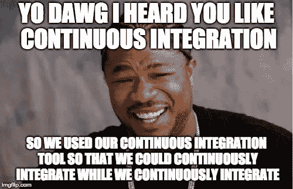
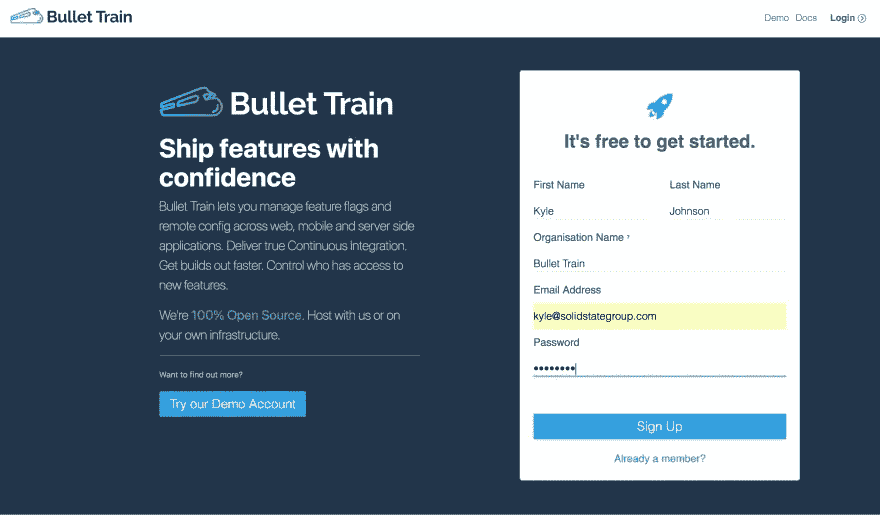
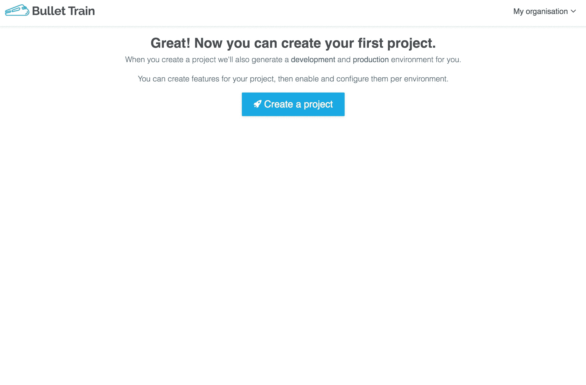
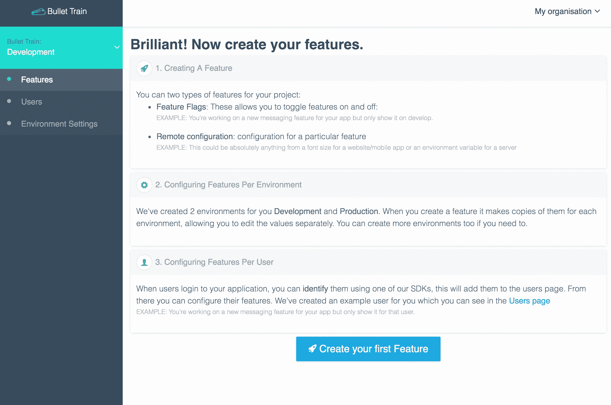
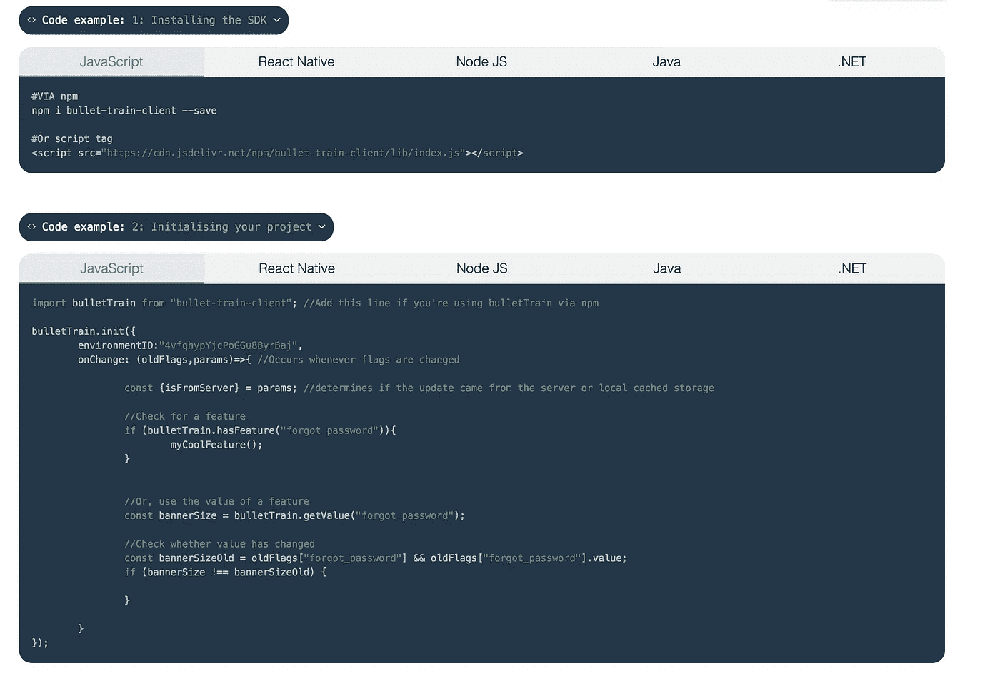
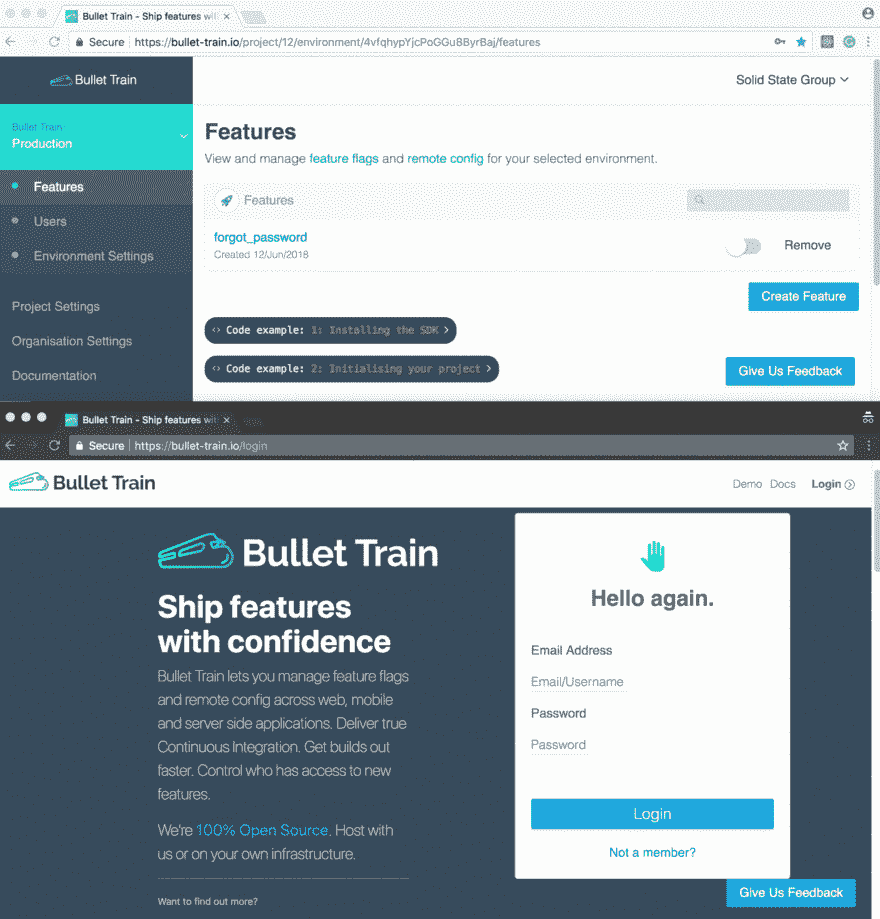

# 使用我们的持续集成工具持续集成我们的持续集成工具

> 原文：<https://itnext.io/using-our-continuous-integration-tool-to-continuously-integrate-our-continuous-integration-tool-e6052c56ce5d?source=collection_archive---------8----------------------->

在开发我们的特性标记工具[子弹头列车](https://bullet-train.io)的过程中，我们实际上是在使用子弹头列车来开发子弹头列车，这样我们就可以在持续集成的同时持续集成。

我们开发子弹头列车是因为我们相信持续集成是所有开发团队都应该追求的。特性标志和远程配置对实现 CI 目标有很大的帮助，尤其是在生产中。因此，遵循这一信念，为了避免虚伪，我们利用它对 CI 的好处来开发工具本身。

Bullet Train 是一个开源项目，允许您将发布和配置功能与代码分开。您可以在 web、移动和服务器端应用程序上跨多种语言管理功能标志和远程配置。

# 使用 CI 和子弹头列车并不是全有或全无的决定

开发人员通常会将向持续集成的飞跃视为一个要么全有要么全无的决定，但事实并非如此。CI 可以在项目中的任何时候使用，使用特性标志在一个特性接一个特性的基础上推广到生产中。

证明这一点的一个很好的例子是我们如何开始使用子弹头列车。我们在 2018 年 6 月推出了初始测试版。在发布之后，我们立即开始了忘记密码的功能。

在这一点上，项目是稳定的，我们使用[夜间监视](http://nightwatchjs.org/)进行端到端测试，它随着我们推送的每个提交而运行，所以我们处于开始使用持续集成的最佳位置。这些是我们创建项目并将新的忘记密码功能与子弹头列车集成时所采取的准确记录的步骤。

# 第一步:注册

首先，我们在[子弹头列车](https://bullet-train.io)上创建了一个账户。

# 步骤 2:创建项目

步骤 1 自动创建了一个名为子弹头列车的组织，并将我添加为会员。下一步是创建一个项目。

# 步骤 3:为“忘记密码”创建了一个功能标志

子弹头列车自动为新创建的项目创建开发和生产环境。我们创建了一个名为 forgot _ password 的特性标志。

# 第四步:整合

此时，我们有一个忘记密码的特性，它在我们的开发和生产环境中都被禁用了。下一步是使用 JavaScript SDK 来显示/隐藏我们的忘记密码特性。

当我创建这个特性的时候，我得到了一些代码片段来安装和集成到我们的代码中。

当然，如何整合，就看你自己了。在我们的例子中，我们有一个 React 应用程序和一个 Flux store，当特性标志改变时，它会进行广播。最后，我们的主页会根据子弹头列车返回的内容显示忘记密码链接。您可以在这里看到这个进程[的提交。](https://github.com/SolidStateGroup/bullet-train-frontend/commit/8192b905e2ef177817bcabb91f5693a5b785fc4d#diff-9cc8a89e380f5af71da71c573661881dR98)

使用特性标志意味着我可以在不妨碍其他开发的情况下将这个特性发布到产品中。

# 步骤 5:启用功能

有了我在生产中的新的忘记密码特性，我所要做的就是启用它，这样它就可以被部署到世界各地。当我在仪表板中启用忘记密码功能时，我可以在网站上看到它。

# 这对我们有什么帮助？

不习惯持续集成的人可能会想:为什么我不像往常一样发布这个特性呢？特性标志是如此好的方法的一些原因:

-它使我能够移动以实现生产的持续整合。现在，推送到主服务器的每个提交都会自动构建到生产环境中。
-它引入了在产品中测试代码的能力，逐步/有针对性地向特定用户推广。
-它使非技术团队成员能够管理功能发布。
-它能够根据最新的代码库尽早测试特性。CI 意味着我们不断地在非常接近生产中运行的情况下测试功能。
-它允许你引入测试程序以获得早期用户反馈。
-通过在紧急情况下远程关闭功能，减少了回滚代码的需要。

**快乐发展！**

