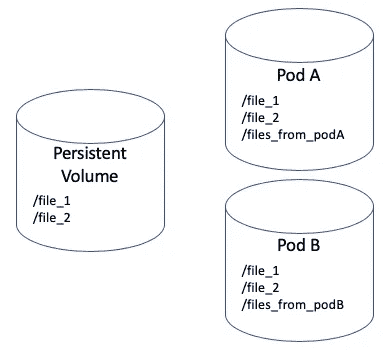
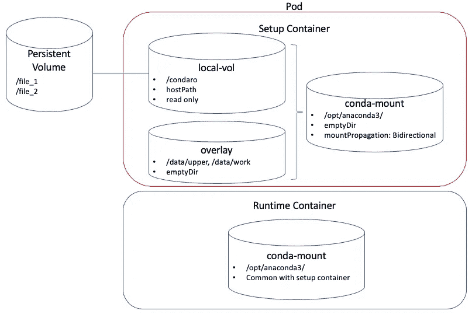

# 在 Kubernetes 上使用覆盖安装

> 原文：<https://itnext.io/using-overlay-mounts-with-kubernetes-960375c05959?source=collection_archive---------2----------------------->

您是否曾经想要授予 Kubernetes pod 对持久卷的读/写访问权限，但不想让 pod 的更改持久保存在备份存储中？这不同于简单地以只读方式挂载卷，因为出于某种原因，pod 需要能够写入文件系统。



豆荚体积的变化是短暂的

## 我的使用案例

我遇到的特定用例必须提供一组标准的基本 [*【康达】*](https://www.anaconda.com/) 环境，同时让 pod 定制环境。对于那些不熟悉的人来说， *conda* 是一个软件包管理器，通常用于分发科学软件包。每个环境都是一组独立的包，类似于 Python 环境。在这个用例中，我们提供了一组库存环境，但是如果 pod(用户)认为我们缺少他们真正想要的包，他们可以简单地将该包临时安装到他们的 pod 中，并且不让库存环境的其他用户看到它。也就是说，这个解决方案可以应用于许多其他的用例——你不需要对 conda 一无所知就可以继续阅读。

## 核心理念

标准的 Linux 覆盖文件系统正是这样做的。它允许您获取一个公共(通常是只读)文件系统，并挂载它，允许用户以读/写模式与公共文件系统中的所有内容进行交互，而不会影响原始文件系统。

## 简单溶体

最简单的做法是在容器内部使用覆盖挂载。容器将以只读方式访问公共卷，并创建一个覆盖挂载。但不幸的是，这不符合我的要求，因为这要求最终用户的容器具有升级的权限(SYS_ADMIN)和覆盖挂载的知识。在我的例子中，终端用户的容器可以运行任意的终端用户代码，因此需要被严格锁定。

# 完全解决方案



**Sidecar / Setup 容器:**你需要一个新的 Sidecar 容器来存放运行的映像。这个边车负责

*   创建一个覆盖挂载，用一个 emptyDir 临时挂载覆盖只读的原始 conda 环境。
*   传播挂载，以便运行时映像可以访问覆盖图。
*   安装额外的软件包或创建一个全新的 env —基于最终用户定义的任何内容。

**运行时容器:**运行时容器访问与**设置**容器相同的 *conda-mount* 卷，所有更改可见。在我的用例中，我选择将结果挂载为只读，以避免用户进一步填满**覆盖**卷。

# 细节

## 卷装载

1.  **local-vol** —这是一个主机路径卷，用于访问主机上的基本 conda 环境。注意，这可以是任何类型的持久卷—为了简单起见，我只是碰巧使用了 hostPath。
2.  **覆盖** —这是一个包含覆盖上层和工作目录的空目录(对 pod 来说是暂时的，但是存储在主机上)。这是所有对**本地卷**的更改被存储的地方。
    注意:如果你真的不想保存在磁盘上，你可以用内存备份，但是那会耗尽主机内存，所以要避免这样做。
3.  **conda-mount** —这是一个实际上保存零数据的空目录。我们将它用作最终 conda 环境的挂载点(/opt/anaconda3)。该卷在 pod 中的两个容器之间共享，并利用装载传播。

## 安装传播

```
volumeMounts:
- mountPath: /opt/anaconda3
  name: conda-mount
  [mountPropagation: Bidirectional](https://kubernetes.io/docs/concepts/storage/volumes/#mount-propagation)
```

在**设置**容器中对 conda-mount 卷所做的任何挂载更改都会传播到主机，因此也允许**运行时**容器看到覆盖挂载。这才是真正的神奇。

请注意，传播的挂载是包含零数据的 **conda-mount** 。它只是覆盖挂载点。原始的 **local-vol** 内容不受影响。

它要求**设置**容器在特权模式下运行(k8s 强制执行这一点)。

```
securityContext:
  privileged: true
```

注意**运行时**容器不需要*而不是*特权运行。这就是我们想要的，因为运行时容器可以运行任意代码。

## 安装容器

**任务:****设置**容器负责:

```
args:
— mkdir -p /data/{upper,work}; 
  mount -t overlay -o lowerdir=/condaro/,upperdir=/data/upper,workdir=/data/work overlay /opt/anaconda3; 
  . /opt/anaconda3/etc/profile.d/conda.sh; 
  conda activate dlipy3; 
  conda install agate -y; 
  conda deactivate; 
  touch /opt/anaconda3/setup_complete; 
  tail -f /dev/null;
```

1.  设置覆盖安装。它使用短暂的**覆盖**卷来托管覆盖挂载的*上部*和*工作目录*(这是所有更改持续的地方)。
2.  进行短暂的修改——在这种情况下，它激活 **dlipy3** conda 环境，安装 *agate* 包，然后停用该环境(以避免阻止将来的卸载)。
3.  添加指示安装完成的标志。这是共享覆盖挂载中的一个文件，允许**运行时**容器等待，直到**设置**容器完成。
4.  现在它在等待——我们必须保持容器运行。

当你使用挂载传播时，你必须卸载一些东西。如果不这样做，Kubernetes 将使 pod 处于*终止*状态，因为卷没有清理。因此，我们添加了一个 preStop 钩子来确保覆盖挂载被移除。

```
lifecycle:
  preStop:
    exec:
      command: [“umount”, “/opt/anaconda3”]
```

## 运行时容器

运行时容器简单地挂载 **conda-mount** 卷(覆盖挂载点)，并检查共享挂载中是否存在 *setup_complete* 文件，以获取 readinessProbe。这很重要，这样容器在准备好之前不会开始消耗挂载。

```
readinessProbe:
  exec:
    command:
    — cat
    — /opt/anaconda3/setup_complete
  initialDelaySeconds: 0
  periodSeconds: 1
  failureThreshold: 300
```

# 把所有的放在一起

这是完整的 yaml 示例。一个简单的`kubernetes create -f example.yaml`应该就可以了。您可能希望修改主机路径路径。

```
kind: Deployment
metadata:
  name: k8s-overlay-mounts
  labels:
    app: test-me
spec:
  selector:
    matchLabels:
      app: test-me
  template:
    metadata:
      labels:
        app: test-me          
    spec:            
      containers:
      - securityContext:
          privileged: true
        image: ubuntu:18.04
        name: setup
        command: [ "/bin/bash", "-c", "--" ]
        args:
        - mkdir -p /data/{upper,work}; 
          mount -t overlay -o lowerdir=/condaro/,upperdir=/data/upper,workdir=/data/work overlay /opt/anaconda3; 
          . /opt/anaconda3/etc/profile.d/conda.sh; 
          conda activate dlipy3; 
          conda install agate -y; 
          conda deactivate; 
          touch /opt/anaconda3/setup_complete; 
          tail -f /dev/null;
        volumeMounts:
        - mountPath: /condaro
          name: local-vol
          readOnly: true
        - mountPath: /data
          name: overlay
        - mountPath: /opt/anaconda3
          name: conda-mount
          mountPropagation: Bidirectional
        lifecycle:
          preStop:
            exec:
              command: ["umount", "/opt/anaconda3"]
      - image: ubuntu:18.04
        name: run
        command: [ "tail", "-f", "/dev/null" ]
        volumeMounts:
        - mountPath: /opt/anaconda3
          name: conda-mount
          readOnly: true
        readinessProbe:
          exec:
            command:
            - cat
            - /opt/anaconda3/setup_complete
          initialDelaySeconds: 0
          periodSeconds: 1
          failureThreshold: 300
      volumes:
      - name: local-vol
        hostPath: 
          path: /opt/anaconda3/
      - name: overlay
        emptyDir: {}
        #          medium: Memory
      - name: conda-mount
        emptyDir: {}
```

# 你为什么不做…？

为什么不使用 initContainer 进行设置？
因为有人要卸载覆盖。如果我们不这样做，Kubernetes 无法清理吊舱，因为一个悬挂的安装。所以我们需要清理出口处的支架。

我们可以在*运行*容器中卸载它，但是*运行*容器需要是一个特权容器——这是我们不想要的。

***为什么不用 run 容器安装新东西？***
因为我希望运行时容器在修改底层 conda 环境方面没有任何智能。这里没有要求——无论用户是否请求对 conda 环境进行更改，都希望保持事物的通用性。我们还在运行时容器中运行任意代码，并希望尽可能锁定运行时容器。

为什么不使用 initContainer 将文件复制到临时卷中？
因为慢。它可以达到同样的技术效果，但是非常昂贵。

***为什么不直接挂载 conda 环境只读，利用 Conda 对~/的使用。康达？***
如果您的 conda 基础安装是只读的，那么 conda 会自动将新的环境和包缓存放入~/.conda 中。对于我们来说，这不是一个完整的解决方案有两个原因:

1.  这对于修改一个现有的环境不起作用(例如:`conda install X`)。更新现有环境比创建一个具有相同内容的全新环境要快得多(取决于环境的大小)。
2.  Conda 不能利用跨文件系统的硬链接。因此，当你在`~/.conda/`创建一个新环境时，它会制作文件的副本，而不是只做硬链接，这增加了存储空间和时间。