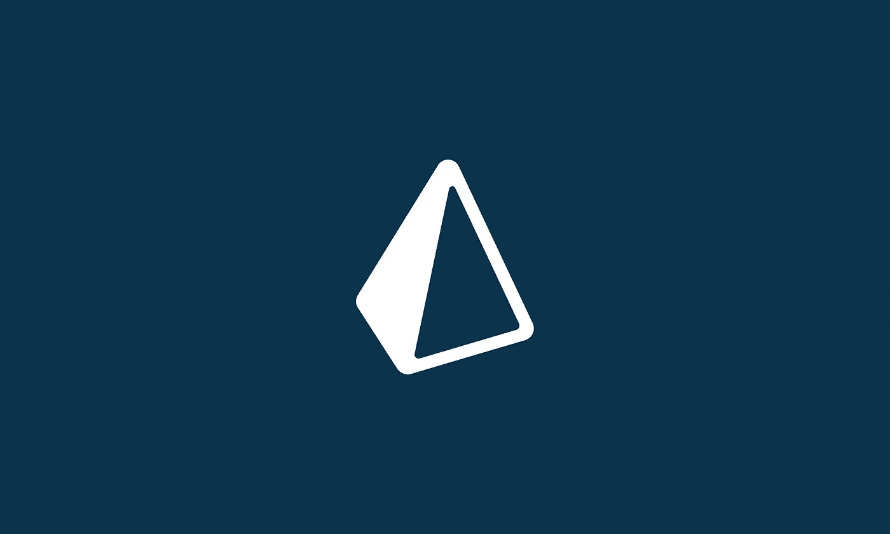
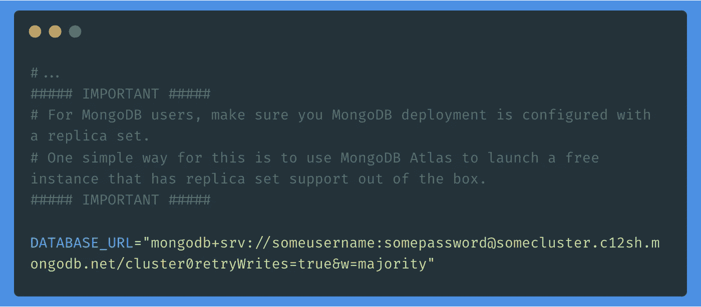
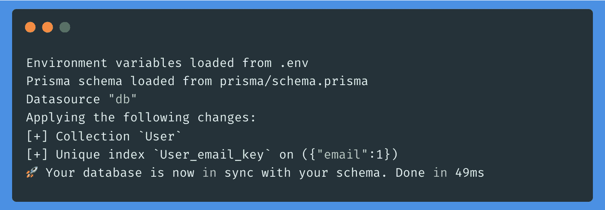
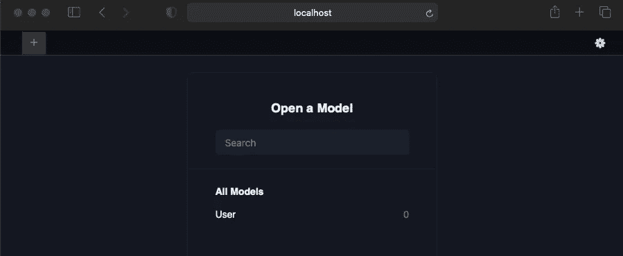
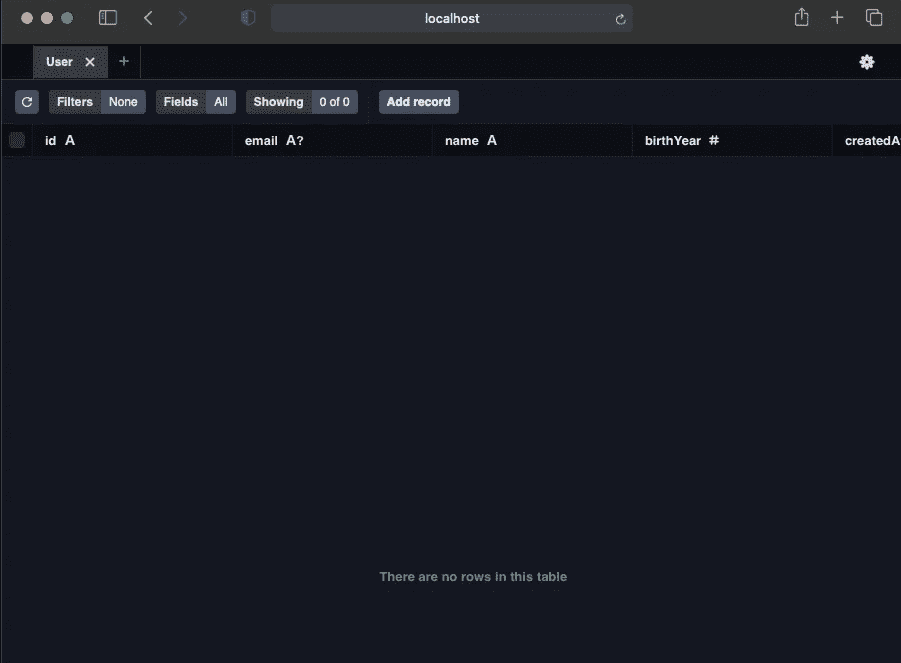
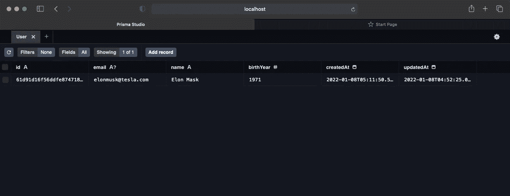
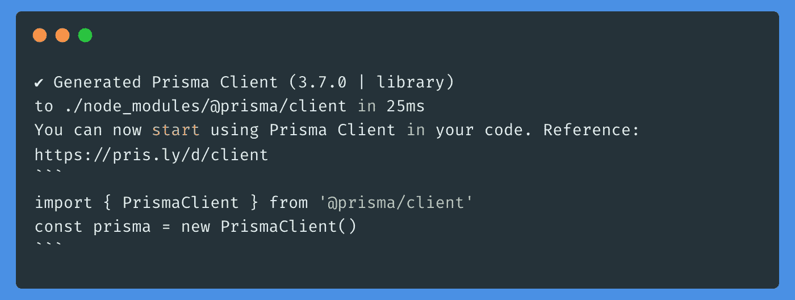

# 在 Next.js 中使用 Prisma ORM 和 MongoDB

> 原文：<https://itnext.io/using-prisma-orm-with-mongodb-in-next-js-e42b1f7543e6?source=collection_archive---------1----------------------->

让我们创建一个简单的 CRUD 应用程序👉



[https://www.prisma.io/](https://www.prisma.io/)

## 🚨重要说明🚨

👉Prisma 的 MongoDB 连接器仍在预览中。

👉另外，在我们开始本教程之前，请确保您的 MongoDB 部署配置了**副本集**。

> 一个简单的方法是使用 [MongoDB Atlas](https://www.mongodb.com/cloud/atlas) 来启动一个免费的实例，它支持开箱即用的副本集。

这里有一个[指南](https://docs.mongodb.com/manual/tutorial/convert-standalone-to-replica-set/)将独立部署转换为副本集。

[](https://docs.mongodb.com/manual/tutorial/convert-standalone-to-replica-set) [## 将独立集转换为副本集

### 本教程描述了将独立实例转换为副本集的过程。使用独立实例…

docs.mongodb.com](https://docs.mongodb.com/manual/tutorial/convert-standalone-to-replica-set) 

想了解更多信息，请前往 [Prisma 的文档](https://www.prisma.io/docs/concepts/database-connectors/mongodb#troubleshooting)。

[](https://www.prisma.io/docs/concepts/database-connectors/mongodb#troubleshooting) [## MongoDB 数据库连接器

### MongoDB 数据源连接器将 Prisma 连接到托管的 MongoDB 实例。如果您想了解有关…的最新信息

www.prisma.io](https://www.prisma.io/docs/concepts/database-connectors/mongodb#troubleshooting) 

## 1.创建新的 Next.js 应用程序

我们可以使用这个简单的命令开始:

`npx create-next-app someappname`

`cd someappname`

## 2.安装 Prisma CLI

让我们安装 Prisma CLI 工具。我们可以将它作为开发依赖项来安装。

`npm install --dev prisma`

## 3.在应用程序中初始化 Prisma

现在我们可以使用 CLI 工具创建几个与 Prisma 相关的文件。运行此命令开始。

`npx prisma init`

你会注意到一个`/prisma`文件夹已经被创建，里面有一个`schema.prisma`文件。还有一个新的`/.env`。

## 4.添加环境变量

上一步创建的`/.env`文件将包含一个`DATABASE_URL`变量。将它更改为 MongoDB 连接字符串。我在本教程中使用的是 MongoAtlas 部署，所以我的`/.env`看起来像这样:



🚨确保将`.env`添加到`.gitignore`

## 5.定义模式

在 Prisma 中定义模式很简单。您有一个`/prisma/schema.prisma`，我们在这里定义我们希望在应用程序中使用的模型。如果你用的是 VSCode，我建议下载 [Prisma VSCode 扩展](https://marketplace.visualstudio.com/items?itemName=Prisma.prisma)

[](https://marketplace.visualstudio.com/items?itemName=Prisma.prisma) [## Prisma - Visual Studio 市场

### 为 Prisma 模式文件添加语法高亮显示、林挺、代码完成、格式化、跳转到定义等功能

marketplace.visualstudio.com](https://marketplace.visualstudio.com/items?itemName=Prisma.prisma) 

一个简单的`/prisma/schema.prisma`文件如下所示。确保文件扩展名只有`.prisma`T24，没有 T3。

✅ `**schema.prisma**` ❌ `schema.prisma.js`

我们已经定义了一个非常简单的`User`模式，它:

1.  自动生成唯一用户`id`。
2.  有一个`unique` `email`字段
3.  一个`name`字段和一个`birthYear`字段。
4.  `createdAt`和`updatedAt`将被自动处理。

## 6.将模式与数据库同步

既然我们已经编写了模式，我们需要在数据库中创建这些集合。这也是在 Prisma 中使用 CLI 工具自动完成的。输入以下命令:

`npx prisma db push`

结果应该是这样的:



既然我们的数据库已经建立，我们可以使用 Prisma Studio 来探索我们的收藏。使用以下命令:

`npx prisma studio`

Prisma Studio 将在您的浏览器中打开一个标签页，用于`[http://localhost:5555/](http://localhost:5555/)`



你会注意到我们的`User`型号在`All Models`下面。点击它打开收藏。



您将看到我们在模式中声明的所有字段。让我们添加一个来自 Prisma Studio 的新用户。点击`Add record`并输入`email, name, and birthYear`字段。点击`Save`，你应该会看到你的新条目。



## 7.生成 Prisma 客户端

现在，为了允许我们以编程方式与数据库进行交互，我们需要首先生成 Prisma 客户机。

```
npm install @prisma/clientnpx prisma generate
```

在第二个命令之后，您应该会在终端中看到类似这样的内容:



现在，让我们创建一个文件，将 Prisma 连接暴露给我们的应用程序。

在`/prisma/prisma.js`创建一个新文件

## 8.创建 CRUD 函数

让我们添加一些函数，从我们的数据库中创建、读取、更新和删除`User`。

创造一个`/prisma/user.js`

## 9.创建 CRUD API 端点

现在，为了使用我们在上一步中编写的函数，让我们创建一些 API 端点。

创建`/pages/api/user.js`

我们使用不同的 HTTP 方法来执行 CRUD 任务。您现在可以测试您的 API 端点了。

以下是一些卷曲的例子:

## 10.使用 getServerSideProps

下面是我们如何在`getServerSideProps`中使用相同的功能。

## 11.更新模式

只需更改您的模式，然后运行`npx prisma db push`

以下是教程的回购链接:

[](https://github.com/skolhustick/next-js-prisma-mongodb) [## GitHub-skolhustick/next-js-Prisma-mongodb:在 Next.js 中使用 Prisma ORM 和 MongoDB

### 此时您不能执行该操作。您已使用另一个标签页或窗口登录。您已在另一个选项卡中注销，或者…

github.com](https://github.com/skolhustick/next-js-prisma-mongodb) 

就是这样！编码快乐！

相关文章:

[](/using-mongoose-with-next-js-11-b2a08ff2dd3c) [## 在 Next.js 11 中使用 Mongoose

### 关于如何在最新版本的 Next.js 框架中使用 Mongoose ORM for MongoDb 的简单指南。

itnext.io](/using-mongoose-with-next-js-11-b2a08ff2dd3c) 

[其他 Next.js](https://eshwaren.medium.com/list/nextjs-tutorials-584ae11f3497) 文章作者 [Eshwaren M](https://medium.com/u/eab2bed790c4?source=post_page-----e42b1f7543e6--------------------------------)


[Eshwaren M](https://eshwaren.medium.com/?source=post_page-----e42b1f7543e6--------------------------------)

## Next.js 教程

[View list](https://eshwaren.medium.com/list/nextjs-tutorials-584ae11f3497?source=post_page-----e42b1f7543e6--------------------------------)8 stories

👇👇👇 🙏

如果你觉得上面的文章有用，请考虑使用下面我的推荐链接订阅 Medium。对你来说没有额外的花费，我将每个月得到一小笔捐款。🙇‍♂️

[](https://medium.com/@eshwaren/membership) [## 通过我的推荐链接加入 Medium

### 作为一个媒体会员，你的会员费的一部分会给你阅读的作家，你可以完全接触到每一个故事…

medium.com](https://medium.com/@eshwaren/membership)