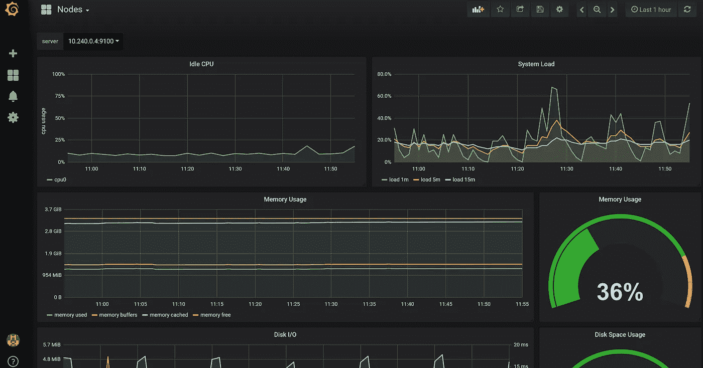
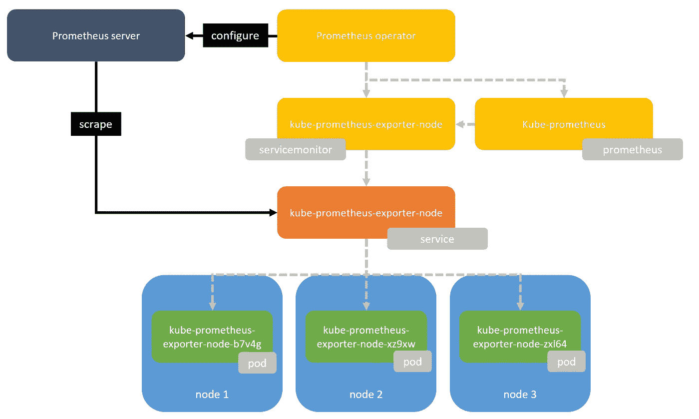
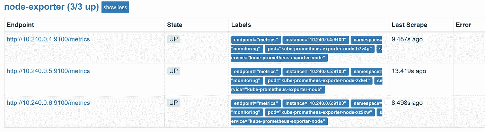

# 在 Azure Kubernetes 服务中使用 Prometheus(AKS)

> 原文：<https://itnext.io/using-prometheus-in-azure-kubernetes-service-aks-ae22cada8dd9?source=collection_archive---------0----------------------->



## 了解 Prometheus 运算符、自定义资源定义和 kube-prometheus

上周五在 T4 举行的创新日期间，我深入了解了普罗米修斯，以及如何利用它从 Kubernetes 上运行的应用程序中收集遥测数据

我用[头盔](https://docs.helm.sh)安装了普罗米修斯操作者和 kube-prometheus。这是让普罗米修斯恢复运行的简单快捷的方法。但后来我对如何使用我的新普罗米修斯装置有点困惑。当我运行`helm install`在我的集群中安装 Prometheus 时，到底发生了什么？部署了哪些资源，我如何使用它们？因此，我开始拆开头盔的模板，试验它所部署的资源，试图了解普罗米修斯操作员是如何工作的，以及安装 kube-prometheus 可以获得哪些额外的资源。以下是我学到的。

# 运算符和自定义资源定义

当你安装带头盔的普罗米修斯操作器时，你会得到一个**操作器**和一组**自定义资源定义**。首先让我们看看什么是运算符:

> 操作符是一种打包、部署和管理 Kubernetes 应用程序的方法。Kubernetes 应用程序是一种既部署在 Kubernetes 上，又使用 Kubernetes APIs 和 kubectl 工具进行管理的应用程序。
> 
> 为了能够充分利用 Kubernetes，您需要一组内聚的 API 来扩展，以便服务和管理运行在 Kubernetes 上的应用程序。您可以将 Operators 视为在 Kubernetes 上管理这类应用程序的运行时。

在 Kubernetes 1.7 [CoreOS](https://coreos.com/) 中还增加了[自定义资源定义(CRD 的)](https://kubernetes.io/docs/tasks/access-kubernetes-api/extend-api-custom-resource-definitions/)。有了 CRD 的，Kubernetes API 可以用额外的资源类型来扩展，以简化运行 Kubernetes 应用程序所需的配置。

## 普罗米修斯算子

Prometheus 操作员使用 3 个 CRD 来大大简化在 Kubernetes 集群中运行 Prometheus 所需的配置。这三种类型是:

*   `**Prometheus**`，定义所需的普罗米修斯部署。操作员始终确保与资源定义匹配的部署正在运行。
*   `**ServiceMonitor**`，它声明性地指定了应该如何监控服务组。操作员根据定义自动生成普罗米修斯刮削配置。
*   `**Alertmanager**`，定义所需的 Alertmanager 部署。操作员始终确保与资源定义匹配的部署正在运行。


运营商工作流程和关系([来源](https://coreos.com/blog/the-prometheus-operator.html)

当您部署一个 **prometheus** 时， **prometheus 操作员**将确保在您的集群中有一个 **prometheus 服务器**的新实例可用。一个 **prometheus** 资源定义有一个 **serviceMonitorSelector** ，它指定了 **prometheus 服务器**的这个实例应该使用哪个 **servicemonitor** 资源。一个 **servicemonitor** 指定了 **prometheus 服务器**应该如何监控一个服务或一组服务。**普罗米修斯操作员**将生成并应用**普罗米修斯服务器**所需的配置。

当您在您的集群中安装 **kubernetes 操作符**时，您将获得该操作符和上面提到的 CRD 操作符，但默认情况下，您不会获得任何 **prometheus 服务器**或任何**服务监视器**实例。然而，要开始监视，您所要做的就是使用正确的 serviceMonitorSelector 部署 prometheus 资源，并部署 servicemonitor 资源。

然而，有一个名为[kube-prometheus](https://github.com/coreos/prometheus-operator/tree/master/contrib/kube-prometheus)**的社区项目，它现在是 github 上 [prometheus 操作员存储库](https://github.com/coreos/prometheus-operator)的一部分，它将为您提供一个 Prometheus 服务器，该服务器被配置为监控您的 Kubernetes 集群，包括一组 [Grafana](https://grafana.com/) 仪表盘。**

**所以让我们继续在一个 [Azure Kubernetes 服务(AKS)](https://docs.microsoft.com/en-us/azure/aks/) 集群中安装 **prometheus 操作器**和 **kube-prometheus** 。**

# **连接和设置舵**

**通过运行以下命令连接到您的群集:**

```
az login
```

**通过运行以下命令列出您的订阅:**

```
az account list
```

**通过运行以下命令选择您的 AKS 群集所在的订阅:**

```
az account set --subscription <subscription-id>
```

**通过运行以下命令获取`kubectl`连接到 AKS 集群所需的凭据:**

```
az aks get-credentials --name <aks-cluster-name> --resource-group <aks-cluster-resource-group>
```

**如果本地没有安装 [HELM](https://docs.helm.sh) ，从[这个 github 库](https://github.com/kubernetes/helm)下载合适的二进制文件。**

**如果您的集群运行中尚未安装[舵](https://docs.helm.sh):**

```
helm init
```

**接下来将 CoreOS repo 添加到 HELM:**

```
helm repo add coreos [https://s3-eu-west-1.amazonaws.com/coreos-charts/stable/](https://s3-eu-west-1.amazonaws.com/coreos-charts/stable/)
```

# **安装 Prometheus 操作员和 kube-prometheus**

**AKS 支持[是最近添加的](https://azure.microsoft.com/en-us/blog/azure-kubernetes-service-aks-ga-new-regions-new-features-new-productivity/)，但是如果您仍然有一个集群没有 RBAC 支持，您可以告诉 HELM 安装这些图表而不使用 RBAC:**

```
helm install coreos/prometheus-operator --name prometheus-operator --namespace monitoring --set rbacEnable=falsehelm install coreos/kube-prometheus --name kube-prometheus --set global.rbacEnable=false --namespace monitoring 
```

**或者和 RBAC 一起:**

```
helm install coreos/prometheus-operator --name prometheus-operator --namespace monitoringhelm install coreos/kube-prometheus --name kube-prometheus --namespace monitoring
```

**现在，您已经在集群中安装了 prometheus 操作员和 kube-prometheus。让我们来看看我们得到了什么:**

## **普罗米修斯资源公司**

```
kubectl get prometheus --all-namespaces -l release=kube-prometheusNAMESPACE    NAME              AGE
monitoring   kube-prometheus   1h
```

## **服务监视器资源**

```
kubectl get servicemonitor --all-namespaces -l release=kube-prometheusNAMESPACE    NAME                                               AGE
monitoring   kube-prometheus                                    1h
monitoring   kube-prometheus-alertmanager                       1h
monitoring   kube-prometheus-exporter-kube-controller-manager   1h
monitoring   kube-prometheus-exporter-kube-dns                  1h
monitoring   kube-prometheus-exporter-kube-etcd                 1h
monitoring   kube-prometheus-exporter-kube-scheduler            1h
monitoring   kube-prometheus-exporter-kube-state                1h
monitoring   kube-prometheus-exporter-kubelets                  1h
monitoring   kube-prometheus-exporter-kubernetes                1h
monitoring   kube-prometheus-exporter-node                      1h
monitoring   kube-prometheus-grafana                            1h
monitoring   prometheus-operator                                1h
```

## **服务资源**

```
kubectl get service --all-namespaces -l release=kube-prometheus -o=custom-columns=NAMESPACE:.metadata.namespace,NAME:.metadata.nameNAMESPACE     NAME
kube-system   kube-prometheus-exporter-kube-controller-manager
kube-system   kube-prometheus-exporter-kube-dns
kube-system   kube-prometheus-exporter-kube-etcd
kube-system   kube-prometheus-exporter-kube-scheduler
monitoring    kube-prometheus
monitoring    kube-prometheus-alertmanager
monitoring    kube-prometheus-exporter-kube-state
monitoring    kube-prometheus-exporter-node
monitoring    kube-prometheus-grafana
```

**通过安装 kube-prometheus，您得到了一个 prometheus 服务器(一个 **prometheus** 资源)和一组**服务监视器**资源，允许您监视您的集群本身。安装 kube-prometheus 还为您提供了一个 [Grafana](https://grafana.com/) 实例，该实例连接到 prometheus 服务器并具有一组预配置的仪表板。**

**你还有一堆叫做`kube-prometheus-exporter-*`的**服务**和相应的**服务监视器**。这些服务公开了 **pods** ，这些 pods 使 Prometheus 可以使用来自您的节点和其他 kubernetes 组件的指标。例如，让我们看看`kube-prometheus-exporter-node`**

**有一种服务叫做`kube-prometheus-exporter-node`:**

```
kubectl get service --all-namespaces -l component=node-exporter -o=custom-columns=NAMESPACE:.metadata.namespace,NAME:.metadata.name
NAMESPACE    NAME
monitoring   kube-prometheus-exporter-node
```

**它提供了对一组叫做`kube-prometheus-exporter-node-*`的吊舱的访问:**

```
kubectl get pod --all-namespaces -l component=node-exporter -o=custom-columns=NAMESPACE:.metadata.namespace,NAME:.metadata.name
NAMESPACE    NAME
monitoring   kube-prometheus-exporter-node-b7v4g
monitoring   kube-prometheus-exporter-node-xz9xw
monitoring   kube-prometheus-exporter-node-zxl64
```

**这些 pod 被部署为守护程序集，这意味着我们集群中的每个节点都将有一个该 pod 的实例:**

```
kubectl get daemonset --all-namespaces  -l component=node-exporter -o=custom-columns=NAMESPACE:.metadata.namespace,NAME:.metadata.name
NAMESPACE    NAME
monitoring   kube-prometheus-exporter-node
```

**还部署了 **servicemonitor** ，它被配置为监视`monitoring`名称空间中具有标签`app=exporter-node`和标签`node-exporter`的服务的`metrics`端口**

```
kubectl describe servicemonitor kube-prometheus-exporter-node --namespace monitoring
Name:         kube-prometheus-exporter-node
Namespace:    monitoring
Labels:       app=exporter-node
              chart=exporter-node-0.3.2
              component=node-exporter
              heritage=Tiller
              prometheus=kube-prometheus
              release=kube-prometheus
...
Spec:
  Endpoints:
    Interval:  15s
    **Port:      metrics**
  Job Label:   component
  Namespace Selector:
    Match Names:
      **monitoring**
  Selector:
    Match Labels: **App:        exporter-node
      Component:  node-exporter**
Events:           <none>
```

**`kube-prometheus-exporter-node`服务有这些标签，因此它的`metrics`端口将被 Prometheus 监控:**

```
kubectl describe service kube-prometheus-exporter-node --namespace monitoring
Name:              kube-prometheus-exporter-node
**Namespace:**         **monitoring**
**Labels: **           **app=exporter-node**
                   chart=exporter-node-0.3.2
                   **component=node-exporter**
                   heritage=Tiller
                   release=kube-prometheus
Annotations:       <none>
Selector:          app=kube-prometheus-exporter-node,component=node-exporter,release=kube-prometheus
Type:              ClusterIP
IP:                10.0.120.251
Port:              metrics  9100/TCP
**TargetPort:        metrics/TCP
Endpoints:         10.240.0.4:9100,10.240.0.5:9100,10.240.0.6:9100**
Session Affinity:  None
Events:            <none>
```

**这允许 Prometheus server 从每个节点获取指标:**

****

**kube-Prometheus-exporter-节点概述**

# **查看指标**

**要访问 Prometheus，我们必须连接到集群中运行 Prometheus 服务器的 pod。我们可以通过使用`kubectl port-forward`将本地主机上的一个端口转发到集群中的一个特定 pod 来实现这一点。运行下面的命令:**

```
kubectl --namespace monitoring port-forward $(kubectl get pod --namespace monitoring -l prometheus=kube-prometheus -l app=prometheus -o template --template "{{(index .items 0).metadata.name}}") 9090:9090
```

**在浏览器中打开[http://localhost:9090/targets](http://localhost:9090/targets)。在这里，您可以看到 Prometheus 正在从哪些端点收集指标。如果我们仔细看看节点导出器目标 e，会看到 Prometheus 正在我们的 3 个节点中的每一个上抓取端口`9100`上的`/metrics`端点。**

****

**Prometheus 删除了节点导出程序端点**

## **格拉夫纳**

**Kube-prometheus 包括 Grafana，要查看它，您首先需要通过在 bash 提示符下运行以下命令来获取用户名和密码:**

```
echo username:$(kubectl get secret --namespace monitoring kube-prometheus-grafana -o jsonpath="{.data.user}"|base64 --decode;echo)
echo password:$(kubectl get secret --namespace monitoring kube-prometheus-grafana -o jsonpath="{.data.password}"|base64 --decode;echo)
```

**接下来运行下面的命令，将端口`3000`转发到承载 Grafana 的 pod:**

```
kubectl --namespace monitoring port-forward $(kubectl get pod --namespace monitoring -l app=kube-prometheus-grafana -o template --template "{{(index .items 0).metadata.name}}") 3000:3000
```

**打开[http://localhost:3000/log in](http://localhost:3000/login)，使用检索到的用户名和密码。登录后，单击页面左上角的控制面板下拉列表:**

****

**仪表板下拉菜单**

**并选择`Nodes`仪表盘:**

****

**节点仪表板**

**在仪表板的左上方，您可以选择想要查看其指标的`server`。`server`是集群中的`node`,从中获取指标。**

**作为 kube-prometheus 的一部分安装的每一个**服务监视器**都为 prometheus 提供了特定的指标。Grafana 有许多默认的仪表板，使用这些指标来显示图表。**

**现在你知道当你使用 HELM 安装 prometheus 操作器和 kube-prometheus 时发生了什么，以及操作器和自定义资源定义如何允许你监视 kubernetes 本身，你可以开始用你自己的**服务监视器**自定义和扩展 Prometheus。**