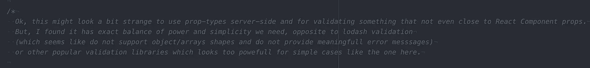
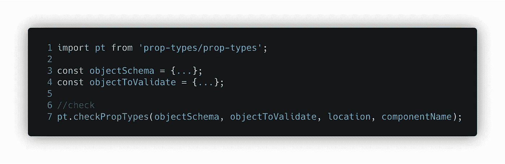

# 到处使用道具类型

> 原文：<https://itnext.io/using-prop-types-everywhere-a27e4fe6b430?source=collection_archive---------4----------------------->

由[克里斯·亨利](https://unsplash.com/@chrishenryphoto?utm_source=unsplash&utm_medium=referral&utm_content=creditCopyText)在 [Unsplash](https://unsplash.com/s/photos/high-altitude?utm_source=unsplash&utm_medium=referral&utm_content=creditCopyText) 上拍摄

我喜欢简单的东西。任何复杂性的增加都是有原因的，就像你的项目中的另一个库一样，它是额外的复杂性，应该有这样做的原因。

有时原因是库降低(封装)了应用程序的复杂性。那很好。

例如，如果您在客户端和服务器端有类似的任务要做，并且根据常识假设您需要为此使用不同的工具，该怎么办？有足够的理由在你的应用程序中有两个看起来很像的库，嗯，也许。

我会说，当我没有太多时间思考的时候，我会听从互联网上的一些建议。

但这次不是。我突然意识到我其实很喜欢使用“道具类型”库来定义 react 组件道具中不同的对象形状和所需的值。当我在服务器端遇到一个 JSON 验证的任务时，我稍微思考了一下，发现实际上没有太多的理由不在生产和服务器端使用这个库，以及用于稍微不同的目的(一点点)。

## 在 React 外部使用 PropTypes

在我写这篇文章的时候，这个想法可能已经不新鲜了。`prop-types`很久以前就被排除到单独的节点模块里了。

[自述](https://www.npmjs.com/package/prop-types)说可以用于和`propTypes`类似的对象。但是，任何 javascript 对象都是相似的。因此，当这个库用于检查 React 组件属性类型之外的其他事情时，这是一种正常情况。

但是这个库有一个限制。默认情况下，它只在 dev env 中工作，并在生产中变成空的 shim 函数。这没关系，这是像这样的客户端库的预期行为。这在许多其他地方可能没问题，但是对于其他情况，我们也需要让它在生产中工作。

您需要编写几行代码来使其在 react 之外工作，但在展示它们之前，我想分享一下我在代码中留下的注释，当时我第一次使用 prop-types 来处理 React 组件 props 之外的事情:

它很好地描述了我当时的感受:对庞大的库感到沮丧，希望使用我已经非常了解的概念，希望避免花太多时间搜索足够好的小库来完成任务。

好了，回到代码，这里有一些文档描述了如何在 React 的生产和外部运行这个库:[http://fb.me/prop-types-in-prod](http://fb.me/prop-types-in-prod)

在几行代码中，您需要显式导入`prop-types/prop-types`，它将返回开发和生产中的非填充版本，并像这样手动调用`checkPropTypes`:

其中`location`和`componentName`用于错误信息。

这是一个非常简单的想法，不需要阅读大量的文档或编写大量的代码，但由于最初对库的假设，这种用法可能看起来很奇怪，而事实上，它显示了我最喜欢的库之一的真正力量。

## 结论

我没有看到这个库经常在生产中使用，这可能有很多原因。有人可能需要一个非常高性能的库，而“prop-types”可能达不到这个最高分，或者可能期望 JSON 验证任务将由一个具有特定接口的库来执行。或者用`prop-types`做其他事情看起来很奇怪，这没关系。

所有不在生产中使用`prop-types`的理由都很重要，但是为什么不试着做一些不同的事情只是为了好玩呢？有趣的是，如果谈到我的经历:lib 的界面很简单，我可以重用为应用程序的不同部分编写的大量代码，我喜欢它。