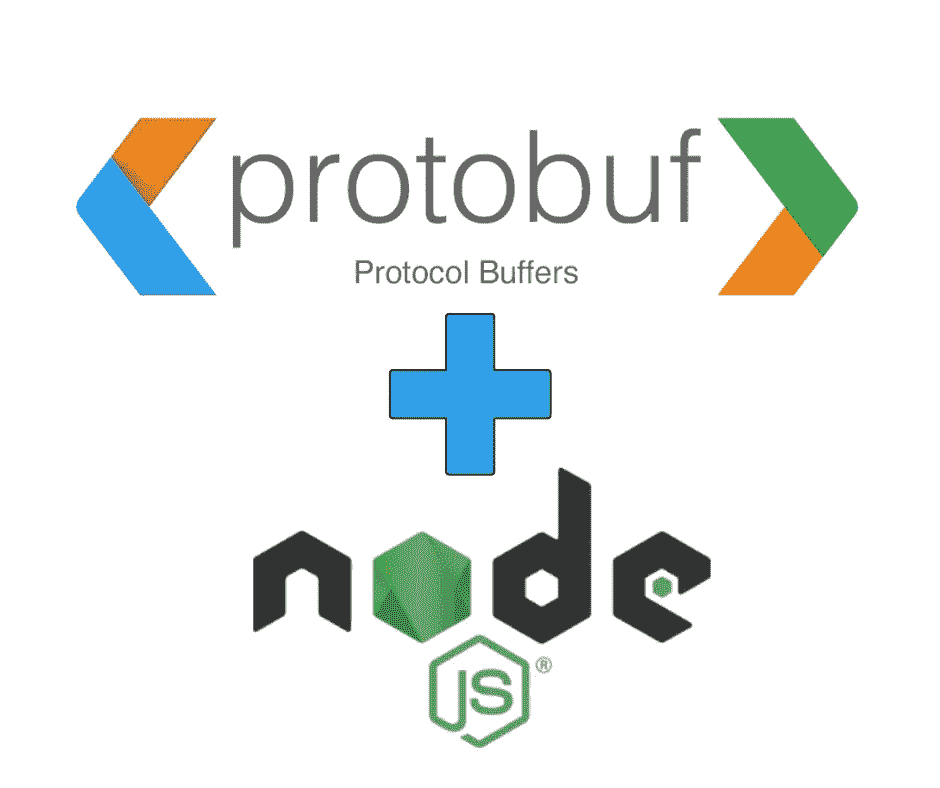

# 在 Node.js 应用程序中使用协议缓冲区

> 原文：<https://itnext.io/using-protocol-buffers-with-node-js-applications-b45c1d03c6d?source=collection_archive---------3----------------------->

## 跨平台-跨语言二进制数据编码，解释



作者图片

**Protocol Buffers 是 Google 开发的工具链，用于编程语言之间的数据和对象的二进制编码。它是跨语言远程过程调用系统 gRPC 的基础，但可以单独使用。**

软件工程的历史总是面临着在应用程序之间共享数据的挑战。存在许多技术，例如，通常使用基于文本的数据格式，如 JSON、TOML、XML 或 YAML。由于有合适的库，这些格式可以被任何编程语言的程序读写。但是，以这些格式存储数据需要更多的磁盘空间、通过互联网传输时的网络带宽以及编码和解码的 CPU 时间。

另一种选择是使用二进制数据格式。例如，在互联网流行之前，基于 ISO 的网络平台将用于大范围的联网。ISO 协议基于二进制格式 ASN.1，它被严格指定到无数的程度，可以支持任何类型的二进制数据编码需求。ASN.1 在很大程度上是一个被遗忘的东西，除了像我这样三十年前致力于将 ISO 协议栈实现到 Unix 系统中的人。今天，它是保证用不同编程语言编写的应用程序之间可移植性的二进制数据格式的历史范例。

Google 对协议缓冲区有这样的说法:

> *协议缓冲区提供了一种语言中立、平台中立、可扩展的机制，用于以向前兼容和向后兼容的方式序列化结构化数据。它很像 JSON，只不过它更小更快，并且生成本机语言绑定。*

短语*语言中立*意味着协议缓冲绑定可用于大多数流行的编程语言，而*平台中立*意味着绑定可用于多芯片架构。短语*结构化数据*意味着协议缓冲区支持按照模式声明编码的数据，并且该模式支持在其他定义中嵌套定义。

使用协议缓冲区从使用`.proto`文件描述模式开始。这些文件允许您描述二进制数据块的格式，该数据块将被编码到二进制消息缓冲区中。`.proto`文件可以被编译成十几种编程语言中的任何一种。编译后的模块为您提供了将数据编码为二进制格式以及从二进制格式解码的代码。您的应用程序如何处理编码数据取决于您自己。

它旨在将编码为协议缓冲区的数据用于网络协议中，以通过互联网传输数据，因此得名该项目的名称。例如，Google 在内部应用程序中广泛使用协议缓冲区。但是，不要让这种预期的用法限制了你的想象力。

官方文档位于:[https://developers.google.com/protocol-buffers](https://developers.google.com/protocol-buffers)

本文中显示的代码可以在:[https://github.com/robogeek/nodejs-protocol-buffers](https://github.com/robogeek/nodejs-protocol-buffers)获得

# Node.js 上的协议缓冲区入门

我们将从使用 Google 开发的协议缓冲工具开始。

第一个需求是获得用于将协议缓冲区定义转换成代码的`protoc`编译器。您可能很幸运，您计算机的软件包管理器有一个包含协议缓冲工具的软件包。

例如，在我的 macOS 笔记本电脑上，我使用 MacPorts 来提供开源工具。`protobuf3-cpp`包是相对最新的，并声称包括编译器。

在 Ubuntu 上，我发现`protobuf-compiler`包含了正确的工具。因此，在 Ubuntu 上安装非常简单:

```
$ sudo apt-get install protobuf-compiler
```

如果失败，您可以前往`https://github.com/protocolbuffers/protobuf/releases`获取协议缓冲团队提供的预构建包。或者，你也可以下载源代码，自己编译。

这个练习的目标是一个名为`protoc`的命令行工具，它是协议缓冲编译器。

```
$ protoc
Usage: protoc [OPTION] PROTO_FILES 
Parse PROTO_FILES and generate output based on the options given:...
```

当命令不带参数运行时，将打印用法消息。

协议缓冲区规范语言有两个版本。在本教程中，我们将使用这种语言的第 3 版，在线文档位于:[https://developers.google.com/protocol-buffers/docs/proto3](https://developers.google.com/protocol-buffers/docs/proto3)

遗憾的是，该网站没有 Node.js 的使用教程。你可以阅读其他语言的官方教程。

谷歌在 https://www.npmjs.com/package/google-protobuf[提供了一个 Node.js 包](https://www.npmjs.com/package/google-protobuf)

该包的源存储库包含类似教程的文档:[https://github . com/protocol buffers/proto buf-JavaScript/blob/main/docs/index . MD](https://github.com/protocolbuffers/protobuf-javascript/blob/main/docs/index.md)

# 使用协议缓冲区定义简单的数据格式

在本教程的剩余部分，我们将介绍一个简单的数据格式，它由协议缓冲区和一对 Node.js 脚本指定，使用该数据格式对数据进行编码和解码。这将是一个简单的 Todo 对象，类似于我在一个示例应用程序中实现的对象，该应用程序是为了探索当时新发布的 Bootstrap v5 而编写的。

参见:[https://techsparx.com/nodejs/examples/todo-bootstrap/](https://techsparx.com/nodejs/examples/todo-bootstrap/)

创建项目目录:

```
$ mkdir protobuf
$ cd protobuf
$ npm init -y
$ npm install google-protobuf --save
```

这需要安装一个外部依赖项，即上一节描述的`protoc`编译器。

在目录中创建一个名为`todo.proto`的文件，并将它放在文件的顶部:

```
syntax = "proto3";
```

这告诉`protoc`使用版本 3。如果您不这样做，编译器将打印一个警告，其中包含文本*没有为原型文件*指定语法，并告诉您将上述文本添加到您的文件中。

我的示例应用程序中的 TODO 对象包含四个字段:

1.  作为识别对象的编号的 *id*
2.  待办事项列表中显示的一个*标题*字符串
3.  一个 *body* 字符串，当用户查看一个 TODO 项目时显示
4.  给出高/中/低优先级的*优先级*枚举

在协议缓冲区中，定义如下:

```
message Todo {
    int64 id = 1;
    string title = 2;
    string body = 3;
    Precedence precedence = 4;
}
```

单词`message`开始定义一个对象。`message`块有一个名字，在本例中是`Todo`，给出了类名。主体内部是一个或多个字段定义。每个字段都有一个数据类型和一个名称。数字赋值是字段编号，而不是类似默认值的任何东西。字段编号决定了数据在记录中的编码位置。

最后一个字段由类型*优先级*定义。这不是内置于协议缓冲区语言中的，而是由以下应用程序定义的:

```
enum Precedence {
     PRECEDENCE_NONE = 0;
     PRECEDENCE_LOW = 1;
     PRECEDENCE_MEDIUM = 2;
     PRECEDENCE_HIGH = 3; 
}
```

我们选择使用一个`enum`对象类型来描述`precedence`字段的允许值。在我的示例应用程序中，LOW、MEDIUM 和 HIGH 的值如下所示。这意味着最初这个`enum`只被指定了这三个值，而`PRECEDENCE_NONE`并不存在。但是，编译器给出了这个错误:

```
The first enum value must be zero in proto3.
```

`enum`中的第一个字段必须具有值`0`。为了保持与先前 Todo 应用程序中使用的值(1，2，3)的兼容性，我希望保持相同的值。这意味着引入值为`0`的`PRECEDENCE_NONE`。

从 protocol buffers 文档中可以看出，enum 声明可以放在`message Todo {...}`的主体中，但是在示例实现中，它是独立的。

这定义了一个单一对象，或者称为*标量值类型*。有十几种数据类型可以归结为整数、浮点、布尔和字符串。每一个都被精确地定义为取 N 个字节，这样它们就可以被正确地编码为二进制。

另一个要考虑的问题是字段编号。随着应用程序的发展，您可能需要更改对象定义。您可以重用现有字段来存储不同类型的值。但是这会破坏您已经在现场部署的应用程序。相反，最佳实践是保留旧的字段定义，或者使用`reserved`关键字来屏蔽那些旧的字段。目的是保持与应用程序旧版本的向后兼容性。

例如，我们可能希望在`body`字段中使用 Markdown。现有的`body`字段用于简单文本，而不是降价。我们可以将消息定义改为:

```
message Todo {
    int64 id = 1;
    string title = 2;
    string bodyMD = 5;
    Precedence precedence = 4;
    reserved 3;
}
```

这一更改将`body`字段重命名为`bodyMD`，以明确该字段存储降价。这个新字段被标记为字段号`5`，字段号`3`被标记为`reserved`。另一种方法是保留旧的`body`字段定义，但是让您的应用程序忽略该字段。

像`Todo`这样的标量值类型只对一个对象有用。您可能想要发送一个 Todo 项列表，因此需要一种方法来指定一个对象数组。

在协议缓冲区中，您这样描述:

```
message Todos {
   repeated Todo todos = 1 
}
```

我们定义了一个新的对象类型，`Todos`。现在我们定义了什么是数组。这意味着该消息包含零个或多个`Todo`对象的实例，它位于字段编号 1。粗略地说，这使它成为一个数组。如果您的应用程序需要，这个对象可以很容易地包含其他项目。

# 为 TODO protobuf 架构生成 Node.js 源

我们已经创建了一个完整的模式。下一步是将它转换成我们可以在应用程序中使用的源代码。这也是我们之前安装`protoc`的原因。

这个编译器可以为多种语言生成源代码。顺便说一句，如果你还记得你的计算机科学课，一个*编译器*将源代码从一种编程语言翻译成一种完全不同的语言。因此`protoc`正在将协议缓冲源代码翻译成其他几种编程语言中的任何一种。

阅读 Protocol Buffers 文档网站可能会让你摸不着头脑——我们的目标是将其用于 Node.js，但没有 Node.js 用法的文档。这是 Protocol Buffers 团队要回答的问题，他们为什么不在自己的网站上发布 Node.js 文档。

转到:[https://www.npmjs.com/package/google-protobuf](https://www.npmjs.com/package/google-protobuf)

然后跟随几个链接结束:[https://github . com/protocol buffers/proto buf-JavaScript/blob/main/docs/index . MD](https://github.com/protocolbuffers/protobuf-javascript/blob/main/docs/index.md)

这两个页面包含 Google 编写的关于使用 Google 协议缓冲区实现的文档，包括使用`protoc`生成 Node.js (JavaScript)代码。令人费解的是，谷歌为什么不在主网站上扩展文档。这可能是因为软件包文档中的警告，因为 2022 年 7 月的项目状态是项目有些中断，他们正在试图纠正。

在`package.json`中添加此`script`条目:

```
"scripts": {
    "protoc": "protoc --js_out=import_style=commonjs,binary:. todo.proto"
},
```

在这个文件中包含像这样的命令是一个最佳实践，这样你就不必花费宝贵的脑细胞去记忆琐事。

对于 JavaScript 输出，有两种风格。一个是支持使用带有`require`函数的 CommonJS 进行导入，这是 Node.js 中的传统用法，另一个是 Google Closure 风格的导入。因为我们的目标是 Node.js，所以我们指定了`commonjs`。`binary`选项使函数的生成序列化为二进制，并从二进制反序列化。选项的`:.`部分指定了输出目录，在本例中是当前目录。使用`:build/gen`表示输出目录是`./build/gen`。该命令的最后一部分指定了输入文件，在本例中为`todo.proto`。

编译器在处理错误信息方面做得很好。前面已经展示了其中的几个，很容易确定要做什么。

该命令在当前目录下创建一个文件`todo_pb.js`。阅读这个文件是有益的。您将看到为`Todo`、`Todos`和`Precedence`创建了 JavaScript 对象定义。

最上面是这个:

```
var jspb = require('google-protobuf');
```

我们的代码没有使用`google-protobuf`，是生成的代码使用了它。在生成的代码中，您将看到该包中函数的自由使用。为了确保这个包是可用的，我们之前安装了它。

# 为协议缓冲区编码数据

在真实的应用程序中，我们可能有一个请求处理器函数收集一些数据，并需要使用协议缓冲区对其进行格式化以发送回复。在我们的例子中，我们希望演示生成协议缓冲区对象，然后将其序列化为二进制文件的核心步骤。在下面的脚本中，我们将演示如何反序列化二进制文件来读取数据。

创建一个名为`encode.mjs`的文件(因为 ES6 模块是 JavaScript 的未来，所以我们尽可能地使用它们)。从这个开始:

```
import { default as Schema } from './todo_pb.js';
import { promises as fsp } from 'fs';

// console.log(Schema);

const todos = new Schema.Todos();

let todo = new Schema.Todo();
todo.setId(1);
todo.setTitle("Buy cheese");
todo.setBody("PIZZA NIGHT");
todo.setPrecedence(Schema.Precedence.PRECEDENCE_HIGH);
todos.addTodos(todo);
```

生成的代码是 CommonJS 格式的，似乎没有生成 ES6 模块的选项。这种导入模式被认为是最有用的。我们还将`fs/promises`作为`fsp`导入，这样我们就有了异步文件系统功能。

生成的代码让我们使用`new Schema.Todos()`和`new Schema.Todo()`来生成相应的对象。

对于`Todo`对象，我找不到设置字段值的好方法。相反，我们必须明确地调用`set`方法，如下所示。创建 Todo 对象后，使用`todos.addTodos`将其添加到`Todos`对象。

尽可能多次重复最后一位代码，根据需要调整值。以此结束脚本:

```
console.log(todos.toObject());

await fsp.writeFile('todos.bin', todos.serializeBinary());
```

第一个为您提供已创建对象的视觉反馈。`toObject`方法将协议缓冲区对象转换成普通的 JavaScript 对象。

最后一行将数据写入文件`todos.bin`。`serializeBinary`方法将对象转换成二进制 blob，然后写入文件。

输出将如下所示:

```
{
  todosList: [
    { id: 1, title: 'Buy cheese', body: 'PIZZA NIGHT', precedence: 3 },
    { id: 2, title: 'Buy sauce', body: 'PIZZA NIGHT', precedence: 3 },
    { id: 3, title: 'Buy Spinach', body: 'PIZZA NIGHT', precedence: 3 },
    { id: 4, title: 'Buy ham', body: 'PIZZA NIGHT', precedence: 3 },
    { id: 5, title: 'Buy olives', body: 'PIZZA NIGHT', precedence: 3 }
  ]
}
```

在我们家，每周六晚上我们从头开始做比萨饼。

我们还可以检查二进制文件:

```
$ od -c todos.bin 
0000000  \n 035  \b 001 022  \n   B   u   y       c   h   e   e   s   e
0000020 032  \v   P   I   Z   Z   A       N   I   G   H   T     003  \n
0000040 034  \b 002 022  \t   B   u   y       s   a   u   c   e 032  \v
0000060   P   I   Z   Z   A       N   I   G   H   T     003  \n 036  \b
0000100 003 022  \v   B   u   y       S   p   i   n   a   c   h 032  \v
0000120   P   I   Z   Z   A       N   I   G   H   T     003  \n 032  \b
0000140 004 022  \a   B   u   y       h   a   m 032  \v   P   I   Z   Z
0000160   A       N   I   G   H   T     003  \n 035  \b 005 022  \n   B
0000200   u   y       o   l   i   v   e   s 032  \v   P   I   Z   Z   A
0000220       N   I   G   H   T     003
0000230
```

仔细看字节。就在每个标题的文本前面有字段编号，每个字符串有长度，等等。如果您愿意，文档中包含了这种格式的详细描述。注意到我们的数据在这个文件中是很重要的。

另一个需要注意的是相对大小的差异。文本形式比二进制形式占用更多的字节。

# 使用 Node.js 反序列化协议缓冲区消息

因为协议缓冲区是语言中立的，所以我们可以使用用不同语言编写的代码来反序列化数据。但这是关于在 Node.js 中这样做的，所以让我们把重点放在那上面。

创建一个名为`decode.mjs`的文件，其中包含:

```
import { default as Schema } from './todo_pb.js';
import { promises as fsp } from 'fs';

const todosBin = await fsp.readFile('todos.bin');
const todos = Schema.Todos.deserializeBinary(todosBin);

console.log(todos);
console.log(todos.toObject());
```

这只是读取`todos.bin`并将数据反序列化为一个对象。然后我们打印对象本身，以及`toObject`表单。

```
{
  wrappers_: { '1': [ [Object], [Object], [Object], [Object], [Object] ] },
  messageId_: undefined,
  arrayIndexOffset_: -1,
  array: [ [ [Array], [Array], [Array], [Array], [Array] ] ],
  pivot_: 1.7976931348623157e+308,
  convertedPrimitiveFields_: {}
}
{
  todosList: [
    { id: 1, title: 'Buy cheese', body: 'PIZZA NIGHT', precedence: 3 },
    { id: 2, title: 'Buy sauce', body: 'PIZZA NIGHT', precedence: 3 },
    { id: 3, title: 'Buy Spinach', body: 'PIZZA NIGHT', precedence: 3 },
    { id: 4, title: 'Buy ham', body: 'PIZZA NIGHT', precedence: 3 },
    { id: 5, title: 'Buy olives', body: 'PIZZA NIGHT', precedence: 3 }
  ]
}
```

第一个让您对协议缓冲区对象有所了解。我们不需要深究细节，但是看到这个还是挺有意思的。第二个是我们上面看到的相同数据，表明我们成功地将数据从一个应用程序传输到另一个应用程序。

# 使用协议缓冲区在应用程序之间传输数据

从高层次来看，我们看到的流程是:

1.  在`.proto`文件中定义模式，然后为所有感兴趣的语言生成代码
2.  传输数据从生成一个协议缓冲消息对象开始，然后调用`serializeBinary`方法
3.  通过调用`deserializeBinary`方法接收数据，将消息缓冲区转换成协议缓冲区对象，然后在应用程序中使用这些数据

# 为 Node.js/JavaScript 使用备用协议缓冲区实现

当与 Node.js 一起使用时，官方的 Google protocol buffers 实现还有一些需要改进的地方。一个是 *protocolbuf.js* ，它自称是一个纯 JavaScript 实现，支持 TypeScript，可以在 Node.js 和浏览器上运行。

有两个包:

1.  is 包含对使用协议缓冲区对象、解析和使用模式等的运行时支持
2.  `protobufjs-cli`是一个命令行工具，可以被视为大致相当于`protoc`

文档([https://www.npmjs.com/package/protobufjs](https://www.npmjs.com/package/protobufjs))讲述了两种使用模式:

1.  不编译直接加载`.proto`文件，并立即开始调用对象上的方法
2.  将`.proto`文件编译成静态类，类似于上面所示

对于本教程，我们将使用第二种模式，以便更容易与我们刚刚走过的代码形成对比。

以这种方式安装软件包:

```
$ npm install protobufjs protobufjs-cli --save
```

后者安装两个命令，`pbjs`和`pbts`，分别支持 JavaScript 和 TypeScript 用法。

要将`.proto`文件编译成可用的代码，运行以下命令:

```
$ npx pbjs -t static-module -w commonjs -o dist-pbjs/todo.js todo.proto #### OR, for ES6 code generation $ npx pbjs -t static-module -w es6 -o dist-pbjs/todo-es6.mjs todo.proto
```

这将旨在生成一个“静态模块”，这意味着创建源代码。模块格式将是 CommonJS 或 ES6 格式，这取决于您的偏好。注意，对于 ES6 模块，为了与 Node.js 兼容，我们用`.mjs`扩展名来命名它。

检查生成的代码很有用，因为这是学习生成的 API 最实用的方法。我发现缺少项目文档，生成的代码足够清晰，可以直接理解如何使用这个包。

```
import { default as Schema } from './dist-pbjs/todo.js';
import { promises as fsp } from 'fs';

const todos = new Schema.Todos();

todos.todos.push(new Schema.Todo({
    id: 1,
    title: "Buy Cheese",
    body: "PIZZA NIGHT",
    precedence: Schema.Precedence.PRECEDENCE_HIGH
}));

// ...

console.log(Schema.Todos.toObject(todos));

await fsp.writeFile('todos-protobufjs.bin', Schema.Todos.encode(todos).finish());
```

此包的用法略有不同。例如，我们可以使用属性对象实例化一个对象实例。研究源代码，我们看到属性是在我们可以直接赋值的地方生成的。

`toObject`和`encode`方法不附属于对象实例，而是类的静态方法。因此，我们称之为`Schema.Todos.toObject`而不是`todos.toObject`。

运行应用程序，我们会看到`toObject`表示的输出:

```
{
  todos: [
    { id: 1, title: 'Buy Cheese', body: 'PIZZA NIGHT', precedence: 3 },
    { id: 2, title: 'Buy sauce', body: 'PIZZA NIGHT', precedence: 3 },
    { id: 3, title: 'Buy Spinach', body: 'PIZZA NIGHT', precedence: 3 },
    { id: 4, title: 'Buy ham', body: 'PIZZA NIGHT', precedence: 3 },
    { id: 5, title: 'Buy olives', body: 'PIZZA NIGHT', precedence: 3 }
  ]
}
```

和之前大致相同。输出文件的大小与上一个示例完全相同:

```
$ ls -l todos* 
-rw-rw-r-- 1 david david 152 Aug 22 11:38 todos.bin 
-rw-rw-r-- 1 david david 152 Aug 22 11:37 todos-protobufjs.bin
```

这验证了协议缓冲区是语言中立的观点，因为我们使用了两个不同的协议缓冲区实现来生成同一个文件。

对`decode.mjs`做一点小小的改变，我们可以在命令行上命名文件，然后以这种方式解码数据文件:

```
$ node decode.mjs todos-protobufjs.bin 
{
  wrappers_: { '1': [ [Object], [Object], [Object], [Object], [Object] ] },
  messageId_: undefined,
  arrayIndexOffset_: -1,
  array: [ [ [Array], [Array], [Array], [Array], [Array] ] ],
  pivot_: 1.7976931348623157e+308,
  convertedPrimitiveFields_: {}
}
{
  todosList: [
    { id: 1, title: 'Buy Cheese', body: 'PIZZA NIGHT', precedence: 3 },
    { id: 2, title: 'Buy sauce', body: 'PIZZA NIGHT', precedence: 3 },
    { id: 3, title: 'Buy Spinach', body: 'PIZZA NIGHT', precedence: 3 },
    { id: 4, title: 'Buy ham', body: 'PIZZA NIGHT', precedence: 3 },
    { id: 5, title: 'Buy olives', body: 'PIZZA NIGHT', precedence: 3 }
  ]
}
```

这演示了用一种实现生成协议缓冲区文件，用另一种实现对其进行解码。

用 protobufjs 编写的解码器如下所示:

```
import { default as Schema } from './dist-pbjs/todo.js';
import { promises as fsp } from 'fs';

const todosBin = await fsp.readFile(process.argv[2]);

const todos = Schema.Todos.decode(todosBin);

console.log(Schema.Todos.toObject(todos).todos);
```

执行(`node decode-protobufjs.mjs todos-protobufjs.bin`)如下所示:

```
[
  {
    id: Long { low: 1, high: 0, unsigned: false },
    title: 'Buy Cheese',
    body: 'PIZZA NIGHT',
    precedence: 3
  },
  {
    id: Long { low: 2, high: 0, unsigned: false },
    title: 'Buy sauce',
    body: 'PIZZA NIGHT',
    precedence: 3
  },
  {
    id: Long { low: 3, high: 0, unsigned: false },
    title: 'Buy Spinach',
    body: 'PIZZA NIGHT',
    precedence: 3
  },
  {
    id: Long { low: 4, high: 0, unsigned: false },
    title: 'Buy ham',
    body: 'PIZZA NIGHT',
    precedence: 3
  },
  {
    id: Long { low: 5, high: 0, unsigned: false },
    title: 'Buy olives',
    body: 'PIZZA NIGHT',
    precedence: 3
  }
]
```

奇怪的是,`id`字段以不同的方式表示。相反，它是一个似乎适合于表示数值范围的对象。否则，输出与前面的实现相同。

# 使用 JSON、协议缓冲区和 Protobuf 对编码和解码进行基准测试。射流研究…

我创建了三对基准函数，它们只对预先创建的对象调用编码或解码函数。对于 JSON，它用的是`JSON.stringify`和`JSON.parse`，其他用的是上面显示的函数。本例中的对象数组有 1000 个元素。

```
$ node bench.mjs 
cpu: Intel(R) Core(TM) i7-5600U CPU @ 2.60GHz
runtime: node v18.6.0 (x64-linux)

benchmark        time (avg)             (min … max)
---------------------------------------------------
encode-JSON  342.37 µs/iter   (311.93 µs … 1.19 ms)
decode-JSON   435.9 µs/iter   (384.44 µs … 1.41 ms)
encode-PB    946.43 µs/iter   (777.38 µs … 3.13 ms)
decode-PB    770.79 µs/iter   (688.99 µs … 1.78 ms)
encode-PBJS  696.75 µs/iter   (618.43 µs … 2.43 ms)
decode-PBJS  455.36 µs/iter   (413.66 µs … 1.09 ms)
```

有趣的是，JSON 编码和解码明显快于同等的协议缓冲区。

另一个衡量标准是每个表示的大小:

```
-rw-rw-r-- 1 david david 328 Aug 22 16:46 todos.json 
-rw-rw-r-- 1 david david 152 Aug 22 11:38 todos.bin 
-rw-rw-r-- 1 david david 152 Aug 22 12:18 todos-protobufjs.bin
```

等效的 JSON 是两倍多。显然，基于文本的数据格式将比二进制数据格式更大。

# 摘要

Google 的协议缓冲区是应用程序之间交换数据或应用程序存储数据的强大方式。它将数据结构编码为紧凑的二进制数据块。

协议缓冲区的主要优势是编码数据的大小。因为它被很好地指定，并且可以在多种编程语言中使用，所以它非常适合许多应用程序。

基于文本的数据格式也在多种编程语言中被很好地指定和使用。显然，大量应用程序使用 JSON、YAML、XML 等进行数据传输，证明了它们的有用性。但是，在保留网络带宽很重要的情况下，该怎么办呢？无论是容纳几十万台繁忙服务器的服务器场，还是连接 5G 蜂窝数据的远程安装的物联网设备，还是智能手机应用程序，在许多场景下，紧凑的二进制数据将提高性能或降低网络数据成本。

# 关于作者


[**大卫·赫伦**](https://davidherron.com/) :大卫·赫伦是一名作家和软件工程师，专注于技术的明智使用。他对太阳能、风能和电动汽车等清洁能源技术特别感兴趣。David 在硅谷从事了近 30 年的软件工作，从电子邮件系统到视频流，再到 Java 编程语言，他已经出版了几本关于 Node.js 编程和电动汽车的书籍。

*最初发表于*[*https://techsparx.com*](https://techsparx.com/nodejs/datastore/protocol-buffers.html)*。*