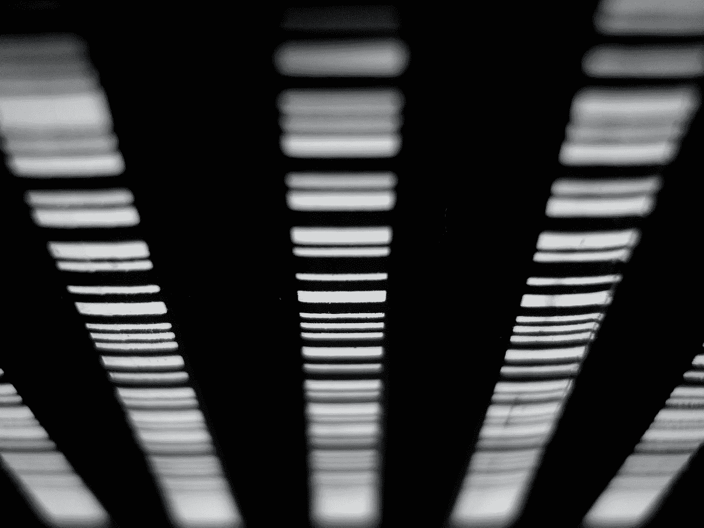

# 通过 Swift 使用 QR/条形码

> 原文：<https://itnext.io/using-qr-barcodes-with-swift-44dc164fc466?source=collection_archive---------3----------------------->

## 保护您的代码免受 COVID 攻击。

在疫情，你可能已经看到许多餐馆在菜单上使用二维码，以避免使用可能被其他顾客污染的纸盒制作的菜单。今天，我将快速介绍如何在 Swift 中使用 QR(快速响应)码甚至常规条形码。

照片由[大卫 pl](https://unsplash.com/@d_dandelion?utm_source=unsplash&utm_medium=referral&utm_content=creditCopyText) 在 [Unsplash](https://unsplash.com/?utm_source=unsplash&utm_medium=referral&utm_content=creditCopyText) 上拍摄

# 我们如何创建二维码或条形码？

要生成 QR 码或条形码，我们需要用于生成图像和应用过滤器的 **CoreImage** 框架，但我们只需导入 **UIKit** 即可。

使用 CoreImage 过滤器的一个奇怪之处在于，它们是用您想要使用的生成器协议中的一个字符串初始化的。这是一份来自苹果文档的发电机协议的官方列表。

你会注意到我在这里强制解包了一些东西——事实上你可以只使用可选的，守卫等等。实际上，我四处寻找是否可以使用 kCIIAttribute 来代替 **inputMessage** ，但是我什么也没找到。如果您知道不使用字符串的解决方法，请在评论部分告诉我。除了不太酷的用于 **CIFilter** 和 key 的字符串之外，我们唯一做的事情就是缩放生成的 **ciImage** 以便在你将其分配给 **UIImageView** 时更加可见。

生成条形码时，几乎是完全相同的片段，但 **CIFilter** 名称将是`CICode128BarcodeGenerator`

# 我们如何阅读二维码或条形码？

当我们想要读取 QR 码或条形码时，我们需要设置一个输入数据流:一个捕获会话。

我们将使用**avcapturevideopreviewplayer**来查看我们正在扫描的内容。它将被捕获会话初始化，这就是为什么我使用 lazy init。

在`viewDidLoad`上，我们设置了以设备摄像机作为输入和输出的会话。在输出中，我们可以设置我们在`metadataObjectTypes`寻找什么。在我们设置元数据对象委托之后，我们将能够实现`metadataOutput(output:didOutput:fromConnection)`，它将为我们提供我们选择的检测到的元数据。

改为检测条形码—同样的过程。但是用`.code128`代替`.qr`作为`metadataObjectTypes`