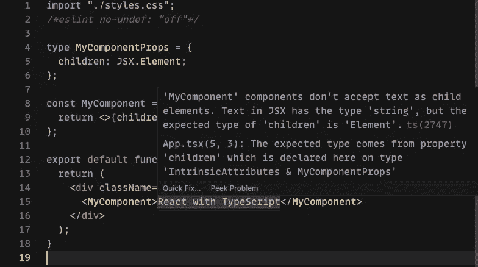
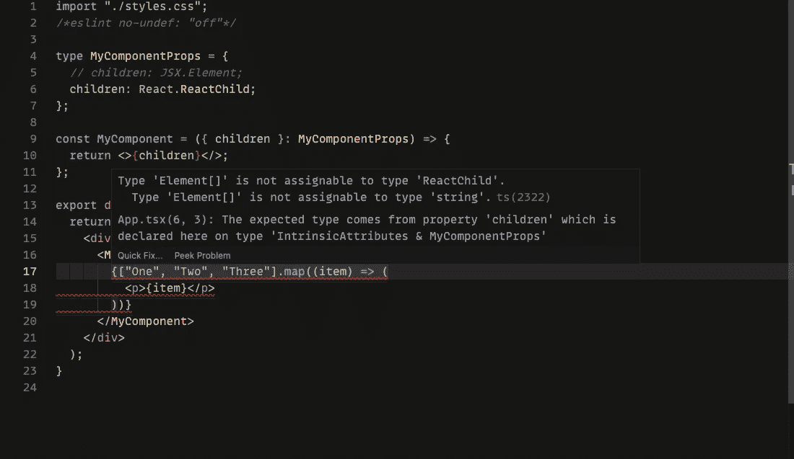
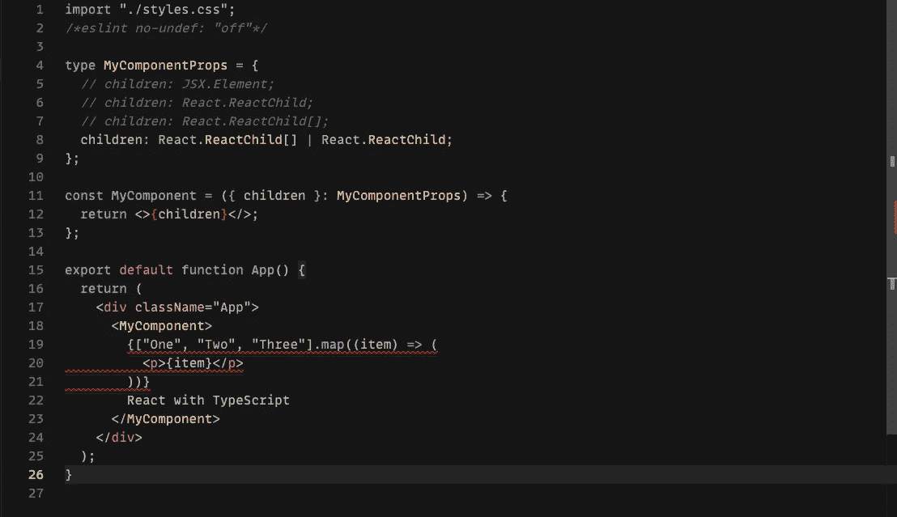
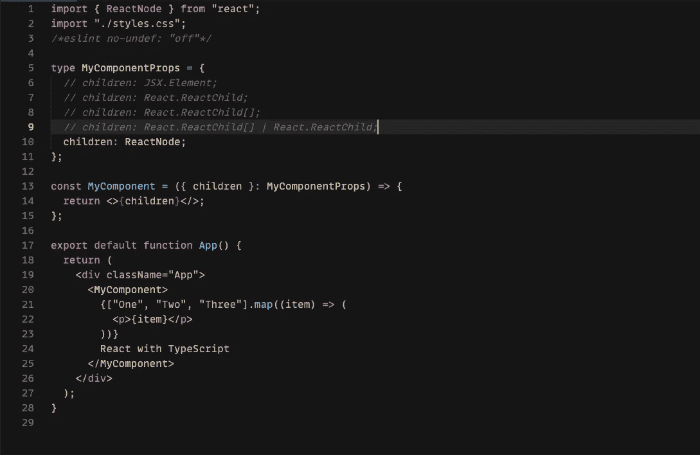
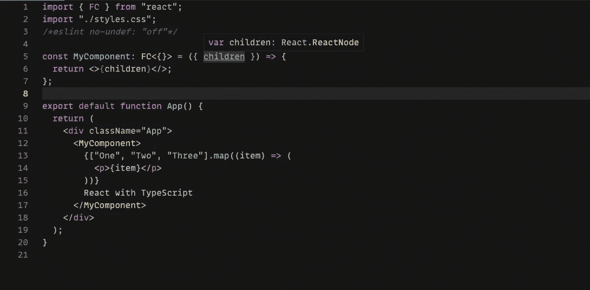

# 将 React 子道具与 TypeScript 一起使用

> 原文：<https://itnext.io/using-react-children-prop-with-typescript-37f6821351bb?source=collection_archive---------2----------------------->

当我开始在 React 中使用 TypeScript 时，第一个困难是弄清楚为`children`道具使用什么类型。这是因为有几种不同类型的 React 为此提供了支持。我看到多个项目交替使用不同的类型，这并没有帮助。

在这篇文章中，我将介绍您可以使用的每种类型，并讨论其利弊，这样您就可以为您的用例选择正确的类型。

# JSX。元素

JSX。元素是您可以用于子元素的最具限制性的类型。只有当你的`children`道具是一个单独的 React 元素时，它才起作用。它不能与任何其他东西一起工作，包括原语，比如字符串:

JSX。元素

`JSX.Element`可以方便地限制你的`children`道具对元素做出反应，但是对于一般用途来说限制太多了。

# 做出反应。重新匹配

ReactChild 允许原语，所以它是一个比`JSX.Element`更宽容的选择。但是，ReactChild 不能用于数组。看看这个生成元素数组的常见映射用例:

重新匹配

您首先想到的可能是使用[联合类型](https://www.typescriptlang.org/docs/handbook/2/everyday-types.html#union-types) `children: ReactChild | ReactChild[]`来允许一组`ReacChild`项。但是这种方法的问题是它不允许将单个元素与数组混合使用:

重新匹配组合

此外，该类型变得有点过于冗长。我们可以做得更好。

# 反应节点

如果您希望`children`道具接受任何东西，那么`ReactNode`是首选类型。它采用 React 元素、原语、门户、片段等。

反应节点

# 做出反应。足球俱乐部

将`children`属性声明为`ReactNode`是一个非常可行的选择，但是如果您想进一步修改代码，可以使用`React.FC`。`React.FC`是使用箭头函数编写的组件的标准类型。正如您可能猜到的，`FC`代表“功能组件”

做出反应。足球俱乐部

`React.FC`将`ReactNode`类型分配给`children`道具，不用自己动手。

# 结论

总结一下，使用`ReactNode`作为组件的`children`属性，除非您想要使属性更具限制性。为了简洁，您可以在箭头函数组件上使用`React.FC`类型。我希望这篇文章对你有用！

如果你想自己尝试这些类型，这里有一个沙盒。

*原载于 2021 年 6 月 29 日 https://isamatov.com**的* [*。*](https://isamatov.com/react-typescript-children-prop/)