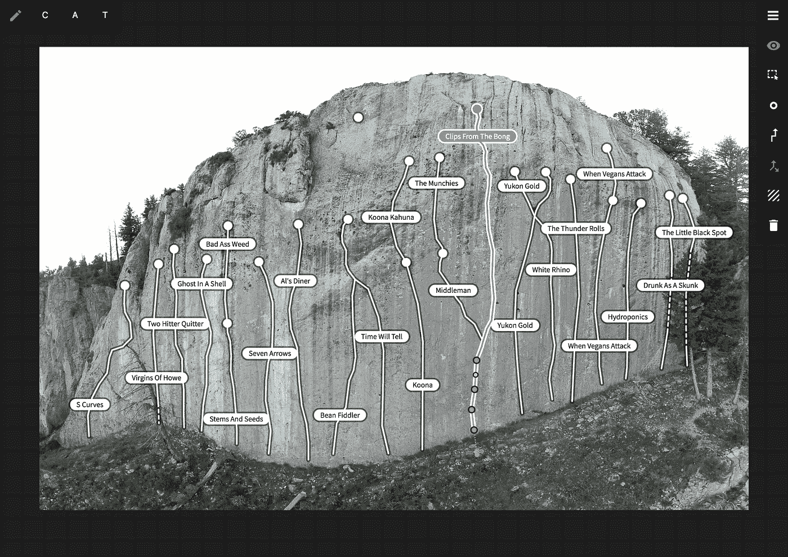
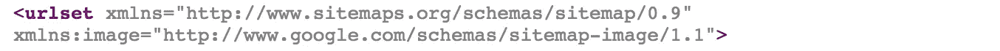

# 使用 React for XML & SVG

> 原文：<https://itnext.io/using-react-for-xml-svg-470792625278?source=collection_archive---------4----------------------->

React 是一个非常棒的工具，不仅适用于 HTML，还可以安全地、符合人体工程学地构造任何基于 XML 的文档。事实上，我们使用 React+SVG 在 [Boltline](https://www.boltline.org/) 构建了整个拓扑编辑器:



# JSX ≠ HTML

然而，在使用 React for XML 时，有几件事需要特别注意。尽管 JSX 有“标记”的外观，但你实际上不是在创建字符串，而是一个 JS 对象；字段不一定对应 HTML 属性，而是 DOM 属性或受 DOM 启发的 React 属性。这就是你用`className`代替`class`的原因。

所以当你需要添加`xlink:href="https://example.com"`时，你会想要使用`xlinkHref="https://example.com"`(注意茶包)。

这对于受支持的属性来说非常好，它包括了 SVG 所需的一切。

# JSX ≠ XML

但是，当您需要更高级的 XML 特性时，这就不起作用了。JSX 很清楚它的目标是完全 XML 支持。让我们尝试将 [Google 的图像扩展](https://support.google.com/webmasters/answer/178636)添加到 react 生成的 sitemap.xml 中:

```
...<image:image>
  <image:loc>[http://example.com/image.jpg](http://example.com/image.jpg)</image:loc>
</image:image>...
```

这中断了，出现了一个非常明显的错误:

```
ERROR in ./SitemapXMLRoot.jsModule build failed: SyntaxError: Namespace tags are not supported. ReactJSX is not XML.> 181 |  <image:image>
      |   ^
  182 |    <image:loc>[http://example.com/image.jpg](http://example.com/image.jpg)</image:loc>
  183 |  </image:image>
```

虽然 JSX 不能胜任这个任务，但实际上它本身就是！我们可以继续使用原始的`React.createElement`调用来定制 JSX 就绪的 React 组件，以呈现我们的定制 XML 元素:

```
const ImageImage = (p: *) => {
  const { children, ...props } = p;
  return React.createElement("image:image", props, children);
};const ImageLoc = (p: *) => {
  const { children, ...props } = p;
  return React.createElement("image:loc", props, children);
};
```

现在让我们使用它们:

```
...<ImageImage>
  <ImageLoc>[http://example.com/image.jpg](http://example.com/image.jpg)</ImageLoc>
</ImageImage>...
```

而且很管用！这呈现了我们的`image:image`和`image:loc`元素，正如我们所希望的:


<loc>http://example.com/image/jpg</loc>

还有一件事。

我们还没有定义`image:`名称空间。尽管 React 16+ *将*传递自定义属性，但冒号打破了 JSX 语法。使用 JSX 扩展运算符可以轻松解决这个问题:

```
const namespaces = {
  "xmlns:image": "[http://www.google.com/schemas/sitemap-image/1.1](http://www.google.com/schemas/sitemap-image/1.1)"
};<urlset
  ae kl" href="http://www.sitemaps.org/schemas/sitemap/0.9" rel="noopener ugc nofollow" target="_blank">http://www.sitemaps.org/schemas/sitemap/0.9"
  {...namespaces}
>
```



<urlset xmlns="”<a" class="ae kl" href="http://www.sitemaps.org/schemas/sitemap/0.9" rel="noopener ugc nofollow" target="_blank">http://www.sitemaps.org/schemas/sitemap/0.9xmlns:image = "[http://www.google.com/schemas/sitemap-image/1.1](http://www.google.com/schemas/sitemap-image/1.1)"></urlset>

查看 [React 关于 DOM 元素的页面](https://reactjs.org/docs/dom-elements.html)了解更多！