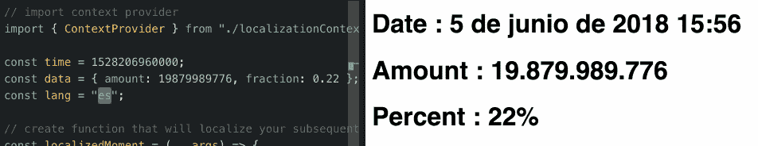

# 使用 React 的上下文 API 为组件提供本地化工具箱

> 原文：<https://itnext.io/using-reacts-context-api-to-provide-a-localization-toolbox-for-your-components-48915f04bb54?source=collection_archive---------3----------------------->

## 简要概述了如何格式化时间和数字，如何使其与特定的语言环境相关，以及如何使用 React 的上下文 API 使这一切变得简单。

# 本地化很难

WooRank 提供 6 种语言的服务:英语、西班牙语、法语、德语、荷兰语和葡萄牙语。这给了我们国际影响力，但也意味着要保持全面的一致性有些头疼。

我们的服务基于数据，基于数字、日期、价值和比率。有趣的是，每种语言都有不同的方式来格式化这些看似不言自明的信息。

以英语中简单的日期/时间为例:`June 5, 2018 3:56 PM`。


审核生成的日期和时间。

下面是它在其他语言中的翻译:

*   **西班牙语** : `5 junio de 2018 15:56`
*   **法语** : `5 juin 2018 15:56`
*   **德语** : `5\. Juni 2018 15:56`
*   **荷兰语** : `5 juni 2018 15:56`
*   **葡萄牙语** : `5 de junho de 2018 15:56`

相信我，你不会想设计自己的解决方案来从 Unix 时间戳自动生成这些内容。

但是还有更多！当你需要显示百分比的时候呢？还是向下舍入一个值？当然，你可以像这样写一些不同的实用函数:

```
const formatPercent = number => Math.round(number * 10000) / 100;
```

但是你真的想吗？

那么显示一个数字的简单任务呢？`1,000,000`在英语中是正确的，但在法语、德语或荷兰语中是无意义的，在这些语言中这样的数字会被标注为`1 000 000`。他们用逗号来标记小数点。在那些语言中，`1,5`是正确的，而在英语中则是`1.5`。

这是一个全新的语言学和科学传统的世界，你也不会想进入最底层。

# 一个解决了的问题…？

幸运的是，格式化日期和数字的问题和互联网甚至计算机科学一样古老，非常聪明的人已经为我们解决了这个问题。在 JavaScript 世界中，这主要意味着使用[矩](https://momentjs.com/)处理日期，使用[数字](http://numeraljs.com/)处理数字。

```
import moment from 'moment';
import numeral from 'numeral';moment(1528206960000).format('LLL');
// June 5, 2018 5:56 pmnumeral(1000000).format();
// 1,000,000
numeral(1.5).format('0.0');
// 1.5
```

但是等等！我们还希望这些格式良好的数据能够根据用户选择的语言进行适当的本地化。这就是两个库都提供的`locales` 发挥作用的地方。这些包含了所有必要的数据以保证一切正常(例如，这里是来自`numeral`的`[‘fr’](https://github.com/adamwdraper/Numeral-js/blob/master/locales/fr.js)` [区域设置](https://github.com/adamwdraper/Numeral-js/blob/master/locales/fr.js))。

```
import moment from 'moment';
import numeral from 'numeral';
import 'numeral/locales';
// yes, you have to import the locales from numeral manuallymoment.locale('es');
moment(1528206960000).format('LLL');
// 5 de junio de 2018 15:56numeral.locales('fr');
numeral(1000000).format();
// 1 000 000
numeral(1.5).format('0.0');
// 1,5
```

那好吧。我将在需要本地化数据的地方导入这些库。还有那个`locales`也是。然后我会获取当前的语言值。希望服务器和客户机在这一点上不会有分歧。但是我在哪里设置`locale`值呢？每个组件一次？还是在 app 的顶层？嗯…

…

一定有更好的办法。

# React 的上下文 API 来拯救

[React 16.3](https://reactjs.org/blog/2018/03/29/react-v-16-3.html) 得到了大量的炒作。喜欢，很多。尤其是因为`[context](https://reactjs.org/docs/context.html)` [API](https://reactjs.org/docs/context.html) 的稳定实现。基本上，这是一种在 React 应用中传递数据的方式，而无需通过 props 自上而下地钻取数据，直到您需要它。实现我们目的的完美工具:构建一个`localizationContext`,它将在 React 应用程序中的任何地方访问正确本地化的`numeral`和`moment`实例。

**编辑(2018 年 6 月 30 日，星期六):**正如在回应中观察到的，也正如 WooRank 的首席开发人员所回答的，这是一个在处理同构应用程序时特别有用的解决方案(即关注在客户端和服务器上渲染相同的代码)。对于纯粹的客户端 spa 来说，这可能是过度的和/或低效的。

我们需要的零件是:

*   一个根`App`，我们将在这里创建`moment`和`numeral`的本地化版本。对于`moment`，我们可以通过在它上面调用`.locale(lang)`来创建一个本地化的实例。不幸的是，`numeral`还不支持这个，所以我们必须全局设置区域设置。

```
const lang = "en";const localizedMoment = (...args) => {
  return moment(...args).locale(lang);
};const localizedNumeral = (...args) => {
  numeral.locale(lang);
  return numeral(...args);
} return numeral(...args);
}localizedMoment(1528206960000).format('LLL');
// June 5, 2018 5:56 pmlocalizedNumeral(1000000).format();
// 1.000.000
```

*   一个反应`Context`给我们进入`Provider`(它将在它的`value`道具上接受我们的`localizedMoment`和`localizedNumeral`)…

```
const Context = React.createContext();const ContextProvider = props => {
  return (
    <Context.Provider
      value={{
        moment: props.moment,
        numeral: props.numeral
      }}
    >
      {props.children}
    </Context.Provider>
  );
};
```

*   …让我们能够访问`Consumer`，这将使我们能够在组件中检索`localizedMoment`和`localizedNumeral`。因为我们预计我们会经常需要这些组件，并且我们懒得将每个需要它的`div`封装在一个`<Context.Consumer>`中，所以我们将创建一个`withLocalization` [高阶组件](https://reactjs.org/docs/higher-order-components.html)，它接受一个组件并返回相同的组件，但是将我们的本地化工具箱合并到它的 props 中！

```
const withLocalization = Component => {
  return function LocalizedComponent (props) {
    return (
      <Context.Consumer>
        {context => {
          return <Component
            {...props}
            moment={context.moment}
            numeral={context.numeral}
          />;
        }}
      </Context.Consumer>
    );
  };
}
```

# 插上电源

是时候把所有东西放在一起了！您的应用程序的根可能如下所示:

```
const time = 1528206960000;
const data = { amount: 19879989776, fraction: 0.22 };const App = () => (
  <ContextProvider
    moment={localizedMoment}
    numeral={localizedNumeral}
  >
    <Localized data={data} time={time} />
  </ContextProvider>
);render(<App />, document.getElementById("root"));
```

虽然您的`Localized`组件可能看起来像这样(注意我们如何通过将它包装在我们的`withLocalization`高阶组件中来访问其道具上的`moment`和`numeral`):

```
import { withLocalization } from "./localizationContext";const Localized = ({ data, time, moment, numeral }) => {
  const localizedDate = moment(time).format("LLL");
  const localizedAmount = numeral(data.amount).format();
  const formattedFraction = numeral(data.fraction).format("0%");return (
    <React.Fragment>
      <h1>Date : {localizedDate}</h1>
      <h1>Amount : {localizedAmount}</h1>
      <h1>Percent : {formattedFraction}</h1>
    </React.Fragment>
  );
};export default withLocalization(Localized);
```

这是你应该能得到的结果！



更改应用程序根目录的区域设置值

从那时起，您可以向您的本地化上下文添加各种其他工具，如`translate`函数或时区处理！

我希望你已经学到了一些东西，并且，请为这个小项目 ~~

这个小项目的代码沙箱